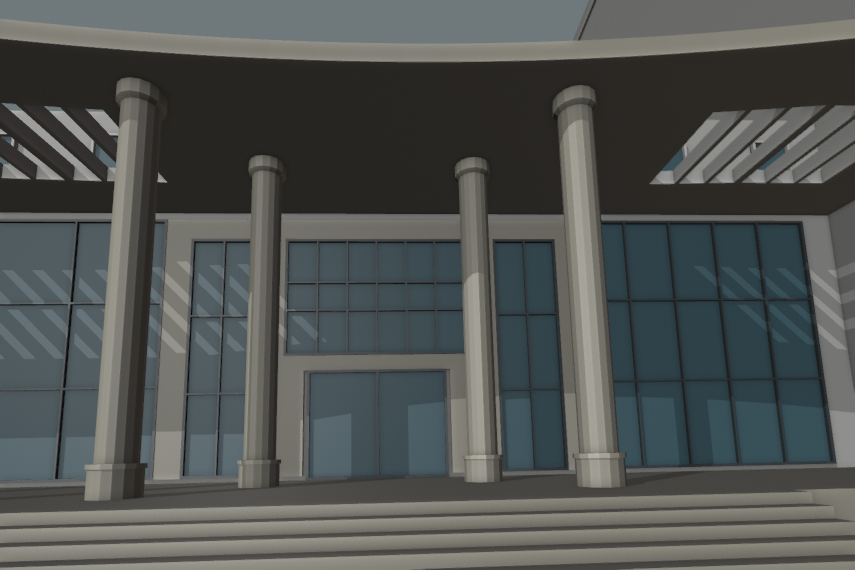

# 结构平台门廊：石色前缘、柱帽与侧格栅

2026-09-30，接续[相机与柱距候选](CIVIL_PLATFORM_CAMERA_ALIGNMENT.md)，完成进入正式构建前的门廊细化。参考已核看的[2023年校方合影](https://tmjz.gxu.edu.cn/info/1452/6575.htm)，补入可见的石色外缘、圆柱帽和较密侧格栅。构件尺度及重复数量仍为估算；本批完成独立候选检查，尚未导出校园模型或通过整栋验收。



## 实施内容

| 部位 | 修改 | 依据与限制 |
| --- | --- | --- |
| 门廊屋面外缘 | 外轮廓竖面使用已有石色材质；顶面、底面与孔洞内壁保持白色 | 照片支持颜色区分；未恢复石材接缝、楼名字样或实物色值 |
| 圆柱顶 | 八柱补入高0.32米、外挑0.08米的柱帽，下部0.07米锥形过渡 | 照片可见四根柱的帽部；其余柱重复、尺寸及16边形近似均为估算 |
| 侧格栅 | 原七个开孔各分三段，新增0.12米分隔梁，形成21个真实开孔 | 照片支持更密的通透格栅；不声称已确定完整数量 |
| 屋面边框 | 宽度由1.55增至1.65米 | 为扩大后的完整柱帽顶面提供支撑；外侧曲线不变 |

前后主柱中心、六分部轮廓、入口、台阶、石色围合和玻璃分格均保持上一候选。中央五个实档保留，侧面细分只作用于原开孔区。新旧对照使用同一相机和灯光，没有重新拟合来补偿外观变化。

## 生成器约束与验证

新增可选 `slattedRoof.edgeFinish`，只影响屋面外轮廓的竖面；孔洞内壁、顶面、底面分别保持原材质。可选 `bayDivisions` 与 `dividerWidth` 必须成对提供，限定2–4段、0.08–0.25米分隔梁及至少0.25米净孔宽。未配置时保留旧路径。

圆柱可选 `capital` 包含 `height`、`projection`、`taperHeight`，禁止用于方柱，要求锥段小于总高、柱帽与柱基之间仍有柱身。柱帽外挑计入平面占地、柱间碰撞及上部玻璃净距；格栅屋面还要求整个16边形柱帽顶面处于实体支撑范围，不能只用柱心命中代替。

277项Python测试通过，覆盖细分孔洞面积/旋转、非法参数、整顶支撑、柱帽边界及上部玻璃冲突。基础与近景两档[280条网格记录](model-checks/refinement/s2-platform-finish-geometry.json)通过：保留既有184条检查，新增八个柱帽宽度与各16个支撑点、五处石色前缘/白色底面、七侧档各三个通孔和两根白色分隔梁。移除柱帽的反例不能通过帽部宽度探测。

上一候选可精确复现，184条旧网格回归通过。由于本轮修改了通用挤出函数，另用当前生产记录分别运行修改前与修改后的生成器：430栋普通建筑的基础、近景共860份顶点/面/材质哈希完全一致。448栋完整解析结果保持；69个GLB在public/out的字节数与原清单一致，正式覆盖表、数据和校园源文件保持。见[汇总及输入指纹](model-checks/refinement/s2-platform-finish-summary.json)。本批未重建Pages或测FPS，独立场景不代替完整校园验收。

## 对照与复现

八张图均已直接核看：

| 视角 | 上一候选 | 当前候选 |
| --- | --- | --- |
| 拟合透视 | [原图](screenshots/refinement/s2-platform-finish/original-photo.png) | [新图](screenshots/refinement/s2-platform-finish/candidate-photo.png) |
| 正面 | [原图](screenshots/refinement/s2-platform-finish/original-entry.png) | [新图](screenshots/refinement/s2-platform-finish/candidate-entry.png) |
| 斜视 | [原图](screenshots/refinement/s2-platform-finish/original-oblique.png) | [新图](screenshots/refinement/s2-platform-finish/candidate-oblique.png) |
| 顶视 | [原图](screenshots/refinement/s2-platform-finish/original-roof.png) | [新图](screenshots/refinement/s2-platform-finish/candidate-roof.png) |

```sh
mkdir -p work/refinement-s2-platform-finish
work/refinement-venv/bin/python scripts/preview_civil_platform_entry.py \
  --output work/refinement-s2-platform-finish/proposal.json
blender --background --python-exit-code 1 \
  --python blender/validate_civil_entry_proposal.py -- \
  --surround --tall-surround --curved-roof --refined-columns --finished-portico \
  --proposal work/refinement-s2-platform-finish/proposal.json \
  --report work/refinement-s2-platform-finish/geometry-rerun.json
```

`--plain-portico`复现上一相机/柱距候选。渲染比较数据使用 `r=proposal(); r['original']=proposal(finished_portico=False)['candidate']`，然后调用 `render_civil_entry_proposal.py -- --proposal=<比较JSON> --output=<独立目录> --camera-report=docs/model-checks/refinement/s2-platform-camera-fit.json`。旧版 `--wide-columns`、`--straight-roof` 等参数自动关闭本轮细化，保持历史候选可复现。

## 下一步：正式构建与联合验收

1. 将门廊整体候选的分区、柱列、混合曲线屋顶、石色围合、玻璃及柱帽作为一个工作包接入正式覆盖表；同步更新来源和估算说明，保留照片未完整配准及八柱假设。
2. 重新准备数据并生成校园源文件、基础与本栋近景GLB；检查后墙移动、原台阶和接路在实际地形中的衔接，以及其他建筑、道路、树和非目标资产保持范围。
3. 对真实源文件和导出资产重新检查21个孔洞、完整柱帽支撑、整门宽通路、台阶接地和两档一致性；构建Pages，核看日夜、远近与手机尺寸视图，并复测S0同条件性能预算。
4. 当前平台仍为部分校准：继续大厅C区运输口、剩余屋面及北楼立面。旧实验大厅独立核对，楼名字样与材质接缝记入细节待办，不将其省略表述为完整照片复原。

累计22个对象、1栋首轮整栋通过、21个部分校准，完整S0–S5范围保持。仅在dev开发、提交与推送，不更新main/master。
