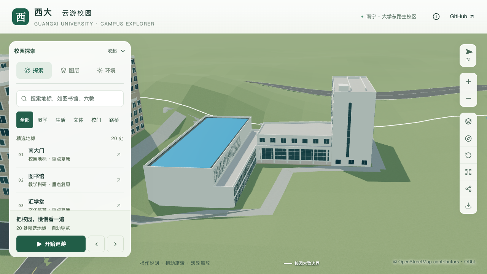

# 结构平台：柱廊后玻璃立面

> 后续接续[门厅上升屋面](CIVIL_PLATFORM_FOYER_ROOF.md)，原柱后玻璃与柱间净空保持。

2026-09-29，接续[六分部修正](CIVIL_PLATFORM_REPARTITION.md)，在连接门厅东侧退后墙面补入分格玻璃。建筑仍为 `way/957404988`，保持原六分部、柱列、屋面、入口及外轮廓。

## 影像对应与估算

直接核看[GX720全景658](https://www.gx720.net/pano/viewer/?slug=pano-658)既有原图块 `b/6/7.jpg`：密集窗低翼向北楼转折处有圆柱，柱后可见深色玻璃带。[2014年校报设计图](https://news.gxu.edu.cn/__local/8/C4/4D/0B1CE8B9D4B8389F21FF34B7030_FF27C11E_793A3.pdf?e=.pdf)也表达柱后的玻璃背景，可作相对关系辅证。全景日期未知，设计图不代表竣工测绘；本次玻璃沿用前批估算的连接体退后墙线，不能据此确认墙线的精确位置。

采用墙长3%—97%的连续玻璃面，底0.6米、顶6.3米，12列三行，外框宽0.12米、深0.1米。所有分格数、比例与米制尺寸均为估算。玻璃使用既有材质和浅面板，不模拟可进入室内，也不将任何格子指定为真实门洞。

本次另看2025年智能建造大赛合影，人物及背景板仍遮挡中央门面，不能由此锁定门锚点。[入口核对记录](CIVIL_PLATFORM_ENTRY_EVIDENCE.md)中的真实人员门与南侧构件门仍待确定。本轮新增[2025年5月研修班参观合影](https://tmjz.gxu.edu.cn/info/1016/7805.htm)，直接查看下载原图的缩放显示：中央门上横梁、圆柱和台阶比大赛合影更清楚。但文章包含多个参访场所，图注未唯一指认建筑，照片也没有周边转角；仅记录为下一轮门廊比对线索，未作为本次几何依据。

## 数据与生成规则

`exposedFacadeRules` 新增显式 `region: "under-portico"`，仅允许完整内部共边上的封闭墙面与开放平顶柱廊配对。该区域只接受有边界的玻璃面板，停用自动窗与阳台；普通外墙面板的3.2米最低标高限制保持。

验证玻璃底至少高于柱廊地坪0.1米、顶至少低于板底0.1米；面框不得越出柱廊轮廓或撞柱。框体复用既有面板生成器，基础与近景使用同一形体。此处的“玻璃”是外观表达，不是入口识别或通行路线证明。

专项参数在上轮基础上追加 `--portico-glass`，独立固定射线检查36个玻璃单元、四周白墙留边、原六根柱和五个柱间的通行空间。旧版白墙模型应在新增玻璃点失败；不得改写旧版几何预期使其假通过。

## 本轮核验

241项Python、62项Node、类型检查、lint、模型及Pages构建通过。源文件、基础与近景各441项专项检查通过，旧白墙模型在新增玻璃点失败。430栋普通楼栋、道路和树冠净空检查通过；六分部、所有原有立面和入口保持。其他447个建筑记录、全部1,085个GeoJSON几何、532个非树源对象、3,063株树、67个其他GLB和93个基础节点保持。准备时间元数据随本次数据生成更新。

11张前后、植被、夜景和移动视口画面直接核看：正面和低斜角的深色玻璃背景使六根白柱更可辨；高俯角仍受顶板与地坪遮挡，开敞空间另由固定射线检查。首屏模型5,399,376字节，比前批增加896字节，最大普通近景1,684,868字节。Blender版本为5.2.2。

精细档60/60/60 FPS、流畅档30/30/30 FPS；相对同系统S0，三角形+4.67%/+10.98%、绘制调用+2.93%/+13.69%，符合原预算。三次LOD往返通过，无浏览器错误；26次CPU快照在六个计时窗口未观察到≥2%的Python/Blender计算，正常桌面程序仍在运行。详见[本轮汇总及指纹](model-checks/refinement/s2-platform-glass-summary.json)。

## 后续

门厅坡面/曲面及柱廊屋面、真实人员门与运输门、台阶接路仍须继续；当前六分部仍为估算，整栋未通过验收。累计22个校准对象、1栋首轮整栋通过、21个部分校准，完整S2–S5及20–30栋整栋目标保持。开发、提交与推送仅在 `dev`。
