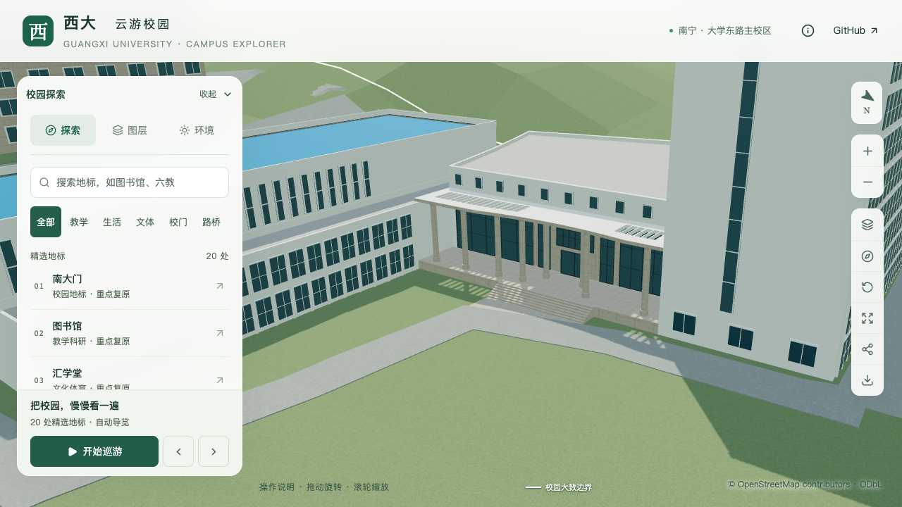

# 结构平台门廊：正式模型集成

2026-09-30，将[完整门廊候选](CIVIL_PLATFORM_PORTICO_FINISH.md)接入dev分支的建筑覆盖表、校园源文件和基础/近景GLB。原来的浅进深、单排六柱与整板屋顶已替换为约6米进深、前后八柱估算、曲线混合屋面、石色围合与六列中央玻璃；柱帽、侧格栅和上部十窗一并进入正式资源。**尺寸、重复数量与形制仍为照片约束估算，不计为整栋完成，也不代表已精确配准。**



## 集成范围与复现

六分部总占地和入口外缘锚点保持。仅门厅与门廊共享边界重新分区，后退门随墙移动；其余四部分的轮廓、高度、屋面保持。低实验翼紧邻门廊的女儿墙因门廊抬高而重新生成：原等高连接边不再视为同层连续屋面，这一派生边界变化纳入本批范围。

采用的具体参数、参考照片及局限分别见[曲线与进深](CIVIL_PLATFORM_CURVED_ENTRY.md)、[相机/柱距](CIVIL_PLATFORM_CAMERA_ALIGNMENT.md)、[饰面/柱帽/格栅](CIVIL_PLATFORM_PORTICO_FINISH.md)。覆盖表的来源、估算说明及屋面/入口/立面复核状态已同步更新；米制高度没有升级为实测，C区运输口仍未确认。

为了保持历史候选可复现，`preview_civil_platform_entry.py`改从[冻结输入](../data/refinement/civil-platform-entry-baseline.json)读取集成前的单栋记录及覆盖配置。不能将同一“移动后墙、增加两柱”操作再次施加到集成后的实时数据。该文件记录来源提交及原建筑数据指纹，未包含参考照片。

## 真实资产与接路检查

278项Python、65项Node测试及类型/lint检查通过，完成数据准备、校园模型和Pages静态包构建。检查的是实际源文件、基础GLB及本栋近景GLB：

| 检查 | 结果 |
| --- | --- |
| 平台六分部、坡顶、屋面体量及既有立面 | 三种资产各442条记录通过 |
| 曲线、21个格栅孔、柱帽整顶支撑、玻璃和窗带 | 三种资产共420条记录通过 |
| 完整3.6米门宽通路、约6米后退地坪、柱基、七级台阶与实际地面 | 三种资产各88条记录通过 |
| 接路、接口、铺装外地形与2.1米净空 | 源文件/基础GLB通过，旧入口资产在新门后退检查中按预期失败 |
| 普通建筑、道路与树冠回归 | 430栋普通建筑源/基础/近景形体及对应道路、树检查通过 |

对应机器记录：[平台上下文](model-checks/refinement/s2-platform-integrated-geometry.json)、[门廊](model-checks/refinement/s2-platform-integrated-portico.json)、[入口与台阶](model-checks/refinement/s2-platform-integrated-entry-geometry.json)、[接路](model-checks/refinement/s2-platform-integrated-connection-geometry.json)。新脚本保留旧参数检查路径；启用 `--integrated-portico` 才使用新的后墙、柱列与坡顶端点预期。

接路保留检查发现两个合理但不能忽略的变化：连接计算以门为局部原点，门后退会改变铺装网格的划分；下方地形也随铺装重新裁切。连接面的世界坐标面积差只有6.43×10⁻¹³平方米，台阶外缘和道路位置保持。对新旧源地形顶点XY并集共59,448处进行竖向比较，330处边界射线未命中而排除；最大高程差约0.08834米，局限于连接铺装及其2厘米边界带内。铺装外最大差0.0000229米。实际基础GLB的铺装下净距至少0.11499米、每2厘米接口采样的最大高差约0.00227米，接路检查通过。详见[地形差异](model-checks/refinement/s2-platform-integrated-terrain-delta.json)。

最初“只允许建筑源对象变化”的保留断言和2厘米地形诊断阈值未通过，调查记录保留在本机 `work/refinement-s2-platform-integrated/source-initial.log` 与 `terrain-delta-initial.log`；最终按实际影响范围检查铺装、地形和接口，没有把失败当作完成。原有两项测试将接路局部坐标写死为旧门深，已改为检查世界坐标台阶外缘，并补充“门后退仍保持连接面”的回归。

## 保留范围与网页画面

其他447栋建筑记录、1,085个GeoJSON几何、3,063株树保持。源文件仅平台楼、连接铺装与局部地形三个对象变化，其余531个非树对象的几何、UV、材质与变换保持。基础GLB对应三个节点变化，93个其他节点保持；只改变基础和本栋近景两份GLB，其余67份保持。69个模型及数据与本地Pages静态包一致。见[数据保留](model-checks/refinement/s2-platform-integrated-data.json)、[源文件保留](model-checks/refinement/s2-platform-integrated-source-preservation.json)、[资产检查](model-checks/refinement/s2-platform-integrated-assets.json)。

首屏模型5,828,040字节，比本批之前增加11,820字节；最大普通建筑近景1,684,868字节。11张目标楼前后、植被、夜景与手机尺寸画面已直接核看，浏览器未记录错误。手机图是桌面浏览器390×844视口，不是真机结果。

| 视角 | 集成前 | 集成后 |
| --- | --- | --- |
| 东侧入口 | [原图](screenshots/refinement/s2-platform-integrated-final/before/personnel-east-trees-off-day.png) | [新图](screenshots/refinement/s2-platform-integrated-final/after/personnel-east-trees-off-day.png) |
| 台阶斜视 | [原图](screenshots/refinement/s2-platform-integrated-final/before/stairs-oblique-trees-off-day.png) | [新图](screenshots/refinement/s2-platform-integrated-final/after/stairs-oblique-trees-off-day.png) |
| 整体体量 | [原图](screenshots/refinement/s2-platform-integrated-final/before/platform-northeast-trees-off-day.png) | [新图](screenshots/refinement/s2-platform-integrated-final/after/platform-northeast-trees-off-day.png) |

## 性能与接续

同系统、浏览器、视口与原S0条件下重新测量，每档三次、每次至少30秒：

| 模式 | 三轮中位FPS | 相对S0三角形增幅 | 相对S0绘制调用增幅 |
| --- | --- | ---: | ---: |
| 精细 | 60 / 60 / 60 | 6.09% | 3.47% |
| 流畅 | 30 / 30 / 30 | 14.26% | 12.55% |

原性能预算通过，流畅档三角形余量仍较小；三次LOD往返无错误。26次CPU快照在计时窗口内未记录达到2%阈值的Python/Blender活动，采样不证明完全隔离。[本批联合汇总](model-checks/refinement/s2-platform-integrated-summary.json)通过本轮门廊局部集成验收，保留未测绘和整栋待办状态。

可从冻结候选重新生成几何检查输入，并直接检查当前源文件和GLB：

```sh
work/refinement-venv/bin/python scripts/preview_civil_platform_entry.py \
  --output work/refinement-s2-platform-integrated/proposal.json
blender --background --python-exit-code 1 \
  --python blender/validate_civil_entry_proposal.py -- \
  --surround --tall-surround --curved-roof --refined-columns --finished-portico \
  --proposal work/refinement-s2-platform-integrated/proposal.json \
  --check-assets . --report work/refinement-s2-platform-integrated/portico-rerun.json
blender --background --python-exit-code 1 \
  --python blender/validate_civil_platform_entry.py -- \
  --entry-trim --integrated-portico --report-prefix=s2-platform-integrated-entry-rerun
```

下一步转回实验大厅C区运输口及剩余屋面/立面，继续区分新平台内部大厅与旧结构试验大厅。楼名字样、材质接缝、完整柱数与真实尺寸仍是待办。累计22个对象、1栋首轮整栋通过、21个部分校准；完整S0–S5范围不变。开发、提交和推送仅在dev，不合并或更新main/master。
