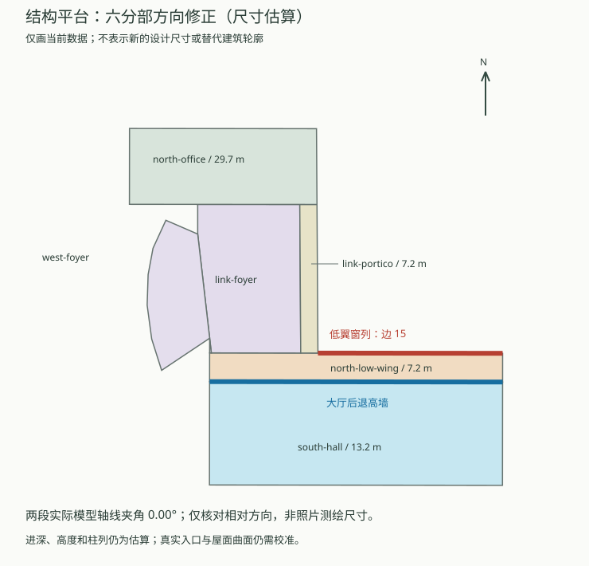
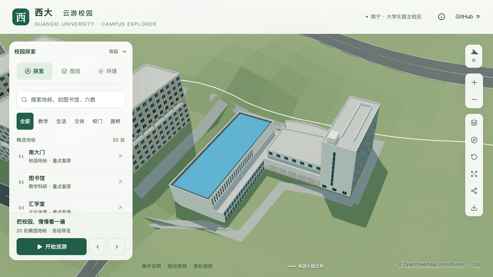

# 结构平台：低实验翼与连接柱廊体量修正

2026-09-29，落实[低翼方向配准返工](CIVIL_PLATFORM_ALIGNMENT_REVIEW.md)：取消连接体东墙上的密集窗列，把低实验翼沿高大厅北侧长边展开，并将连接体前沿改为开敞柱廊。仍属于 `way/957404988` 一个复合建筑，不增加建筑计数。

## 资料对应与估算边界

[2014年校报设计效果图](https://news.gxu.edu.cn/__local/8/C4/4D/0B1CE8B9D4B8389F21FF34B7030_FF27C11E_793A3.pdf?e=.pdf)、[校方2022年公告航拍](https://www.gxu.edu.cn/system/_content/download.jsp?urltype=news.DownloadAttachUrl&owner=1556120285&wbfileid=3792656)与[GX720全景658](https://www.gx720.net/pano/viewer/?slug=pano-658)提供了“高大厅—前侧低窗翼—转折柱廊—北楼”的相对关系。设计效果图不是竣工测绘，全景拍摄日期未知，历史航拍也不证明2026年现状。

本次采用**原外轮廓内重新分区的估算模型**：从南大厅北侧划出6米深低翼，而不是向前场任意增加一块占地。这个选择使低翼与大厅长边同向、保留高低层次和原映射外边界；资料没有独立证明6米分界恰好对应建成墙线。蓝顶的前后进深因此减少，后续若取得实测平面，须重新校准分界，不能把“未改变OSM外轮廓”作为分界真实的证明。

| 分部 | 本次表达 | 依据程度 |
| --- | --- | --- |
| 高大厅 `south-hall` | 保持13.2米高和1.2米内缩蓝顶，北墙后退6米 | 米制尺寸估算；高空间表达保留 |
| 北侧低实验翼 `north-low-wing` | 6米深、7.2米高、两层；原边15上18列两行窗 | 方向与前后关系受影像约束；进深、层数及窗数估算 |
| 连接门厅 `link-foyer` | 原中部实体扣除东侧柱廊条带，10.8米占位高度保留 | 功能与屋面曲面仍待细化，不再称已确认的低实验翼 |
| 东侧柱廊 `link-portico` | 深3.6米、顶高7.2米、净高6.85米、地坪0.24米、六根直径0.65米圆柱 | 开敞柱廊形制受影像约束，尺寸与柱数估算；没有据此认定真实门位 |
| 西弧形分部、北办公楼 | 保留原轮廓及7.2/29.7米高度、北楼窗网和屋顶四附加体 | 西侧层数及米制尺寸仍估算；北楼九层有历史设计依据 |

六部分合并与原外轮廓的面积对称差约1.65×10⁻¹²平方米，无新增孔洞或占地。低翼窗列从原边14迁至边15；大厅22组高窗移到后退的共享高差墙，底标高由7米改为8.1米，避开低翼7.2米屋面及通用女儿墙。尺寸都可在输入覆盖表中继续修订。



## 生成器与验证原则

斜外墙分割后，GEOS有时返回非空但不完整的相交线段。新增整条外边覆盖检查，只在覆盖确实不完整时启用已有的共线区间恢复；不扩大几何容差、不对完整边界强行改写。回归用例中旧实现缺失原边2的一段，新实现恢复完整且无重叠的覆盖；现有其他楼栋解析结果保持。

分部新增可选 `wallFinish: "white"`，复用现有白色材质，统一高差墙、柱和顶板的墙面颜色；未指定的楼栋继续采用原材质。首次候选生成中发现分割多边形方向导致外墙法线反向，已统一新分部外环顶点顺序后重建。源、基础和近景须通过独立法线及射线检查。

专项使用新参数，避免误跑历史东墙窗列预期：

```sh
blender --background --python-exit-code 1 --python blender/validate_civil_platform.py -- --inset-roof --north-facade --roof-volumes --east-slit --repartition --report-prefix=s2-platform-repartition
```

检查覆盖低翼屋面、高差两侧、大厅退后窗带、18列两行低窗、六根柱及五个开敞柱间、柱廊地坪、蓝顶面积及北楼既有细节。旧版应在低翼屋面检查失败；程序只验证采用的估算几何，照片对应与准确尺寸仍须分开评估。

## 实施核验

238项Python、62项Node、类型检查、lint、完整模型及Pages构建通过。源文件、基础与近景模型各401项专项检查通过，旧模型在低翼屋面检查失败；430栋普通楼栋、道路及树冠净空检查通过。全部448个原建筑轮廓、1,085个GeoJSON几何保持。

仅目标源对象、`base.glb` 和 `chunk-n2-n3.glb` 改变；532个其他非树对象、3,063株树、67个其他GLB和93个基础节点保持。首屏模型5,398,480字节，比前批增加1,972字节；最大普通近景1,684,868字节。此次导出使用Blender 5.2.2，未把旧版导出器版本写作当前环境。

11张修改前后、植被、夜景与390×844移动视口画面逐张核看。低翼、高差墙和内缩蓝顶在浏览器可辨；柱廊射线检查通过，但柱后白墙使开敞感偏弱，后续需随玻璃和入口校准改善。没有把移动视口检查当作手机真机性能结果。



精细档60/60/60 FPS，流畅档30/30/30 FPS；相对同系统S0，三角形+4.45%/+10.96%、绘制调用+1.28%/+14.07%，仍在原预算内。三次LOD往返通过，无浏览器错误；26次CPU快照在六个计时窗口未观察到≥2%的Python/Blender计算。正常桌面应用仍在运行，十秒采样不是完全隔离证明。详见[验证汇总与指纹](model-checks/refinement/s2-platform-repartition-summary.json)。

## 尚未完成

连接门厅的实际曲面/坡面、柱后玻璃及人员入口、南侧构件运输门、台阶接路和其他立面继续校准。当前地坪和柱列不代表入口接路验收通过。平台仍为部分校准，完整S2–S5与20–30栋整栋目标保持；开发、提交和推送仅在 `dev`。
