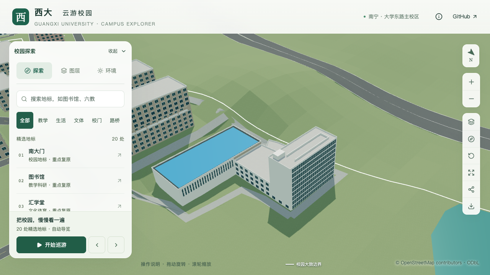

# 结构平台北楼：屋顶长条与局部附加体

2026-09-21，接续[北楼窗网与东端实墙](CIVIL_PLATFORM_NORTH_FACADE.md)，补充北楼平屋顶上可辨认的长条和局部小体量。所属对象仍为 `way/957404988`；新增四个屋顶构件，不增加楼栋或层数，不改变原九层主体和南大厅。

## 依据与简化范围

[学校2022年拆除采购公告](https://www.gxu.edu.cn/info/1364/30576.htm)的[航拍附件](https://www.gxu.edu.cn/system/_content/download.jsp?urltype=news.DownloadAttachUrl&owner=1556120285&wbfileid=3792656)展示北楼屋面上的平行长条及端部小体量。结合全图的蓝顶大厅和北楼位置，把两条长条按东西向布置，端部小体量放在北楼东南部。西端连接及四块边界是对低分辨率影像的简化解释，不宣称已完成构件测绘或确认实际设备用途。

原图哈希、获取路径与时点限制沿用[新旧大厅识别记录](CIVIL_LAB_IDENTIFICATION.md)。本批直接核看完整上下文及北楼裁图，不通过放大推断原图没有的细节。历史照片不能证明2026年现状；不加入未确认的水箱、设备管道、附房门窗、屋梯或可通行屋顶路线。

| 构件 | 沿北边范围 | 向南内退 / 进深 | 高于原屋面 | 性质 |
| --- | --- | --- | --- | --- |
| 北长条 | 原边13的0.09—0.82 | 3.0 / 0.4米 | 1.1米 | 外形估算 |
| 南长条 | 同上 | 9.0 / 0.4米 | 1.1米 | 外形估算 |
| 西连接 | 同起点，沿边宽0.4米 | 3.4 / 5.6米 | 1.1米 | 连接关系与尺寸估算 |
| 东南小体量 | 原边13的0.82—0.96 | 10.3 / 3.8米 | 2.6米 | 不推断具体用途 |

两条长条各约28.585米；小体量沿边约5.482米。主体屋面仍为29.7米估算标高，最高附加体达到32.3米，均相对本栋地面基准。表中范围沿原北外边从西向东计，内退方向朝南，跟随原边轻微偏转；不依赖世界坐标轴强行摆正。

## 实现约束

新增通用 `roofVolumes`，每个矩形显式给出ID、所属分部、原外边锚点、沿边范围、内退、进深与抬升。`scripts/roof_volumes_data.py`校验1—12个构件、唯一ID、有效数值、实体平顶支撑，以及距支撑外沿和内院至少0.5米；存在体积重叠时拒绝构建。相接边允许连接，不当作有面积重叠。

该首版不支持与穹顶、冠部屏墙、坡檐等其他专用屋顶构件叠加，也不支持放到内缩彩色覆盖层上，避免未经检查的穿插。屋顶附加体统一归入现有屋顶编辑组，使用已有白色材质，基础与近景通过同一函数生成。原平屋面、女儿墙、窗列和入口不移位。

## 验证

新增5项数据测试，检查旋转与反绕向后的世界位置、幂等与撤销、内院和边沿净距、非法参数、体积重叠及不支持的屋顶组合。普通建筑回归为每个附加体增加顶面采样；被其覆盖的原屋面仍从构件内部检查支撑面，没有取消原平屋面检查。

平台专项在独立固定坐标检查四个顶面、14个外露侧面及五处开放屋面，并保留原屋面、立面和高空间大厅检查。西连接的两个短端与长条相接，不误作外露面采样。运行命令：

```sh
blender --background --python-exit-code 1 --python blender/validate_civil_platform.py -- --inset-roof --north-facade --roof-volumes --report-prefix=s2-platform-top-local
```

236项Python、59项Node检查、类型检查、lint、完整模型及Pages构建通过。

- [平台专项](model-checks/refinement/s2-platform-top-geometry.json)：源文件、基础和近景各315项检查通过；[旧模型反例](model-checks/refinement/s2-platform-top-negative-geometry.json)在长条顶面检查中失败。[430栋普通建筑](model-checks/refinement/s2-platform-top-generic-geometry.json)、[实际树冠净空](model-checks/refinement/s2-platform-top-trees-geometry.json)及[道路](model-checks/refinement/s2-platform-top-road-building.json)回归通过。
- [数据不变项](model-checks/refinement/s2-platform-top-data.json)：仅目标新增屋顶附加体及依据，原主体、支撑屋面、立面、入口和1,085个GeoJSON几何保持。四体量合并占地约45.939平方米，最小屋面边沿净距约1.643米。
- [源文件](model-checks/refinement/s2-platform-top-source-preservation.json)与[资产](model-checks/refinement/s2-platform-top-assets.json)：仅平台源对象、基础GLB及本栋近景区块变化；其他532个非树对象、3,063株树、67个GLB与93个基础节点保持。69个模型与生产包一致，首屏5,394,580字节（增加300字节），最大普通近景1,684,868字节。
- [浏览器](model-checks/refinement/s2-platform-top-final-context-browser.json)和[画面对照](model-checks/refinement/s2-platform-top-visual-review.json)：四组前后、植被开启、夜景和手机尺寸共11张图直接核看，无页面、控制台或HTTP错误。手机尺寸采用基础层，保留同样的屋顶轮廓；底层入口和未校准南立面不因此视为完成。



最终[汇总及指纹](model-checks/refinement/s2-platform-top-summary.json)确认本局部工作包通过。[性能复测](model-checks/refinement/s2-platform-top-performance-browser.json)使用同机Apple M5、Chromium 148、1280×720、DPR 1及既有S0活动协议，每档三轮各30秒：

| 指标 | 精细档 | 流畅档 |
| --- | --- | --- |
| 三轮FPS中位数 | 60 / 60 / 60 | 28 / 28 / 28 |
| 相对S0的FPS变化 | 0% | −6.67% |
| 三角形中位数及相对S0变化 | 4,201,776，+4.52% | 1,166,327，+10.87% |
| 绘制调用中位数及相对S0变化 | 563，+2.93% | 287，+9.13% |

六项均符合原预算，三次LOD往返无错误；[27次进程快照](model-checks/refinement/s2-platform-top-performance-performance-context.json)在计时窗口未记录到超过2%阈值的Python/Blender计算。结果仅代表此固定设备与活动视角；单次绘制调用变化不作为普遍性能改善结论，也不外推为手机真机保证。

人员门廊、南厅运输口、其余立面和低翼屋顶继续核对，入口位置确认后再接台阶及道路。当前仍为22个校准对象、1栋首轮整栋通过、21个部分校准；该屋顶工作包不代表平台整栋或S2—S5完成。所有提交与推送仅在 `dev`。
