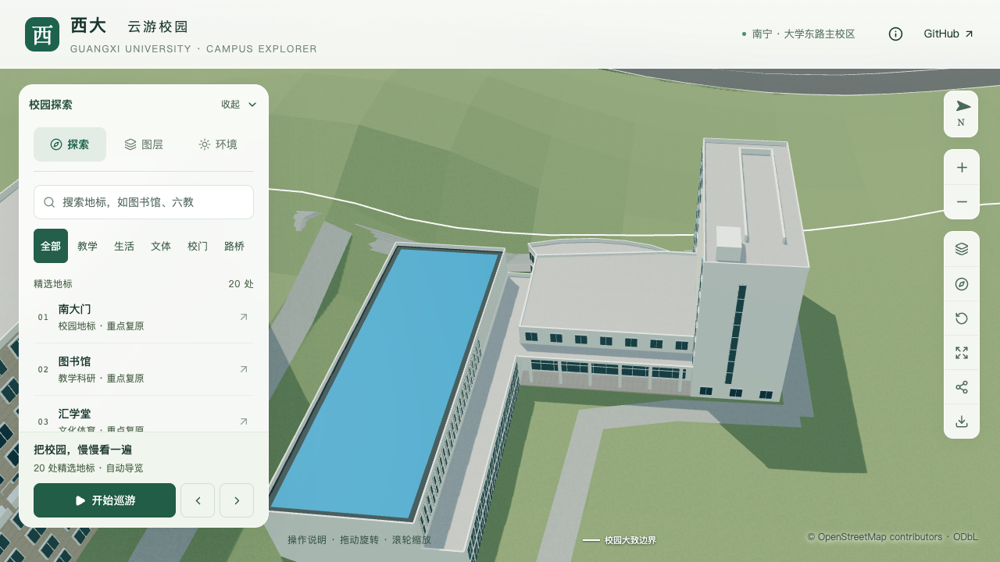

# 结构平台：门厅檐口与柱廊薄边框

2026-09-30，接续[门厅上升屋面](CIVIL_PLATFORM_FOYER_ROOF.md)，为 `way/957404988` 的连接门厅补入连续浅色屋面外缘，同时将柱廊的通用高女儿墙调整为薄边框。主体六分区、原坡面、柱列、玻璃和入口保持。

## 图像依据与采用尺寸

本批直接核看既有[GX720全景658](https://www.gx720.net/pano/viewer/?slug=pano-658)图块 `b/6/7.jpg`：门厅上升屋面外缘有浅色凸起，柱廊顶板可见较薄的外沿与较深色的中部。结合[2022年校方航拍](https://www.gxu.edu.cn/info/1364/30576.htm)核对蓝顶大厅、低翼、连接门厅和北楼的相邻关系。照片支持构造关系，不能换算准确宽高；下列数值都是有界估算。

| 位置 | 模型表达 | 估算尺寸 |
| --- | --- | --- |
| 门厅东、南、西侧 | 沿原四段坡面连续升高的浅色边沿 | 从外墙线向内0.35米，高出当地坡面0.45米 |
| 门厅北侧 | 接北楼高墙，保留原屋面接缝 | 不追加边沿 |
| 柱廊东侧外沿 | 替换通用0.8米女儿墙的薄边框 | 向内0.35米、高0.18米，顶标高7.38米 |

边沿全部位于原分部占地内，不向外扩展或改变墙线。柱廊顶板仍为7.2米、板底6.85米；背靠门厅及与低翼、北楼相接的边界不再生成通用女儿墙。真实压顶断面、排水坡、雨水口、顶面材料和老化颜色尚未确认，未从深色照片区域推断构造孔洞。

## 生成约束与核验方式

分部 `roof.rim` 显式给出外环边索引、宽度和高度，仅用于连续平屋面或显式 `profiled` 屋面。边索引相对于分部的外环，不是整栋原始外环。配置整体替换该分部的通用女儿墙，未选边保持开放；宽度限制0.15–0.8米，高度限制0.1–0.8米。

生成时先将边带裁到原占地以内，再按支撑屋面每个三角面求高程。转角边带先合并，顶面没有重复覆盖；内外边壁沿边带边界生成，分段坡面交线不生内部竖墙。基础与近景共用同一几何。原屋面继续作为支撑面，白色边框使用已有材质。

数据测试用解析斜面核对高度随坡变化、环带面积、内外壁法线、未选边和内院留空，并拒绝越界尺寸、重复/过期边索引和不支持的屋面。专项参数在 `--foyer-profile` 后追加 `--roof-rim`，用独立固定坐标核验边框顶高、宽度两侧和外向侧面；旧模型作为负例。

## 本批核验

247项Python、62项Node测试、类型检查、lint和Pages构建通过。源模型、基础模型与近景模型各502项专项检查通过；上一批无檐口模型在新增白色边框采样处失败。普通楼栋、树冠净空和道路检查通过。其他447个建筑记录、532个非树源对象、3,063株树及1,085个GeoJSON几何保持。

直接核看11张固定浏览器对照图，包括门厅高位、柱廊较低视角、整体场景、夜景和手机基础模型。浅色檐口在所查转角连续，柱廊外缘变薄，玻璃及柱列保持；未发现新增缺面。高位远景中细边较轻微，不能据此认定真实断面和尺寸已经复原。

仅基础GLB和目标近景块变化，其他67个GLB、基础模型93个非目标节点保持；首屏5,399,880字节，比前批增加552字节，最大普通近景块1,684,868字节。[几何检查](model-checks/refinement/s2-platform-rim-geometry.json)、[数据保留](model-checks/refinement/s2-platform-rim-data.json)、[资产核对](model-checks/refinement/s2-platform-rim-assets.json)、[视觉核看](model-checks/refinement/s2-platform-rim-visual-review.json)。

首轮性能数值为精细60/60/60、流畅30/30/30 FPS，几何成本也在预算内，但26次CPU快照捕捉到其他项目持续Python计算，因此未通过同条件验收。[首轮汇总](model-checks/refinement/s2-platform-rim-first-summary.json)保留失败状态；后续确认对应两个进程已结束且预检未见同类高负载，再安排补测。没有停止其他项目的进程。

补测完成三次LOD往返，精细/流畅分别60/60/60、30/30/30 FPS，无浏览器错误；相对S0，三角形中位数增加4.55%/10.98%，绘制调用增加2.93%/13.69%，均在预算内。但26次CPU快照中有一次其他Python进程活动（2.7% CPU、累计CPU时间0.08秒）；按现行2%采样门槛，仍不记同条件通过。两轮各6张回归画面均已核看。[最终汇总](model-checks/refinement/s2-platform-rim-summary.json)保留 `passed: false`、几何视觉通过和性能数值通过的分项状态。**本批同条件性能及联合验收待复验**，不修改门槛或覆盖失败记录。

## 后续与范围

继续核对大厅南侧构件运输口、人员入口和道路连接，以及未确认的立面和屋面细节。该复合体仍为部分校准；累计22个对象、1栋首轮整栋通过、21个部分校准，完整S2–S5及20–30栋整栋目标保持。所有开发、提交和推送只在 `dev`。
