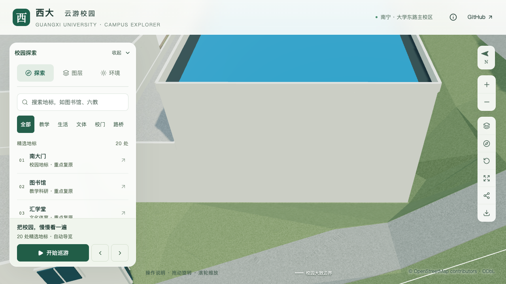
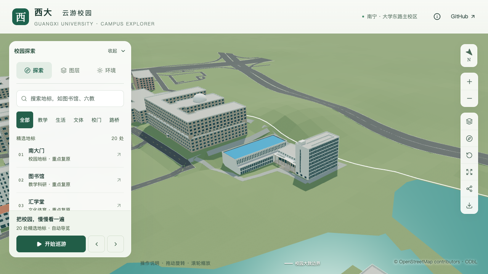
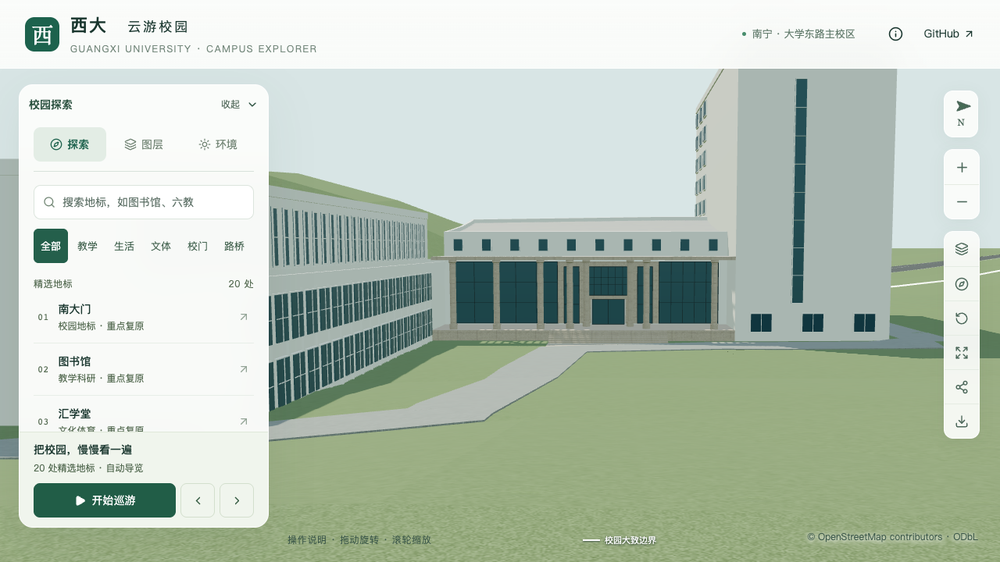
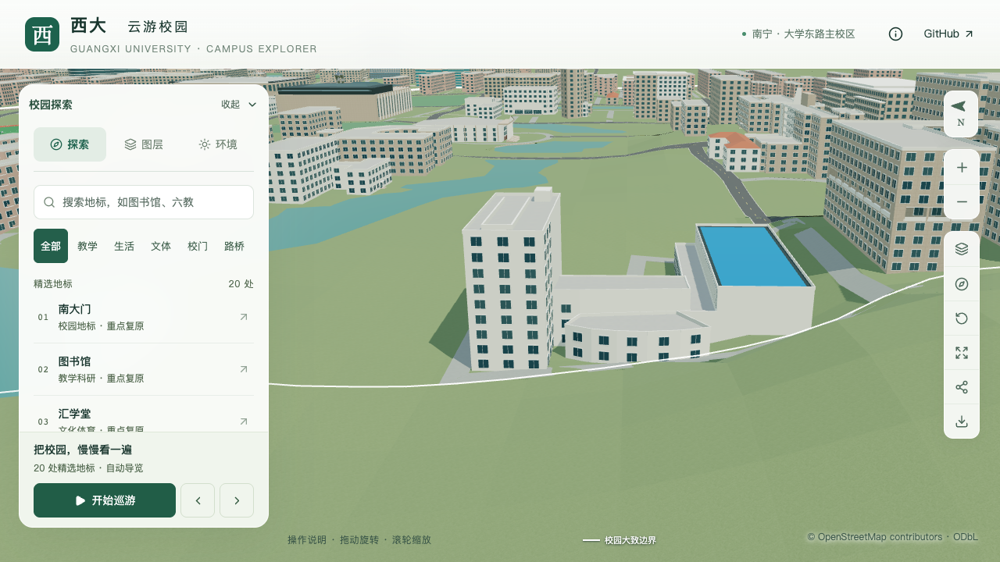

# 大型结构试验研究平台首轮整栋校准验收

> 当前结论（2026-09-30）：完成接地修补后的整栋联合复验，恢复首轮通过。22个校准对象中2栋首轮通过、20个部分校准，S3六栋邻楼整栋通过仍为0；完整S0–S5目标未完成。

## 本次恢复依据

此前地形和普通服务路进入封闭楼体，暂停整栋结论是必要的。该问题经过[基础与道路修补](CIVIL_PLATFORM_FOUNDATION.md)及[保留边界修正](CIVIL_PLATFORM_RECHECK.md)解决；本轮重新联合检查当前生产源文件、基础与近景模型，不以单个修补报告替代整栋判断。

原计划第5.3节允许明确登记估算和无法确认项。本轮重看航拍、北侧全景及具名参观合影，复核下方四领域表；新增施工外景和室内照片的取舍已记录，仍没有运输口、北楼南西面或西门厅屋面的新定位依据。因此这些内容继续待证。本次恢复首轮通过不等于这些部位已还原，也不证明实测高度、2026年竣工状态或用户已确认楼名。旧大厅和另一个6–8层新建中心仍独立识别。

[联合报告](model-checks/refinement/s2-platform-whole-restored-summary.json)核对9组实际检查：

- 楼体、屋顶和主要已校准立面：源/基础/近景各595处；人员入口各88处；集成门廊共420条检查通过。
- 全楼接地：源/基础各1108点无超原容差的地形或普通道路侵入；不是只查楼心。
- 西侧服务路：各6438处路面、470处封口、85处接缝检查通过；人员入口接路各82点及2.1米净空通过。
- 周边：各49196点，物理学院周界1129点；源保留地形最大变化约0.061毫米，邻楼周界变化为零。服务路重建带约3.2毫米历史变化继续单列，未放宽保留区容差。
- 建筑/树木及道路、水体、运动场/树木分别重新检查源模型和实际GLB，两组均通过。

[13张当前网页画面](model-checks/refinement/s2-platform-whole-restored-context-browser.json)均已核看，涵盖人员入口、东北整体、北楼南西面、门厅、屋顶、大厅端面、树图层、夜景和手机尺寸。南斜视仍被前景地形遮挡，排除其完整南墙证明用途；西端近照和实际网格采样用于接地判断。手机视角仅为桌面浏览器视口模拟。没有浏览器记录错误。

当前69个模型在public、out与实际HTTP响应中一致，生产源文件、模型、数据及运行代码均与上批`9f27469`保持。性能复用[无损打包后的同条件测量](model-checks/refinement/s5-lossless-summary.json)：精细60/60/60、流畅30/30/30 FPS；相对S0三角形增加5.85%/13.65%，绘制调用增加3.29%/9.89%，原预算通过。模型清单、源文件指纹和运行时代码已核对；当前生成JS与HTTP一致，但上批未保存逐个JS哈希，不声称做过历史JS二进制比较。本轮没有新增FPS测量或重复构建。

首屏5,993,304字节，余6,696字节，最大普通近景1,684,868字节。接续推进其他已校准对象的整栋联合复核；上述土木待证项取得定位资料后优先修订。开发、提交和推送仍仅在dev。

## 历史首轮报告（接地问题发现前）

以下保留首次验收时的资产、画面和计数；其旧接地结论曾暂停，当前结论以本页上方及恢复报告为准。

2026-09-30，`way/957404988`，近景区块 `chunk-n2-n3`。按[实施计划第5.3节](CAMPUS_REFINEMENT_PLAN.md#53-批量推进与验收)通过首轮整栋校准，保留以下估算和未知项。本轮汇总现有模型并联合复核，没有新增生产几何；不代表实测、竣工复原或2026年现场认证。

本项目暂以“大型结构试验研究平台综合楼”作为用户“新结构大楼”的工作对应，尚非用户明确指认，后续名称澄清见[接续清单](CIVIL_LABS_FOLLOWUP.md)。平台实验大厅、九层北楼及连接门厅属于同一个地图对象，计一栋。加上已验收的土木学院，目前22个校准对象中 **2栋首轮通过、20个部分校准**，20–30栋及S0–S5整体目标尚未完成。旧结构试验大厅仍是独立待定位对象，不重复计数。

## 核对范围与证据边界

本次直接复核已保存的校方航拍局部、GX720全景瓦片及2023年学院参观合影。它们分别支持体量/屋顶、厅北墙/北楼东端与门廊构成；没有提供北楼背面和大厅运输门的完整定位证据。来源链接及时间限制见[大厅四面资料表](CIVIL_PLATFORM_HALL_NORTH.md)、[门廊集成](CIVIL_PLATFORM_PORTICO_INTEGRATION.md)和[运输口取证](CIVIL_PLATFORM_DELIVERY_ENTRY.md)。上传或报道日期不等于照片拍摄日期。

| 领域 | 有依据且已落地 | 估算或通用示意 | 待核对 |
| --- | --- | --- | --- |
| 层数与体量 | 原统一五层体拆为大厅、低翼、连接门厅、柱廊、西门厅、九层北楼六部分；保留原占地 | 大厅13.2米、低翼7.2米、连接门厅10.8米、柱廊8.6米、西门厅7.2米、北楼29.7米；低翼/西门厅两层及分界位置为估算 | 各部分实测高度、分界和楼层口径；九层依据历史设计资料 |
| 屋顶 | 大厅蓝色内退屋面及白色边墙；连接门厅向西抬升；柱廊中央实顶与两侧格栅；北楼屋顶条形体和局部凸部 | 内退1.2米、门厅抬高2.4米及各小体量尺寸；西门厅暂沿用平顶 | 蓝顶坡度/排水、西门厅真实屋面和完整设备布局 |
| 入口与接路 | D区入口结合OSM节点与照片关系定位；后退门、曲线柱廊、台阶和服务路连接落地；撤去缺证据的南墙默认门 | 后退约6米、门宽3.6米、七级台阶、八柱布局、玻璃分格和材质颜色 | C区运输口的墙面、数量、宽高；实测标高、无障碍路线及其他小入口 |
| 主要立面 | 大厅北墙双排高窗覆盖完整长墙；低翼窗网；北楼北向窗网及东端白墙窄玻璃带；D区石色围合与玻璃 | 大厅32列、低翼18列、北楼北面22列及各分格尺寸均为照片约束估算；北楼南/西和西门厅窗格仍通用 | 北楼背面窗型与排布、西门厅立面；大厅南/东/西白墙只是未核实占位，不证明实际无门窗 |

符合首轮标准的依据是上述形体、屋面、入口和主要可见立面已有校准，并已逐项登记无法确认内容；不是以通用窗格证明背面已还原。后续取得可定位新照片后再修订这些部分，不继续凭空增加细节。

## 当前模型画面与几何检查

[首批12张画面](model-checks/refinement/s2-platform-whole-context-browser.json)及[补充6张画面](model-checks/refinement/s2-platform-whole-supplement-context-browser.json)均已直接核看，覆盖主入口日夜、东北整体开关树、屋顶俯视、北楼南/西斜向、西门厅、大厅东端及手机尺寸。桌面均加载目标近景区块，浏览器无错误。手机为桌面Chromium的390×844视口模拟，不是实体手机测试。

首批大厅南向画面被物理学院挡住；补充南偏西画面仍有前景地形遮挡下部，保留为视线局限记录，不作为完整南墙或接地验收证据。西门厅下部亦有地形遮挡。大厅南侧运输门继续列未知；当前墙面和屋面形体由实际模型探测补充验证。其他方向的截图不能消除现实资料的缺口。

本轮重新运行[接路检查](model-checks/refinement/s2-platform-whole-connection-geometry.json)：源文件及基础模型各82个铺装采样、2.1米净空、台阶高差、道路接口和连接区外492处地形采样通过。核对指纹后复用上一批平台各595条、人员入口各88条和三档门廊共420条检查，以及树木净空结果；没有把它们写成本轮重新执行。平台检查涵盖源文件、基础和近景三个版本。

[机器汇总](model-checks/refinement/s2-platform-whole-summary.json)核对上述报告的源文件/数据/GLB指纹；69个模型在public、本地out及实际HTTP响应中一致，公共数据亦一致。生产代码和模型未修改，因此本轮未重复完整构建、278项Python或65项Node测试；这些通过结果属于上一批。

## 性能沿用与后续安排

复用[大厅北墙批次性能](model-checks/refinement/s2-platform-hall-span-summary.json)，没有重新测量FPS。模型清单完全一致，运行时代码自该次测量所属批次无改动；当前生成JS与HTTP逐个比对。上次测量未记录生成JS哈希，因此不宣称历史与当前JS二进制已直接比较；本次保存的JS哈希供后续追溯。

| 上批同条件性能 | 精细 | 流畅 |
| --- | --- | --- |
| 三次FPS | 60 / 60 / 60 | 30 / 30 / 30 |
| 相对S0三角形增幅 | 6.32% | 14.61% |
| 相对S0绘制调用增幅 | 3.47% | 14.83% |

首屏模型5,830,400字节，最大普通近景1,684,868字节。流畅档接近15%预算上限，后续新增细节前先考虑减少绘制开销。原性能阈值保持。

当前平台转入“有新依据再修订”。旧大厅的1984年资料与2022年拆除采购不证明现状或已拆除，须取得可定位轮廓及状态证据才建模。接续主计划优先处理性能余量和S3图书馆北入口六栋邻楼的未完成项；旧大厅保留独立取证，不以矩形检索范围造楼。所有开发、提交、推送仅在dev，未经允许不合并主分支。
