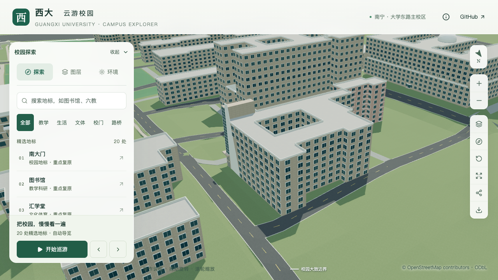
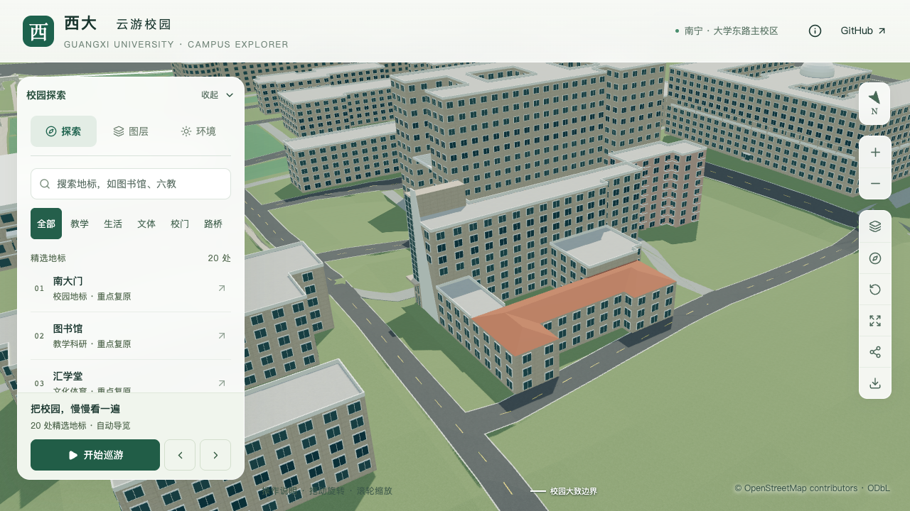

# 土木学院北翼与低连接段体量

2026-09-21，将原统一八层平顶的后部拆为北翼及东、西连接段。北翼改为连续红色坡屋面，南主楼保留八层；原OSM轮廓、内院和西南附楼均保持。该批只完成体量与屋面，不计整栋验收。

## 依据与估算范围

[北侧航拍取证](CIVIL_REAR_MASSING_EVIDENCE.md)已通过内院、南侧资环材楼和西侧物理楼定位。[GX720全景](https://www.gx720.net/pano/viewer/?slug=pano-658)可辨北翼三层及相连的低楼段，屋面由横向长脊、两端短脊和转折坡面相接。页面索引及资源路径中的2021年不能作为拍摄日期。照片只用于参考，不作为纹理或公开素材打包。

| 分部 | 本批采用 | 确定程度 |
| --- | --- | --- |
| 南主楼 | 八层、26.4米、平屋面 | 保留既有参数；高度仍为层高换算 |
| 北翼 | 三层、檐口10.8米 | 可见三层有影像支持；3.6米层高及高度为估算 |
| 北翼屋顶 | 红色连续坡面，脊高增量2.3米，最高13.1米 | 形制有依据，屋脊位置、高度、坡度均为估算 |
| 东连接段 | 三层、10.8米、平屋面 | 低置信度估算；照片中的浅色覆盖面未直接当作实测屋顶 |
| 西连接段 | 四层、13.2米、平屋面 | 四层读数待核对，高度为估算 |

分界沿原内院南北边延长线。南界相对候选线向北平移0.05米，以容纳已有塔部白墙支撑；它是分部内部的估算分界，不改变原占地。四块并集与原分部的对称差约1.37×10⁻¹²平方米，重叠面积在浮点误差范围内为零。原内院留空；西南附楼与露台的实体和檐口保持。

北翼使用明确的顶点与三角面网络表达两条短脊、横向主脊和两处屋谷，没有采用距离场生成的顶部平台。新增的有界屋面解析器要求投影完整覆盖所属轮廓、没有重叠或孔洞、内部共边连续、檐口高度为零，并统一朝上法线。重复XY顶点、非整数索引、退化面、断开的屋脊和填满内院的网格会被拒绝；既有屋顶继续使用原路径。

## 保留细节与回归处理

南面及西端第七/八层退进、窗带、附楼高墙与拱窗、露台、台阶、门厅、塔头及斜墙保持。迁移分部名称和共享边锚点后，东侧第16边的幕墙比例坐标按原端点距离重新换算，保持距东南角0.10至3.70米的3.60米玻璃宽度。主楼在两侧低楼段上方新增通用窗列；这些窗列仍为示意，真实外廊和楼梯体量另行细化。

场地入口记录仅更新幕墙所属分部名称。铺装、湖岸和低植被记录只更新依赖指纹，几何保持。增量构建以当前3,063株树为输入，没有恢复原先已剔除的树；本批报告记录的是3,063株至3,063株，历史完整候选集剔除报告保留在前一提交。

旧附楼检查通过显式 `--rear-massing-added` 保留南部屋顶、原内院及较低墙面的法线检查，北翼与连接段交由新专项。斜墙检查在同一模式下要求旧高连接墙位置留空；背斜面射线从表面附近发射，避免新低楼窗框遮挡旧长射线路径，其材质、位置与法线要求保持。

## 验收

[北翼专项](model-checks/refinement/s2-civil-rear-geometry.json)在源文件、基础和近景模型分别检查60条记录，覆盖坡面高度和法线、两条短脊与长脊、两处屋谷、檐口连续性、两侧低平顶、南主楼顶、内院和露出的主楼墙面。[旧模型反例](model-checks/refinement/s2-civil-rear-negative-geometry.json)在第一处坡面检查被拒绝。

[数据检查](model-checks/refinement/s2-civil-rear-data.json)确认447栋其他建筑、原轮廓、树位和场地几何保持。[资产检查](model-checks/refinement/s2-civil-rear-assets.json)与源文件比较另行记录模型范围；最终运行与视觉结果由[联合汇总](model-checks/refinement/s2-civil-rear-summary.json)保存。

九张最终前后、日夜、植被开关和390×844手机尺寸截图已直接核看；手机为桌面视口模拟。北翼屋面及低连接段可辨，内院保持，南侧细节同时由独立几何检查覆盖。

| 北侧视角 | 修改前 | 修改后 |
| --- | --- | --- |
| 北翼与连接段 |  |  |

214项Python测试、56项Node测试、类型检查、lint及完整模型/Pages构建通过。源文件检查确认只有土木学院网格变化，3,063株树实例保持；只变更基础模型及 `chunk-n2-n3`，其他67个GLB和93个基础节点保持，全部69个GLB与生产包一致。首屏模型5,331,392字节，比前一批增加344字节；最大普通近景1,684,868字节。

三次LOD往返和两档各三次30秒环绕通过，浏览器无错误。精细档60/60/60 FPS，流畅档28/28/28 FPS；相对同系统S0，三角形增加4.18%/9.65%，绘制调用增加4.02%/14.83%，帧率变化0%/−6.67%，均符合原预算。流畅档绘制调用中位数仍为302，接近15%增幅上限，后续细化需继续控制开销。

24次CPU快照未在计时窗口捕获高占用Python或Blender计算；采样间隔10秒、只纳入CPU至少2%的进程，不证明完全没有后台活动。图书馆手机尺寸回归截图也已直接核看。[联合验收](model-checks/refinement/s2-civil-rear-summary.json)通过，保存当前资产指纹、专项及性能记录。

## 仍待完成

主楼北向外廊及两端楼梯间、北翼外廊与门窗、两侧连接楼细节、西南附楼高墙后的屋面及完整前庭仍需逐项校准。连接段层数和楼高继续保留待核对状态。累计仍为21条部分对象记录、新增整栋验收零栋；当前学院楼完成后，依用户顺序推进实验大厅、新结构大楼，并继续核对旧大厅与现用平台的身份及历史时点。
