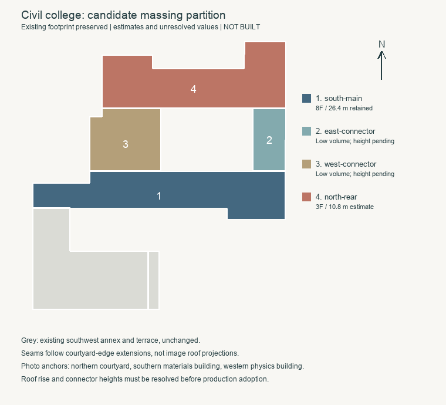

# 土木学院北翼分段与实验建筑位置依据

2026-09-21，接续第七层退进验收，新增可定位的北侧航拍视角。该影像直接反驳当前模型把主楼、北翼和两侧连接段统一为八层平顶的处理。本批交付来源记录和保持原轮廓的候选分段；生产模型尚未修改，不计整栋完成。

## 北侧视角与定位

[GX720广西大学航拍全景](https://www.gx720.net/pano/viewer/?slug=pano-658)可从北侧观察学院楼。定位同时使用内院、南侧资环材楼和西侧带穹顶的物理楼，与现有OSM及Esri影像对应；不能只凭白色立面认楼。[旧页面](https://www.gx720.net/home/view/658)的索引显示2021-08-06，资源路径也含2021/8，但二者均不证明拍摄日期。较新的Esri影像仍显示对应红色北翼屋面，可辅助核对位置，不能据此补出拍摄日期或结构尺寸。

已直接核看浏览器全景及其已加载的原始分块，其中`4/b/6/4.jpg`清楚显示北翼三排楼层开口、红色坡屋面及西侧低平顶连接段。判断范围如下：

| 区域 | 可采用的观察 | 仍需明确的参数 |
| --- | --- | --- |
| 南主楼 | 高体量与低翼有明显高差；既有八层参数继续保留 | 26.4米仍为原层高换算 |
| 北翼 | 三层可见，屋面由中段与两端突出部分连接，有坡面与转折 | 檐口高度、屋脊高度及屋谷位置；10.8米只作为沿用3.6米层高的候选估算 |
| 东连接段 | 低于南主楼，顶部可见浅色覆盖面 | 不能把覆盖面直接当作主体屋顶标高；层数、高度待定 |
| 西连接段 | 低平顶体量，位于主楼与北翼之间 | 四层读数仍为待核对推断，不能直接写为确认值 |
| 西南附楼 | 大部分被南主楼遮挡 | 本次航拍不能解决三角形高墙后的屋面形制 |

参考照片仅留在本机`work/refinement-s2-civil-location/`，不打包为公开图片或模型纹理。[证据记录](model-checks/refinement/s2-civil-rear-location-evidence.json)保存来源、直接核看范围及文件哈希。

## 可复核的候选分段

将现有`main-and-rear`按内院南北边的延长线分为四块：南主楼、东连接段、西连接段和北翼。南主楼及北翼之间的内院保持原状，西南附楼和露台不参与本次划分。分界是原轮廓与可见体量共同约束的候选线，不代表实际施工缝。

[机器可读候选](model-checks/refinement/s2-civil-rear-partition-proposal.json)保存四块完整坐标：面积约760.36、167.47、353.34和740.40平方米。联合轮廓与原分部的对称差约为1.3×10⁻¹²平方米，互相重叠面积和侵入内院面积均为零。这只验证平面划分，没有验证拟建模型或宣称楼高已确认。

落模时先明确两侧连接段高度的估算口径，再处理北翼连续坡面、两端转折和屋谷。现有不规则四坡屋顶生成器采用距离场与高度平台，不能未经对照就当作照片中的屋脊拓扑。分段后需按实际端点迁移南立面、露出墙面及塔部支撑锚点，保留已完成的南面退进、附楼、台阶、门厅和前场连接。

新的高差会产生露出墙面，也可能改变树木遮挡及碰撞关系。后续验收须覆盖源文件、基础/近景实际模型、内院留空、屋面高差、旧八层体量清除、已有局部回归及原性能预算；不能只用本次平面检查替代。

## 实验建筑位置进一步收敛

[学校2024年10月23日施工通知](https://www.gxu.edu.cn/info/1365/36792.htm)所附位置图已成功取得并直接查看。图中“结构大厅”标签位于现学院楼北面的施工范围内，“大型结构试验研究平台综合楼”及“研究平台”在其西侧。通知正文说明工地主出入口在君武路，这与图示东侧入口对应。

该图补上了此前缺失的项目位置线索，但它是施工范围示意图，不能替代2022年逐栋拆除清单，也不能证明某栋的实际拆除日期。当前数据中尚无可独立确认的旧大厅ID，候选`way/957404988`仍需要按复合体核对，不能因多个地图标签重复新增楼栋。用户所指大厅是旧大厅还是现用大厅的澄清仍保留。

## 当前状态与接续

本批仅新增证据及候选分段，69个GLB、Blender源文件和生产数据均与`0dda33b`一致，没有重新执行无改动模型的性能测量。下一步将本次北翼与连接段证据用于体量修正，再继续侧后立面及未确认屋面。累计仍为21条部分对象记录、新增整栋验收零栋；当前学院楼完成后，按用户顺序推进实验大厅、新结构大楼。
