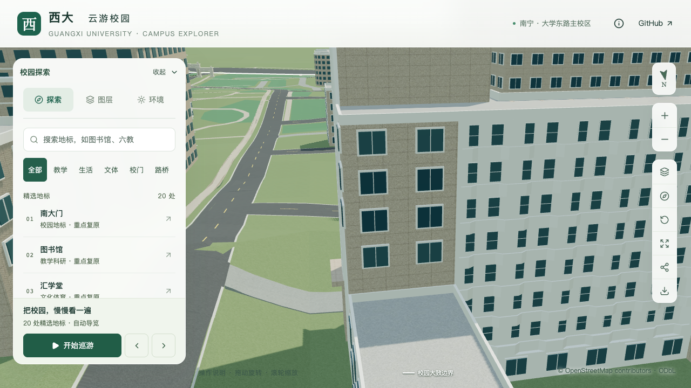
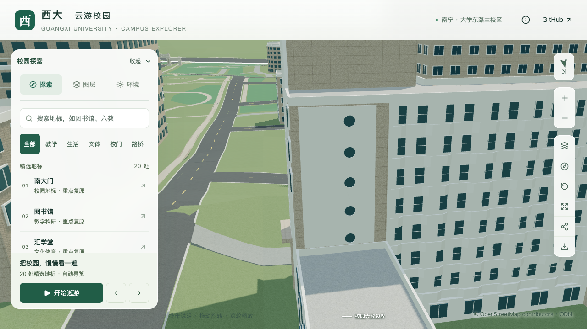

# 土木学院主楼北向东端圆窗墙

2026-09-21，在主楼北向折线外廊完成后，补入其东端白墙上可辨的五个圆窗。本批只校准上部外露墙面，未确认楼梯内部和顶部体量，仍不计整栋完成。学院楼完成后，按用户顺序继续实验大厅、新结构大楼。

## 依据与参数

来源为已定位的[GX720广西大学北侧全景](https://www.gx720.net/pano/viewer/?slug=pano-658)，拍摄日期未知，定位方法见[北侧取证](CIVIL_REAR_MASSING_EVIDENCE.md)。参考图仅本机留存，不作为公开模型纹理。朝南观察时，圆窗墙位于画面左侧，对应建筑东端；五个深色圆形开口及白色墙面有影像支持。

参数锚定 `south-main` 与 `east-connector` 相邻的上部外露立面，沿边由东向西。保留既有主楼26.4米、东连接楼10.8米及其女儿墙；没有为容纳圆窗降低连接楼，也没有将照片里更高的白色体量另建为楼梯塔。

| 内容 | 采用值 | 精度边界 |
| --- | --- | --- |
| 白墙范围 | 该边0.08至0.86，高11.7至26.25米 | 位置及尺寸估算 |
| 圆窗 | 五个，直径1.1米 | 数量、圆形有图像依据；尺寸估算 |
| 圆窗中心 | 墙内水平0.65，标高12.4、15.5、18.6、21.7、24.8米 | 受现有低屋面净空约束的估算排布 |
| 白墙前面 / 玻璃前面 | 原墙外0.15 / 0.04米 | 浅层外观表达，不代表真实墙厚或室内空间 |
| 圆形分段 | 每窗32边，两档相同 | 有限多边形近似 |

西端窄窗分格尚未准确辨认。两端楼梯体量、北翼外廊、两侧连接楼细节及西南附楼后方屋面仍待继续核对。

## 生成规则

`panels` 增加受限类型 `round-window-wall`，沿用显式墙面边界，并要求1至16个圆窗。每个开口只有墙内水平比例 `t`、相对建筑基准的中心标高 `height`、半径 `radius`；拒绝非有限数值、布尔值、越界、重叠或孔间净距不足的配置。沿用既有面板与窗带、挑檐、凹廊和低屋面的冲突检查。

数据准备阶段对矩形白墙减去圆孔后进行三角化，生成 `roundWindowWalls`；输入规则不被改写。模型生成白墙正反面、孔壁和后退的圆形玻璃。与墙面范围相交的默认方窗停止生成，孔口背后的原主体墙保留；没有矩形深色底板或伪造的楼梯内部。普通玻璃、格栅和实墙面板继续原路径。

## 验证

220项Python测试、280项旋转及反向立面生成检查通过。三角化测试核对覆盖面积、无重复三角形覆盖及五个圆心留空；无效参数测试覆盖越界、重叠、过量和非法数值。

[固定坐标专项](model-checks/refinement/s2-civil-round-windows-geometry.json)对源文件、基础和近景实际网格各检查112处：圆窗玻璃、圆外白墙及四角、径向孔壁、白墙边界和保留屋面。位置容差依次为0.006、0.05、0.02米；玻璃/白墙法线点积大于0.99，径向孔壁内向点积大于0.95。[旧模型反例](model-checks/refinement/s2-civil-round-windows-negative-geometry.json)在首个圆窗中心命中旧石色墙面而失败。

[数据检查](model-checks/refinement/s2-civil-round-windows-data.json)限定一条上部外露立面变化；447栋其他建筑、所有分部和屋顶、入口、内院外廊及其余立面保持。[资产检查](model-checks/refinement/s2-civil-round-windows-assets.json)确认只改变基础模型和所在近景区块，其余67个GLB与93个基础节点保持；69个模型与生产包一致，3,063株树保持。首屏模型5,368,388字节，增加7,496字节；最大普通近景1,684,868字节。

56项Node测试、类型检查、lint、完整模型及Pages构建通过；此前南立面、入口、附楼、北向折线外廊、后部屋面、道路和树木检查均通过。16张前后、斜向、日夜、植被开关及手机尺寸截图均直接核看，图书馆手机回归保持正常；手机尺寸是桌面视口模拟。

| 东端圆窗墙 | 修改前 | 修改后 |
| --- | --- | --- |
| 北向近景 |  |  |

首次性能对照的流畅档绘制调用中位数为303，比S0增加15.21%，超出原15%预算；[首次未通过汇总](model-checks/refinement/s2-civil-round-windows-first-summary.json)保留，未覆盖。旧版本同样存在单次303的记录，本次修改前后该区块均为七个材质组，位置包围盒完全一致。页面约1.5秒更新指标、测试每1.6秒读取，环绕角度没有同步；采样波动是有依据的解释，但没有证明它是唯一原因，详见[排查记录](model-checks/refinement/s2-civil-round-windows-performance-diagnosis.json)。

只做了一次独立复核，没有改模型、渲染逻辑或验收阈值。精细档60/60/60 FPS，流畅档28/28/27 FPS；三角形中位数4,193,374 / 1,161,838，绘制调用570 / 302。相对同系统S0，三角形增加4.31% / 10.45%，绘制调用增加4.20% / 14.83%，帧率中位数变化0% / −6.67%，符合原预算。[复核及联合汇总](model-checks/refinement/s2-civil-round-windows-summary.json)通过，但首次失败表明当前没有可声称的稳定性能余量，后续细化需继续控制开销。

两次均完成三轮LOD往返和每档三次30秒环绕，浏览器无错误；各24次CPU快照在计时窗口内未捕获高占用Python或Blender。10秒采样及2%CPU纳入阈值不证明完全没有后台活动。累计仍为21条部分对象记录、新增整栋验收零栋。
