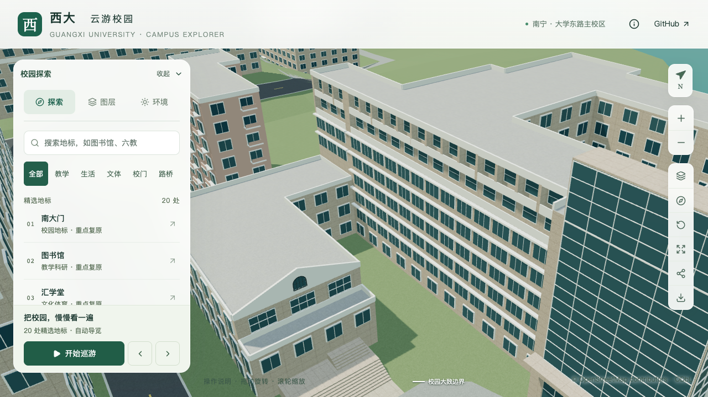

# 土木学院第七层退进及西端延续墙

2026-09-21，接续附楼高墙和后翼取证，将土木建筑工程学院南立面及西端延续墙的第七层由贴墙窄窗改为凹进窗面。既有第八层深隔板留在原楼层，未扩展成跨两层柱列。对象为 `relation/12875606`；本批仍是局部校准，不计整栋完成。

## 依据和采用参数

[学院官网宽幅](https://tmjz-en.gxu.edu.cn/images/banner_six.jpg)和[完整正面照片](https://tmjz.gxu.edu.cn/__local/A/7E/69/4A06C7C98FB4DD485911A8F3606_2806A0A4_AFCA6.jpg)中，第七层位于前部横向构件后方，第八层有更明显的竖向隔板。照片拍摄日期未知。退进关系有照片支持，下列尺寸与开间数均为简化估算，不是测绘数据，也不据凹槽形态推定可通行外廊。

| 部分 | 采用参数 | 保留关系 |
| --- | --- | --- |
| 南主立面 | 原外环第1边，十三开间 | 两端回墙位置保持 |
| 西端延续墙 | 主体与低附楼共享边，三开间 | 原10.8米附楼及内部分界保持 |
| 第七层凹进 | 内退0.95米，地板19.8米，顶板下缘22.92米 | 沿用3.3米估算层高 |
| 窗面 | 宽为开间64%，窗台高1.05米，窗高1.85米 | 后墙、白色窗框及一道横档，基础和近景共用 |
| 窗下墙 | 高0.95米 | 连续浅色窗下实体 |
| 新增底板 | 厚0.09米，下缘19.71米 | 与第六层已有挑檐上缘19.698米保持0.012米模型净距 |
| 第八层隔板 | 仍从第八层底板下缘22.92米起 | 原南面十四道、西端四道隔板及顶层窗槽保持 |

所有标高均相对本栋既有地面基准。薄底板及其与挑檐的净距是展示几何，不能当作实际结构节点设计。[证据记录](model-checks/refinement/s2-civil-seventh-evidence.json)保存参数、照片来源与哈希。

## 生成与验证范围

凹槽复用既有 `openCorridor` 形体生成。新增可选 `piers.firstLevel`，允许深隔板仅从上层开始；缺省时保持原有起始层。解析器拒绝隔板起始层越出凹槽，或将原本要求立柱的底层架空区域改为无柱。新增 `firstSlabThickness` 只影响凹槽最下方底板，缺省仍为0.18米，范围限定为0.08至0.30米。

首次数据检查发现默认0.18米新底板与既有第六层挑檐的标高范围相交，因此显式采用0.09米。未降低相交检查门槛；第八层底板和顶板厚度保持0.18米。旧第七层面板被移除，新窗随后墙退进，避免在原墙位置残留贴面玻璃或实体封堵。

[专项探针](model-checks/refinement/s2-civil-seventh-geometry.json)使用独立固定坐标，覆盖两处立面的后退玻璃、窗框、后墙、窗下实体、净空、底板上下表面、顶板下表面、两端回墙、下层无深隔板及原顶层隔板；并直接比较导出后底板下缘与原挑檐上缘，要求净距为正。[旧模型反例](model-checks/refinement/s2-civil-seventh-negative-geometry.json)已按预期在第七层后退窗面检查失败。

原南立面及西端专项中被替代的第七层贴墙窗检查，仅在显式 `--seventh-recess-added` 下交由本专项；第八层、中部窗带和挑檐继续原检查。附楼专项的两处22.8米高墙探针在同一显式模式下改查内退0.95米后的墙面，屋面、内院及其他探针保持。

## 模型与画面检查

209项Python、56项Node测试、类型检查、lint、完整模型及Pages构建通过。源文件、基础模型和近景模型各通过238条专项记录；两种细节级别及旋转墙面的独立生成测试确认，下层凹槽不出现上层深隔板。底板与原挑檐导出后最小净距分别约0.0120、0.0227、0.0114米，均为正。

[数据检查](model-checks/refinement/s2-civil-seventh-data.json)确认仅两处立面规则变化，其他447栋建筑、全部轮廓、场地及树位保持。[源文件检查](model-checks/refinement/s2-civil-seventh-source-preservation.json)确认仅土木学院网格变化，其余非树对象的几何、材质、UV和变换保持，3,063株树实例保持。[资产检查](model-checks/refinement/s2-civil-seventh-assets.json)确认只变更基础模型和`chunk-n2-n3`，其余67个GLB及93个基础节点保持，全部69个GLB与生产包一致。首屏模型5,331,048字节，比上一批减少244字节；最大普通近景1,684,868字节。

七张前后、日夜、植被开关和手机尺寸截图已直接核看：第七层形成连续退进窗面，上层深隔板仍可辨，原附楼、台阶、门厅与接路保持。西端局部在宽景中有遮挡，三开间细节同时由独立几何探针检查。手机为桌面视口模拟，不是真机验证。

| 视角 | 修改前 | 修改后 |
| --- | --- | --- |
| 南立面上部 |  |  |

重新准备数据后，铺装报告的名称顺序已与面积顺序对齐；树木剔除报告记录完整候选集合至现有3,063株的生成过程。两者是生成报告更新，发布铺装和树木数据保持不变，最终源文件及发布模型的树木净空回归通过。

## 性能与本批状态

完成三次LOD往返及两档各三次30秒环绕，浏览器无错误。精细档60/60/60 FPS，流畅档28/28/28 FPS；相对同系统原S0，三角形增加4.31%/9.61%，绘制调用增加4.02%/14.83%，帧率变化0%/−6.67%，均通过原预算。流畅档302次绘制调用已接近15%增幅上限，后续继续控制构件与材质开销。

24次CPU快照未在计时窗口捕获高占用Python或Blender计算，同条件比较通过；采样每10秒一次，仅记录CPU至少2%的进程，不证明完全没有后台活动。图书馆手机尺寸回归截图已直接核看。[联合验收汇总](model-checks/refinement/s2-civil-seventh-summary.json)通过，保存资产指纹、性能原始记录及视觉核看记录。

本批在dev交付，累计仍为21条部分对象记录、新增整栋验收零栋。后翼层数、侧后立面、未确认屋面和完整前庭仍按[取证队列](CIVIL_SITE_EVIDENCE.md)推进。之后依用户顺序处理实验大厅和新结构大楼，对大厅身份及历史时点的核对不因本批局部完成而省略。
