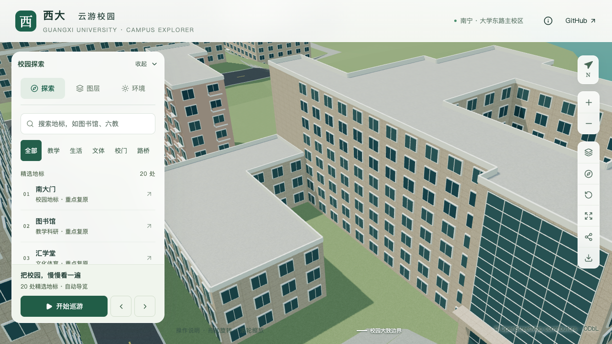

# 土木学院南立面窗组与挑檐

2026-09-20，接续入口与西南低附楼，在 `relation/12875606` 原外环第1边校准南侧中部窗组及顶部窗格。范围为东侧玻璃门厅以西约44.46米的原墙段；主体八层、26.4米及西南三层、10.8米仍是此前采用的估算，原轮廓、内院和入口保持。西端附楼上方的内部分界墙不在本次墙段内。

## 照片依据与采用参数

[学院英文官网宽幅](https://tmjz-en.gxu.edu.cn/images/banner_six.jpg)和[学院域名正面图](https://tmjz.gxu.edu.cn/__local/A/7E/69/4A06C7C98FB4DD485911A8F3606_2806A0A4_AFCA6.jpg)显示，中部楼层以横向窗组和浅色挑檐为主，顶部两层窗格较窄、竖向分隔更明显。此批先把两种窗型分开；顶部实际深凹窗廊和大挑柱仍未还原。

| 部位 | 本批采用 | 依据边界 |
| --- | --- | --- |
| 第二至第六层 | 五道窗组，每道十三开间，每组近景三格 | 重复横向节奏有照片支持；开间数、窗宽及分格为简化估算 |
| 中部窗高 | 3.3米估算层高的60%，即1.98米 | 非测绘尺寸 |
| 连续挑檐 | 外挑0.55米、厚0.24米 | 照片约束估算，基础和近景共同保留 |
| 第七、第八层 | 每层十三组较窄窗，每组二列二行 | 仅表达不同窗型，仍贴于实体墙面，不能视为已完成真实凹廊 |
| 其余立面 | 保留此前实现 | 底层、西端附楼上方、侧后立面继续待核对 |

原外环第1边从 `[-493.43996763,-834.87773600]` 指向 `[-537.90085785,-834.82207600]`。范围位置跟随原墙段，不用照片透视或航拍屋顶投影改变地面轮廓。原始图片只作本机参考，未分发为模型纹理。来源及哈希见[本批证据](model-checks/refinement/s2-civil-facade-evidence.json)。

## 生成规则

为 `windowBands` 增加可选、包含终止层的 `lastLevel`。省略时保持从首层到最高层的原行为；指定时，窗组、挑檐、通用窗替换及面板重叠校验使用相同楼层范围。本楼使用零起始第1至第5层，顶部两层另配置玻璃面板。保留窗间实墙、窗后实体与已有东南玻璃门厅。

## 附楼与后续工作

此次同时复核了低附楼照片：可见宽下梯、窄上梯及中间平台，原有简单单跑台阶规则不足以表达。现有画面还不能确认平台进深及完整侧面，继续取证后再实现两段台阶，不把通用入口直接套用。附楼的高屋面、露台和窗廊也仍待完成。

本次仍属当前土木学院楼的局部校准，不能计为整栋完成。完成当前楼后继续按实验大厅 → 新结构大楼的顺序推进。

## 几何与画面检查

[专项验证](model-checks/refinement/s2-civil-facade-geometry.json)在源文件、实际基础GLB和近景GLB各执行250条射线，检查五层窗面及窗间实墙、挑檐上下表面和深度外空区、顶部窄窗及其侧边实墙、顶部不重复中部挑檐，以及玻璃背后的原墙面。近景窗框向墙内伸入少许，因此从墙内检查时先越过窗框背面，再要求命中原墙面位置，不能将窗框当作墙体。旧模型在新窗组位置[按预期失败](model-checks/refinement/s2-civil-facade-negative-geometry.json)。

已有附楼体量每级58条射线与东南入口每级143条射线回归通过。182项Python测试、56项Node测试、类型检查、lint及完整模型/Pages构建通过；430栋普通建筑、3,063株树净空回归通过。源文件仅本栋变化，其他530个非树对象及全部树实例保持。

| 南立面近景 | 修改前 | 修改后 |
| --- | --- | --- |
| 中部窗组、挑檐及顶部窗格 |  |  |

七张最终楼栋画面已经直接核看，含前后近景、前后总览、植被开启、夜景及手机尺寸。最初两组近景被资环材楼部分遮挡，已留在本机诊断目录；最终采用东南方向的更近视角，能看到本次墙段。手机检查为桌面视口模拟。

[资产比对](model-checks/refinement/s2-civil-facade-assets.json)确认仅基础模型和 `chunk-n2-n3.glb` 变化，其他67个GLB及90个基础节点保持，69个GLB与生产数据一致。首屏模型5,169,024字节，增加7,888字节；最大普通近景仍1,684,868字节。当前仍为21条部分对象记录，整栋完成数不增加。

## 性能与本批结论

三次LOD往返、两档各三次30秒环绕完成，浏览器无错误。精细档60/59/46 FPS，中位数59，相对原同系统S0下降1.67%；流畅档30/30/30 FPS。三角形增加3.78%/8.32%，绘制调用增加4.75%/11.03%，均符合原预算，未调整门槛。

24次CPU快照在计时窗口未记录到超过2%阈值的Python/Blender计算。该10秒间隔采样不证明完全没有后台活动，也不能解释单轮46 FPS的全部波动。图书馆手机尺寸回归已直接核看。[本批汇总](model-checks/refinement/s2-civil-facade-summary.json)为局部联合验收通过，前述尚未实现的凹廊、台阶、屋顶和其他立面仍留在完整目标内。
