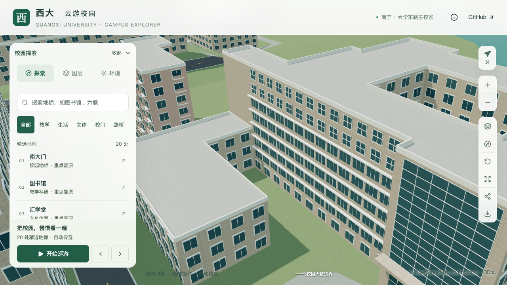

# 土木学院南立面顶层凹窗槽

2026-09-20，接续[南立面窗组与挑檐](CIVIL_SOUTH_FACADE.md)，将原第1边最上层的贴墙玻璃改为有进深的凹窗槽。第七层窄窗、中部五层窗带、入口、主楼和附楼体量保持。本次只处理第八层，不能视为整栋完成。

## 外观依据与参数

[学院官网宽幅](https://tmjz-en.gxu.edu.cn/images/banner_six.jpg)及[完整正面照片](https://tmjz.gxu.edu.cn/__local/A/7E/69/4A06C7C98FB4DD485911A8F3606_2806A0A4_AFCA6.jpg)可以辨认最上层窗间较深的竖向隔板、底部挑板和浅色窗下墙；下一层形态不同，因此没有把同一竖向构件重复成跨两层的柱列。

| 部位 | 本次采用 | 口径 |
| --- | --- | --- |
| 顶层凹窗槽 | 仅零起始第7层，内退0.95米 | 照片约束估算，未改变原地面轮廓 |
| 竖向分隔 | 十三开间、十四道隔板，宽0.42米、深0.95米 | 数量及尺寸为简化估算 |
| 窗下实体 | 高0.95米，浅色 | 表达窗下墙，不据此认定为可通行外廊栏板 |
| 底板与顶板 | 厚0.18米，保留原26.4米屋面 | 构造近似，非结构测绘 |
| 后退窗 | 宽为开间的64%，窗台1.05米、高1.85米 | 显式窗框与横档，基础和近景共用 |

原墙段约44.46米，两端留2.5%回墙。十三开间继续前一批的估算节奏；只有第八层窗面后退，前一批第七层十三组窄窗保持。图片拍摄日期未知，资料只在本机参考，来源哈希与参数见[本批证据](model-checks/refinement/s2-civil-recess-evidence.json)。

## 混合立面的生成约束

复用凹廊生成器建立后墙、底板、顶板、回墙和竖向隔板，但不把这一构件名称视为实际通行用途的证据。同一墙段允许不同楼层分别使用实体窗带、面板和凹槽；解析器检查窗框、挑檐以及凹槽底板所占标高，拒绝相交。

显式凹槽窗仅替换配置楼层的通用窗。未关闭全立面通用窗时，显式窗必须全部落在凹槽层内，避免误删底层或其他楼层；原来全立面关闭通用窗的配置保持原行为。窗定义数量上限由12提高到32，以容纳本墙段十三开间。

## 保留范围与待办

本批不覆盖第七层实际退进、西端低附楼上方高墙、侧后立面、东端塔冠、附楼高屋面及两段台阶，也未完成完整道路连接。上述内容继续属于当前土木学院楼待办；完成本楼后再按用户顺序推进实验大厅和新结构大楼。

## 几何与画面对照

[顶层专项](model-checks/refinement/s2-civil-recess-geometry.json)对源文件、实际基础GLB和近景GLB各检查146处：后退玻璃及窗框、窗间后墙、前方净空、十四道隔板的正面与两侧、窗下实体、底板、顶板及原屋面，并检查相应法线。旧贴墙窗模型[按预期失败](model-checks/refinement/s2-civil-recess-negative-geometry.json)。

保留的中部及第七层立面每级219处检查通过；原附楼体量58处、东南入口143处回归通过。185项Python测试、两级混合立面几何小样、56项Node测试、类型检查、lint与完整模型/Pages构建通过。旧单元测试样例缺少起始层信息，在新增楼层范围检查中报错；补齐真实解析输入所需的起始层后重跑全套，未放宽模型输入检查。

| 顶层凹窗槽 | 修改前 | 修改后 |
| --- | --- | --- |
| 原贴墙窗与有进深的窗槽 |  |  |

七张最终楼栋画面已直接核看，包括前后近景、前后总览、植被开启、夜景及手机尺寸。近景可辨最上层的回墙阴影、竖向分隔及浅色窗下墙，下方窗带和第七层保持。手机画面为桌面视口模拟。

[资产检查](model-checks/refinement/s2-civil-recess-assets.json)确认只改变基础模型及本栋近景区块，其他67个GLB和90个基础节点保持，69个GLB与生产数据一致。首屏模型5,170,376字节，增加1,352字节；最大普通近景仍1,684,868字节。

430栋普通建筑及3,063株树的实际模型净空检查通过。[源对象比对](model-checks/refinement/s2-civil-recess-source-preservation.json)确认只有土木学院楼变化，其他530个非树对象的几何、材质、UV与变换，以及全部树实例均保持。

## 性能记录

首次测量完成三次LOD往返与两档各三次30秒环绕，浏览器无错误。精细58/54/58 FPS，中位数58，较原同系统S0下降3.33%；流畅30/30/30 FPS。三角形增加3.71%/8.07%，绘制调用增加0.73%/11.03%，数值在原预算内。

但24次CPU快照在计时窗口捕获到另一项目的两条Python进程，因此[首次汇总](model-checks/refinement/s2-civil-recess-summary.json)保留为同条件性能验收未通过。观察到的进程随后已退出，对未变模型补测一次；没有中断其他项目或调整预算。采样间隔10秒、只收集至少2% CPU的进程，不证明完全没有后台活动，也不用于把单轮帧率波动全部归因于这些进程。

未变模型复测为精细60/60/60 FPS、流畅30/30/30 FPS，三次LOD往返无错误。相对原同系统S0，三角形增加3.62%/8.32%，绘制调用增加2.38%/11.03%，通过原预算；24次CPU快照在计时窗口未捕获高占用Python/Blender进程，两轮图书馆手机尺寸画面均已核看。源文件、生成输入和模型清单哈希与首次测量一致，沿用匹配这些资产的几何检查。[复测汇总](model-checks/refinement/s2-civil-recess-recheck-summary.json)为本批局部联合验收通过；首次失败报告保持，21条部分对象记录及零新增整栋验收数量不变。
