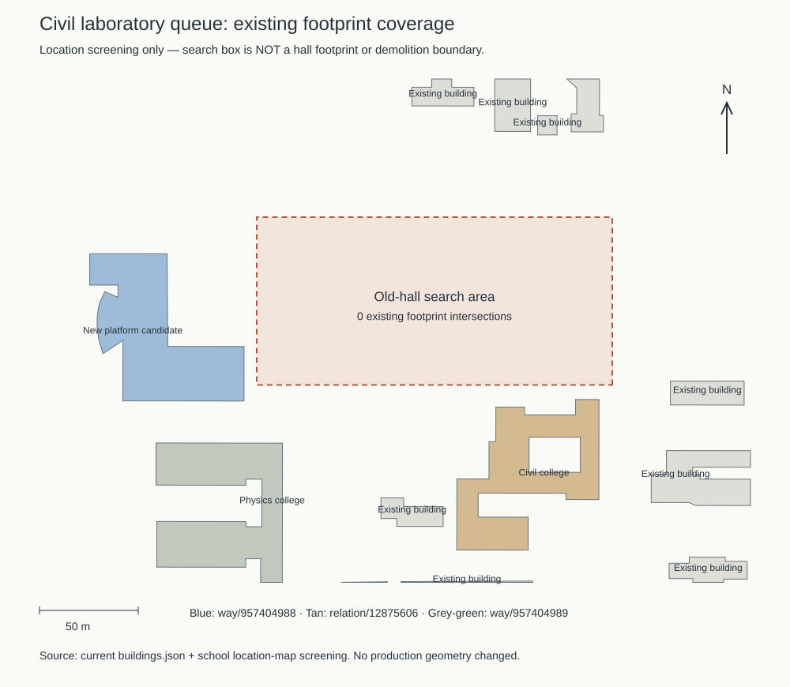

# 土木片区施工图核对与后续实施顺序

**最新接续：** 学院楼已通过[首轮整栋校准](CIVIL_WHOLE_REVIEW.md)，保留连接段与附楼屋面等未知项；下一工作包为实验大厅，然后是新结构大楼。本文原有“先收尾”和零栋计数是取证时状态，位置/时点不确定性继续有效。

2026-09-21。接续学院楼北翼收尾，取得学校公开的2024年临时水电施工图。本批补充对象位置、楼层标注与资料时点依据，尚未修改模型。执行顺序保持：**当前学院楼 → 实验大厅 → 新结构大楼**。

## 来源及核看范围

[学校2024年7月26日采购公告](https://www.gxu.edu.cn/info/1364/36271.htm)的附件3为[土木工程综合实验中心项目配套临时水电工程施工图](https://www.gxu.edu.cn/system/_content/download.jsp?owner=1556120285&urltype=news.DownloadAttachUrl&wbfileid=14901393)。本次成功下载，不能再将这份附件记为未取得。

- 文件共43页，26,523,963字节；SHA-256：`5df1451daa47fd16d01cac778e39375256f5f054525c530ac9ee72786df10213`。
- 已直接核看PDF页序2、3、4、5、39、40，其中第4页为DL-02，第39页为DL-37。第39页右下学院楼标签另放大核看；页序与图号不能混用。
- 可见图签为广西大学设计院有限公司、2024.04、施工图、A版。PDF内部标题仍带另一项目名称，以可见图签及公告附件对应关系识别本文件；文件生成时间不等于底图测绘日期。
- 原PDF与本机渲染图保留在`work/refinement-s2-civil-plan-evidence/`，仅用于核对，不作为公开模型纹理或转载图纸。

## 图纸实际支持什么

| 图纸及区域 | 直接可见内容 | 可以采用的结论及限制 |
| --- | --- | --- |
| 第4页DL-02，创新实验中心北侧 | 独立实验室轮廓标注大型结构研究平台名称及3F；其东北侧另一长条轮廓标注力学实验室，含3F、2F和1F局部 | 能区分邻接实验建筑与创新实验中心，提供平台低体量的分段线索；不能把3F推广到整个新结构复合楼，也不能直接确定用户所指大厅 |
| 第4页DL-02，南侧创新实验中心 | 多段轮廓内分别有9F和8F标注 | 说明本底图按局部体量标层；邻楼标注不能套给土木学院或新结构平台 |
| 第39页DL-37，施工范围西侧 | 底图出现相邻的3F、9F等体量，南侧隔道路与创新实验中心相邻 | 与新平台南北楼存在高差的历史资料可交叉核对；完整模型ID、南北分界和各标签归属尚未完成配准，不能直接落模 |
| 第39页DL-37，右下学院旧楼区域 | 名称、3F及“拟拆除”标注清楚可读；图框下缘另有局部9F标注，南侧轮廓未完整展示 | 新增的是拆除意向和局部分层线索，不是拆除完成证明。不能据此把现有学院楼整体改为三层、九层或直接删除 |

第39页的3F标注需与当前模型北翼位置进一步配准后才能成为该分部的独立层数依据；本批不将“邻近且相似”升级为已确认对应。图纸没有提供当前西连接段的完整立面，也没有展示西南附楼后方屋面，因此不能解决连接段宽度、格栅锚点或附楼坡向。

## 与既有资料的关系

[2024年10月施工位置图](https://www.gxu.edu.cn/info/1365/36792.htm)把结构大厅放在学院楼北侧施工范围内，把研究平台及其综合楼标在西侧。它与本次施工图共同缩小了核对区域，但两图都不能证明2026年的逐栋存废状态。

[2014年校报基建专版](https://news.gxu.edu.cn/__local/8/C4/4D/0B1CE8B9D4B8389F21FF34B7030_FF27C11E_793A3.pdf?e=.pdf)描述平台由南楼、北楼与门厅组成，北楼设计九层、南楼含实验大厅。本次低体量标注支持继续按复合建筑调查，尚不足以把候选`way/957404988`的默认五层整体替换为三层或九层。

[2021年学院参观报道](https://tmjz.gxu.edu.cn/info/1452/5053.htm)分别提到旧大厅和新平台。因此“实验大厅”仍保留两个核对方向：旧结构大厅，以及新平台内部的现用实验大厅。没有锁定轮廓前，不重复新增两栋建筑。

## 下一步工作包

1. **学院楼收尾。** 继续按[有限收尾清单](CIVIL_WING_WRAP.md#整栋收尾清单)核对连接段、附楼屋面和前庭；本次图纸不能解答的尺寸保持估算。最终报告须把旧底图、照片与当前模型的时点差异列出，再完成全楼多视角、入口接路、LOD和原性能预算验收。
2. **实验大厅。** 先把施工图、施工位置图与现有轮廓配准，区分旧大厅与新平台内部大厅；取得可定位外观后实施厅体高度、屋顶、大开口及入口接路。若属于同一复合对象，用分部表达，不重复造楼。拟拆除不等于已拆除，不能据此自行删除。
3. **新结构大楼。** 以`way/957404988`为候选，先验证整个复合轮廓，再区分高层办公区、低实验区及连接门厅，依次处理层数、高度、屋顶、主要立面和入口。三层、九层均先作为对应分部的核对线索，米制高度仍需依据或明确估算。

本批仅改文档，模型与生产数据保持`aae5ac2`状态，不重复执行无资产变化的渲染和性能测试。累计仍为21条部分对象记录、零栋新增整栋验收；本次取证不计作建筑完成。修改、提交和推送仅在`dev`，不更新主分支。

## 2026-09-21接续：大厅区域的模型覆盖筛查

前庭园路完成后，以`3fbfc07`的448条建筑记录核查后续大厅候选位置。学校[施工位置图](https://www.gxu.edu.cn/info/1365/36792.htm)把旧“结构大厅”放在学院楼北侧、新平台东侧；先据此设置本地坐标搜索框`[-650, -780, -470, -695]`（西、南、东、北，单位米）。这是人工选取的检索范围，**没有完成图纸配准，也不是大厅轮廓或拆除范围**。

检查全部建筑多边形及内院，而非只查名称或中心点，结果如下：

| 搜索范围 | 与现有建筑轮廓的面积相交 |
| --- | --- |
| 原搜索框 | 无 |
| 四周各扩大5米 | 无 |
| 四周各扩大10米 | 新平台`way/957404988`约98.405平方米；学院楼`relation/12875606`约31.167平方米 |

[机器记录](model-checks/refinement/s2-civil-lab-coverage.json)保存输入文件SHA-256、区域内候选对象及三组交集结果；[复现脚本](../scripts/inspect_civil_lab_coverage.py)只读取生产建筑数据并输出诊断文件。图中蓝色复合体与学院楼均已有独立ID。10米扩框开始碰到邻楼，说明不能靠扩大搜索范围，把最近对象直接认作旧大厅。

这项检查排除了“当前搜索框内已经有建筑轮廓，只是名称未标注”的情况，但**不证明旧大厅已拆除或现场为空地**。仍可能是数据漏绘、检索范围偏差或历史底图变化。下一步应先确认用户所指大厅及资料时点，再决定是补绘缺失对象，还是细化新平台内部大厅；不能把搜索框直接挤出成楼，也不能把已有复合体重复登记为两栋完成建筑。

学院楼剩余屋面另补查[广西大学站全景624](https://www.gx720.net/pano/viewer/?slug=pano-624)及[鲁班路站全景659](https://www.gx720.net/pano/viewer/?slug=pano-659)。已通过浏览器直接核看校园方向，关键低附楼区域仍受资环材楼、物理楼等遮挡，不能提供可靠的坡向或连接段分界；不把这些视角升级为屋面校准依据。新增直接核看的PDF第6页DL-04为创新实验中心配电房相关平面，也未解决学院楼屋面问题。

本次只补充后续工作准备、诊断脚本与记录；学院楼未新增整栋验收，生产数据、69个GLB和Blender源文件保持`3fbfc07`。开发顺序仍为学院楼收尾 → 实验大厅 → 新结构大楼。后续模型验收继续沿用原预算，最近流畅档绘制调用已较S0增加14.83%，不得因新增目标放宽门槛。
