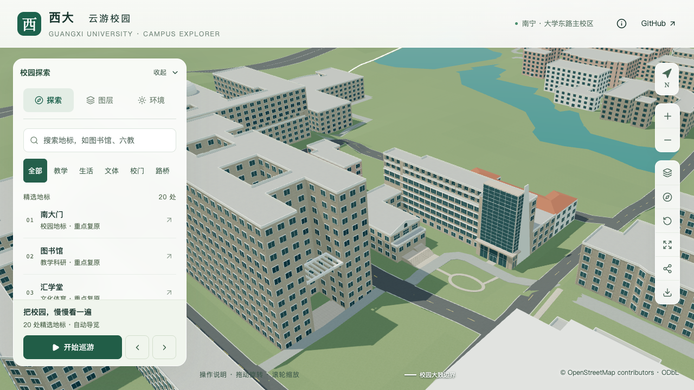
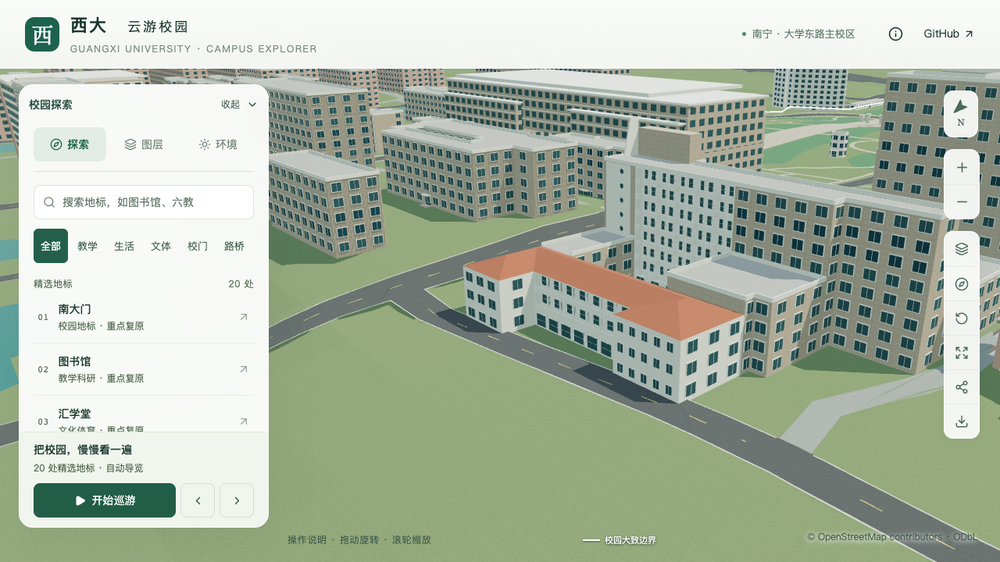
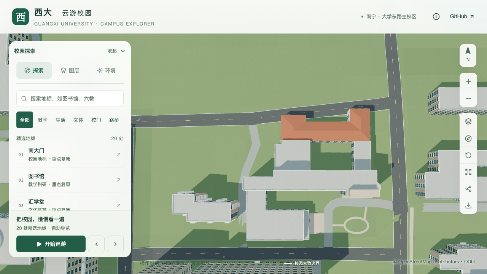

# 土木建筑工程学院首轮整栋校准验收

2026-09-21，`relation/12875606`，近景区块 `chunk-n2-n3`。结论：**按实施计划第5.3节通过首轮整栋校准，保留明确的估算和未知项。** 本次汇总已有建模成果并完成联合核验，未修改生产模型。它不是实测模型，也不证明2026年现场状态。

## 验收口径与历史记录的关系

[原计划第5.3节](CAMPUS_REFINEMENT_PLAN.md#53-批量推进与验收)要求核对层数/主体高度、屋顶、入口和主要立面，明确无法确认项，且至少有一项依据明确的形体或入口校准落地。该要求允许有记录的估算与未知项。

此前[收尾清单](CIVIL_WING_WRAP.md#整栋收尾清单)把连接段和附楼屋面继续列在整栋验收之前。本次完整复核四个领域，将经过资料排查仍无法确认的内容转入下表的待核对登记；没有将它们改成确认值，也没有补造坡屋顶或调整未经定位的墙线。原局部报告中的“零栋新增整栋验收”保留为当时状态，以本报告作为之后的当前状态。

21个已建立校准记录的对象中，现有**1栋通过首轮整栋校准，20个仍为部分校准**；土木学院主楼、北翼、附楼与门厅只计同一个稳定ID。20–30栋目标、S3邻楼及S4/S5剩余工作继续保留。

## 四项核对及未知登记

| 领域 | 有依据且已落地的内容 | 估算或沿用值 | 尚未确认 |
| --- | --- | --- | --- |
| 层数与主体高度 | 南主楼与低翼分开；北翼照片可辨三层；保留原轮廓和内院 | 主楼八层来自原OSM，26.4米按层高推算；北翼10.8米；东/西连接段10.8/13.2米；附楼10.8米 | 连接段准确层数、宽度与分界；附楼底层是否含半地下口径；所有高度均无实测 |
| 屋顶 | 主楼平屋面及高塔冠、北翼连续红色坡屋面、附楼退台与三角形高墙分别表达 | 北翼屋脊13.1米；塔冠屋面32.4米、白墙34.8米；附楼高墙峰顶14.4米；屋脊布局和坡度简化 | 附楼高墙后方屋面仍是未核实的平顶占位；高墙不证明存在完整双坡屋顶 |
| 入口与接地 | 默认中段入口改为南侧东端玻璃门厅；附楼宽下梯、窄上梯及平台；两处短铺地接至前庭道路 | 门厅、台阶和接路尺寸；草坪环路及两条支线布局 | 实测标高、外围小入口、标识、家具和完整场地测绘 |
| 主要立面 | 南侧窗带与七八层退进；玻璃塔部及斜侧墙；主楼北侧折线外廊与东侧圆窗；北翼外廊、两端窗列与白色转角墙 | 窗格数量、开间、廊深及构件尺寸仍有照片约束下的简化 | 主楼西端楼梯间/连接段格栅的具体位置；部分侧窗仍通用；空调与设备未逐项复原 |

南侧主要依据为[学院官网照片](https://tmjz-en.gxu.edu.cn/images/banner_six.jpg)及[正面远景](https://tmjz.gxu.edu.cn/__local/A/7E/69/4A06C7C98FB4DD485911A8F3606_2806A0A4_AFCA6.jpg)，北侧依据为[已定位的航拍](CIVIL_REAR_MASSING_EVIDENCE.md)。本次重新直接核看南侧官网照片与北侧原图，对应当前模型的高低体量、屋面、入口和主立面。参考照片拍摄日期未知；航拍上传路径不是拍摄日期。没有完成摄影测量或相机标定，不能据倾斜照片中的宽窄观感修改原OSM占地。

[2024年施工图与位置图](CIVIL_UTILITY_PLAN_EVIDENCE.md)涉及历史建筑及“拟拆除”标记，不能证明具体建筑已拆除。本轮保留既有校园历史资料口径，不将旧图与2026年现状混为一谈。

## 同一资产集的联合验证

[23组实际几何检查](model-checks/refinement/s2-civil-whole-geometry-suite.json)全部通过。检查包含入口、附楼、南面窗带、七八层凹进、塔冠、侧墙、门厅转折、两段台阶、露台、高墙拱窗、后部体量、主楼北廊、圆窗、北翼及其端部/转角、前庭道路、园路和两处接路；沿用各专项源文件、基础GLB、近景GLB的容差。套件逐项核对输入指纹，验证过程没有修改资产。

[十张当前画面](model-checks/refinement/s2-civil-whole-context-browser.json)已直接核看：南侧、北侧正向及两侧斜向、前庭、园路俯视、整栋俯视、树木开启、夜景和手机尺寸。桌面画面载入近景区块；手机尺寸画面采用基础模型，高低体量和入口形制保留，浏览器记录无错误。树木会遮挡北翼底部，内院廊板在白色漫射光下较浅；本次用关树视图及几何检查补充查看，没有宣称逐窗照片级复原。手机视图是桌面Chromium的390×844视口模拟。

树木净空复用[园路批次检查](model-checks/refinement/s2-civil-garden-trees-geometry.json)：源文件、模型清单、植被文件及相关输入指纹均与当前一致，3,063株树未改变。性能复用最近的[跑道合批验收](model-checks/refinement/s5-track-batching-summary.json)：生产模型、运行时代码及生成JS指纹一致，未重新测量或把历史数值称为本次实测。

| 最近同条件测量 | 精细 | 流畅 |
| --- | --- | --- |
| 三次FPS | 60 / 60 / 60 | 29 / 29 / 29 |
| 相对S0三角形增幅 | 4.48% | 10.77% |
| 相对S0绘制调用增幅 | 2.74% | 13.31% |
| 原预算 | 通过 | 通过 |

该记录还包含三次LOD往返和图书馆手机尺寸回归。首屏模型5,386,884字节，最大普通近景区块1,684,868字节，继续满足原体积预算。所有复用条件、画面清单和实际HTTP资产指纹保存于[整栋汇总](model-checks/refinement/s2-civil-whole-summary.json)。本次没有运行无代码改动的全量构建，也没有放宽性能门槛。

## 接续顺序

当前学院楼进入有据再修订阶段，不再以未知的小构件无限延长本轮工作。接下来按用户指定顺序推进：

1. **实验大厅。** 先确认旧结构试验大厅或新平台内部大厅。旧大厅所在检索区没有现成建筑轮廓，但这不证明现场为空；先配准公开图纸与地理数据，取得可定位轮廓，再处理厅体、屋顶、大开口和接路。没有依据前不把检索矩形造为楼，也不删除旧建筑。
2. **新结构大楼。** 候选为大型结构试验研究平台综合楼 `way/957404988`。将2014年南楼大厅、九层北楼及门厅线索与2024年分区图核对，先确认复合轮廓与南北分界，再改当前统一五层示意。平台内大厅作为分部处理，不重复计整栋。

详见[土木片区证据及工作包](CIVIL_UTILITY_PLAN_EVIDENCE.md)。所有开发、提交、推送继续仅在`dev`，主分支保持。
