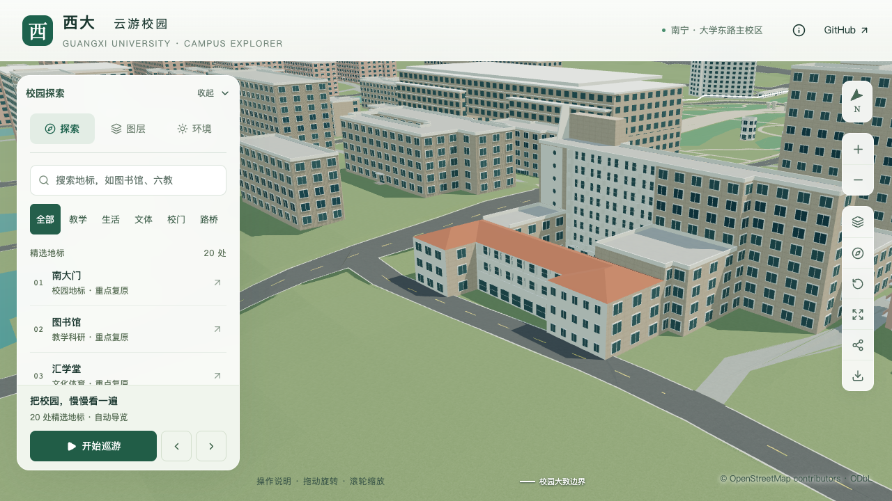

# 土木学院北翼转折墙面与整栋收尾范围

2026-09-21，接续北翼两端正面窗列，将北翼四面侧墙、转折墙统一为浅白色，保持原墙体及通用侧窗。本批没有新增顶点、面或窗格；侧窗数量仍未取得逐窗依据，不因改色计为立面全部校准。

## 依据与范围

[北侧航拍](https://www.gx720.net/pano/viewer/?slug=pano-658)可辨前凸两端的浅白色墙面在转角处延续。原始切片 `4/b/6/4.jpg` 与完整北侧视图仅用于本机核看，拍摄日期未知。朝北两端和中央外廊已分别完成[正面窗列](CIVIL_WING_END_WINDOWS.md)、[中央外廊](CIVIL_NORTH_WING_FACADE.md)校准，本批处理剩余外侧墙的材质衔接。

| 原外环边 | 所属分部 | 长度约值 | 本次处理 |
| --- | --- | --- | --- |
| 10 | `north-rear` | 15.23米 | 西侧墙使用共享白色材质 |
| 12 | `north-rear` | 3.92米 | 西端内侧短转折墙使用白色材质 |
| 14 | `north-rear` | 7.80米 | 东端内侧转折墙使用白色材质 |
| 16 | `north-rear` | 19.13米 | 东侧墙使用白色材质 |

第10、16边同时跨越其他分部，规则明确限定 `north-rear`，不把白墙覆盖到连接楼或主楼。复用 `wallFinish` 完整墙面匹配，不贴附重叠薄板。窗体、原轮廓、内院、屋脊、入口及全部已有专项构件保持。

复核连接段时，倾斜照片中的西连接楼显得比当前分段窄；但既有Esri俯视影像存在屋顶投影偏移，两者不足以给出地面边界。这个视觉疑点尚未被证明是模型尺寸错误，本批不按照片像素比例改动原OSM轮廓，也不把格栅定位到未经确认的墙面。连接段分界和高度继续保留估算口径。

## 验证

[源文件比较](model-checks/refinement/s2-civil-wing-wrap-source-preservation.json)逐项比较新旧对象：土木学院的顶点、拓扑、UV、变换和材质槽均一致，恰有四个原墙面从 `stone` 改为 `white`；其余对象和3,063株树保持。该比较覆盖既有南面、圆窗、楼梯、门厅和前场，不仅抽查新增墙面。

[固定坐标专项](model-checks/refinement/s2-civil-wing-wrap-geometry.json)在源文件、基础模型和近景各检查48处，覆盖四条墙面上三处横向位置、四个高度的材质、墙线及外向法线。位置容差分别为0.006、0.05、0.02米；法线点积大于0.99。[旧模型反例](model-checks/refinement/s2-civil-wing-wrap-negative-geometry.json)命中旧石色墙而失败。北翼正面、中央外廊、后部体量、主楼北外廊及圆窗另有实际导出回归。

十一张前后、东西斜向、南侧回归、日夜及手机尺寸截图均已直接核看。侧墙与正面白墙衔接，通用侧窗保持。手机视图为桌面浏览器尺寸模拟。

| 西侧斜向 | 修改前 | 修改后 |
| --- | --- | --- |
| 北翼侧墙 |  |  |

224项Python测试、56项Node测试、类型检查、lint和Pages构建通过。资产核验确认69个GLB中仅基础模型及土木学院近景块变化，另67个GLB与93个基础模型节点保持；生产包与全部资产清单一致。首屏模型5,374,956字节，比前一批减少28字节；最大普通近景块1,684,868字节。

同条件各三次持续活动测量，精细档60／60／60 FPS，流畅档28／27／28 FPS。相对同系统S0基线，精细档三角形、绘制调用中位数分别增加4.57%、4.02%；流畅档分别增加10.60%、14.83%，帧率中位数下降6.67%。数字通过原门槛，但流畅档绘制调用仍接近15%上限，不能将一次通过理解为后续细化有充足余量。

24次CPU快照在计时窗口内未发现达到记录阈值的Python或Blender活动；十秒间隔及2%CPU阈值不证明完全没有后台活动。图书馆手机尺寸回归图已直接核看。三次LOD往返及浏览器检查完成，无记录错误；[联合验收](model-checks/refinement/s2-civil-wing-wrap-summary.json)保存当前文件指纹、原始性能结果和全部专项链接。

## 整栋收尾清单

**后续状态：** 已完成[首轮整栋联合验收](CIVIL_WHOLE_REVIEW.md)。下表为验收前的历史清单；连接段、附楼高墙后屋面等经资料排查仍未知，按原计划第5.3节保留为明确待核对项，不再把取得这些资料作为本轮无限延期的前提。确认范围没有扩大为实测，未删除待核对内容。

整栋校准以[计划第5.3节](CAMPUS_REFINEMENT_PLAN.md#53-批量推进与验收)的层数/高度、屋顶、入口、主要立面为范围；确认、估算和未确认项分别记录。尺寸尚无实测可以明确保留估算，缺少主要形制依据不能用增加小构件代替。当前未宣布整栋完成。

| 工作包 | 已有证据和实现 | 尚需处理的验收项 |
| --- | --- | --- |
| 主楼与北翼体量 | 主楼八层、北翼三层；北翼红色坡屋面、内院保留；高度及屋脊尺寸为估算 | 两侧连接段的高度、分界需与可定位视角再核对；不能把南楼层数套给低翼 |
| 主要立面 | 南面窗带、七八层退进、东塔门厅与圆窗、北主楼折线外廊、北翼朝北窗列/外廊已实现 | 主楼北侧西端楼梯间、连接段白墙及格栅的具体锚点；侧窗、空调和小设备列为未确认细节，不虚构确认值 |
| 西南附楼屋面 | 低体量、退台、三角形高墙和拱窗已实现 | 高墙后的屋面仍为原平顶，需取得坡向或平顶依据后核对；高墙本身不能证明双坡屋顶 |
| 入口与前庭 | 东南主入口定位、门槛、附楼外台阶及两处短铺地已连通；道路突跳已修复；随后补入[草坪环路与两条接路支线](CIVIL_FORECOURT_GARDEN.md)，布局和尺寸为估算 | 园路在最终联合验收中继续纳入；外围步道、标识设施及实测尺寸仍未确认，不将有界园路等同完整测绘复原 |
| 最终联合验收 | 局部均有源/基础/近景及浏览器记录 | 在上述主要项收尾后，使用同一资产集核验全楼多视角、入口至道路、LOD与原性能预算，形成一份整栋报告 |

细部未知项需要列出，不要求在没有资料时补造窗表、设备或材料实测值。本清单不改写完整项目目标，也不把部分记录计为新增整栋。学院楼完成后，按用户指定顺序继续实验大厅、新结构大楼。

后续[施工图取证](CIVIL_UTILITY_PLAN_EVIDENCE.md)补充了学院旧楼区域的3F与“拟拆除”标签；尚需配准分部，不能据此认定当前北翼已拆除，也未解决连接段宽度或附楼后方屋面。最终整栋报告须明确这些资料的时点限制，收尾范围继续按上表执行。

接续又核看广西大学站624、鲁班路站659两处航拍及施工图第6页；低附楼受邻楼遮挡，图纸也未提供其屋面。该组资料不支持修改连接段分界或把附楼改为坡屋顶，具体排除记录与后续大厅覆盖筛查统一见[施工图核对记录](CIVIL_UTILITY_PLAN_EVIDENCE.md#2026-09-21接续大厅区域的模型覆盖筛查)。
