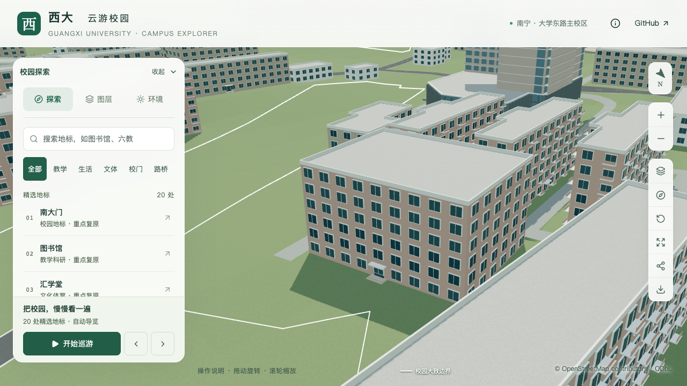
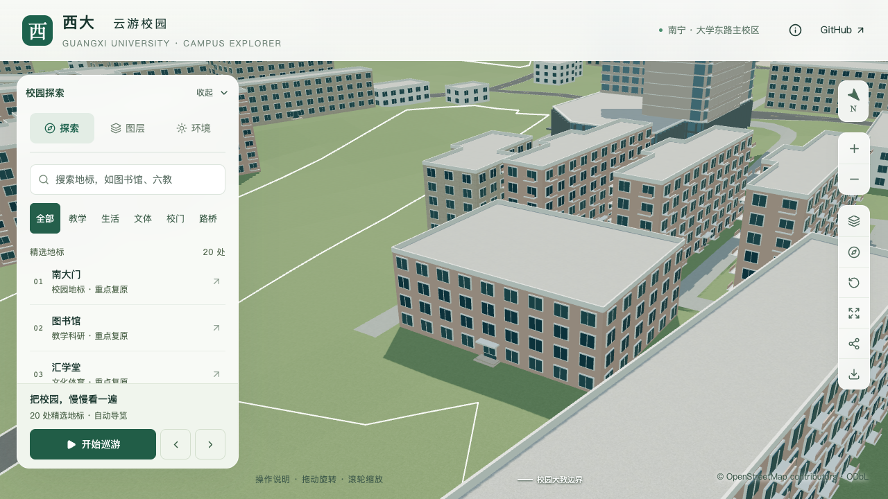
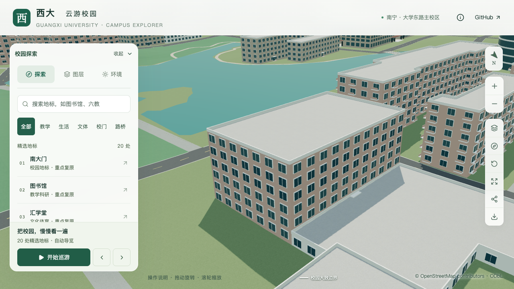
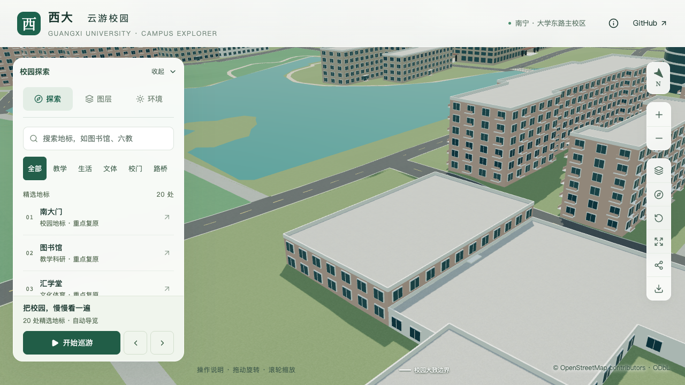

# 东苑、碧湖苑餐厅校准

本批对应 S2，新增两条部分校准记录。两栋原先均采用生活建筑默认六层；根据校方资料改为东苑四层、碧湖苑两层。层高仍按 3.3 米估算，入口和完整立面尚未完成核对，不计为两栋完整复原。

## 依据与采用参数

| 建筑 | 稳定 ID | 原参数 | 当前参数 | 依据与局限 |
| --- | --- | --- | --- | --- |
| 东苑餐厅 | `way/759191485` | 6 层 / 19.8 m | 4 层 / 估算 13.2 m | 设计院 2022 年项目说明明确称南侧既有东苑餐厅为四层，与项目册具名照片的四排楼层相符；项目册文字写三层，计数差异仍未解释 |
| 碧湖苑餐厅 | `way/759609659` | 6 层 / 19.8 m | 2 层 / 估算 6.6 m | 项目册具名条目文字和照片均支持两层；大厅实际层高未取得，不能把 6.6 m 当作测量高度 |

[广西大学基金会校园项目册](https://jjh.gxu.edu.cn/__local/A/1C/2D/C94DA67648AB9698A6BE04E1718_D3801DBD_2512297.pdf)的 PDF 第 43 页、印刷第 39 页包含两栋照片及说明。文件创建元数据为 2020-01-15，发布日期和照片拍摄日期未知，不能据此断言建筑至今未改建。

[广西大学设计院《广西大学研究生公寓》](https://sjy.gxu.edu.cn/info/1042/1294.htm)发布于 2022-05-20，设计时间为 2021 年 2 月。此次采用的是文字中“四层东苑餐厅”的既有邻楼描述；拟建公寓的三十层、99.9 米不用于餐厅。页面湖景图片也未作为平面定位或尺寸证据。

两栋沿用原 OSM 外轮廓、`living` 导航分类和 `canteen` 形制，显式记录照片约束的平屋顶。食堂没有宿舍式阳台。未取得全屋面资料，屋顶小构件仍为简化表达。[字段取证记录](model-checks/refinement/s2-dining-evidence.json)保存来源哈希、冲突、未采用信息及前后参数。

## 固定镜头对照

下列东北视角采用相同相机、1280 × 720、DPR 1、日间精细配置，均加载对应普通近景区块。关闭标签和树木以检查楼体；正常场景树位未改变。

| 建筑 | 修改前 | 修改后 |
| --- | --- | --- |
| 东苑餐厅 |  |  |
| 碧湖苑餐厅 |  |  |

东苑东北侧能看清四排窗口及与后方住宅的高度关系；西南侧邻楼遮住部分低层，仅用于屋顶和相对高度检查。碧湖苑东北侧短面可见两排窗口，长面下部被前景楼体遮挡；西南侧补充检查长面。碧湖苑西南侧的修改前截图发生自动降档，不能用于材质、阴影或性能前后比较。

另检查碧湖苑保留植被的日景、东苑夜景和 390 × 844 手机尺寸画面。手机画面加载基础模型，屋顶和四层高度可见；邻楼遮挡和简化立面限制了入口判断。此项属于桌面浏览器模拟，不是真机性能测试。

## 检查与剩余工作

- 完整数据准备和 Blender 重建后，仅两栋校准字段改变；448 栋身份、原始标签和轮廓保留。道路、地形、图书馆场地、运动场及 3,030 株树记录不变。
- 31 项 Python、51 项 Node、类型检查、lint 和 Pages 生产构建通过。共享形体检查覆盖 430 栋源对象、430 栋基础表示与 417 栋近景表示；重建后时光之门另做几何复核。
- 69 个模型的大小和哈希与清单匹配，公共数据与生产数据一致。首屏模型 5,637,644 bytes，最大普通近景块 1,684,868 bytes，均符合预算。图书馆、农学院所在近景块及其他 28 个普通区块不变。
- 11 个上下文画面状态完成，页面、控制台与 HTTP 错误为空。画面通过范围是层数、高低关系、平屋顶及加载表现，不代表入口方向和所有立面已核实。

东苑主入口仍为东侧最长边回退示意，碧湖苑仍为北侧最长边回退示意。碧湖苑照片中的大拱窗、圆角楼梯体和上层开放廊道尚未完成平面定位；当前普通窗口不能代表这些真实构件。下一步需取得有方位的外观资料，再校准入口、立面及局部体量。秀苑和南苑第二餐厅目前资料不足，未因“某层经营餐饮”的信息改变整栋层数。

[资产核验](model-checks/refinement/s2-dining-assets.json) · [共享形体](model-checks/refinement/s2-dining-geometry.json) · [浏览器上下文](model-checks/refinement/s2-dining-context-browser.json) · [逐画面审查](model-checks/refinement/s2-dining-visual-review.json)。

## 当前版本联合验收

[标准浏览器记录](model-checks/refinement/s2-dining-validated-browser.json)完成六组固定画面、三次远近景往返、精细和流畅档各三次 30 秒环绕，无页面、控制台或 HTTP 错误。五组桌面及一组手机尺寸回归图已直接检查，图书馆中央连接、六柱、内院及普通坡屋顶保持。

| 三次结果的中位数 | S0 | 当前版本 | 相对 S0 |
| --- | ---: | ---: | ---: |
| 精细 FPS | 60 | 60 | 0% |
| 精细三角形 | 4,017,716 | 4,035,422 | +0.44% |
| 精细 Draw Calls | 537 | 538 | +0.19% |
| 流畅 FPS | 30 | 30 | 0% |
| 流畅三角形 | 1,052,490 | 1,094,225 | +3.97% |
| 流畅 Draw Calls | 268 | 279 | +4.10% |

精细三次为 60/60/60 FPS，流畅三次为 30/30/30 FPS。设备、浏览器、视口和活动协议与 S0 一致；[26 次进程采样](model-checks/refinement/s2-dining-validated-performance-context.json)未观察到其他项目构建、资产校验或数据准备任务，常规桌面应用仍在运行，系统安全服务有一次短时高占用。因此按常规桌面条件接受本轮比较，不声称隔离基准或设备普遍性能。

本批层数与估算高度调整通过几何、画面、加载和性能联合验收，完整 S2 的 20–30 栋目标仍未完成。[汇总与哈希](model-checks/refinement/s2-dining-summary.json)保存验收范围。当前模型已包含农学院门廊，补足该累计版本的性能复测；此前受并发任务干扰的历史报告保留原结论。
