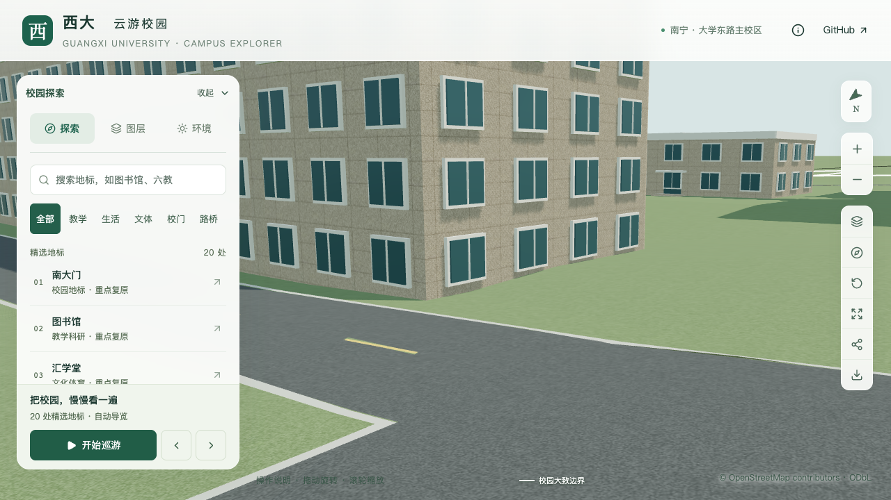
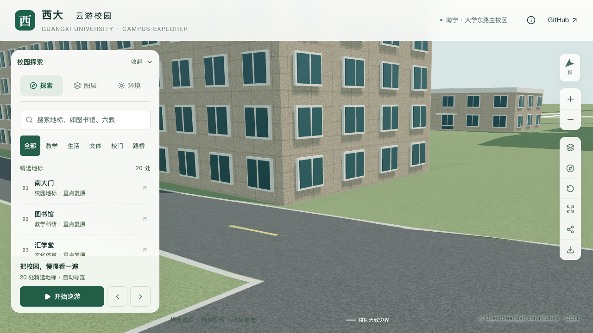

# 原环境楼候选：西端地形侵入修补

2026-09-30，`way/759170251`。已修补当前模型西端的地形侵入，保留现有楼体和道路。此项针对可复现的模型冲突，不依赖历史环境楼身份是否最终确认，也不解决7F/8F差异或入口方位。

## 问题与采用范围

在繁殖所及相邻低楼取证时，补查了三栋现有模型的接地。繁殖所与无名低楼各192/132个采样未检出超过原容差的侵入；原环境楼候选在整栋617个采样中，源与基础GLB各有23点高于采用楼底0.3米，最高分别约0.572/0.574米，集中在西端。[原始三栋检查](model-checks/refinement/s3-environment-ground-before.json)保留精确DEM插值基准；[旧资产负例](model-checks/refinement/s3-environment-ground-negative.json)使用正式审计器的已发布两位小数楼底1.99米，同样失败。两种基准相差约0.247毫米，不改变判定。

修补继续采用原来的0.3米粗略模型诊断容差，不是现场允许高差。只处理西端：封闭占地与米制矩形`[260,-440,282,-380]`相交，再采用0.1米核心外扩和3米过渡。矩形、过渡距离与标高都是模型参数，不能作为现场土方设计。正式配置保存在`data/foundation-overrides.json`的`environment-west-foundation`；保留原DEM、楼底、轮廓、八层估算、默认入口及所有立面。

新增`repairBounds`使局部修补不必重切整栋周围的地形；它仅裁剪封闭修补占地，不裁剪验收范围。准备器和审计器同时支持未分部的普通建筑；庭院空洞和既有开放门廊仍排除。无效、空交集及非有限边界被拒绝。新增测试在旧准备器上失败；八项准备测试、六项真实网格审计夹具及十四项修补网格夹具通过。

## 候选与模型预算

整栋6米过渡候选首屏6,004,512字节，改为3米仍为6,004,060字节，均未采用。将修补限制到已检出的西端区域后，首屏为**5,999,908字节**，增加2,916字节，原6,000,000字节预算仅余92字节。所有候选都保持整栋617点检查，未缩小验收范围或放宽容差。后续新增模型须先解决体积余量，不能以放宽预算继续堆细节。

最终局部候选影响7个原地形三角面，净增加116个三角形；道路裁剪数为0。[候选构建记录](model-checks/refinement/s3-environment-ground-candidate-build.json)的掩膜与正式配置逐字段一致，之后仅将该地形接入当前源文件与基础GLB。保留原Draco位置/纹理精度和压缩级别，导出时仍只临时剔除严格零面积地形面。

## 正式验收

| 检查 | 源模型 | 实际基础GLB |
| --- | ---: | ---: |
| 整栋采样 | 617 | 617 |
| 高于楼底0.3米的地形侵入 | 23 → 0 | 23 → 0 |
| 道路侵入采样 | 0 | 0 |
| 保留地形最高残差 | 0.2725米 | 0.2759米 |
| 周边采样 | 10,641 | 10,641 |
| 范围外地面最大变化 | 0.046毫米 | 11.520毫米 |
| 四栋邻楼周界最大变化 | 0 | 0.015毫米 |

没有宣称整栋地面完全贴平；局部修补后的最高残差仍如表所列。基础GLB的毫米级变化属于重新压缩后的差异，使用原0.025米保持性容差；源保持性仍用原0.002米。普通道路压缩节点完全相同，基础路面按此前导出检查变化，并单列既有源/导出误差，没有宣称修好原道路误差。详见[整栋](model-checks/refinement/s3-environment-ground-final.json)与[周边](model-checks/refinement/s3-environment-ground-neighbors.json)报告。

- 448栋建筑记录和轮廓保持。源文件只改变地形，其他534个非树对象、3,062株树保持；修补区内无树中心，不新增树根悬空。
- 远离修补区的97,818个地形面在坐标、绕序、材质、平滑标记和UV上精确保持；局部边界另由周边射线检查覆盖。此前土木与动物学院修补配置保持，没有重新生成这些区域。
- 仅`base.glb`变化，其他68个GLB、96个基础节点保持；69个资产清单、哈希、字节数与Pages包一致。近景建筑共用基础地形，近景建筑资产无需改动。
- 291项Python、70项Node、类型检查、lint及Pages构建通过。旧生产资产仍被同一接地检查拒绝。

保持性见[源对象报告](model-checks/refinement/s3-environment-ground-source-preservation.json)、[地形与树位报告](model-checks/refinement/s3-environment-ground-terrain-preservation.json)和[资产报告](model-checks/refinement/s3-environment-ground-assets.json)。

## 画面对照与剩余工作

首组近景相机落在图书馆遮挡范围，不能证明墙脚修复；其记录保留但明确排除。最终改用西北侧近景，前后对照可见西端窗下墙面露出，邻接道路保持。夜景、树图层和手机画面已核看；手机为基础表示。两组共14张图已检查，正式采用第二组7张。

建筑完整外观仍待证，具名照片的采用边界见[繁殖所及相邻低楼取证](REPRODUCTION_BUILDING_EVIDENCE.md)。本批不增加整栋通过数：22个校准对象、1栋首轮通过、21个部分校准，S3六栋整栋通过数0。实验大厅与新结构平台继续按[土木接续清单](CIVIL_LABS_FOLLOWUP.md)优先；旧大厅与6–8层新建中心仍分别识别。

## 性能与汇总

[最终汇总](model-checks/refinement/s3-environment-ground-summary.json)确认精细60/60/60、流畅30/30/30 FPS；相对同系统S0，三角形增加5.85%/13.65%，绘制调用增加3.29%/9.89%，均在原15%增长限制内。三次LOD往返无错误；27次CPU快照在计时窗口未记录到阈值以上Python/Blender负载。五张S0固定上下文画面另已核看。
