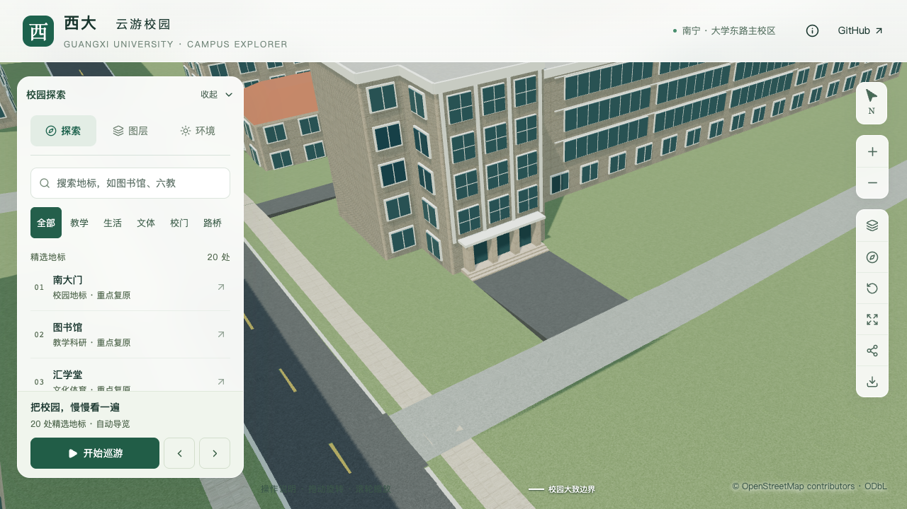
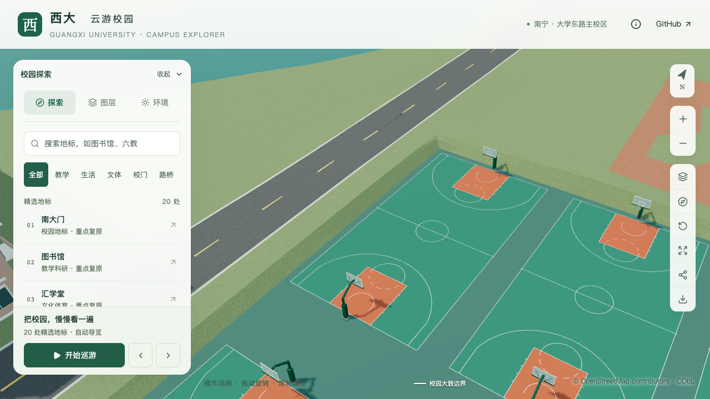

# 基础模型：省去纯色材质未使用的纹理坐标

数学学院南门批次之后，首屏模型距 6 MB 上限只剩 452 bytes。本批在 Draco 压缩前省去纯色材质未使用的 UV 数据，首屏基础模型与树模板从 5,999,548 降至 **4,833,592 bytes**，减少 **1,165,956 bytes，约 19.43%**。剩余预算为 **1,166,408 bytes**，可用于继续校准建筑和场地。

本批属于计划的资源预算前置工作。建筑高度、屋顶、入口、道路连接、球场标线与篮网形体均保持；不增加整栋校准数量，也不表示 S5 或全计划完成。

## 实现与适用范围

`blender/export_attributes.py` 使用 Blender glTF 导出器的 `gather_mesh_hook`，在基础模型编码前按最终材质检查纹理需求。基础颜色、金属度/粗糙度、法线、遮蔽及自发光贴图均会保留纹理坐标；未知扩展和启用中的扩展也保守保留。导出器生成的六种已知空扩展占位单独识别，避免将没有启用的占位当作材质效果。

处理只作用于基础模型的导出属性映射，不修改源网格、材质或可编辑 UV。临时导出钩子在作用域退出或异常时移除，不保存为用户插件配置。普通近景、独立地标及树模板沿用原导出规则。

`preserve_glb_geometry.py` 同步恢复被保留 Draco 载荷的完整属性映射。即使新的纯色导出已省去 UV，恢复旧载荷时仍会补回它所需的 accessor，避免载荷与描述不匹配。原时间之门节点继续按既有维护流程保留。

## 验证

| 检查 | 本批结果与范围 |
| --- | --- |
| 导出小样 | 实际混合材质 Draco 导出确认纯色 UV 被省去、贴图 UV 保留；核心贴图槽、未知/启用扩展、源 UV 和钩子清理均检查 |
| 数据回归 | 102 项 Python 测试通过，其中包括旧载荷属性集合恢复 |
| 实际基础模型 | 86 个节点、411 个材质分组；288 个分组省去 UV，123 个分组压缩载荷保持 |
| 解码几何 | 每个变化分组的有向三角面集合逐顶点比较，位置和法线完全相同；图片、材质、节点属性和变换保持 |
| 数据与其他模型 | 可编辑源、所有派生数据（模型清单除外）及其余 68 个 GLB 字节保持 |
| 增量维护 | 道路与篮球场更新在两个隔离副本通过，86 个基础节点压缩几何保持，首屏均为 4,833,480 bytes；正式资产未被副本覆盖 |
| 浏览器 | 七张原图逐张核看，覆盖数学学院连接、篮球场、植被、夜景和手机尺寸；入口、道路纹理、球场标线及篮架保持 |

省去了 1,146,986 个原顶点上的 UV 属性，按每顶点两个 float32 计算约为 8.75 MiB 的解码属性数据。这是数据量计算，不是进程内存、显存或帧率收益实测。

本批的实际三角面等价性支持继续使用原几何结论，包括台阶/铺面连接及建筑与树木空间关系；原报告保留其原始哈希，不改写为本次重新运行。新的导出等价性检查与最终资产指纹见[本批汇总](model-checks/refinement/s5-unused-uv-summary.json)和[解码比较](model-checks/refinement/s5-unused-uv-decoded.json)。

活动性能单独测量，结果与并发负载条件记录在本批汇总中。静态对照截图不作为帧率或手机真机证据。

当前资产的三次精细活动均为 60 FPS，流畅为 29/29/28 FPS，中位数为 29 FPS，帧率与几何成本数值门槛通过。26 次进程快照捕捉到约 30 秒外部 Python 高负载，**同条件性能与本批联合验收仍待完成**，未在相同干扰条件下反复测量。两组 1280×720 前后对照分别有 13 和 6 个像素不同，未宣称逐像素全等；人工核看未见形体或材质变化。

## 复现入口

```sh
# 实际导出小样与属性保留回归
blender --background --python-exit-code 1 --python blender/test_export_attributes.py
python3 -m unittest discover -s scripts -p 'test_incremental_glb.py'

# 在冻结修改前 public/models 后，对比实际基础 GLB；使用仓库现有 Draco 解码器
node scripts/check-export-attributes.mjs BEFORE_ROOT docs/model-checks/export-attributes.json
```

`BEFORE_ROOT` 是包含修改前 `public/models/base.glb` 的版本目录。比较允许纯色分组省去 UV，其他属性、材质和形体必须符合报告中的严格等价条件。新增材质扩展或自定义着色器若使用 UV，应先扩展保留规则和实际导出小样，再启用相应效果。

| 修改前 | 修改后 |
| --- | --- |
|  |  |
|  |  |
