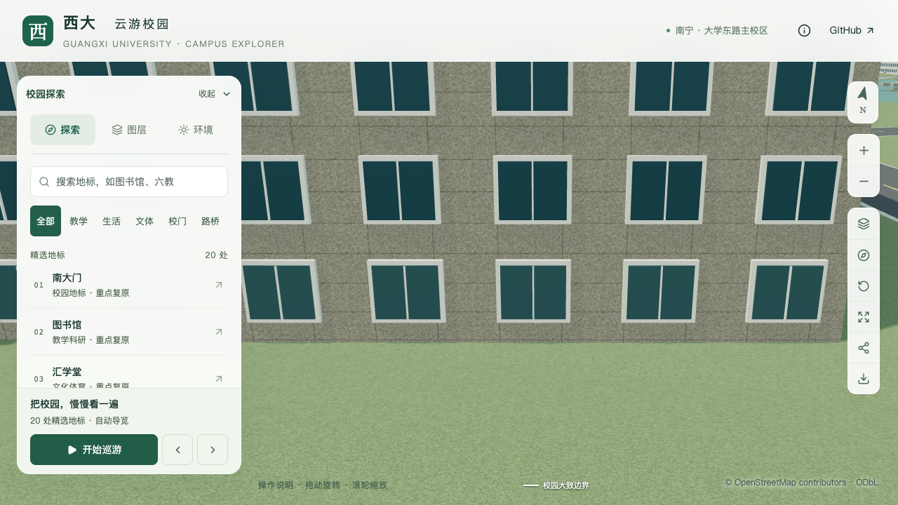
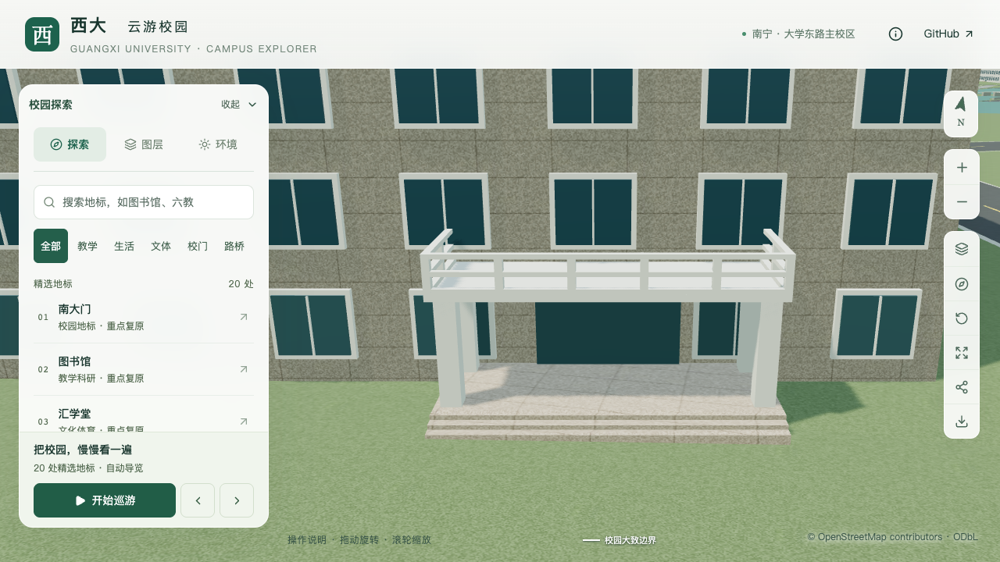
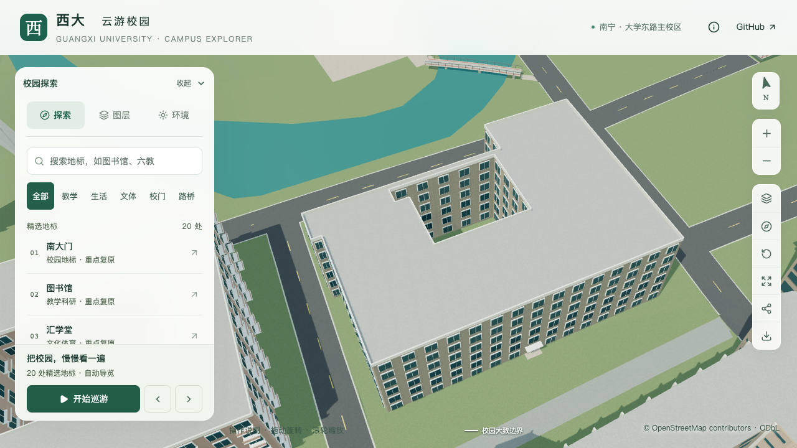

# 林学院南侧门廊校准

2026-09-13，S2 普通建筑入口校准，目标为 OSM `relation/11564703`。本批将最长外边中点的示意入口调整为南侧长立面靠东端的低门廊，保留原始主体、内院和六层估算高度。当前为局部校准，整栋完成数不增加。

## 资料与方位

- [校方项目册](https://jjh.gxu.edu.cn/__local/A/1C/2D/C94DA67648AB9698A6BE04E1718_D3801DBD_2512297.pdf) PDF 第 39 页、印刷第 35 页的第 12 项为林学院。已核对完整排版，并提取该项原始嵌入图 `Im425`；照片显示长立面端部的低门廊。它继续支持历史六层资料，照片日期未知。
- [学院官网页头门廊照片](https://lxy.gxu.edu.cn/img/h2.jpg)展示学院石、成对方柱、宽台阶和两排镂空栏板。该图是通用页头，不能使用文章发布日期作为照片日期；照片上部有裁切。
- [2026 年校友访谈](https://lxy.gxu.edu.cn/info/1019/3412.htm)正文将学院石定位在学院南门，配图的独特石形和题字与页头对应。结合项目册长短立面关系、OSM 轮廓，采用南侧外边第 5 边靠东端作为入口位置。朝向和边锚点属于交叉比对推断，具体坐标未测量。
- [校方英文学院介绍](https://www.gxu.edu.cn/en/info/1152/1707.htm)提供具名局部立面和屋面照片，支持局部平顶；下部被树木遮挡，不能据此统计总层数或定位入口。屋顶小体量尚未映射，本批不新增。

[逐图判断与文件哈希](model-checks/refinement/s2-forestry-evidence.json)同时记录未采用的照片。2026 年招生报道的主要配图是体育场馆内咨询活动，不能将其中的门和看台套到学院门廊；两次养护照片只支持局部天台存在，不能据此定位整栋屋面。

## 采用参数

| 项目 | 当前值 | 依据边界 |
| --- | --- | --- |
| 主体 | 六层，19.8 m | 历史资料层数 × 3.3 m 估算层高 |
| 入口锚点 | 外环第 5 边，`t=0.16` | 从该边东端向西取点；照片与轮廓约束估算 |
| 门面 | 宽 4.2 m、高 2.8 m | 估算，贴附原主体墙 |
| 门廊 | 宽 9 m、外挑 3.2 m | 估算，与原主体分开表达 |
| 平台 | 相对楼栋基准 +0.60 m | 为衔接当前模型地面采用，不是实测高差 |
| 台阶 | 3 级，踏面深 0.30 m，起算标高 +0.24 m | 级数按近照简化；顶部依次 +0.60/+0.48/+0.36 m |
| 方柱 | 四柱，宽 0.55 m，边距 0.45 m | 按前后成对关系简化，尺寸未测量 |
| 顶板 | 板底 +3.50 m，厚 0.20 m | 估算 |
| 栏板 | 高 1 m、两排镂空 | 可见形制有照片支持；孔宽及分段为简化 |

所有标高均以既有楼栋基准为零点。首次沿用零标高台阶时，最外一级中点埋地约 9.35 cm；实际地形九点采样显示台阶范围相对楼栋基准约高 0.047–0.315 m。因此单独设置台阶起算标高，台阶实体向下延伸到地面以下，保留原地形。入口到道路的完整铺地连接仍属于后续场地校准。

## 实现与约束

`entrances.attachedPortico` 表达附着在主体外侧的门廊；既有 `parts.openBelow` 继续用于原轮廓内的门廊。新配置不改 OSM 外环、不填内院，也不把整条 61 m 长立面作为台阶宽度。

解析阶段检查完整字段、有效数值、柱间门宽、柱位、竖向净空、外边范围，以及外挑占地与本栋全部轮廓的关系。当前外挑配置限定于未分段主体，避免把它附到不明高差的分段上。近景和基础层共享平台、方柱、顶板与镂空栏板；门面覆盖区域不再叠加通用窗格。

门廊及台阶占地加入最终植被落点排除，并加入低矮景观上下文哈希。该二维范围只约束种植位置，实际树冠碰撞与地面支撑另外验证。

## 验收与剩余工作

旧源文件在 `03_入口与平台` 检查中失败，确认本次参数变化确实要求更新模型。专项检查覆盖源文件和实际基础/近景 GLB 的四柱、三阶台面、门廊板底、两排栏板开口，并对每级台阶左、中、右采样实际地形。

本批最终几何、固定镜头、资产一致性和性能状态以[执行记录](CAMPUS_REFINEMENT_PROGRESS.md)及对应报告为准。入口尺寸仍为估算；其他入口、完整前后立面、屋顶小体量和道路到入口的场地组织继续待核对。本记录不能作为整栋校准完成的依据。

本次入口几何、七张有效画面、81 项数据测试、54 项 Node 检查及生产资产一致性已通过。性能三次中位数精细 60 FPS、流畅 28 FPS，数值达标，但捕捉到并发 Python/Blender 负载，因此[本批汇总](model-checks/refinement/s2-forestry-summary.json)仍为 `workPackagePassed: false`。首屏模型 5,904,900 bytes，增加 2,632 bytes；其他楼栋、既有场地与 3,061 株树保持。

| 位置 | 修改前 | 修改后 |
| --- | --- | --- |
| 南侧靠东端近景 |  |  |
| 主体与内院 |  |  |

[七张有效原图核对](model-checks/refinement/s2-forestry-visual-review.json)包含上述四图、保留植被、夜景和单独补拍的手机尺寸画面。初次相机被邻楼遮挡，后一次手机参数因距离不足 18 m 被分享参数解析器拒绝；这些画面均明确排除。采图脚本增加同等参数前置校验，避免把回退全景误记为入口画面。

复现入口：

```sh
work/refinement-venv/bin/python scripts/building_overrides.py
work/refinement-venv/bin/python scripts/vegetation_data.py
blender --background --python-exit-code 1 --python blender/build_campus.py
blender --background --python-exit-code 1 --python blender/validate_forestry_entry.py
blender --background --python-exit-code 1 --python blender/validate_generic.py -- --report-prefix=forestry-review
```

完整重建仍需按既有流程处理无关时光之门的生成差异，成套核对源文件、压缩模型与清单；本批没有解决全项目字节确定性问题。
