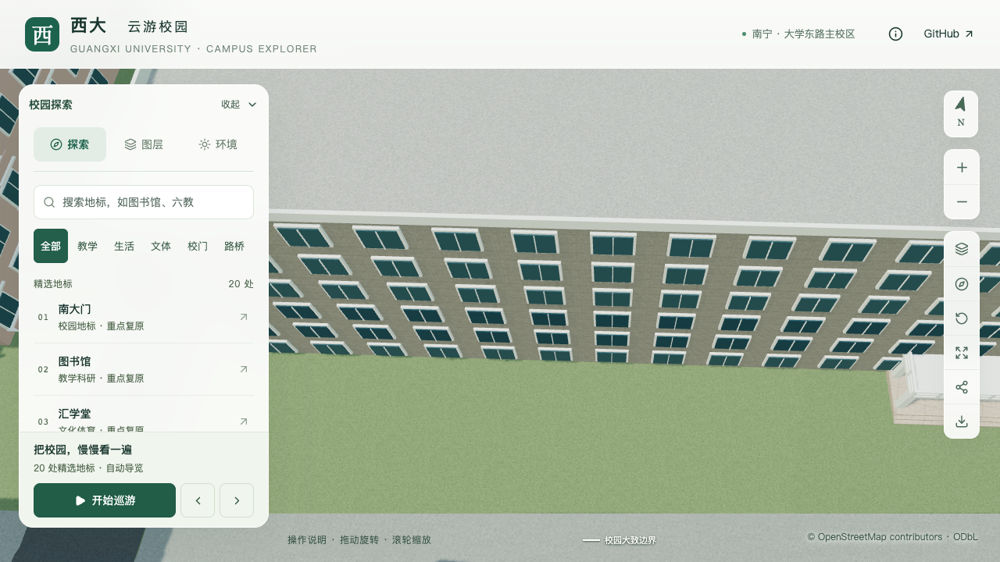
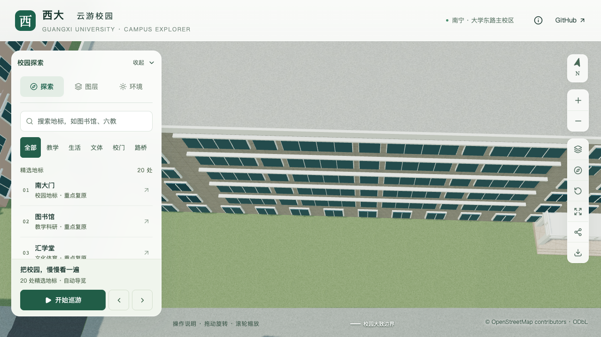
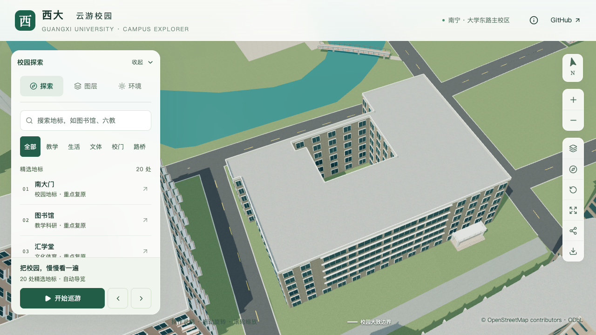

# 林学院南侧中段立面校准

2026-09-13，S2 普通楼栋校准，目标为 `relation/11564703`。本批在已校准南门的基础上，处理南侧长立面中段的宽窄窗组与水平挑檐。完整楼栋、其他入口及场地连接继续待核对，整栋完成数不增加。

## 资料支持与估算边界

[校方项目册](https://jjh.gxu.edu.cn/__local/A/1C/2D/C94DA67648AB9698A6BE04E1718_D3801DBD_2512297.pdf) PDF 第 39 页、印刷第 35 页的林学院具名照片，是本批立面依据。南侧方位沿用[入口校准](FORESTRY_COLLEGE_ENTRY.md)中的学院石、南门报道和 OSM 轮廓交叉定位。原图只用于造型参考，不作为网页贴图。

可见中段是宽窄不一的窗组，窗上有水平挑檐；本批保持实体外墙。照片分辨率和透视不足以确定每扇窗的精确数量，采用四宽三窄组作为中段简化，具体边界、分格和尺寸均标为估算。它不代表整条南立面已经逐窗复原。

新查阅的 2021 年学生工作简报配图只展示南门门廊，不能支持上部窗列；2026 年林科院专家来访报道的合影拍摄于校园游览中的另一地标，已排除。不能因为报道主体是林学院就把所有配图归到学院楼。

## 参数与实现

| 项目 | 采用值 | 说明 |
| --- | --- | --- |
| 立面锚点 | 外环第 5 边，`t=0.28–0.84` | 原边从东端向西，范围由照片约束估算 |
| 楼层 | 二至六层 | 沿用历史六层及 3.3 m 估算层高；底层单独保留 |
| 窗组 | 4 个宽组、3 个窄组 | 估算简化；宽组约 5.5–6.1 m，窄组约 1.8 m |
| 窗高 | 层高的 0.55 | 估算；宽组近景分为 4 格 |
| 挑檐 | 5 条，外挑 0.38 m，厚 0.18 m | 尺寸估算，基础与近景均保留 |
| 未覆盖区域 | 底层、南侧两端、其他立面、入口上方竖向突出体 | 继续待取证，未套用本批窗组 |

人工 `windowBands` 规则锚定原始外边上的局部范围；仅替换对应上层范围中会相交的通用窗户。自定义窗组之间保持实墙，避免原通用窗户从窗间漏出。基础模型保留同宽玻璃面和挑檐；近景增加边框与窗梃。该规则不挖空墙体、不改变 OSM 外环和内院，也不新增开放走廊。

`scripts/facade_bands_data.py` 校验范围、窗组顺序、含边框的间隔、分格尺寸、楼层和挑檐参数；不允许与开放走廊、阳台或另一种窗格规则混用。`blender/facade_bands.py` 负责共享挑檐与两级窗格表达。

## 验证要求

`blender/validate_forestry_facades.py` 从可编辑源文件和实际解码的基础/近景 GLB 发射材质区分射线，检查窗组两端与中点、窗后实体墙、窗间空白、挑檐顶面及近景窗梃。不能用生成器输出自比较代替实际资产检查。修改前模型必须在该检查中失败；当前模型通过后还需检查入口保持、其他建筑与场地不变，以及浏览器画面。

本批实际结果与资产哈希见[汇总](model-checks/refinement/s2-forestry-facades-summary.json)，原图判读和未采用资料见[取证记录](model-checks/refinement/s2-forestry-facades-evidence.json)。同条件性能缺少有效报告时继续标记待验收，不沿用旧资产的通过结论。

| 视角 | 修改前 | 修改后 |
| --- | --- | --- |
| 南侧中段 |  |  |
| 主体、内院及入口 |  |  |

[七张有效画面](model-checks/refinement/s2-forestry-facades-visual-review.json)包括前后近景、前后整体、植被开启、夜景与手机尺寸模拟。首轮近景被前方楼顶遮挡下部楼层，已保留记录并排除；补拍后的近景可见全部五层窗带。

本批几何、画面、83 项数据测试、完整数据准备和 Pages 构建通过。首屏模型 5,905,668 bytes，增加 768 bytes，其他建筑与树位保持。性能精细三次均为 60 FPS、流畅三次均为 28 FPS；由于采样捕捉到其他高负载 Python/Blender，同条件性能与工作包联合验收仍未通过。当前尚未形成整栋校准完成记录。

复现命令（完整重建须同时保留无关时光之门的既有源对象和导出几何，见入口记录）：

```sh
work/refinement-venv/bin/python scripts/building_overrides.py
blender --background --python-exit-code 1 --python blender/build_campus.py
blender --background --python-exit-code 1 --python blender/validate_forestry_facades.py
blender --background --python-exit-code 1 --python blender/validate_forestry_entry.py -- --report-prefix=s2-forestry-facades
```
