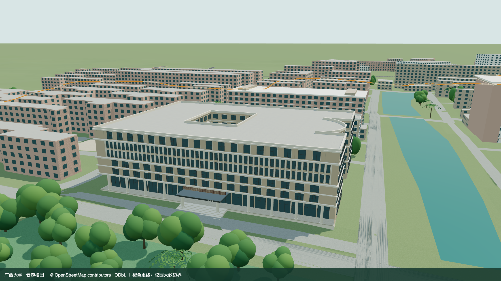
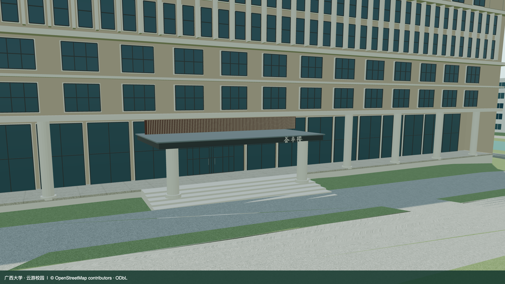

# 荟萃楼精细建模记录

更新：2026-09-11。[查看荟萃楼](https://wcqqq1214.github.io/gxu-campus-3d/#place=huicui)。

荟萃楼位于新闻传播学院同一组楼体的北侧。本次替换原来按教学楼类型生成的模型，保留 `relation/11970574` 的真实轮廓、内院、西侧弧形凹口以及坐标和朝向。复用原有模型，现为第 20 处精选地标；独立加载 `huicui.glb`，已从普通建筑分区移出，避免重复。

## 复原内容

- 北翼七层立面：下部通高圆柱廊，三、四层成组方窗，五、六层密集窄窗与竖向石材条，顶层石材窗框及横向挑檐。
- 酒店北门：双圆柱金属雨棚、竖向木色饰面、荟萃楼立体字牌、雨棚底板分缝与灯具、玻璃门和把手。
- 门厅退进，玻璃位于柱廊后侧；柱廊前方没有实墙。
- 门前踏步和基座与现有地形衔接。踏步数量和尺寸为地形适配估算，非照片实测。
- 保留学院侧翼、内院及平屋顶女儿墙；未充分拍到的立面按原轮廓和同楼风格估算。





北门近景为检查细节临时隐藏植被、边界和标注；默认场景仍保留这些图层。

## 来源与年代

| 资料 | 日期 | 用途与边界 |
| --- | --- | --- |
| [OSM 建筑关系](https://www.openstreetmap.org/relation/11970574) | 快照 2026-09-09；最后编辑 2021-06-23，版本 3 | 轮廓、内院、7 层标签；总高按 7×3.3 米估算，非实测。 |
| [校方全景照片](https://www.gxu.edu.cn/info/1006/24034.htm) | 发布 2020-01-10；拍摄日期未知 | 北立面比例、窗格、圆柱廊和门厅。 |
| [新浪广西入口近景](https://k.sina.cn/article_2475191397_p93886c6502700e259.html) | 页面未显示年份；图片路径含 20181115，拍摄日期未知 | 雨棚、字牌、柱子及玻璃门；按历史参考使用。 |
| [校方弘志厅活动报道](https://zc.gxu.edu.cn/info/1095/3507.htm) | 发布及活动日期 2024-12-31；拍摄日期未知 | 确认楼宇在用及七楼功能，不证明近期外立面状态。 |
| [校方酒店吊顶改造公告](https://zc.gxu.edu.cn/info/1113/3974.htm) | 发布 2026-03-30 | 核对近期名称与使用情况，不用于推断外立面变化。 |
| [校方会议手册](https://cicsem.gxu.edu.cn/__local/1/9E/DB/BF34475DDE4E0D13163657EDBAA_BBF87370_13B34F.pdf) | 发布日期未知，历史资料 | 核对位于西校园新闻学院北面的相对位置。 |

所有资料获取日期为 2026-09-11。检索了近期资料，但未获得拍摄日期可核实的 2024—2026 年清晰外立面照片。现行携程页面使用了与 2020 年校方文章相同的全景图，因此没有将其标为新照片。模型依据可见外部特征复原，不保证与 2026 年现状逐项一致；未建内部客房，未将估算尺寸当作实测。

参考照片只保留链接，不复制入仓库、不作纹理。自制模型和材质采用 CC BY 4.0，地图轮廓沿用 OSM ODbL 署名。来源记录见 [huicui-sources.json](../data/huicui-sources.json)。

## 重建与验证

```bash
python3 scripts/huicui_data.py
blender --background --python-exit-code 1 --python blender/update_huicui.py
blender --background --python-exit-code 1 --python blender/validate_huicui.py
```

第一步需要 `scripts/requirements.txt` 的 Python 地理依赖。完整 `data:prepare` 和 `blender/build_campus.py` 也已接入。局部脚本只重建基础 GLB、独立地标 GLB、原分区及 Blender 源对象。源对象“荟萃楼 · 新闻传播学院共用楼体”具有顶板、立面、门厅、学院侧翼和屋顶分组；仅对此对象合并重合顶点，保留面 UV 和分组以控制体积。

源网格及压缩后两档 GLB 均检查柱廊无实墙遮挡、内院不封顶、雨棚顶板存在、踏步高于地形，并限制下级踏步离地高度。[几何检查结果](model-checks/huicui-geometry.json)与[其他资产保留记录](model-checks/huicui-retained-assets.json)可复核。

网站现有 20 处精选目录，支持“荟萃楼”“荟萃楼酒店”“新闻传播学院”搜索、分类筛选、模型点选、详情与来源、北门近景、分享链接和自动巡游。材质沿用原有昼夜和画质切换逻辑。
