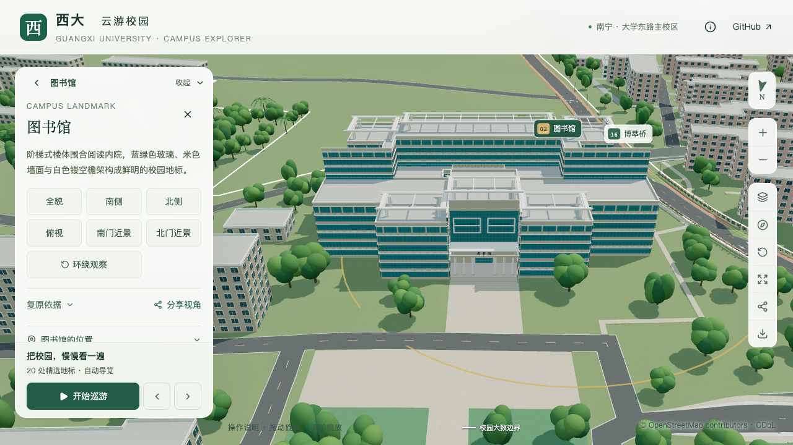
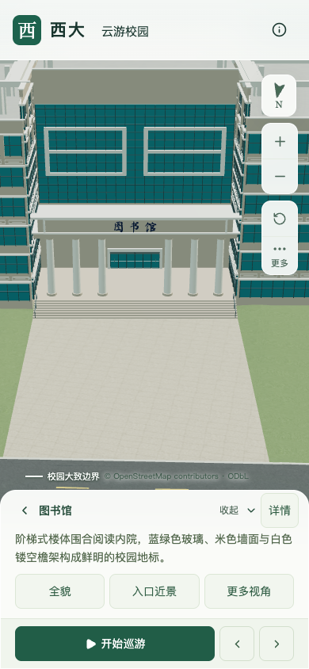
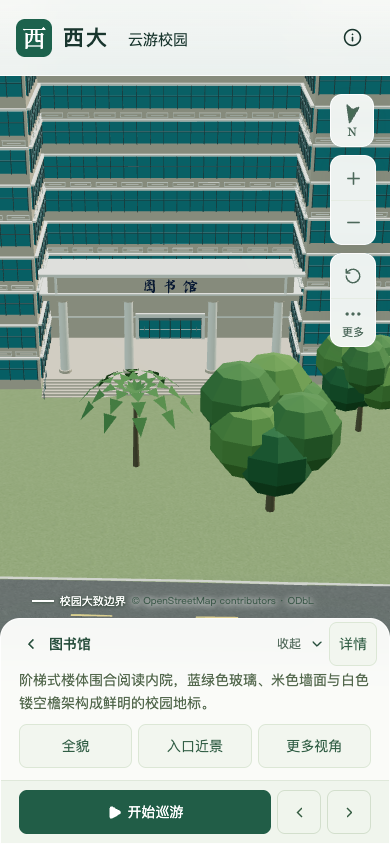
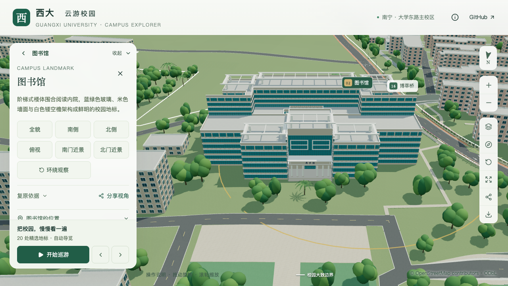
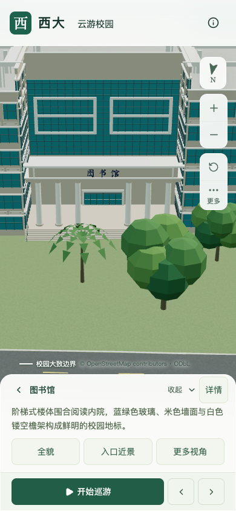

# 图书馆北入口场地样板

状态：北门六柱、南北体量及北幕墙已校准；中央前场铺地、台阶下局部地形和树冠排除已实现，源文件/实际 GLB、日夜及图层检查通过。固定镜头、三次远近景往返与本批性能复核通过；相邻普通建筑校准尚未完成，完整 S3 仍未完成。

## 取证与采用范围

[校方 2026 年读书月报道](https://news.gxu.edu.cn/info/1002/43647.htm)明确活动于 4 月 26 日在图书馆北楼前广场举行。首图可见六根门廊柱，中央开间较宽，台阶前为硬质铺地；人群遮挡精确的地面边界。采用六柱数量，保留原轮廓和北侧入口位置；柱距、柱径与高度仍为照片约束估算。

原模型北入口只有四根柱。本轮补充两根中间柱，基础、近景及可编辑源同步；主入口的门洞与六片门扇继续沿用既有采购规格。门扇数量与门廊柱数量分别核验。[取证索引](model-checks/refinement/s3-library-evidence.json)记录本机参考图哈希与用途，原照片不随仓库分发。

旧本机文件 `library-north-official.png` 实际是历史建筑图片，不能凭文件名用作当前北入口参考。[校方 2026 图文](https://www.gxu.edu.cn/info/1004/40412.htm)中的图书馆照片与本机 `library.jpg` 哈希一致，前景包含时光之门。该雕塑的 OSM 位置在图书馆以北，因而照片观察北立面。原代码把双回形幕墙放在南侧，北侧反而整体较高；现已结合以下独立来源纠正。

### 南北体量与幕墙校准

[2014 年校报第 3 版](https://news.gxu.edu.cn/__local/8/C4/4D/0B1CE8B9D4B8389F21FF34B7030_FF27C11E_793A3.pdf)明确二期馆位于原馆以南、地上 11 层。[2024 年考研座位通知](http://www.lib.gxu.edu.cn/info/5662/12260.htm)确认南九、十楼阅览区投入使用。[校方开放区域](https://www.gxu.edu.cn/en/info/1157/1721.htm)列出北楼三至六层，与照片共同约束北楼六层表达。建设资料不是竣工测绘；官网介绍南楼段落后的两幅图片实际为室内照，不用于外立面判断。

保留原轮廓和内院，将南楼设为 11 层、36 米，北中央设为 6 层、27 米，北两翼与连廊设为 6 层、23.5 米。北楼中央略高于其两翼；照片后方更高的馆舍属于南楼，不能混作北侧高翼。所有米制高度、连廊层数及分界均为估算。双回形幕墙缩放至北侧约 25.7 米的原始凹口，屋顶檐架随所属分区调高低，北门位置及六柱保持。

新增检查在旧源文件上复现“南低北高”错误；当前[源文件与远近 GLB 检查](model-checks/refinement/s3-library-envelope.json)均确认南楼 36 米、北中央 27 米、两翼 23.5 米、北向双回形构件以及开放内院。[数据对照](model-checks/refinement/s3-envelope-data-invariants.json)确认 448 栋外环、高度总值和身份、道路、地形及树位保留，只有图书馆分区与资料字段改变。

## 重建流程修复

1. 外围道路生成时复用 20 米校界邻近建筑筛选。完整准备先前会避让稍后被删除的 32 栋远处建筑，导致约 7,843 平方米道路差异；修复后道路、步道、路缘三层与既有结果的几何差异均为零。
2. 通用来源归入 `data/sources.json`，与荟萃楼、篮球场和楼栋校准的来源文件共同生成公共来源表。清空派生目录后也能准备数据，不再读取旧公共来源作为输入。
3. 荟萃楼是共享楼体中的北翼地标；完整准备保留整楼“新闻传播学院”的名称和教学分类，导航继续使用“荟萃楼”。GeoJSON 同步最终立面依据。

[隔离重建核验](model-checks/refinement/s3-preparation.json)保留检查范围。448 栋建筑身份与轮廓、树位、球场、地形和校界保持；主路约 0.846 平方米在沥青与路缘饰面之间重算，合并铺地范围未变。桥下接口差异为数值误差。Blender 会在模型构建时补充高程、区域与区块字段，不能将准备前后的缺少字段误判为丢楼。

## 中央前场连接（2026-09-12）

样板沿用 [S0 工作范围](model-checks/refinement/site-scope.json)，实际新增铺地只连接北门台阶与道路 `way/699156914`。25.2 米宽度沿用现有台阶作为中央连接估算，纵向按[实际道路铺地边缘](model-checks/refinement/s3-site-road-interface.json)延伸约 28.02–28.15 米，面积 707.805 平方米。照片支持硬质铺地用途，不能据此确认完整广场边界或现场坡度。

人工输入为 `data/site-overrides.json`，最终派生为 `public/data/sites.json`。记录关联稳定建筑 ID、入口、轮廓摘要、道路几何摘要、局部坐标和逐项估算说明。完整数据准备在全部既有道路与场地处理后生成连接及最终排树；保留原 `surfaces` 槽位。当前连接区没有旧映射铺面，因此覆盖槽位为空，没有凭空裁改其他铺地。

`blender/site_geometry.py` 对实际道路三角面采样，按入口底部 3.57 米和道路边缘约 3.480–4.185 米连接。局部替换 6 个粗地形面，增加 3,066 个地形面，最大削低约 0.544 米，边缘 3 米范围过渡回原地面，建筑基础排除在修整范围外。原始 DEM 文件未改动。

入口最低两级曾被地形覆盖约 0.227/0.060 米，保留在[修改前采样](model-checks/refinement/s3-stair-ground.json)。当前最低一级高出铺地约 0.15 米；新铺地共 1,682 个面，并含侧面收口和埋入接缝。主路接触带的 82 个原道路三角面及补口并入小型场地对象，保留原材料与高程，减小全校道路共同压缩产生的接缝误差。

场地对象 `site-library-north` 常驻基础模型，归道路图层。源文件按铺地、侧面、埋入接缝和主路接口原铺面分组；图书馆入口平台和台阶继续使用既有共享模型。关闭道路图层时铺地随道路隐藏，关闭建筑图层时铺地保留，地标近景加载不重复生成前场。

最终树冠排除移除 4 株示意树，保留 3,030 株的坐标、高度、类型与相对顺序。既有旋转仍依赖实例索引，本批没有声称其他树木旋转全部不变；跨分区稳定旋转归入 S4。完整准备可恢复相同排除结果，单独重复执行排树时报告的是该次实际删除数量。

### 几何与画面验收

[源文件及实际基础 GLB 检查](model-checks/refinement/site-geometry.json)各采样 310 个铺地点，最低一级台阶均约 0.15 米，铺地最小露出量分别约 0.064/0.035 米。外围 20,195 个地形点在源文件中与原面完全一致；实际 GLB 最大误差约 0.051 米，低于按 15 位量化和局部坡度推导的逐点容差。这是压缩误差范围，不是测绘精度。

道路每 2 厘米的采样高差最大约 0.0011 米（源文件）和 0.0363 米（基础 GLB）；压缩后的一个材料边界存在不超过 1 毫米的缺口界限，未将其写为数学意义的零接缝。检查同时覆盖建筑冲突、全部 3,030 株实际源树冠与道路图层归属。

[日夜与图层检查](model-checks/refinement/s3-site-ui-interaction.json)完成基础、地标近景、道路关闭、建筑关闭、图层恢复和夜景六种状态，没有浏览器错误。最初 `s3-site-interaction.json` 因测试脚本使用精确开关名称而超时，修正匹配附带描述的可访问名称后通过；该失败记录保留。

[中央连接汇总](model-checks/refinement/s3-site-summary.json)确认本批体积、几何、画面与性能门槛通过。精细/流畅三次中位 FPS 为 60/28，精细各轮为 60/60/46；测量为同机常规桌面条件，手机为尺寸模拟。

当前剩余工作是[六个邻楼目标](model-checks/refinement/s3-neighbor-review-queue.json)的入口、立面与比例核对，以及完整 S3 的最终汇总。广场完整边界、南侧入口及未见细节继续标为待核对。

## 本批模型对照

两图均为同机 390 × 844 的手机尺寸模拟，显示由四柱到六柱的变化。树冠仍遮挡前场，尚不能据此验收场地通行链。

| S2 四柱（历史） | S3 六柱（场地修改前） |
| --- | --- |
|  |  |

[本批验收汇总](model-checks/refinement/s3-entry-summary.json)：25 项 Python 与 51 项 Node 检查通过，精细/流畅 FPS 中位数为 60/28，资源切换正常，浏览器错误为空。

### 方向校准后的固定镜头

这组历史画面显示方向校准后的状态；其中台阶前的草地与遮挡树已由上文中央前场工作处理，不将历史截图作为当前场地状态。

[方向校准汇总](model-checks/refinement/s3-envelope-summary.json)记录 26 项 Python、51 项 Node 检查、模型与生产资源哈希，以及本次性能测量条件。初始资产体积为 5,588,184 bytes，仍在 6,000,000 bytes 预算内。
