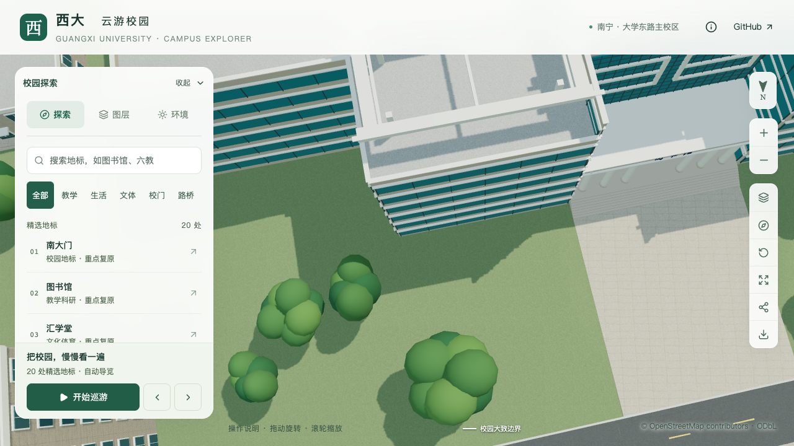

# 图书馆北入口东侧低矮绿篱试点

2026-09-13，S4 的首个独立低矮景观配置。对象是图书馆北入口东侧的一段低矮绿化，主入口、台阶和中央前场继续留空。几何、画面及增量维护检查已通过。四轮活动性能数值达标，但 CPU 记录均捕捉到并发计算，尚未通过同条件性能验收；本批工作包保持待验收。

## 资料与估算边界

[校方 2026 年 4 月 17 日图文](https://www.gxu.edu.cn/info/1004/40412.htm)中的北立面照片，以北侧时光之门确认方位，入口东侧位于照片左侧，可见部分低矮绿化。照片不能确认完整花坛边界、准确尺寸或植物品种。本段沿映射北楼东翼前缘表达局部示意，不作为逐株或测绘复原。

[2026 年读书月报道](https://news.gxu.edu.cn/info/1002/43647.htm)支持北门中央硬质前场保持开放，未用于定位绿篱。另检查过图书馆蒜香藤、新闻学院绿篱及劝学岛景观池养护照片；它们缺少可核对的位置或不属于低矮绿篱，本次没有据此增加模型。[资料采用与排除记录](model-checks/refinement/s4-low-planting-evidence.json)保存本地参考照片哈希；照片没有作为贴图或发布资源分发。

| 参数 | 当前值 | 依据性质 |
| --- | --- | --- |
| 建筑 | `relation/11564702` | 已映射图书馆轮廓，保存轮廓修订哈希 |
| 楼栋局部线段 | `(18, 39.7) → (34, 39.7)` 米 | 沿北楼东翼前缘的局部示意 |
| 长 × 宽 × 高 | 16 × 1.4 × 0.75 米 | 模型估算，非现场测量 |
| 占地 | 22.4 平方米 | 上述估算参数的派生面积 |
| 类型 | 连续低矮叶团 | 不推定具体品种；未增加围墙、花朵或树干 |

## 数据与生成流程

人工输入为 `data/low-planting.json`，`scripts/low_planting_data.py` 生成 `public/data/low-planting.json`。最终植被准备自动调用该步骤，也可单独运行。校验稳定 ID、来源、楼栋局部坐标、轮廓哈希、有限数值与完整占地；占地不得越出校界，或进入最终建筑/道路/水面/运动场范围、模型保留区和显式开放区。无效输入报错，不自动移动绿篱。

`blender/low_planting.py` 使用最终地形三角面求取高度，生成带端面、圆折肩部和轻微顶部起伏的连续叶团。底部嵌入地面约 3 厘米以吸收贴地与量化误差。植被图层控制源对象和基础 GLB 中的 `vegetation-low-library-northeast-hedge`，不依赖乔木模板或普通建筑近景替换。

初版使用深浅两种叶材质，实际 Draco 解码后接缝因独立量化形成两个开放组件。小范围对照确认单材质能保留一个闭合组件，最终采用单材质并保留原有 290 个三角形。平地、斜地测试加入实际压缩往返，闭合检查没有放宽。

道路和球场增量脚本调用 `sync_source_low_planting()`，在最终地形生成后同步源文件绿篱。环境或轮廓变化后应先刷新派生配置；过期配置会被构建拒绝。两条实际增量命令均在隔离副本中验证：先把源绿篱抬高 3 米，再执行更新，随后对源文件及全部导出资产重新检查，确认恢复贴地。主工作区资产保持不变。[增量维护报告](model-checks/refinement/s4-low-planting-incremental.json)。

完整数据准备链另在隔离副本中运行两次，包括移走全部 `public/data` 后从原始缓存重新生成。两次派生绿篱与当前文件完全一致，上下文哈希相同；[空输出准备检查](model-checks/refinement/s4-low-planting-clean-prepare.json)通过。数据阶段产生 3,122 个乔木候选，后续模型阶段才决定最终树数，此数据检查不替代最终树木净空检查。

## 当前几何与画面证据

[实际几何检查](model-checks/refinement/s4-low-planting-geometry.json)读取源文件和清单中的 69 个 GLB。源绿篱与解码绿篱均为一个闭合组件、290 个三角形；最高点相对实际地形约 0.750 / 0.746 米，最低点约 −0.030 / −0.035 米。源与运行场景分别检查 4 / 7 个相邻网格，未发现表面相交或可识别闭合组件包含。3,061 株树的两级模板经包围盒初筛均不与该绿篱重叠；这里没有工程净空含义，开放场地网格不自动补成实心体。

[资产保留检查](model-checks/refinement/s4-low-planting-assets.json)确认原有 83 个基础节点的几何、材质、属性和变换不变，只增加绿篱节点；另 68 个 GLB 字节不变。[源对象保留检查](model-checks/refinement/s4-low-planting-source-preservation.json)确认原 523 个非树木对象和全部树实例不变。首屏基础模型与树模板共 5,902,268 bytes，比试点前增加 4,444 bytes；最大普通近景区块仍为 1,684,868 bytes。生产包与公共资源匹配。

修改前：



修改后：


[七张原始截图核对](model-checks/refinement/s4-low-planting-visual-review.json)包括前后正面、前后俯视、夜景、关闭植被和手机尺寸模拟。正面绿篱受既有树冠部分遮挡，俯视补充完整范围检查。初次相机从楼后看向目标，被楼体遮挡，原记录保留但不用于验收。手机图是桌面视口模拟，不是手机真机测试。

## 性能结果与未完成验收

四轮均完成三次 LOD 往返和两档各三次 30 秒图书馆活动镜头，无浏览器错误。配置与 S0 基线一致，数值门槛均通过。

| 第四轮三次结果的中位数 | S0 基线 | 当前 | 变化 |
| --- | ---: | ---: | ---: |
| 精细 FPS | 60 | 60 | 0% |
| 精细三角形 | 4,017,716 | 4,083,689 | +1.64% |
| 精细 Draw Calls | 537 | 544 | +1.30% |
| 流畅 FPS | 30 | 28 | −6.67% |
| 流畅三角形 | 1,052,490 | 1,092,731 | +3.82% |
| 流畅 Draw Calls | 268 | 280 | +4.48% |

首轮记录到一次短时 Python 活动，第二轮记录到高负载 Blender/Python 进程；后者两条 Blender 进程各有约 51 秒的观测跨度。虽然数值通过，不能据此给出同条件性能通过结论。保留[首轮汇总](model-checks/refinement/s4-low-planting-initial-summary.json)、[补测汇总](model-checks/refinement/s4-low-planting-recheck-summary.json)及各自 CPU 记录；后续在计算负载稳定时补测，当前[工作包汇总](model-checks/refinement/s4-low-planting-summary.json)的 `workPackagePassed` 为 `false`。

78 项 Python 数据测试、54 项 Node 检查、平地/斜地/缺失地形及两次实际 Draco 往返检查通过，Pages 生产构建通过。这些结果不替代尚未通过的同条件性能验收。

第三轮精细 60/60/60、流畅 28/28/29 FPS，捕捉到一次 76% CPU 的 Python 进程；第四轮精细 60/60/60、流畅 28/28/28 FPS，捕捉到一次 100% CPU 的 Python 进程。第四轮启动时无此高负载进程，运行中仍有其他计算启动，故没有放宽门槛或删除采样。保存[第三轮汇总](model-checks/refinement/s4-low-planting-quiet-summary.json)、[第四轮汇总](model-checks/refinement/s4-low-planting-final-check-summary.json)和各自完整进程记录；资产哈希与此前几何验收一致。暂停连续重测，先推进 S2 楼栋资料与形体工作。

## 复现

```sh
work/refinement-venv/bin/python scripts/low_planting_data.py
blender --background --python-exit-code 1 --python blender/test_low_planting.py
blender --background --python-exit-code 1 --python blender/build_campus.py
blender --background --python-exit-code 1 --python blender/validate_low_planting.py -- --report-prefix=low-planting-check
```

完整构建还会重新生成时光之门，现有体素步骤存在跨构建字节变化；本批将源雕塑和压缩资产从试点前快照保留，并重新核对哈希。不能将本批局部保留证明解释为全项目字节级确定性。

该试点不代表完整 S4 已完成。庭院/湖边的有依据树位组织、S2 的 20–30 栋整栋核对、S3 邻楼与联合场地验收，以及 S5 仍需继续。
