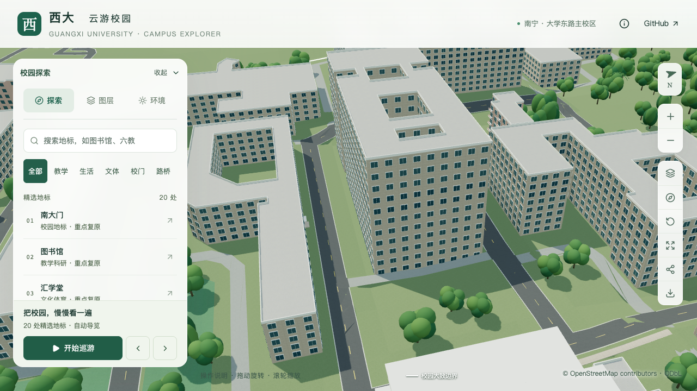
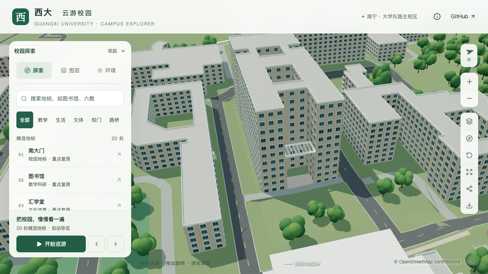

# 资源环境与材料学院：东端透空框架

> 2026-09-16；开发分支 `dev`。接续[整体尺度校准](MATERIALS_BUILDING_HEIGHT.md)，仅完成东端高低分段与透空框架，仍为部分校准。

## 依据与范围

目标为 `relation/11564999`。[设计院实景](https://www.gibrd.com/product/1290.html)与[学院首页照片](https://zyhjcl.gxu.edu.cn/images/IMG_1247-2-1.jpg)共同支持东端中央开敞、顶部横梁透空、圆柱支撑的形态。照片及身份核对沿用[上一批取证记录](model-checks/refinement/s2-materials-height-evidence.json)，不将照片当作测量图纸。

原模型把东端中央也挤出至 48.1 米。本批将最东内院与外边线之间的约 141.95 平方米分段改为低框架，南北两侧及其余主体保留原高度。主楼与框架采用共享分界顶点，避免倾斜边线布尔裁切产生薄墙；两段并集严格覆盖原 OSM 建筑轮廓，三处内院不被填平。

| 参数 | 本批模型值 | 证据边界 |
| --- | --- | --- |
| 主体屋面 / 最高地上层数 | 48.1 m / 11 | 沿用上一批，主体高度口径仍为估算 |
| 框架梁顶 / 梁底 | 21.86 / 21.06 m | 参照照片比例估算，非现场标高 |
| 边梁平面宽度 | 0.8 m | 简化估算 |
| 内横梁 | 7 根、宽 0.3 m | 简化排布，数量与尺寸未实测 |
| 透空区域 | 8 个几何开孔 | 梁间真实留空，无覆盖整面的屋顶板 |
| 立柱 | 4 根、直径 0.7 m | 照片约束简化，采用 16 边圆截面 |
| 暂定底平台 | 高 0.6 m | 沿用建模基准的估算，尚未校准入口层高 |

框架分段的 `levels: 1` 表示一个开放结构单元，不代表一层可使用楼层，也不把梁顶约五层的高度当作五层楼板。

本批不构成完整入口复原：照片中更低的独立门雨棚、门区、台阶、平台真实标高及接路仍待处理；中部水平构件、后侧连廊、退台、外墙饰面和主要窗组也未完成。原北侧示意入口暂保留待核对，不以新增透空框架宣称东主入口已经可通行。当前仍为 19 条部分对象记录，新增整栋验收数为零。

## 数据与共享模型

`openBelow.slattedRoof` 只接收 `edgeWidth`、`slatWidth`、`slatCount`。当前支持单一、近直角、无孔四边形，第一条边决定横梁方向；最小梁间空隙 0.25 米。拒绝无效尺寸、超限梁数、退化四边形、消失的开孔以及柱中心未落在梁上的配置。

数据处理生成带孔 `roofGeometry`。Blender 对同一带孔轮廓生成梁顶、梁底和侧面，基础与近景共用；该框架不叠加普通屋顶女儿墙。通用屋顶验证相应改为在实际梁面采样。倾斜分段的立面解析保留外边线的三个区间，侧翼临框架墙面从平台以上生成窗层。

## 验证

154 项 Python、56 项 Node 测试、完整模型和 Pages 构建通过。[数据核查](model-checks/refinement/s2-materials-frame-data.json)确认覆盖规则幂等，447 栋非目标建筑及场地数据不变。

[框架专项检查](model-checks/refinement/s2-materials-frame-geometry.json)对源文件、实际基础和近景分别进行 29 组射线检查：7 个横梁、8 个孔洞、4 个边梁、4 组圆柱轴向命中与侧向净空、3 个高主体屋面及 3 个原内院。孔内向下射线首次命中底平台，证明梁间没有整面顶板；柱旁射线确认开放空间。旧版本在源文件控制检查中命中 48.1 米高屋面，按预期失败；[控制报告](model-checks/refinement/s2-materials-frame-before-geometry.json)不宣称另做了旧基础/近景控制。

430 栋普通建筑的源文件、基础与近景回归和实际树冠检查通过。[源对象比较](model-checks/refinement/s2-materials-frame-source-preservation.json)确认只有目标楼改变，其他 530 个非树木对象和 3,063 株树保持。[资产核查](model-checks/refinement/s2-materials-frame-assets.json)确认仅 `base.glb` 与 `chunk-n2-n3.glb` 变化，其余 67 个 GLB 和 90 个非目标基础节点保持；首屏 5,142,712 bytes，增加 2,756 bytes，最大普通近景 1,684,868 bytes。

七张前后、去树、夜景及手机尺寸画面已逐张核看，见[画面记录](model-checks/refinement/s2-materials-frame-visual-review.json)。本次东向镜头置于综合实验大楼与目标楼之间，可以看到框架下方；画面中的底平台仍是估算占位，不能代替完整入口验收。手机为 390 × 844 桌面浏览器模拟。

| 修改前 | 东端框架分段后 |
| --- | --- |
|  |  |

精细档60/60/60 FPS、流畅档29/29/29 FPS；相对同系统S0，三角形增加3.43%/7.87%，绘制调用增加2.38%/11.03%，均通过原预算。三次LOD往返无错误，24次CPU快照在六个计时窗口内未记录到超过2%阈值的Python/Blender计算。完整指标和指纹见[本批汇总](model-checks/refinement/s2-materials-frame-summary.json)。

后续优先核对本楼入口的独立低雨棚、门区和台阶，再推进其余连廊与立面。

复查当前源文件及导出模型：

```sh
blender --background --python-exit-code 1 --python blender/validate_materials_frame.py -- --report-prefix=materials-frame-recheck
```

如使用 `--check-root` 对比历史资产，该目录需包含完整的 `blender/gxu-campus.blend`、`public/models/base.glb` 与 `public/models/chunk-n2-n3.glb`。固定验收坐标及高度来自本批校准布局，不能把该脚本用于证明估算尺寸已得到实测确认。
