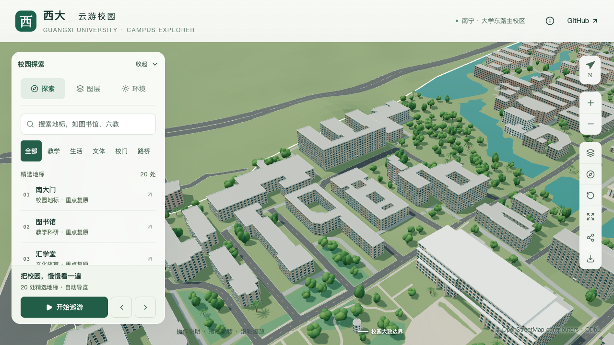
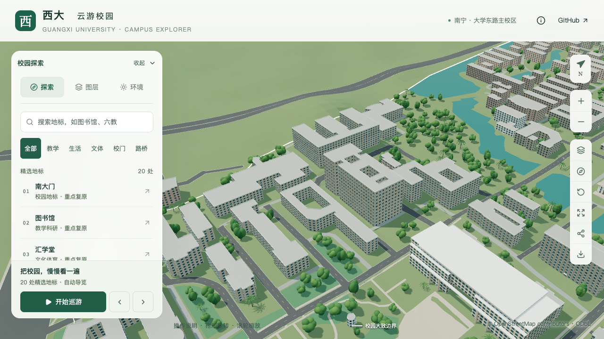

# 资源环境与材料学院：整体高度校准

> 后续东端高低分段与透空框架已接续实现，见[框架专项](MATERIALS_BUILDING_FRAME.md)。下文保留本批历史状态。

> 2026-09-16；开发分支 `dev`。本批校准整体尺度，仍是部分校准，不计入整栋验收完成数。

## 采用依据

目标为 `relation/11564999`，原名称、OSM 轮廓及三个内院保持。之前没有有效 OSM 层数，模型按类型生成五层、16.5 米主体。

[广西建筑科学研究设计院项目页](https://www.gibrd.com/product/1290.html)发布于 2024-04-25，项目名为“广西大学文科教学大楼”，明确记载地上 11 层、地下 1 层、建筑高度 48.9 米。该名称与当前学院名不同，采用以下交叉证据完成匹配：

- 设计院实景照片的入口标识为资源环境与材料学院，其双侧高体量、低门廊、中央开口与[学院首页照片](https://zyhjcl.gxu.edu.cn/images/IMG_1247-2-1.jpg)一致。
- 页面说明为东西长向地块，东邻综合实验大楼、北邻土木学院楼，与当前映射位置一致。南侧旧物理楼和西侧新物理楼不混用。
- [校方 2023 年改造公告](https://www.gxu.edu.cn/info/1364/32571.htm)明确提到已有第十层和地下一层下沉式庭院，支持排除原五层默认值。公告中的拟改造内容不视为竣工事实。

照片拍摄日期均未知；原图只作本地核对，不随仓库分发或用作纹理。来源登记于 `data/building-sources.json`，原始标签保留。

## 参数与边界

| 字段 | 原值 | 本批采用 | 依据性质 |
| --- | --- | --- | --- |
| 最高地上层数 | 类型默认 5 | 11 | 设计院明确记载；不表示所有分段均为 11 层 |
| 主体高度 | 16.5 m | 48.1 m | 建模换算估算，非实测主体屋面标高 |
| 示意女儿墙 | 0.8 m | 0.8 m | 沿用现有生成规则，尺寸未确认 |
| 模型最高女儿墙相对楼栋基准 | 17.3 m | 48.9 m | 暂以设计院公布建筑高度控制整体尺度 |
| 屋顶 | 默认平顶 | 照片约束的平顶 | 背部、设备和退台仍待核对 |

设计院没有说明 48.9 米的起算标高及女儿墙口径，因此不能直接把该数值标成实测主体高度。本批以 `48.9 − 0.8 = 48.1` 米控制屋面，平均分配 11 层窗位；平均层高也只是建模参数。地下层不叠加到地上层数或模型高度中。

本批继续使用单一挤出体，**低门廊、中段连廊、局部退台和各翼层数尚未建模**。保留原北侧示意入口并明确其待核对状态；东侧真实主入口的平台和台阶需要随后单独解析。三处映射内院保持开放，公告中的庭院加盖方案不在本批实施。

这是从明显过矮的默认体量向资料约束尺度的一步，不是完整立面复原。累计部分对象记录增加至 19 条，新增整栋验收完成数为零。

## 本轮候选筛查

| 候选 | 发现与处理 |
| --- | --- |
| 校友之家 / 西 6B | [基金会官网](https://jjh.gxu.edu.cn/)地址为 6A；不能把旧项目册五层套用到 `way/759147082` 的 6B。另有近年六楼活动信息，需继续核对改造后的具体楼体，暂不修改 |
| 第四教学楼 | 项目册七层条目照片同时出现高楼和低层体量；当前 `way/880036326` 是低层映射，不整体抬到七层 |
| 第六教学楼 | 项目册七层包含地下一层，不能把当前六层地上体量改成七层 |
| 第十教学楼 | 已采用独立地标模型，不纳入普通建筑覆盖表 |
| 物理学院 | [学院首页](https://physics.gxu.edu.cn/)取得具名照片；电梯停层数不能替代各翼地上层数，暂保留 OSM 九层，后续单独核对 |

## 验证与下一步

数据幂等性、447 栋非目标建筑不变、原标签/轮廓/地标身份和场地数据不变见[数据核查](model-checks/refinement/s2-materials-height-data.json)。149 项 Python 测试、56 项 Node 测试及完整模型、Pages 构建通过；430 栋普通建筑的源文件和实际基础/近景检查、实际树冠检查通过。

[源文件差异核查](model-checks/refinement/s2-materials-height-source-preservation.json)确认只有资环材学院改变，其他 530 个非树木对象及 3,063 株树保持。[资产核查](model-checks/refinement/s2-materials-height-assets.json)确认 69 个 GLB 中只有基础模型与 `chunk-n2-n3` 变化，90 个非目标基础节点保持。首屏模型 5,139,956 bytes，较上一批增加 4,524 bytes；最大普通近景区块 1,684,868 bytes，均在原预算内。

七张同镜头前后、去树、夜景及手机尺寸画面已逐张核看。原五层体量偏矮的问题得到修正，三个内院在俯视中仍可辨认；前场与建筑下部在东侧镜头被综合实验大楼遮挡，不能用这些截图验收入口。手机为 390 × 844 桌面浏览器模拟，非真机测试。

| 修改前 | 整体尺度校准后 |
| --- | --- |
|  |  |

精细60/60/60 FPS、流畅29/29/29 FPS；相对同系统S0，三角形增加3.59%/7.75%，绘制调用增加2.19%/11.03%，均在原预算内。三次LOD往返无错误，24次CPU快照中计时窗口未记录到超过2%阈值的Python/Blender计算。完整指标与资产指纹见[本批汇总](model-checks/refinement/s2-materials-height-summary.json)，原图指纹和身份对应见[取证记录](model-checks/refinement/s2-materials-height-evidence.json)。

下一步优先解决本楼东向入口、高侧翼与较低连廊的分段对应，再扩展主要立面；保持源数据、基础模型与近景使用同一组参数。S2 的 20–30 栋目标及 S3 必需邻楼验收继续按原计划执行。
