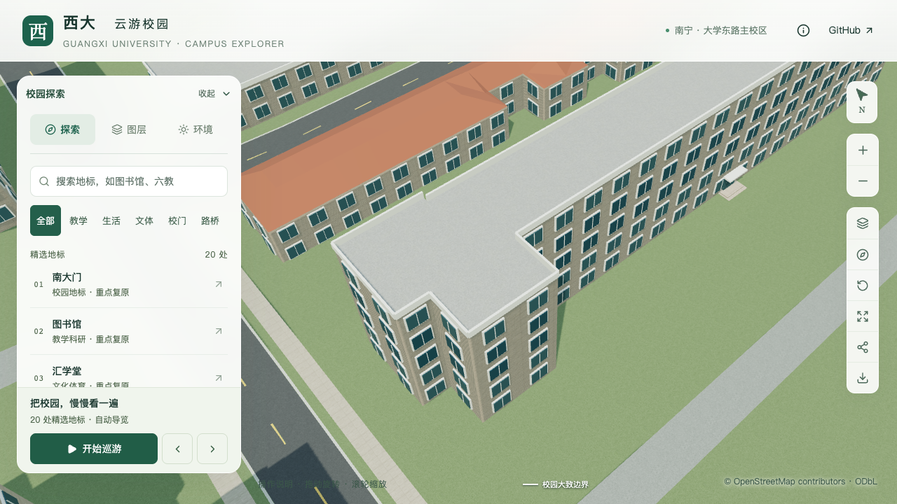
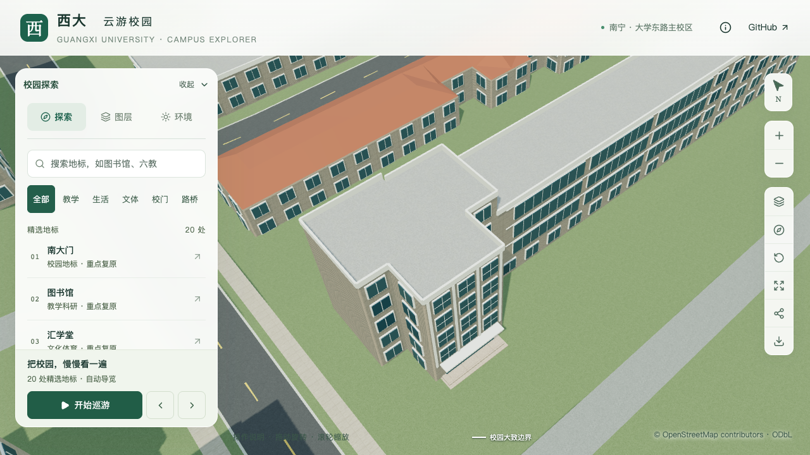
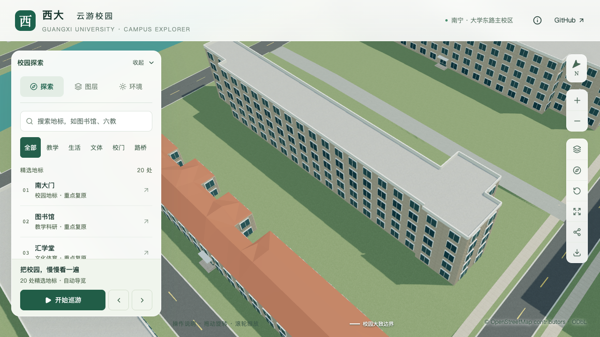
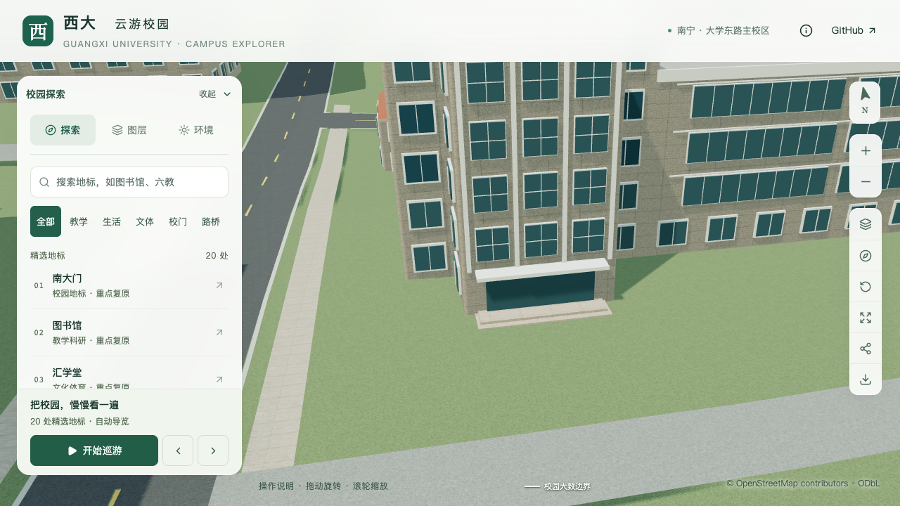
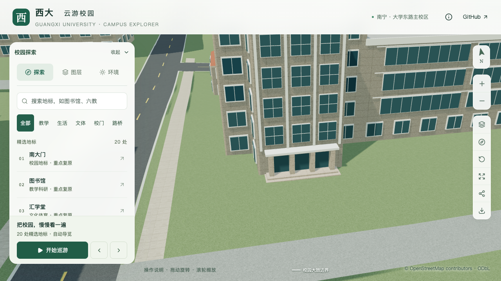
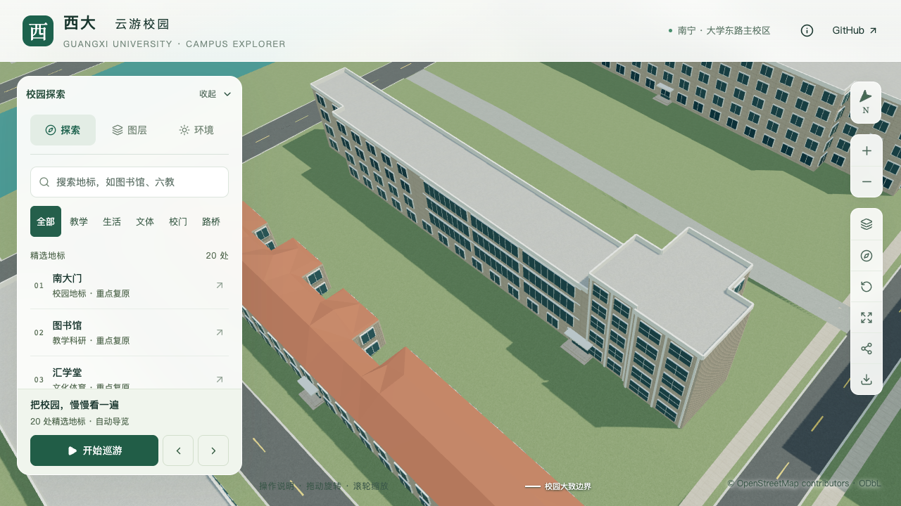
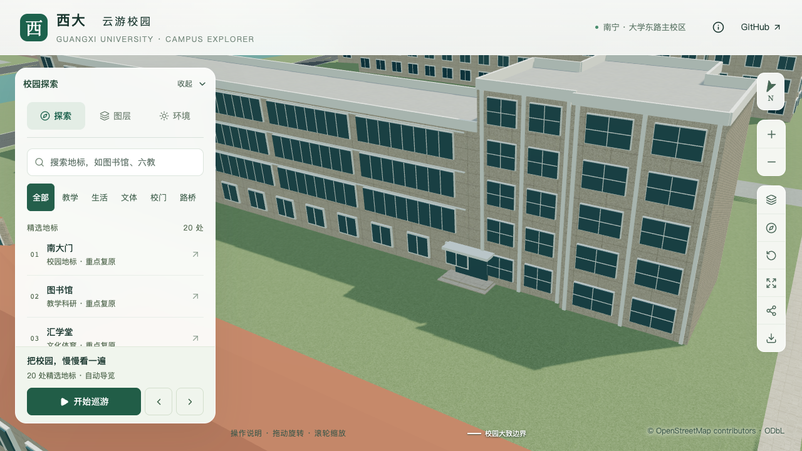
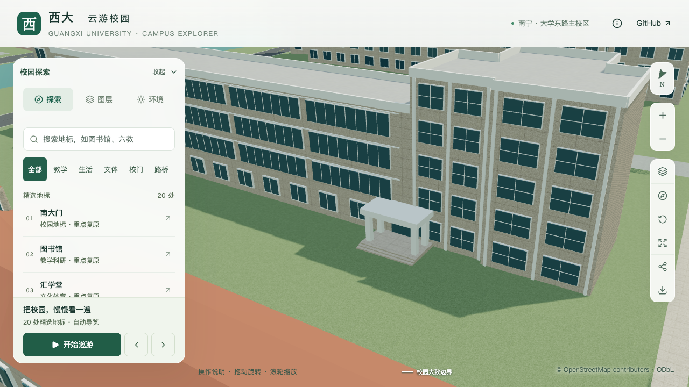

# 数学学院：分段体量、入口与封闭窗廊

本批对象为地图中的数学与信息科学学院 `way/759129516`，位于 `chunk-n1-n3`。本次校准保留全部 OSM 外环，采用西端五层、较低主体四层的分段表达，将主入口从南侧最长边中点迁至西南凸部，并增加对侧次入口、封闭窗廊和西端实墙。属于部分校准，尚不计入 20–30 栋整栋验收数量。

## 资料与方位

- [学院 Environment](https://mi.gxu.edu.cn/ywbEnvironment.htm)第 1 张显示三窗凸部下的三开间主入口，第 3 张显示五层端部、较低封窗走廊及方柱雨棚，第 5 张显示楼梯花格与窗廊。第 4 张是另一栋广西数学研究中心，未套用于学院楼。
- [2022 年毕业生活动](https://mi.gxu.edu.cn/info/1004/4577.htm)的具名门口合影与 Environment 主入口一致。封窗和这套门面至少在 2022 年已存在，不能仅凭 2024 年装修结算简报推定其改造时间。
- [校方学院风采](https://www.gxu.edu.cn/info/1021/18799.htm)及项目册第 39 页展示历史开放走廊、五层端部和实墙。新版照片已封窗，因此本批保留实体墙背衬并增加玻璃表达，没有生成开放外廊。
- Esri World Imagery 的局部瓦片辅助核对长条楼、西南凸部及相邻红屋顶与地图位置。影像拍摄时间与屋顶位移未核实，未用于测高或网页纹理。20 级请求返回无影像占位图，排除。

主入口朝南是照片特征与西南凸部、影像和地图联合对应的推断；原先“主入口朝北”的研究假设已撤销。照片日期未知，不将它们称为 2026 年实景。原图只保存在本地工作目录，仓库记录链接、哈希和采用范围，见[取证索引](model-checks/refinement/s2-mathematics-evidence.json)。

## 已落地参数

| 项目 | 本批表达 | 依据边界 |
| --- | --- | --- |
| 西端高体量 | 五层、16.5 m | 五层有资料；3.3 m 层高为估算 |
| 较低主体 | 四层、13.2 m；分界 X = −265 m | 可见窗廊四层；分界与未完整拍到的东端连续表达仍为估算 |
| 主入口 | 外边 7 中点，宽 7.2 m，朝南 | 对应三窗西南凸部；锚点与宽度估算 |
| 次入口 | 外边 1 的 t = 0.13，门宽 3.2 m，四柱雨棚宽 6.4 m、深 3.2 m | 对应五层端部旁低雨棚；方柱、实心顶板及三级短台阶已生成，尺寸估算 |
| 西南上层窗列 | 二至五层三列窗 | 数量来自照片；窗高、窗宽和分格估算 |
| 西端墙 | 外边 10 关闭通用窗户 | 历史端墙照片与方位推断 |
| 南北窗廊 | 较低体量二至四层局部连续窗组 | 封窗有照片；具体组段、窗梃、挑檐尺寸估算 |
| 西南台阶与铺地 | 三道踢面，顶面 +0.45 m、基底 +0.06 m、总宽 8.4 m；约 91.57 m² 铺地接至南侧道路 | 三道台阶来自照片；尺寸及连接范围估算，见[南门连接](MATHEMATICS_SOUTH_ENTRY.md) |

初次生成的西南外一级平台局部埋地约 4.6 cm，见[修改前地形采样](model-checks/refinement/s2-mathematics-ground-observation.json)。随后采用明确的 `landingHeight`，抬高门面、雨棚和平台，并将平台做成向下延伸的实体。该历史批次尚缺铺地连接；后续已补充北门雨棚及转折步道，以及南门三道台阶及直向道路连接。

## 生成器调整

`facadeRules.part` 可将一条 OSM 外边上的规则限定到某个已存在的体量分段。窗组的归一化位置相对于该分段与原边的交段计算，窗层数采用分段层数。未知分段、没有接触目标外边、交段不连续、同一边混用整体和分段规则都会报错。

数学学院微斜外边的切分点存在浮点误差，精确求交曾只返回端点。解析器仅在没有有效线段时，恢复端点距原边不超过 0.1 微米的重合边界区间；不扩大分段面积、不移动原轮廓，也不替换已有有效求交。数据测试覆盖实际斜边、旋转分段、边界覆盖、无重叠及失效锚点。

`entrances.landingHeight` 用于简化入口的平台顶面，范围为 0.2–1.2 m；默认生成两级实心平台。后续新增 `stairFlight` 显式指定台阶数量、宽度、踏面和基底；不能与内退入口或独立门廊混用。基础和近景共享同一台阶形体。其他楼栋沿用原规则。

## 验收与剩余工作

实际源文件和 GLB 专项检查覆盖两个体量高度、南北封窗及背后实墙、西端无窗墙、两处入口和旧入口移除，并采样平台左右及中央与实际地形的关系。完整建筑回归、资产保留、空派生目录准备、固定镜头与性能记录见[本批汇总](model-checks/refinement/s2-mathematics-summary.json)。早期平台版本的图片和报告保留为历史，不能替代最终资产验收。

上一批 87 项数据测试、430 栋实际几何回归、九张原图和资源预算检查通过。精细/流畅三次活动 FPS 分别为 60/60/59、29/28/28，数值门槛通过；27 次 CPU 快照捕捉到约 91 秒并发 Blender 负载，因此该批同条件性能及联合验收未通过。性能范围为既定图书馆活动镜头，局部截图不视为数学学院独立性能压测或手机真机结果。后续门面与窗列批次见下节。

仍需核对东端全貌与最终高度分界、花格下方门厅及其他主要立面。主入口三开间、北侧五层端部四列窗、北门四柱雨棚与短台阶、[北门至西侧人行道连接](MATHEMATICS_NORTH_CONNECTION.md)、[南门三道台阶与道路连接](MATHEMATICS_SOUTH_ENTRY.md)，以及[竖向玻璃和三层花格](MATHEMATICS_FACADE_PANELS.md)已在后续批次实现。尺寸继续区分资料确认与估算。上述缺口完成前，本楼保留“部分实现”，不以几何通过代替整栋真实性验收。

## 最终固定镜头

下图关闭植被以检查建筑，采用同一前端、镜头和视口。历史资产来自冻结目录；当前图对应平台修正后的完整资产。另有植被开启、夜景和手机尺寸记录，九张原图均在[画面核对记录](model-checks/refinement/s2-mathematics-visual-review.json)中登记。

| 修改前 | 修改后 |
| --- | --- |
|  |  |
|  |  |

## 后续校准：主门三开间与北侧四列窗（2026-09-13）

[2024 年校友活动](https://mi.gxu.edu.cn/info/1004/5595.htm)的门前合影支持三开间、两根中柱与两根外柱。本批在原入口锚点和平台上增加四根石材门柱、连续门楣及三个独立玻璃门洞，移除门柱背后的玻璃。门柱宽 0.55 m、深 1.2 m、入口总宽 7.2 m 为照片约束下的估算，不代表实测。

Environment 北侧照片支持五层端部四列窗，现按微错位的外边 1 和 11 各布置两列，窗高、宽度、窗距和分格仍为估算。[校方英文学院页](https://www.gxu.edu.cn/en/info/1152/1702.htm)的照片提供相同端部和低窗廊的另一份参考，远端仍被树遮挡，未据此确认东端全部层数。来源与采用范围见[本批取证记录](model-checks/refinement/s2-mathematics-portal-evidence.json)。

`doorFrame` 与平台共用入口坐标，基础和近景都生成三开间主体；近景普通窗避开门洞。实际源文件、基础 GLB 和近景 GLB 检查玻璃宽度、四柱、门楣、无柱后玻璃及北侧五层窗列，继续覆盖既有高度、封窗、实墙和平台贴地。

七张桌面、夜景、植被及手机尺寸原图均已核看，见[画面记录](model-checks/refinement/s2-mathematics-portal-visual-review.json)。主门镜头用于检查门面，楼顶局部超出画幅；北侧整体镜头补充体量关系。完整批次结果见[汇总](model-checks/refinement/s2-mathematics-portal-summary.json)。本楼仍为部分校准。

89 项数据测试、430 栋普通建筑实际几何回归、3,061 株树木检查、空派生目录准备与 Pages 构建通过。首屏模型 5,908,320 bytes，比上一批增加 1,256 bytes。三次精细 FPS 为 50/57/59，流畅为 28/28/28，数值门槛通过；27 次 CPU 快照记录到其他 Python/Blender 重任务，因此本批同条件性能和联合验收仍未通过，未重复测量。

| 修改前 | 本批修改后 |
| --- | --- |
|  |  |
|  |  |

## 后续校准：北门方柱雨棚与短台阶（2026-09-13）

Environment 第 3 张显示北门四根方柱、实心平雨棚及门前短台阶。本批复用 `attachedPortico`，将原薄雨棚和小平台替换为宽 6.4 m、深 3.2 m 的四柱入口空间，平台 +0.36 m、板底 +3.4 m、板厚 0.6 m，前缘三级踏步各高 0.12 m、宽 0.3 m；这些尺寸为估算。雨棚没有镂空栏板，金色包边与板面接缝暂为简化表达。见[取证范围](model-checks/refinement/s2-mathematics-north-evidence.json)。

解析器允许外挑雨棚跨越实心高低体量，逐一检查接触部分的高度，拒绝低于雨棚顶的局部体量及开放底层；外挑占地纳入最终植被和低矮景观上下文。原林学院带栏板门廊配置保持。台阶构建前采样和源文件/实际两级检查均使用真实地形：最外一级高出地面约 12–14 cm，实体底部接入地面。平台及每级台阶左右和中央均检查表面宽度、贴地及底部悬浮。

92 项数据测试、430 栋普通建筑实际几何、3,061 株树木回归、空派生目录准备和 Pages 构建通过；旧模型在新四柱射线检查中按预期失败。除数学学院源对象、所在基础节点及近景区块外，其余 523 个非树木源对象、83 个基础节点和 67 个 GLB 不变。69 个资产与生产包一致，首屏模型 5,909,140 bytes，增加 820 bytes。

七张原图覆盖近景前后、整体前后、植被、夜景与手机尺寸，见[画面记录](model-checks/refinement/s2-mathematics-north-visual-review.json)。本批最终性能、资产哈希及剩余范围见[汇总](model-checks/refinement/s2-mathematics-north-summary.json)。该批尚未完成入口前铺地与道路连接；北门连接见下方后续记录，本楼继续部分实现。

三次精细活动 FPS 为 60/57/47，流畅为 28/28/28，帧率和几何成本数值门槛通过。27 次进程快照中记录到一次 CPU 97.9% 的外部 Python 任务，因此同条件性能和本批联合验收仍未通过；未将数值通过解释为无干扰测量，也未重复测量。

| 修改前 | 本批修改后 |
| --- | --- |
|  |  |

## 后续校准：北门至西侧人行道（2026-09-13）

新增约 103.74 m² 的转折铺地，将北门三级短台阶接至崇文路东侧的映射人行道。3.6 m 宽度、2.3 m 前出和边界为资料约束估算；建筑形体、原道路边界与树位保持。导出初版出现人行道裂缝，补齐裁切后的共边分段后，源模型与实际 GLB 的入口、铺面、地形和接口检查通过。完整数据、失败修复记录、画面与验收范围见[北门场地连接](MATHEMATICS_NORTH_CONNECTION.md)。

## 后续校准：南门三道台阶与道路连接（2026-09-13）

按具名照片将两级简化平台改为三道踢面，宽 8.4 m、各高 0.13 m、顶面 +0.45 m，尺寸为估算；约 91.57 m² 直向铺地接至映射服务道路。初版最低踏步露出不足与道路接触纹理拉伸已修正，实际源/GLB、九张最终画面及南北入口回归通过。101 项数据测试通过，完整准备恢复一株已不与校准后低体量相交的示意树，其余 3,061 株保留。

首屏模型 5,999,548 bytes，仅余 452 bytes 预算。精细三次均为 60 FPS，流畅均为 28 FPS，数值达标；测量期间有其他 Python 高负载，同条件性能仍待验收。参数、等价性证明、截图与剩余范围见[南门台阶及场地记录](MATHEMATICS_SOUTH_ENTRY.md)。本楼继续部分校准。
