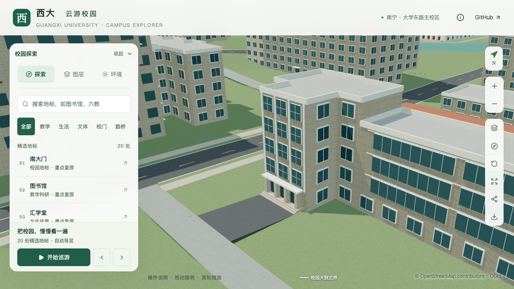
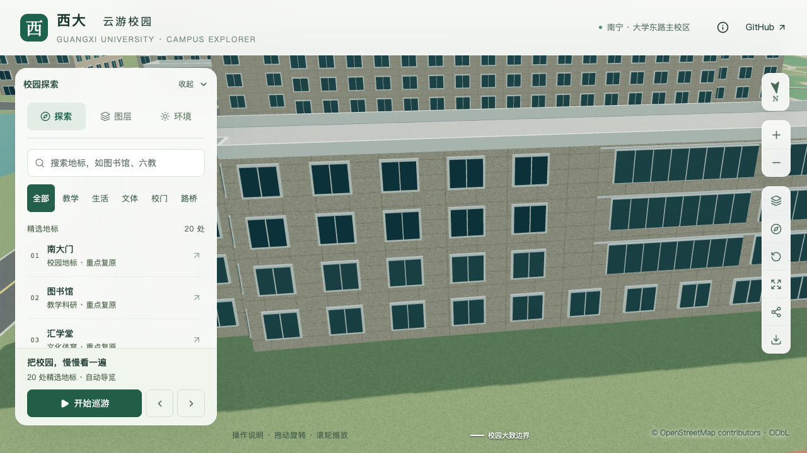

# 数学学院：竖向玻璃与北侧楼梯花格

对象为数学与信息科学学院 `way/759129516`，所在区块 `chunk-n1-n3`。本批补充南门凸部东侧的连续玻璃，以及北侧低体量上的三层花格和两侧窗。楼体轮廓、高低分段、南北入口与既有道路连接保持；东端全貌和高度分界仍待核对，本楼继续作为部分校准记录。

## 资料与估算边界

[学院 Environment](https://mi.gxu.edu.cn/ywbEnvironment.htm)第 1 张显示主入口三窗凸部旁的竖向玻璃连接面，第 3、5 张显示北侧长窗组另一端的楼梯花格。第 5 张可见三层白色花格和侧窗，花格背后较暗。照片拍摄日期未知，不能作为 2026 年现状测绘。

玻璃面对应原轮廓第 6 边（西南凸部的东向侧面）；花格对应第 1 边的 `lower-east` 分段。前者依据凸部与主门位置对应，后者依据北侧长窗组与五层端部的相对关系定位。北侧纵向位置尚无测量尺寸，采用约 72% 位置作为明确标注的估算。[取证记录](model-checks/refinement/s2-mathematics-panels-evidence.json)保存本地原图哈希与采用范围；原图未用于网页贴图。

| 构件 | 本批参数 | 依据与限制 |
| --- | --- | --- |
| 南侧玻璃连接面 | 第 6 边局部 0.08–0.92，宽约 5.08 m；标高 +3.40 至 +16.15 m；3 列、8 行 | 连续玻璃有照片；具体跨度、分格和高度界限估算 |
| 北侧三层花格 | 低体量北边局部 0.705–0.736，宽约 1.80 m、高 2.10 m | 三层叠置有照片；具体定位、尺寸及 3×4 八角纹样为简化估算 |
| 花格侧窗 | 两侧分别使用 0.660–0.691、0.750–0.781；与花格同高，每窗 2×2 分格 | 两侧窗有照片；窗宽、间距、分格估算 |
| 北侧面板标高 | +4.098–6.198、+7.398–9.498、+10.698–12.798 m | 沿既有 3.3 m 估算层高对齐；不是实测标高 |

花格以白色浅构件、八角孔隙和暗色背板表达。保留原实体墙，未重建内部楼梯，也不声称穿透整栋墙体。原照片中的精细花形连接纹样有所简化。花格下方门厅、东端完整立面和不可见部分继续待取证。

## 数据与生成

`facadeRules.panels` 为上层实心外立面提供有界面板。每个面板记录 ID、类型、局部起止位置、底/顶标高、列/行数、框宽和深度。框线包含在面板外矩形内，分段位置相对于解析后的局部立面计算。

解析器拒绝越界、重复 ID、重叠、无可用孔隙的分格、开放底层、内院面、阳台、窗列与开放走廊冲突；与封闭窗带同处一边时，额外检查窗框及挑檐范围。首版仅支持底部不低于 +3.2 m 的上层构件，不接管地面入口。

基础与近景共用面板几何，编辑源保留 `05_立面专项` 顶点组。只移除与面板矩形相交的通用窗及其近景外框，其余窗带、实体墙和入口沿用原规则。花格共用相邻八角形的直边，避免重复生成同一根杆件。

## 检查范围

- 数据测试覆盖非法数值、越界、分格过密、重叠和冲突规则。
- 几何小样检查两个细节级别及 0°、90°、31.14° 旋转后的孔隙、背板、框深与默认窗避让。
- 实际源文件、基础 GLB 和近景 GLB 检查每个单元孔隙及外框，继续覆盖原体量、封窗、实墙、两处入口与平台贴地。
- 固定镜头覆盖东南玻璃连接面、北侧花格、北侧整体及植被、夜景、手机尺寸。

104 项数据测试通过；调整冲突校验顺序后，36 项覆盖解析器测试再次通过。首次全量测试与数据准备并行，读到中间状态而失败，该次记录作废并保留；最终测试在准备完成后执行。旋转小样、430 栋实际普通建筑以及 3,062 株源/运行树木网格检查通过。旧资产在新增面板检查中按预期失败。

只改变数学学院源对象、基础模型中的 `chunk-n1-n3` 节点及同名近景文件；其他 525 个非树木源对象、85 个基础节点、67 个 GLB、全部原始轮廓及树位保持。69 个资源与生产包一致。首屏模型 4,847,648 bytes，比上一批增加 14,056 bytes；最大普通区块 1,684,868 bytes，均在预算内。

十张原图已逐张核看。桌面图使用近景，两张手机尺寸图使用基础模型：竖向玻璃和三层花格都保留；植被图中的树冠遮挡部分侧窗，未为截图修改既有树位。夜景沿用项目的玻璃发光表达，不作照明实测。最终性能状态见[本批汇总](model-checks/refinement/s2-mathematics-panels-summary.json)。几何检查通过不等于估算尺寸已得到实测确认，也不计为整栋验收通过。

活动测量无浏览器错误，精细三次 55/53/56 FPS、流畅 28/28/27 FPS；相对 S0，中位帧率分别下降 8.33%/6.67%，三角形增加 2.16%/5.14%，Draw Calls 增加 0.37%/2.99%，数值门槛通过。27 次进程快照记录到其他 Python/Blender 重任务，其中一组 Blender 负载持续观测约 100.6 秒；**同条件性能及本批联合验收仍待完成**。测量仅覆盖固定图书馆活动镜头，不扩大为数学学院独立压测或手机真机结果。

## 固定镜头对照

| 修改前 | 修改后 |
| --- | --- |
|  |  |
|  |  |

[完整画面记录](model-checks/refinement/s2-mathematics-panels-visual-review.json) · [实际源文件与 GLB](model-checks/refinement/s2-mathematics-panels-geometry.json) · [资产保留和预算](model-checks/refinement/s2-mathematics-panels-assets.json)。
