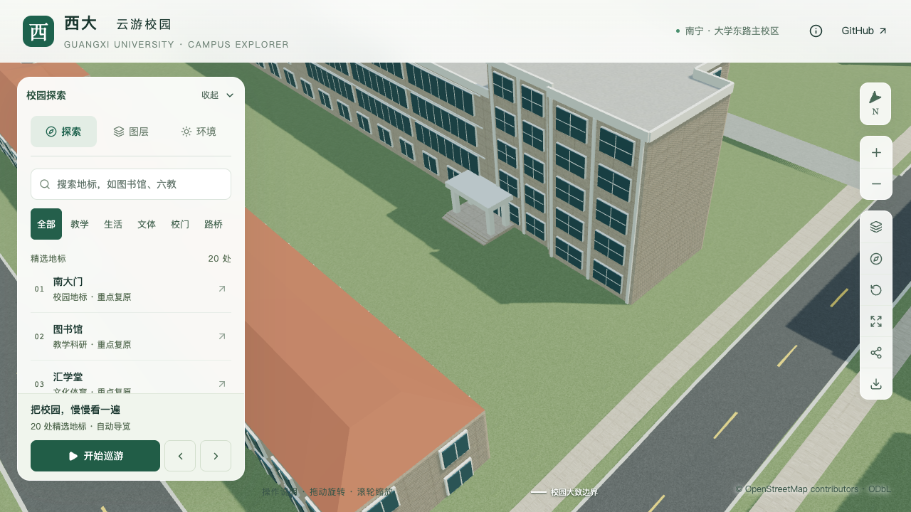
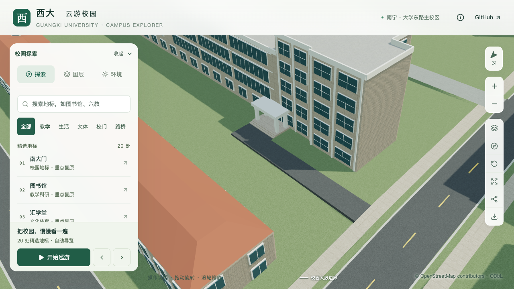

# 数学学院北门至西侧人行道连接

对象为数学与信息科学学院 `way/759129516` 的北侧次入口，以及崇文路东侧映射人行道 `way/842784673`。本批为既有四柱雨棚和短台阶补充向西转折的连接铺地，范围约 103.74 m²；原建筑轮廓、人行道边界、树位及地标保持。

## 来源与范围

[学院 Environment](https://mi.gxu.edu.cn/ywbEnvironment.htm)第 3 张可见北门台阶前的硬质铺地；[校方英文学院页](https://www.gxu.edu.cn/en/info/1152/1702.htm)照片补充其与西端人行空间的关系。方位沿用楼栋、照片及地图的对应推断。照片日期未确认，不称为当前现场测绘；原图仅作本地造型参考。

本批仅建立从已校准台阶至映射人行道的通行连接。3.6 m 宽度、前出 2.3 m 后向西转折的范围属于照片和地图约束估算，不代表完整院落、车行道路或广场的真实边界。没有补入未定位的花坛、树、停车位、栏杆或无障碍设施。

北门正前方的第五教学楼阻止了简单向北延伸至校道的方案。连接采用明确的入口 ID 和人行道 ID，左右边界与选定人行道逐断面相交，并检查与建筑、既有门廊、运动场和水体不重叠。

## 数据与模型

配置保存于 `data/site-overrides.json` 的 `mathematics-north-connection`。`scripts/side_connection_data.py` 解析 `side-connection` 类型，保留原轮廓并验证入口、目标人行道摘要、资料来源、搜索范围和碰撞。普通入口与图书馆既有场地共享准备流程；多个场地的整地范围必须互不相交。

`blender/side_connection.py` 从实际人行道网格采样接口平面，采用北门台阶基底作为另一端标高，生成转折铺地和侧面收口。最低踏步与连接铺地之间保留约 0.12 m 高差。铺地下方地形沿实际铺面三角形裁切并下调，范围外仍保持原地形平面，不更换 DEM。

人行道接触带以原三角面作为独立小范围组件导出，保留标高与材质；周边埋入过渡带处理独立压缩的边界。裁切后相邻长短边统一分段，避免 Draco 量化将原本共线的边分开。连接常驻基础模型并跟随道路图层，不受普通楼近景替换影响。

## 修复记录与证据

初版源几何在 405 个铺面采样和 1,355 个范围外地形采样中通过，但实际 GLB 的保留人行道部分出现压缩缝隙。同位置旧资产采样没有缺口，新资产在 5 mm 间隔的两个采样点缺失，见[缝隙定位记录](model-checks/refinement/s3-mathematics-path-gap-observation.json)。该版本的几何报告和截图保留为历史，不用于最终验收。

修复采用既有的共边细分方法：对接触带涉及的原道路三角面及相邻保留边共享分段，保持原三角面平面。实际几何检查继续测量接触带两侧的缝隙上界和标高突变，没有通过放宽缺口限制来替代修复。

最终源模型和实际 GLB 均通过 405 个铺面采样、1,355 个范围外地形采样、五处台阶衔接及四组人行道接口检查。实际 GLB 的铺面最小离地余量约 11.5 cm，最低踏步高差约 11.87–11.93 cm；检测到的边界缝隙上界为 1 mm，人行道相邻 2 cm 采样间最大高差约 2.69 cm。范围外地形源模型最大误差约 0.023 mm、压缩模型约 6.59 mm，后者属于量化范围。见[实际几何检查](model-checks/refinement/s3-mathematics-path-geometry.json)。

96 项数据测试、两种坡地合成几何、空派生目录准备、图书馆场地、数学学院源文件/基础/近景和 3,061 株树木实际网格回归通过。新路径没有改变任何楼栋、原建筑轮廓或树位；524 个旧非树木源对象中仅地形和道路变化，新增一个场地对象。导出只改变 `base.glb`，保留其余 68 个 GLB 与原基础模型中的 82 个节点。69 个资源与生产包匹配，首屏模型 5,973,800 bytes，比连接前增加 64,660 bytes，距离 6 MB 预算尚余 26,200 bytes。

增量维护在两个隔离副本中分别运行道路、篮球场更新，从不含连接的旧源文件恢复场地对象及 `siteId`/道路图层属性。修复同步遗漏后，实际源文件与基础模型接口均通过。首次道路更新还暴露保留雕塑几何后的未引用缓冲占用；清理后两流程的首屏资源均为 5,973,696 bytes，85 个基础节点压缩几何不变。差异为导出容器开销；这些隔离资产没有覆盖正式产物。见[增量验证](model-checks/refinement/s3-mathematics-path-incremental-summary.json)。

七张最终原图已逐张核对，覆盖前后入口、前后人行道接口、植被开启、夜景和手机尺寸。初版裂缝图片保留为失败历史，最终记录见[画面核对](model-checks/refinement/s3-mathematics-path-visual-review.json)。植被镜头中该处没有可见树木，不能据此证明全校树位正确；手机图为桌面视口模拟。

| 连接前 | 连接后 |
| --- | --- |
|  |  |

当前资产三次精细测量为 60/60/58 FPS，流畅为 27/28/30 FPS，数值门槛通过；27 次 CPU 快照捕捉到其他 Python 重任务，因此同条件性能和本批联合验收尚未通过。没有浏览器错误，性能仅覆盖固定图书馆活动镜头，不代表本楼局部或手机真机实测。未在相同干扰条件下反复测量。

本批最终资产哈希、性能结果和验收状态见[汇总](model-checks/refinement/s3-mathematics-path-summary.json)。数学学院东端全貌与最终高度分界、楼梯花格和竖向玻璃、南侧真实台阶及南门连接仍未完成；北门连接本身不能替代整栋验收。
