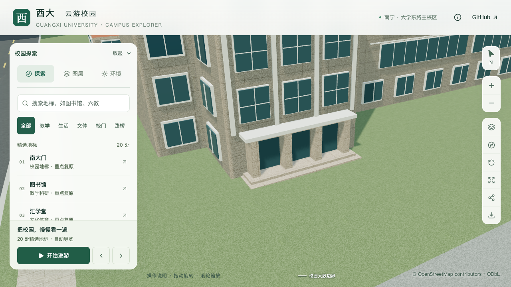
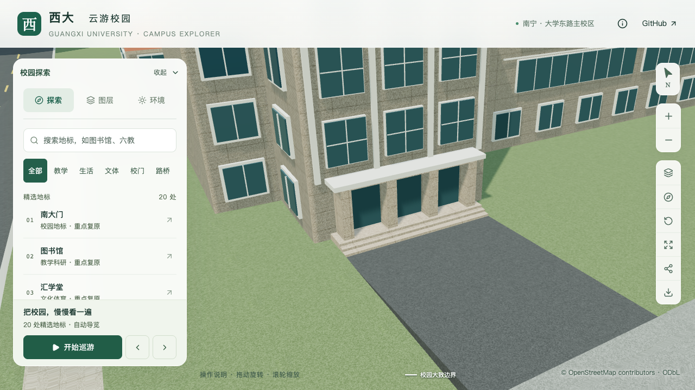
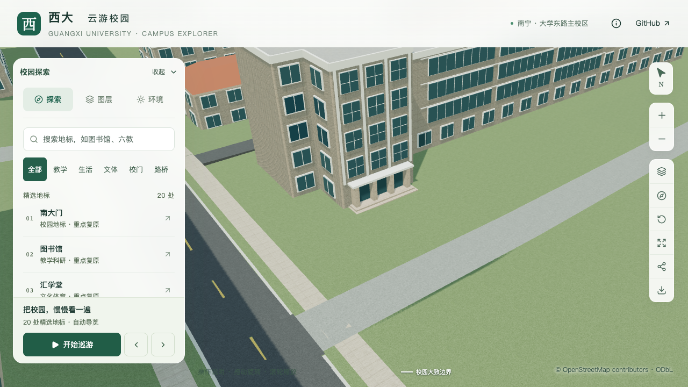
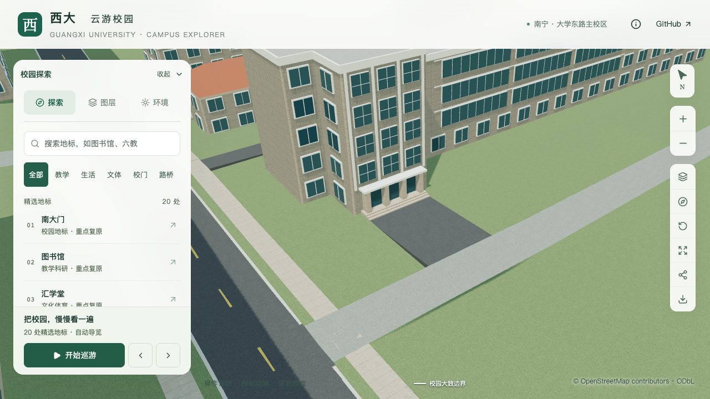

# 数学学院南门：三道台阶与道路连接

本批对象是数学与信息科学学院 `way/759129516` 的西南主入口，以及南侧映射服务道路 `way/686131235`。原两级简化平台改为三道前向台阶，新增约 91.57 m² 的连接铺地，形成道路至门口的连续空间。整栋仍为部分校准。

后续[导出属性优化](EXPORT_ATTRIBUTE_BUDGET.md)已在保留本批形体和材质的情况下，将首屏模型降至 4,833,592 bytes。下文模型哈希、体积与性能描述保留南门批次当时的验收快照。

## 依据与估算

[学院 Environment](https://mi.gxu.edu.cn/ywbEnvironment.htm)第 1 张及[2024 年具名活动照片](https://mi.gxu.edu.cn/info/1004/5595.htm)显示三道前向台阶、三开间门面和门前硬质铺地。南侧方位沿用西南凸部、照片及地图的对应；道路端由映射轮廓定位。照片日期未完全确认，不称为当前测绘，原图仅作本地参考。

| 参数 | 采用值 | 依据边界 |
| --- | --- | --- |
| 前向踢面数量 | 3 道 | 可见台阶数量 |
| 平台顶面 | 楼栋基准 +0.45 m | 照片约束估算 |
| 台阶基底 | 楼栋基准 +0.06 m | 结合原地形采样修正 |
| 每道踢面 | 0.13 m | 由采用的平台与基底高差分配 |
| 台阶总宽 | 8.4 m | 照片和已有门面约束估算 |
| 平台深度 | 1.2 m | 覆盖既有门柱底部，尺寸估算 |
| 两处下级踏面 | 各 0.32 m | 尺寸估算；平台至最前缘共 1.84 m |
| 连接铺地 | 91.566 m² | 从台阶全宽接至原道路边界，不代表完整院落范围 |

没有按照片中的相对位置增种棕榈，也未补造花坛、停车位或无障碍设施。来源和采用范围见[取证记录](model-checks/refinement/s3-mathematics-south-evidence.json)。

## 数据与生成

`entrances.stairFlight` 记录宽度、平台深度、踢面数量、踏面宽度及基底标高，必须与 `landingHeight` 配合。解析器检查有限尺寸、踢面高度、完整门面支承、外边附着、旋转及楼体冲突。基础与近景共享同一台阶，门面和雨棚随平台同步抬升。外挑占地进入最终植被排除和低矮景观上下文。

`front-connection` 以稳定入口和道路 ID、轮廓与铺面摘要约束前向连接。它复用北门连接的实际路面采样、局部地形裁切及侧边收口；目标限定为平面层级的步道或服务道路，拒绝桥隧和失效锚点。南北连接分别保留各自的局部坐标与搜索方向。

本批普通建筑形体变化需要完整构建；道路或篮球场增量更新沿用上一批已验证的场地同步流程，不能用它们代替普通建筑源文件和近景的重建。

## 修正与验证

初版采用零基底时，最低踏步右侧仅高出旧地形约 3.93 mm。将基底改为 +0.06 m 后保持平台高度，改善最低踏步露出。该[前置采样](model-checks/refinement/s3-mathematics-south-ground-preflight.json)保留为未通过记录；初次生成的变量命名冲突也在全量导出前修复，随后全部 430 栋生成检查通过。

实际几何检查覆盖台阶三级顶面、左右宽度、门面、雨棚和地面关系；南侧连接在源模型/基础 GLB 各采样 367 个铺面点和 913 个范围外地形点，并核对五处最低踢面及五组道路断面。北门连接和图书馆场地另行回归，不以南侧检查代替。

初版接口有一张三角面因法线选择了另一投影方向，产生可见纹理拉伸。[定位记录](model-checks/refinement/s3-mathematics-south-road-uv-observation.json)显示修改前没有错误投影、初版出现一处。道路接触带现明确沿用世界 XY 平面纹理，埋入接缝也保持原路面纹理坐标。未标记的竖直侧面继续按正常方向投影。

完整准备得到 3,122 株候选；最终模型保留 3,062 株，比上一批恢复一株 `[-229.9, -861.4]` 的固定候选，其余 3,061 株属性不变。实际旧五层模型与该树相交，已校准低体量及本批模型均不相交，见[三版本比较](model-checks/refinement/s3-mathematics-south-restored-tree.json)。这是完整准备对现有候选重新筛选的结果，不是新增现场树位资料。

101 项 Python 数据测试、四种连接合成几何、道路纹理投影回归、空派生目录准备及 Pages 构建通过。纹理修复前已完成 430 栋普通建筑和 3,062 株树对实际源建筑/运行建筑网格的检查；这些报告保留原哈希。[等价性证明](model-checks/refinement/s3-mathematics-south-uv-preservation.json)确认后续仅改变南侧接触带 UV，所有源几何、材质、树木属性及对应压缩建筑/树资源不变，因而复用这些检查。最终版本另行实测南北连接和道路接触带 UV，不能将复用写成重新运行。

九张最终原图已逐张核看，确认三级台阶、连接铺地和接口纹理修复；夜景与手机尺寸保留连接。首屏模型 5,999,548 bytes，比本批之前增加 25,748 bytes，距 6 MB 上限仅剩 452 bytes；最大普通近景区块 1,684,868 bytes。69 个模型与生产包一致，其余 67 个 GLB 及 82 个旧基础节点保持；原建筑轮廓均未移动。

三次精细活动测量均为 60 FPS，流畅均为 28 FPS。相对 S0，帧率中位数持平/下降 6.67%，三角形增加 2.04%/4.87%，Draw Calls 增加 1.86%/2.61%，数值门槛通过。但 26 次 CPU 快照记录到其他 Python 重任务，**同条件性能与本批联合验收尚未通过**。浏览器无错误；性能范围为固定图书馆活动镜头，不是本楼局部或手机真机压测。

当前资产、检查范围、纹理修复前后等价性、九张最终画面与性能结论见[本批汇总](model-checks/refinement/s3-mathematics-south-summary.json)。尺寸和铺地范围仍属估算；东端全貌、高度分界、楼梯花格、竖向玻璃及其他主要立面的核对尚未完成，未增加整栋验收数量。

| 修改前 | 修改后 |
| --- | --- |
|  |  |
|  |  |
