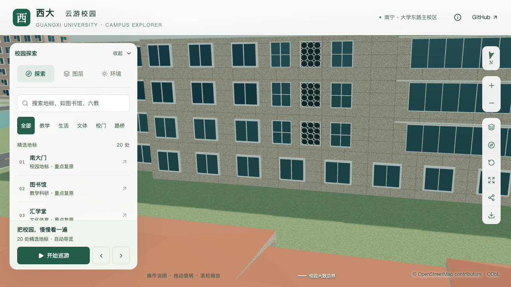
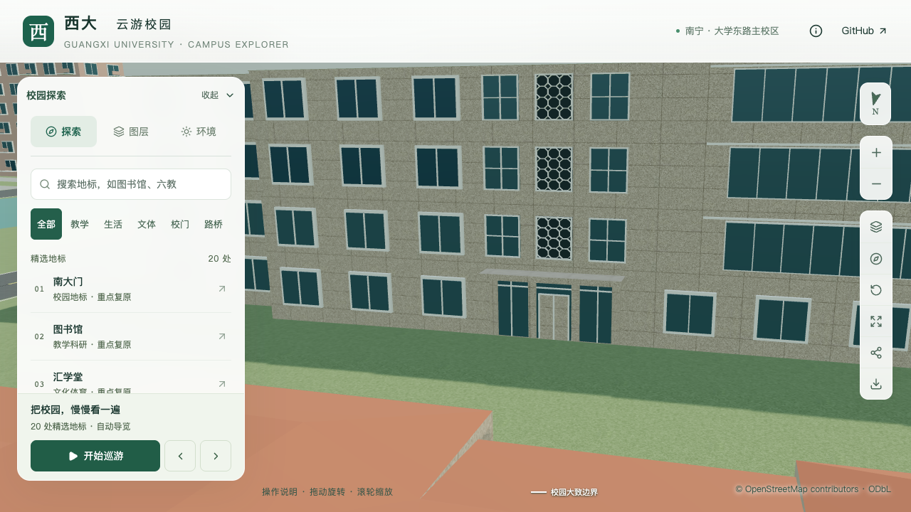

# 数学学院：花格下方门厅与整栋复核

2026-09-30，`way/759129516`。补充北侧三层花格下方的中央实门、两侧玻璃及连续平雨棚，替换该位置原有通用窗；基础与近景同步。数学学院仍为部分校准，东端全貌、高低分界和新增门厅的门前接路未完成，不增加整栋通过数量。

## 依据与位置推断

重新直接核看[学院 Environment](https://mi.gxu.edu.cn/ywbEnvironment.htm)第1、3、5张外景及第2张室内照片。第5张可见花格下方中央不透明双扇门、侧面玻璃和连续平雨棚；第1、3张用于复核既有南门和北侧西端入口。第2张不能定位外墙，排除。它们都是已保存资料，本轮不计新增照片，也不以网页仍在线证明2026年外观未变。照片拍摄日期未知，原图仅留本地参考。

此前门厅因缺精确锚点而未表达。本轮采用可从同一张照片判断的**门与花格共轴关系**，复用已落模花格的估算轴线，而非声称补得绝对定位资料。低体量北墙的局部中心比例为0.7205，换算原外环第1边为0.754062731，中心约`[-223.129, -868.110]`米。若后续资料修正花格位置，门厅也应同步调整。

| 内容 | 当前表达 | 证据边界 |
| --- | --- | --- |
| 中央门 | 1.5米宽、2.3米高双扇实门 | 不透明门扇及中缝可见；具体尺寸、门饰和材质简化估算，复用石色材质，不称为石门 |
| 门厅玻璃及墙柱 | 总宽6.6米、三开间；两侧玻璃及门上亮窗 | 门、侧窗和柱墙关系可见；分格、柱宽0.4米、深0.22米均估算 |
| 雨棚 | 宽7.0米、出挑1.2米、板底3.15米、厚0.3米 | 连续平雨棚可见；尺寸及檐边细节估算 |
| 门槛 | 采用楼底以上0.03米 | 不是实测；只检查实际模型门前局部地形，未补造遮挡处台阶、花坛或道路 |

建筑实体墙背衬保留，不建室内通道。门厅与北侧西端四柱入口是两个不同位置；原南门、北侧西端入口及其接路保持。

## 生成及验证

`flushEntrance.opaqueDoor` 显式控制实门，默认玻璃门行为保持；实门区域没有重复叠放玻璃。入口冲突判断区分同一地图边上的不同体量区间，并允许与水平范围不重叠的封窗带共存；窗带检查含近景外框的6厘米余量，重叠仍拒绝。

当前源文件、基础GLB、近景GLB各34处新门厅检查通过，覆盖实门、侧窗/亮窗、墙柱、雨棚顶面/底面与朝向；旧模型在同一实门检查中失败。门轴与花格轴数值一致，每个表示另查门前3点，门槛高出当前地形约6.3–6.6厘米。这是模型局部净空，不是现实可达路线证明。

既有形体、窗廊、花格和南北门各411条检查通过；整栋源/基础各311点无超过原0.3米诊断容差的地形或普通道路侵入，最高地形仍高于采用楼底约0.177米，不宣称全楼贴平。南北接路重新检查，建筑与树木净空通过。对应报告统一由[最终汇总](model-checks/refinement/s2-mathematics-lobby-summary.json)索引。

仅数学学院源对象、基础模型的`chunk-n1-n3`节点及同名近景GLB更新。其余534个非树对象、3,062株树、96个基础节点与67个GLB保持。地形、道路、原建筑轮廓保持；场地派生文件只更新入口依据文本和依赖摘要。采用已冻结最终数据的增量重建，未把全量数据准备产生的未分块、候选树中间状态发布为模型数据。

299项Python、70项Node、类型检查、lint和Pages构建通过。15张当前/历史对照画面均已直接核看：门厅近景、南北旧入口、北侧整体、东端和屋顶，以及树图层、夜景与手机尺寸。树冠遮挡花格门厅的整体图仅作环境上下文；手机是桌面视口模拟。东端截图展示当前估算形体，不能补足现实外观依据。

首屏模型5,994,692字节，比上批增加1,388字节，余5,308字节；最大普通近景1,684,868字节。同条件精细三次60/60/60 FPS、流畅30/30/30 FPS；相对原S0三角形增加5.86%/14.01%、绘制调用增加3.29%/12.55%，均通过原预算。三次LOD往返无错误，24次进程快照未记录到计时窗口内阈值以上的Python/Blender计算。快照间隔10秒、纳入阈值2% CPU，不宣称完全隔离；性能沿用固定图书馆活动镜头，不扩大为数学学院独立压测。

## 整栋核对结论与接续

| 领域 | 已有依据或实施 | 尚未确认 |
| --- | --- | --- |
| 层数与体量 | 西端五层、低体量四层的照片约束表达 | 东端完整层数、准确分界、实测高度 |
| 屋顶 | 照片可见平顶及高低关系 | 背部设备、完整屋面及实际坡度 |
| 入口 | 南门、北侧西端门及两条接路；新增花格共轴门厅 | 新门厅绝对位置和门前接路、其他不可见入口 |
| 主要立面 | 西端实墙、两面窗廊、三层花格、玻璃连接面及门厅 | 东端全貌、精确窗格和其他不可见部分 |

本楼继续部分校准；全项目仍为22个对象、2栋首轮通过、20个部分校准，S3必需六栋整栋通过数0。下一步定向核对数学学院东端与花格门前铺地；在这一资料范围完成有界核对后继续其他独立对象，不用截图或几何检查替代缺失的现实资料。土木待证项取得新定位资料后优先恢复，完整S0–S5目标保持。

| 修改前 | 修改后 |
| --- | --- |
|  |  |
