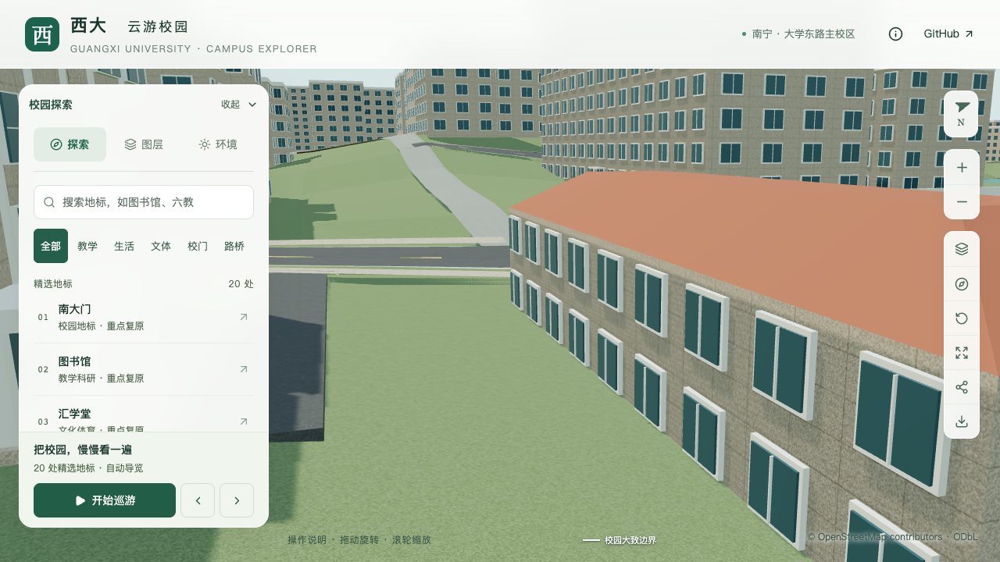
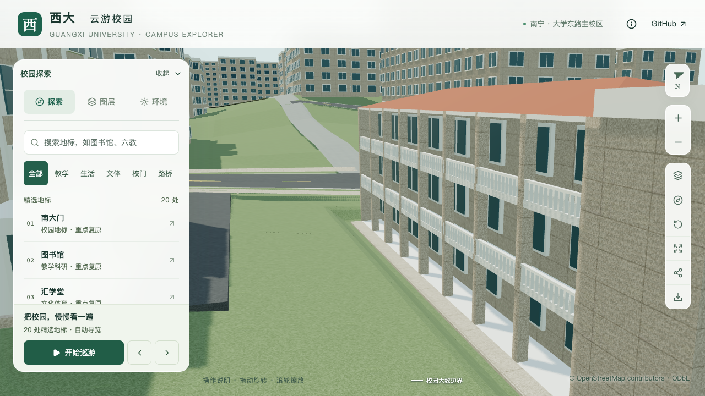
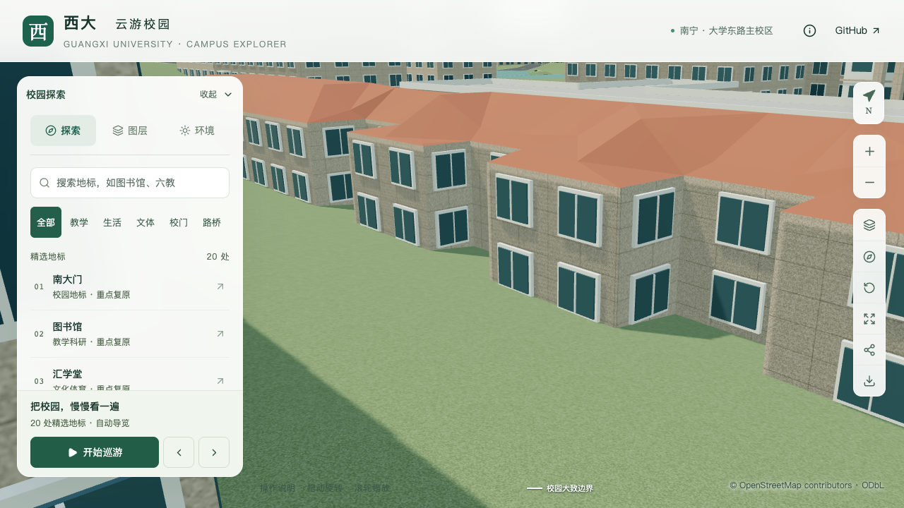

# 广西数学研究中心：体量、外廊与入口校准

2026-09-13，S2–S3 工作包。对象为 `way/759129515`，网页沿用地图名“第五教学楼”，人工校准记录注明广西数学研究中心。该楼位于数学学院北侧、莲湖西侧；身份对应来自官网具名位置图、相邻关系与南侧三凸部轮廓的交叉判断。

本页保留首批体量、入口和地面校准的参数及证据。后续已补充[东翼两处附着式上层外廊](MATH_CENTER_EAST_GALLERIES.md)，最新资产与验收结果见该批记录。

## 资料及采用范围

[中心官网简介](https://gxcmr.gxu.edu.cn/info/1003/2227.htm)明确区分西楼三层、东楼两层，并附两张具名外观照片。[官网位置图](https://gxcmr.gxu.edu.cn/info/1151/1177.htm)用于定位；其中西段“6F”与文字、照片存在冲突，因此未采用其层数标签。介绍记载改造于2021年底完成，页面发布日期和照片拍摄日期未知。

照片用于本地造型参考，不作为模型贴图分发。[取证索引](model-checks/refinement/s2-math-center-evidence.json)记录原始链接、文件哈希、支持字段和未确认项。数学学院调研报道的三张室内照片已排除，不能用它们确认数学学院东端。

## 本批参数

| 部位 | 修改前 | 当前表达与依据 |
| --- | --- | --- |
| 西侧主体 | 两层、6.6米 | 依据明确层数改为三层；主体9.9米采用3.3米估算层高 |
| 东侧主体 | 两层、6.6米 | 保留两层；与西段在原轮廓退台处约束分界 |
| 屋面 | 整体示意四坡顶 | 西外廊与东楼分别采用红瓦坡顶，起坡1.5/1.4米；标识墙单独采用平顶 |
| 西楼南面 | 实体墙与默认窗列 | 三层内退外廊；估算8开间、1.8米廊深，柱宽0.42米、深0.5米 |
| 白色栏杆 | 无 | 二、三层通透栏杆；0.9米高，以0.11米方条简化曲线石栏，底层保留开口 |
| 主入口 | 最长边中点的北向示意入口 | 东楼南侧中央凸部第7边；门宽4.4米，单开间，入口上方三扇竖窗 |
| 台阶 | 通用薄平台 | 两道踢面；顶高0.34米、基底0.04米、宽6.2米、踏深0.32米，尺寸均估算 |
| 入口短铺地 | 无 | 沿台阶宽度前出1.4米，约8.68平方米；周边两米内局部整地渐变 |
| 外廊地面 | 粗地形穿入底层 | 廊内清除侵入地形，廊前沿开口宽度补一米窄铺地；外侧两米渐变，尺寸为估算 |

西楼外廊东端约4.31米作为楼梯标识墙分段，东西分界、标识墙宽度、屋坡和立面尺寸均为照片及地图约束估算。原始建筑轮廓完整保留，基础与近景共用主要体量、外廊、栏杆和入口。

## 实现与检查

`parts.roof` 支持明确的分部屋顶，仍须由 `parts` 的资料说明约束。`openCorridor` 增加显式柱列和通透栏杆；底层开放必须配置柱位，不能直接移除底层墙。坡屋顶外廊另保留顶层板面，旧平顶外廊维持原有输出。

`entry-apron` 只表达有依据的入口短铺地。准备阶段检查来源、入口和轮廓版本、楼体及其他入口冲突；建模阶段按实际旧地形三角面降低侵入地形，并在局部边界接回原平面。附近没有直接可对应的映射道路，本批不把短铺地称为完整道路连接。

初版实际检查发现台阶被地形埋住；低角度画面又暴露底层外廊内约半米地形穿入。补充底层地形检查和 `gallery-apron`，清除廊内穿插并增加外侧一米窄铺地。对应失败报告及探测记录保留。最终使用完整构建同步楼栋高程、源文件与全部资产；资料准备后直接调用道路增量更新会缺少完整楼栋高程输出，因此未将该中间状态用于交付。另一次屋脊检查将偏离屋脊的点错误预期为最高点，已将采样位置改为映射西段中心，未放宽几何误差门槛。

110项数据测试与旋转小样通过；最终源文件、基础/近景实际模型通过西三东二、分部屋顶、柱廊、栏杆、三窗与台阶检查。廊前窄铺地约31.8513平方米。底层楼板与地形的基础模型最小余量约12.75厘米，外廊铺地约12.29厘米。范围外地形采样通过。

430栋普通建筑及3,062株树木的全量检查在外廊整地前通过；最终资产使用[非地形对象与资产等价性](model-checks/refinement/s2-math-center-gallery-preservation.json)承接该证据，两处新铺地另行与全部运行树木检查。它们不是对最终资产重新执行的一次全量校园检查。

最终69个模型与生产包一致，首屏模型5,009,668 bytes，比本批之前增加162,020 bytes，余量990,332 bytes；最大普通近景区块1,684,868 bytes。仅基础模型和本楼所在近景区块改变，其他67个GLB、84个旧基础节点、原建筑轮廓和树位保持。最终篮球场增量维护在隔离副本通过，保留88个基础节点；道路增量仅有外廊整地前的检查，未扩大称为最终道路维护验证。最终结果、性能及资源指纹见[批次汇总](model-checks/refinement/s2-math-center-summary.json)。

当前资产三次LOD往返及两档各三次30秒活动没有浏览器错误。精细60/60/29 FPS、流畅28/28/28 FPS，中位数相对S0分别持平/下降6.67%；三角形增加2.94%/6.52%，Draw Calls增加0.74%/8.58%，数值门槛通过。26次CPU快照发现其他Python重任务，**同条件性能和本批联合验收仍待完成**，未在相同干扰条件下重复测量。性能范围是固定图书馆活动镜头，不是本楼压力测试或手机真机结果。

## 最终画面对照

九张原图逐张核看，覆盖三组前后、植被、夜景和手机尺寸。近景确认柱廊楼板和台阶已露出地面；手机尺寸只验证上层外廊与主要形体，底层被前景屋顶遮挡。[逐图记录](model-checks/refinement/s2-math-center-grounded-visual-review.json)注明画面范围与限制。

| 外廊修改前 | 外廊修改后 |
| --- | --- |
|  |  |

| 南入口修改前 | 南入口修改后 |
| --- | --- |
|  |  |

## 尚未完成

该楼仍属于部分校准。东翼入口两侧的上层外廊已在后续批次实现；西/北立面、瓦屋面不可见端部、楼梯标识墙小孔和侧窗、真实门窗材质、底层精确窗列以及完整道路连接继续待核对。简化方条不等于精确石栏复原；默认窗列不代表已逐扇确认。

本批增加一条楼栋记录，累计12条部分记录；整栋验收数量不因此增加。20–30栋完整普通楼校准、图书馆必需邻楼和完整样板、S4剩余庭院/湖边及S5仍保持原范围。
