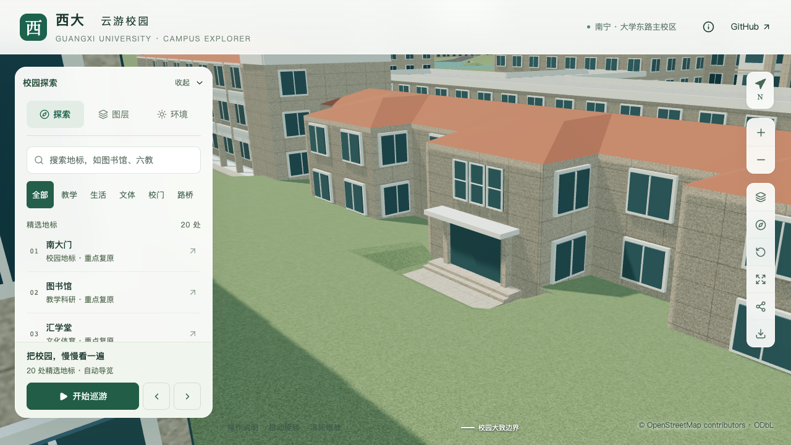
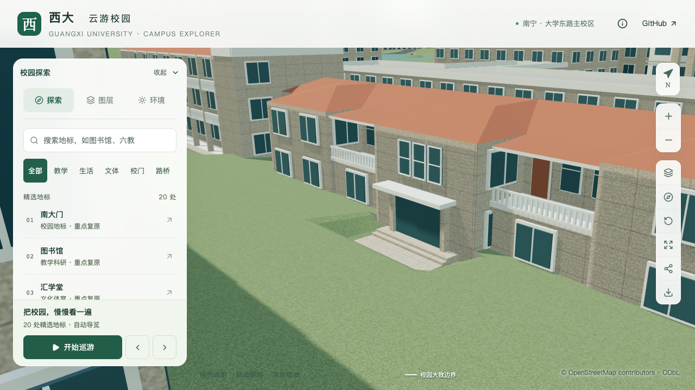
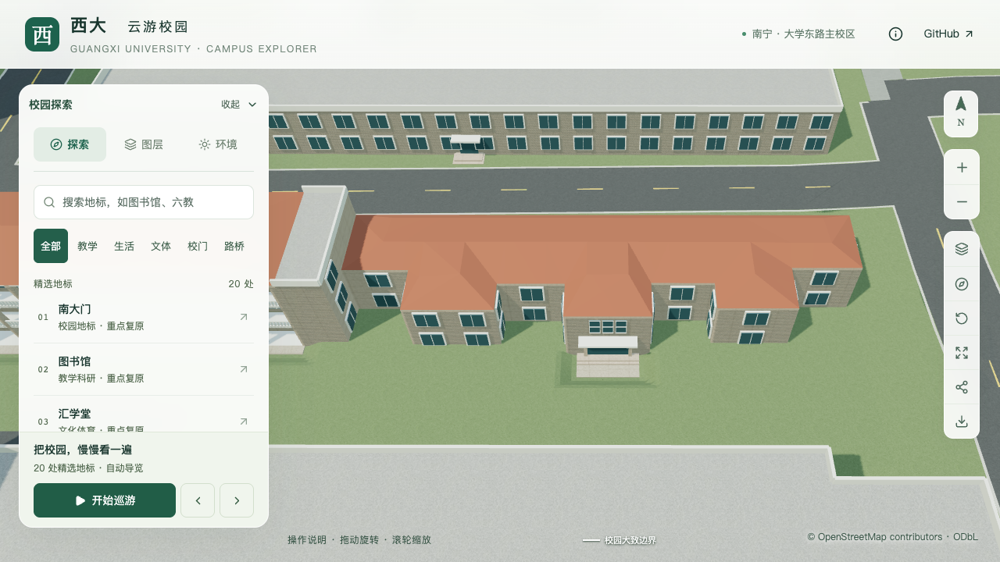
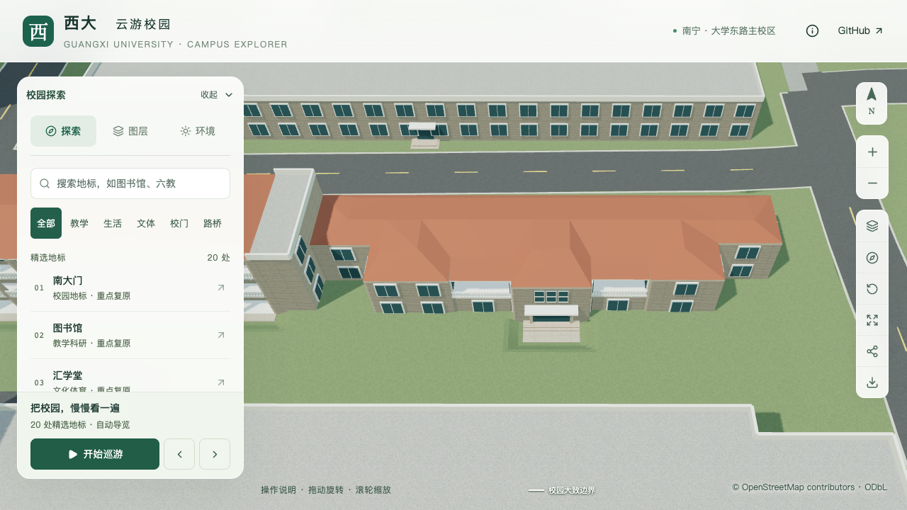

# 数学研究中心东翼上层外廊

2026-09-13，接续[数学研究中心体量与入口校准](MATH_CENTER_CALIBRATION.md)，对象仍为 `way/759129515`。本批补充中央南入口两侧外廊，不增加楼栋记录数或整栋验收数。

## 照片与轮廓对应

[中心官方简介](https://gxcmr.gxu.edu.cn/info/1003/2227.htm)中的具名正面照片显示：中央入口两侧上层有白色栏杆，廊后可见两窗一门，下面为有窗的实体底层。按三处南向凸部及中间凹口，与原外轮廓第5、9边对应。照片拍摄时间未知，仅作本地造型参考；身份匹配、估算参数和未确认项见[取证记录](model-checks/refinement/s2-east-gallery-evidence.json)。

这里采用附着在原墙线外的构件。已有 `openCorridor` 会向楼内退让，不能直接用于照片中的这两处空间。原始地图外环与内院不修改，新增占地单独保存，用于生成几何和最终植被排除。

| 参数 | 当前采用方式 | 依据边界 |
| --- | --- | --- |
| 两处外廊 | 第5边向外2.8 m、第9边向外2.9 m | 由照片和相邻凸部深度约束估算 |
| 廊道标高 | 3.3 m，下面为实体底层 | 已确认两层；3.3 m层高仍为估算 |
| 端部 | 沿两侧原映射凸部墙线收口 | 保留原墙线微小斜向，不预留无依据侧缝 |
| 栏杆 | 0.9 m高，0.11 m方条，约0.32 m间距 | 简化照片中的曲线石栏；贴墙端不加侧栏杆 |
| 屋面 | 红色斜檐接主体屋面，向外下降0.25 m，厚0.18 m | 具体坡度与构造尺寸为估算 |
| 上层门窗 | 每侧两窗一门，门靠中央凸部 | 数量及相对位置由照片约束；锚点、尺寸和色彩简化为估算 |
| 底层窗列 | 随新增实体移至外侧墙 | 仍使用示意窗列，不称为逐窗复原 |

## 实现与验证范围

`facadeRules.attachedGallery` 要求有来源的完整字段，当前限实体两层、四坡屋面外边。检查有限尺寸、门窗范围与重叠、屋檐净空、原楼体及其他建筑/入口冲突。零端部退让只允许被两面映射凸部侧墙包围的凹口，并按各侧墙方向求交；不能把这项配置套到普通凸角上。

基础与近景共用楼板、实体下层、栏杆、门窗与斜檐。底层旧后墙不再生成窗格；新增占地进入统一地面种植排除，最终树冠与构件仍需实际网格检查。原主入口、两级台阶、西楼三层外廊及两处局部铺地继续由原专项回归覆盖。

初版旋转与主体检查通过，但俯视图发现0.15 m端部退让造成细缝，因此改为按侧墙交线收口，补充屋面端部实际采样。初版画面与报告保留，不能用它们替代收口后的最终证据。新增解析器测试最初缺少楼名测试字段，修正夹具后通过；隔离道路维护第一次因副本缺少报告输出目录而退出，属于副本准备问题。

楼板白色侧面与底层墙面共面的问题通过缩短下部墙面解决，旋转小样另检查同一射线位置只有一张外表面。最终115项数据测试、两级三种旋转小样、完整构建和Pages通过。源文件及实际基础/近景模型检查廊道空隙、楼板、斜檐、端部收口、栏杆孔隙、两窗一门与底层窗台离地；旧模型缺少楼板、初版端部收口高度不符，分别在新增检查中失败。

最终资产重新通过430栋普通建筑与3,062株树木网格检查；原数学研究中心的西楼外廊、入口、台阶和两处铺地专项继续通过。69个模型与生产包一致；首屏5,012,720 bytes，本批净增加3,052 bytes，余量987,280 bytes，最大普通近景区块1,684,868 bytes。原528个非树木源对象中只改变本楼，其余527个对象的几何、UV、材质与变换保持；全部原轮廓、树位、87个基础节点及其他67个GLB保持。

道路增量维护在成套最终资产的隔离副本通过：88个基础节点压缩几何和其他68个GLB保持，源/基础/近景外廊专项通过。该副本首屏5,012,592 bytes，正式资源未被副本覆盖。

最终结果、资产指纹、性能条件及逐图审阅以[本批汇总](model-checks/refinement/s2-east-gallery-summary.json)为准。

当前资产三次LOD往返和两档各三次30秒活动无浏览器错误。精细60/60/60 FPS、流畅30/28/28 FPS，中位数相对S0持平/下降6.67%；三角形增加2.91%/6.31%，Draw Calls增加0.93%/6.72%，数值门槛通过。26次CPU快照记录到一个外部Python进程约90秒高负载，故**同条件性能与本批联合验收仍待完成**。没有在相同干扰条件下重复测量；性能范围仍是固定图书馆活动镜头，不是本楼压力测试或手机真机结果。

## 固定镜头对照

九张最终原图均已审阅。手机尺寸使用基础模型，可见上层外廊，底层与台阶被前景楼屋顶遮挡；贴地关系采用桌面近景和实际地形采样验收。树木开启时遮挡部分前场，保留原示意树位。[逐图记录](model-checks/refinement/s2-east-gallery-joined-visual-review.json)限定每张图的用途。

| 修改前 | 修改后 |
| --- | --- |
|  |  |
|  |  |

## 剩余范围

该楼仍属于部分校准。西、北等其余主要立面、楼梯标识墙孔窗、屋面不可见端部、真实门窗材质、底层精确窗列与完整道路连接仍待核对。两处附着外廊不是整栋实测，也不代表已完成20–30栋目标或图书馆完整场地样板。
