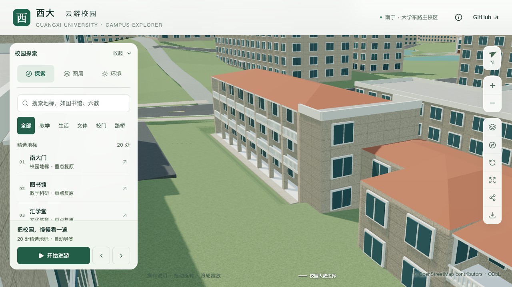

# 数学研究中心楼梯标识墙小窗

2026-09-16，继续校准 `way/759129515`（地图名第五教学楼）。在已完成的西三层、东两层及南侧外廊基础上，为西楼楼梯标识墙增加三组小窗，每组两列两行，共十二扇；保留其余实墙。楼体、屋顶、主入口、外廊及场地均保持。

## 依据和估算范围

[数学研究中心官网简介](https://gxcmr.gxu.edu.cn/info/1003/2227.htm)的[西楼照片](https://gxcmr.gxu.edu.cn/__local/B/BE/05/E67F02AED5F7BD7077752927A6E_267556F7_EAE25E.jpg)可辨认标识墙靠东一侧的三组小窗。照片与相邻三层外廊、东侧两层体量的关系沿用已核对的轮廓定位，对应原外环第15边的 `west-stair` 分段。照片拍摄日期未知，不称为当前测绘记录；原图仅保存在本地供造型参考。

数量与分组来自照片，以下参数均为比例估算：约0.37米窗宽、0.35米窗高，两列中心在分段边长的0.13与0.32处；三组下缘相对楼栋基准为3.4、6.05、8.7米，组内两行相距0.55米。窗框采用4厘米宽、6厘米深的简化表达。模型用浅层玻璃与窗框表达外观，没有切开通向楼内的孔洞，也没有复原墙上文字、排水管、真实材料或不可见侧窗。

## 实现与验证

复用 `facadeRules.panels`，允许与 `windows: false` 一起使用：显式面板继续生成，默认大窗停止生成。外立面、尺寸、阳台和其他窗系统的冲突约束保留。两级模型使用相同的十二处窗面与窗框。

166项Python和56项Node测试、类型检查、lint及完整模型/Pages构建通过。初次Node检查误在完整建模结束前运行，读取到缺少高程和不配套的资源清单；最终成套输出后全部通过。实际模型专项在源文件、基础GLB和近景GLB分别检查十二处玻璃首交、十二处窗框和十八处保留实墙。旧模型在第一处窗面探测中命中石墙，构成有效反例。

原数学研究中心的分段屋顶、三层外廊、栏杆、主入口、台阶、两处局部铺地及东楼附着外廊回归通过；430栋普通建筑和3,063株树的实际形体检查通过。仅目标楼源对象、基础模型对应区块与一个近景GLB改变；其他530个非树木对象、全部树实例、90个基础节点及67个GLB保持。首屏模型5,153,348字节，比上一版本增加2,560字节，最大普通近景区块仍为1,684,868字节。

## 画面对照

初版镜头被南侧数学学院遮挡，未用于外观验收。调整到楼前间隙后，七张最终画面已逐张检查：近景可见三组小窗，夜景沿用既有玻璃照明；北侧全景用于确认体量保留，不用于验收朝南小窗。手机尺寸可见窗组，楼下部被前景屋顶遮挡，不作地面通行证明。

| 修改前 | 修改后 |
| --- | --- |
|  |  |

[实际窗面检查](model-checks/refinement/s2-math-stair-windows-geometry.json) · [原结构与场地回归](model-checks/refinement/s2-math-stair-existing-geometry.json) · [附着外廊回归](model-checks/refinement/s2-math-stair-gallery-geometry.json) · [资产核查](model-checks/refinement/s2-math-stair-assets.json) · [网页画面](model-checks/refinement/s2-math-stair-visible-context-browser.json)。

该楼仍有西、北立面、屋面不可见端部、底层窗列及完整道路连接待核对。本次补齐可见小窗，不增加部分对象记录或整栋验收数；20–30栋及S3六栋邻楼范围保持。

## 性能结果

相同设备、系统、浏览器及图书馆活动协议下，精细三次60/60/60 FPS，流畅28/27/27 FPS。相对同环境S0，流畅中位数下降10%，处于既定允许边界；两档三角形增幅为3.50%/7.98%，绘制调用增幅为2.38%/11.03%，均通过原预算。保留真实测量结果，没有为获得更高帧率重复测量。

三次LOD往返无浏览器错误；24次CPU快照在计时窗口内未记录到超过2%阈值的Python/Blender计算。图书馆手机尺寸回归已核看。该测量是全局固定活动镜头，不是数学研究中心近景压力测试或手机真机测量。[本批验收汇总](model-checks/refinement/s2-math-stair-summary.json)保存检查范围与资产指纹，[来源记录](model-checks/refinement/s2-math-stair-evidence.json)保存观察和估算边界。
