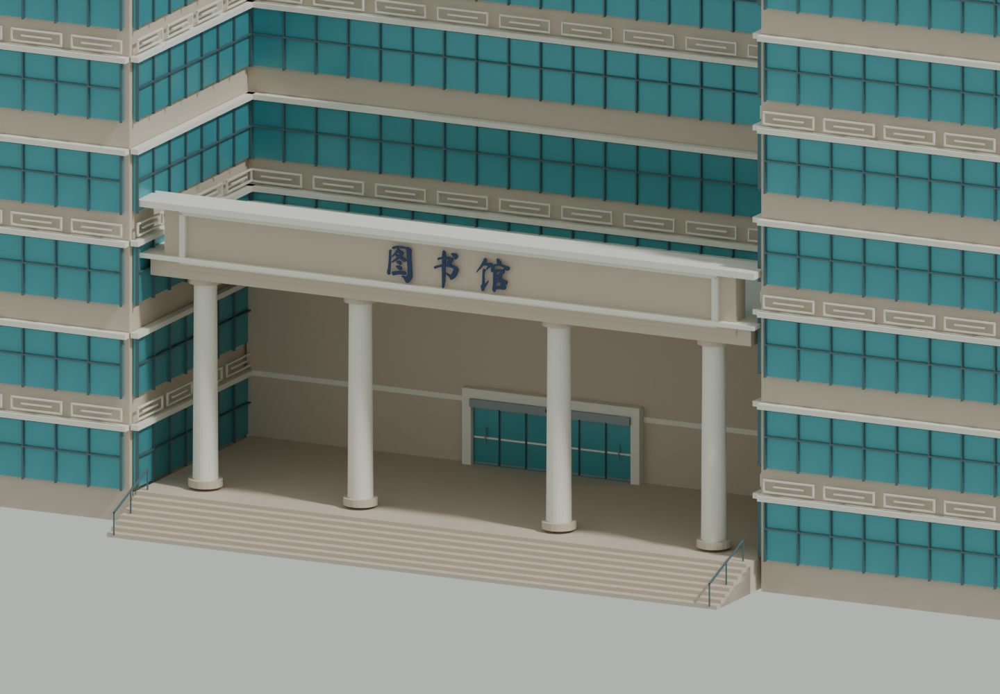

# Blender 模型与重建

源文件 `blender/gxu-campus.blend` 由 Blender 5.2.1 LTS 构建，使用米制坐标；建筑、树木与道路水体为具名对象，建筑带 `featureId` / `landmark` / `sourceUrl` 属性。材质与自制 JPEG 纹理均打包在 .blend 内，不需要额外下载摄影贴图。

## 可重复构建

网页运行只需要 npm；重新制作模型需要 Blender 和 Python 3.9+。

```sh
python3 -m venv work/venv
work/venv/bin/pip install -r scripts/requirements.txt
npm run data:restore
work/venv/bin/python scripts/prepare_geodata.py
npm run models:build
```

`blender` 必须位于 PATH，也可改用本机 Blender 可执行文件绝对路径。工作文件位于 `work/`，不纳入 Git。固定随机种子使植物配置和纹理一致；不同 Blender/Draco 版本可能改变二进制压缩结果。

数据流程：OSM JSON → Shapely 合并关系和内环 → 校园外扩 300 米裁剪 → Earcut 多边形三角化 → 米制地形、轮廓及 POI 目录 → Blender 几何 → 自包含 Draco GLB。`data:restore` 使用已发布快照；要更新数据，运行 `python3 scripts/fetch_geodata.py --refresh` 后重新准备和构建。

## 模型分级

### 两处田径场

`data/sports.json` 保存可编辑参数；`scripts/sports_data.py` 从 OSM 外轮廓推导米制中心和方向，`prepare_geodata.py` 生成完整运动场平整区和排树区。`blender/sports.py` 独立生成连续圆弧跑道、内场条纹、平面标线、球门网架和西场主席台。每个弯道使用 96 段；细白线位于面层之上，足球场与跑道不再随粗粒度 DEM 起伏。东场两侧原始直道铺地延伸保留。

源文件中“西校园田径场”“东校园田径场”是独立可编辑对象，各有 6 个具名顶点组（铺地、跑道、草坪、分道线、足球标线、球门）。西场主席台有 3 个建筑构件组，开放台面替代原来的通用带窗房屋，基础和近景模型均同步。网页在基础 GLB 内为两场保留独立节点，统一归入 sports 图层；不进入精选地标导航。

独立节点把 Draco 16 位位置量化范围约束在单个场地，避免全校园范围量化将厘米级标线压入跑道表面。`validate_exported_sports.py` 解码实际发布 GLB，逐条检查分道线的高度间隔。仅调整基础导出布局时可用 `blender --background --python-exit-code 1 --python blender/build_campus.py -- --base-only`，保留既有源文件与近景资源；修改几何或数据后仍应运行完整构建。

```sh
blender --background --python-exit-code 1 --python blender/validate_sports.py
blender --background --python-exit-code 1 --python blender/validate_exported_sports.py
blender --background --python-exit-code 1 --python blender/validate_landmarks.py
```

[西场模型预览](screenshots/west-track.png) · [东场模型预览](screenshots/east-track.png) · [几何检查结果](model-checks/sports-geometry-check.json)。照片只作造型参考，未打包分发。完整精度边界见 [数据说明](DATA.md#东西田径场修订)。

### 加载资源

| 资源 | 用途 |
| --- | --- |
| base.glb | 地形、路面、水体、绿地、运动场、周边建筑、带窗格的全校基础建筑和地标体量 |
| west / east / north.glb | 普通建筑近景，增加窗框、窗梃、阳台、入口雨棚、女儿墙等；加载后替换对应基础分区 |
| 14 个地标 GLB | 独立加载，可点选、巡游和单独修改；使用一致的米制位置 |
| trees.glb | 3 个多材质模板，网页合并为顶点色几何后分块实例化 |

模板材质包括石材、白色涂层、玻璃、深色金属、灰青屋瓦、铺装、草地、树皮和三种树冠色。9 张 128 × 128 自制 JPEG 纹理采用米制平面 UV；没有大尺寸摄影贴图。几何使用 Draco，解码器本地托管。东/西/北是场景加载分区，并不逐线等同于校方的行政分区。网页以视距触发普通分区近景，树木按空间块进行视锥剔除。精细和流畅档共用约 5.99 MB 基础资源，流畅档减少实例数量与渲染像素。

## 14 处地标检查

下面两个视角由实际 .blend 源文件渲染。用于检查几何、屋顶、入口和未见面的处理，不表示两张参考照片均覆盖每个面。全部模型为人工规则生成的外部建筑模型，没有室内重建。

| 地标 | 主要检查点及依据 | 视角 1 | 视角 2 |
| --- | --- | --- | --- |
| 南大门 | 2022 校方、2024 日期水印和 2026 活动照片：三跨石门、四门柱、弧形承托、叠檐、雕花嵌板、顶部小亭及红色立体校名；尺寸估算 | [查看](model-checks/south-gate-1.png) | [查看](model-checks/south-gate-2.png) |
| 图书馆 | 2026 图文正面及图库侧面：檐架、阶梯体量、入口柱廊；已补北侧门廊与感应门，未见细部估算 | [查看](model-checks/library-1.png) | [查看](model-checks/library-2.png) |
| 汇学堂 | 2026 图文正面：灰青坡顶、木门、竖向柱廊；入口按用户确认转向东，背面推定 | [查看](model-checks/huixue-1.png) | [查看](model-checks/huixue-2.png) |
| 大礼堂 | 官方图库现状斜视：三角山花、六柱门廊、侧面窗列、台阶 | [查看](model-checks/auditorium-1.png) | [查看](model-checks/auditorium-2.png) |
| 综合体育馆 | 2021 官方视频 7 秒/12 秒：浅坡大屋盖、采光构件、百叶、柱墩；辅以 2024 场馆用途 | [查看](model-checks/stadium-1.png) | [查看](model-checks/stadium-2.png) |
| 大学生活动中心 | 2026 图文：曲线轮廓、白色水平带、深色玻璃；保留 OSM 内院 | [查看](model-checks/student-center-1.png) | [查看](model-checks/student-center-2.png) |
| 第六教学楼 | 官方图库：竖向窗列、平屋顶挑檐、雨棚、台阶；保留真实内院，未见面推定 | [查看](model-checks/teaching-six-1.png) | [查看](model-checks/teaching-six-2.png) |
| 第二教学楼 | OSM 轮廓、7 层标签及 2024 导览位置；立面主要按教学楼类型推定，未取得可确认的近期外观 | [查看](model-checks/teaching-two-1.png) | [查看](model-checks/teaching-two-2.png) |
| 综合实验大楼 | 校门与实验楼官方图库：双翼与中央上部桥体，底部通孔保持开放；后立面推定 | [查看](model-checks/laboratory-1.png) | [查看](model-checks/laboratory-2.png) |
| 计算机与电子信息学院 | 官方 PDF 第 1 页：竖向玻璃核心、粉色侧墙、窗列与悬挑平檐；背面及细节推定 | [查看](model-checks/computer-1.png) | [查看](model-checks/computer-2.png) |

重新生成视角：

```sh
blender --background --python-exit-code 1 --python blender/render_checks.py
```

维护时先修改 `data/landmarks.json` 的位置及来源，再修改 `blender/landmarks.py` 中对应造型。普通楼宇规则位于 `blender/build_campus.py`，几何组装器位于 `blender/geometry.py`。不要修改稳定 ID 来解决显示名称变化；模型、目录和拾取应保持一致。

## 南大门现状重建与汇学堂朝向修正（2026-09-09）

旧版误用了官方无日期图库中的旧南门柱列照片，现已完全替换为近期照片一致可见的三跨石门。现模型保留三处真实贯通门洞、四个分块石柱、弧形承托、叠层檐口、石雕嵌板、双排顶部小亭和横向红色校名。近景含门柱分缝、几何花纹、檐下纹饰、匾额嵌框及立体字；基础 LOD 保留相同现状轮廓与校名。门前花坛和矮栏按近期照片示意配置，不包含临时活动帐篷。

依据为 [2022 年校方毕业季第二张照片](https://news.gxu.edu.cn/info/1002/39575.htm)、[2024-10-10 日期水印现场照片](https://www.lun51.com/homepage/index.php?a=index&aid=1069&c=View&m=home)、[2026 年活动报道首图](https://www.5iidea.com/contents/47982)。2026 文章发布于 4 月 27 日、活动发生于 4 月 14 日，但单张门口照片的拍摄日未知。没有使用旧门照片恢复现门。

门的位置、宽度和进深绑定 OSM way/1492215424 门楼轮廓；门高及构件比例、未见背面为照片估算；雕花为几何近似，非扫描。校名使用 [Ma Shan Zheng](https://github.com/google/fonts/tree/main/ofl/mashanzheng) 开源书法字形替代原题字，不能称为原笔迹精确复刻。完整字体及 SIL OFL 许可位于 `blender/fonts/`；仅字形网格进入 GLB，网页不加载字体文件。

源模型南大门保留具名顶点组，方便分别编辑门柱、各门跨、匾额、校名和景观。规则位于 `blender/south_gate.py`。汇学堂先交换建模局部宽深再绕中心旋转 +90°，入口由南转东且主体仍适配原 OSM 边界框；导览镜头同步切换到东侧。朝向修正依据用户确认，不代表 OSM 数据在该日重新测量。

```sh
npm run models:build
blender --background --python-exit-code 1 --python blender/validate_landmarks.py
blender --background --python-exit-code 1 --python blender/render_checks.py -- south-gate huixue
```

几何检查直接读取保存后的 .blend：射线检查三门洞贯通、四门柱和三横梁存在，并检查汇学堂木门顶点位于东立面。结果见 [geometry-check.json](model-checks/geometry-check.json)。

现南门直接绑定 OSM `way/1492215424`（`building=gatehouse`、`man_made=ceremonial_gate`），替换原先在该轮廓生成的通用建筑。原版独立 POI 位于其北侧约 90 米，已经移除该误定位；稳定地标 ID 仍是 `south-gate`。

入口轴线上 OSM 标注 `memorial=column` 的四根历史门柱按纪念构筑物生成柱身、凹槽和柱帽，避免套用通用房屋的窗格、入口规则。南门模型基底对齐抬高 0.40 米的网页路面，保留可见柱脚。

模型清单保存各 GLB 的 SHA-256，网页把哈希附在资源 URL 上；更新模型后不会继续使用同名旧文件缓存。

## 图书馆与留学生公寓

图书馆规则位于 `blender/library.py`：OSM 轮廓经 `scripts/architecture_data.py` 划分为五个阶梯体量，内院保持贯通。近景包含蓝绿色幕墙与横竖分格、窗间墙、回纹腰线、镂空檐架、六柱门廊、立体馆名、台阶和扶手。馆名字体为随项目打包的 OFL 字体近似。源模型保留十二个具名顶点组（含北门门廊、门扇、台阶和北向馆名）；基础 LOD 保留体量、庭院、入口、檐架及大窗格，近景加载细回纹与密窗格。

留学生公寓规则位于 `blender/international_residence.py`：完整 OSM 底层轮廓作为国际学院裙楼，高层部分分为折角双翼。24 层住区带逐层阳台板、隔板、栏板和扶手，端面以大片实墙及窄窗带为主，转角连续玻璃窗带按层分隔；裙楼有独立遮阳竖板、门窗与入口雨棚，屋顶设置女儿墙、镂空框架和示意设备。源文件同样保留八个具名顶点组。高层退界、未见面与细部尺寸是照片估算，不宣称测绘级复原。

| 模型 | 南侧视角 | 背侧视角 |
|---|---|---|
| 图书馆 | [查看](model-checks/library-1.png) | [查看](model-checks/library-2.png) |
| 留学生公寓 | [查看](model-checks/international-residence-1.png) | [查看](model-checks/international-residence-2.png) |

```sh
blender --background --python-exit-code 1 --python blender/validate_architecture.py
blender --background --python-exit-code 1 --python blender/render_checks.py -- library international-residence
```

参考照片年份和精度限制见 [数据说明](DATA.md#图书馆与留学生公寓资料)。公开参考照片不嵌入模型，不随站点重新分发。

### 图书馆北入口补建（2026-09-09）

北门设在 OSM 轮廓北侧中央内凹处，门面沿建筑局部 +Y 朝北（实际方位约 11.6°），与南门分别建模。补齐四柱门廊、内凹馆名牌、玻璃门、不锈钢门头、平台台阶及扶手；基础与精细 LOD 均保留北入口，仍归属图书馆地标。

[校方 2026-05-26 采购公告](http://www.lib.gxu.edu.cn/info/5662/12651.htm)明确北楼门洞为 6.60×2.55 米、六片门扇玻璃各 1.00×2.25 米；模型采用这些参数。该公告不证明安装验收已经完成。柱廊及牌匾参考[本馆介绍的北楼照片](http://www.lib.gxu.edu.cn/info/5692/8371.htm)与[官网页头近景](http://www.lib.gxu.edu.cn/__local/F/D1/F7/AD49D5886A41A265D4E96FE19B9_C206CD48_2A731.jpg)，照片拍摄日期未知；柱距、雨棚和台阶等尺寸按照片比例估算，不宣称实测。门扇为静态外观，不模拟开门。



## 新东门、东门、西门

重建入口模块为 `blender/campus_gates.py`，每座门均有基础 LOD 和独立 Draco GLB，具名顶点组保留在 Blender 源文件中。入口几何以局部南向创建，再按目录方位旋转；东门朝东、西门朝西、新东园门朝南。新增三门进入精选名单，原有 01—11 编号不变，新增 12 新东门、13 东门、14 西门。

东门以 OSM 门节点定位，结合相邻建筑净空将宽度约束为估算 22 米、高度估算 8 米。采用三处真正贯通的椭圆拱洞、四座凹槽石柱、叶片状柱头浮雕、连续平檐、檐下齿饰、菱花嵌板和红色立体校名。雕饰是照片启发的几何近似，文字使用项目 OFL 字体，并非原书法描摹。西门保留开放式校道，以门窗框、玻璃、薄檐、扶栏、道闸等细化小型入口设施。新东门暂为有明确位置依据的门卫设施推定模型，需近年实拍才能校准门体；没有复制东门石拱。

基础档保留拱洞、柱体、檐口和岗亭；细小雕饰、立体文字、栏杆竖杆、门把手与道闸色带仅在近景加载，控制首屏预算。模型资料及精度差异见 [DATA.md](DATA.md)。

| 地标 | 正面检查 | 背面检查 |
| --- | --- | --- |
| 新东门（外观推定） | [正面](model-checks/new-east-gate-1.png) | [背面](model-checks/new-east-gate-2.png) |
| 东门 | [正面](model-checks/east-gate-1.png) | [背面](model-checks/east-gate-2.png) |
| 西门 | [正面](model-checks/west-gate-1.png) | [背面](model-checks/west-gate-2.png) |

几何验证：`blender --background --python-exit-code 1 --python blender/validate_gates.py`，从各门真实朝向发射射线，检查三拱通道及另外两门中心通道贯通、东门四柱与横梁存在、对象唯一及可编辑分组保留。

三门检查图使用 Blender Workbench 材质色与空隙阴影展示源几何；实际光照、贴图和近景切换另在 Three.js 网页检查。

## 空间区块导出（2026-09-10）

普通校内建筑按中心所在的 360 米网格分为 30 个区块；每栋建筑完整归入一块，保留庭院与稳定 ID。基础 GLB 各区块节点与近景文件共用 `chunk-…` 键，实现逐块替换。地标仍独立加载。清单保留 `zones` 数组字段以兼容资产检查，但内容已改为空间区块，并记录边界。

基础 GLB 保留 16 位位置精度，法线使用 7 位量化以控制传输体积；运动场几何间距与单独量化范围保留。高精细区块保持 10 位法线。几何与源文件不因法线压缩而减面。`--base-only` 检查网格键与现有清单一致，网格发生变化时必须完整重建。

## 近景材质与植物 LOD（2026-09-10）

普通建筑按稳定 OSM ID 分配少量暖冷墙面色，局部窗格使用反射色差，细节层增加小型入口平台；保留原始轮廓、位置和高度。树冠提高分段并合并重合顶点形成平滑法线，棕榈采用连续弧形叶轴与成对叶片。以上为示意细化，未增加实测精度或新的树位。网页叠加轻微、可重复的植被色差，并按观看距离调整阴影偏移。

`vegetation.py` 是完整构建与植物单独重建共用的模板。完整构建保存精细树冠到 Blender 源文件，网页同时导出 `trees.glb` 远景和 `trees-near.glb` 近景。仅调整植物时可运行 `blender --background --python-exit-code 1 --python blender/build_vegetation.py` 重导两份 GLB 与清单；若修改模板几何，仍需完整构建来更新 `.blend` 源文件。当前 `.blend` 已包含这次的近景几何。
