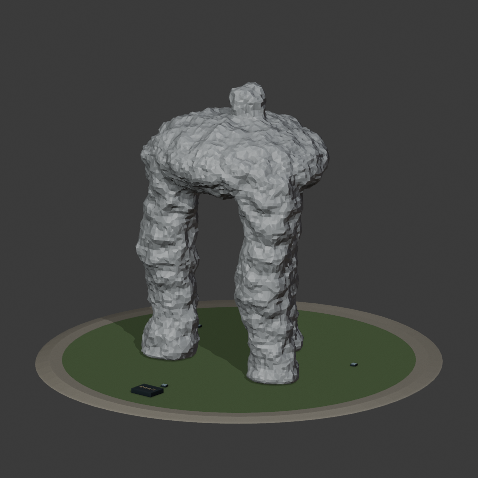
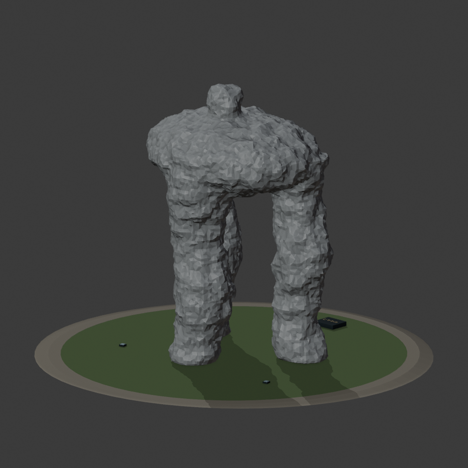
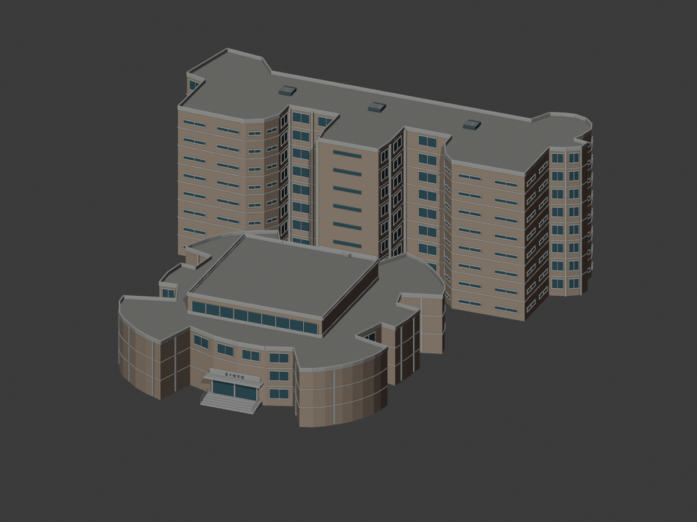
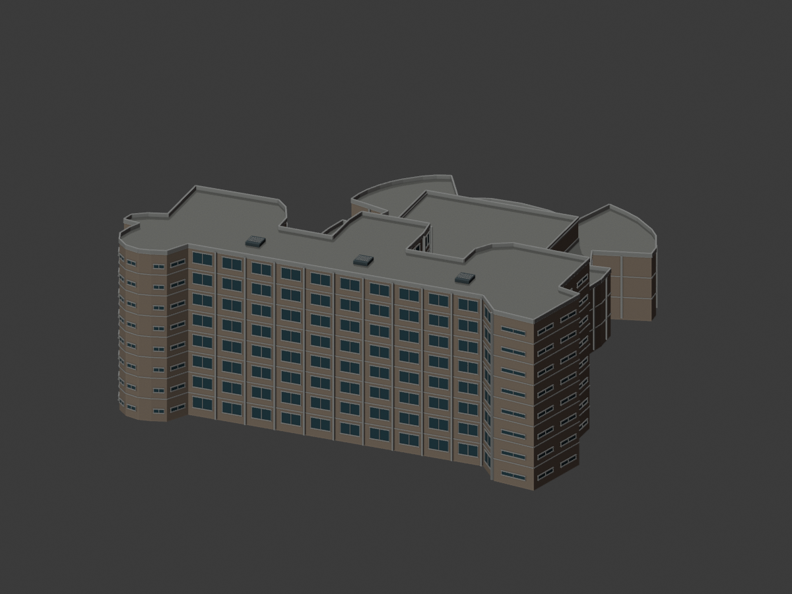
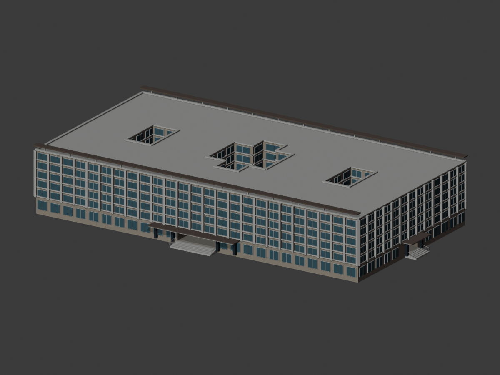
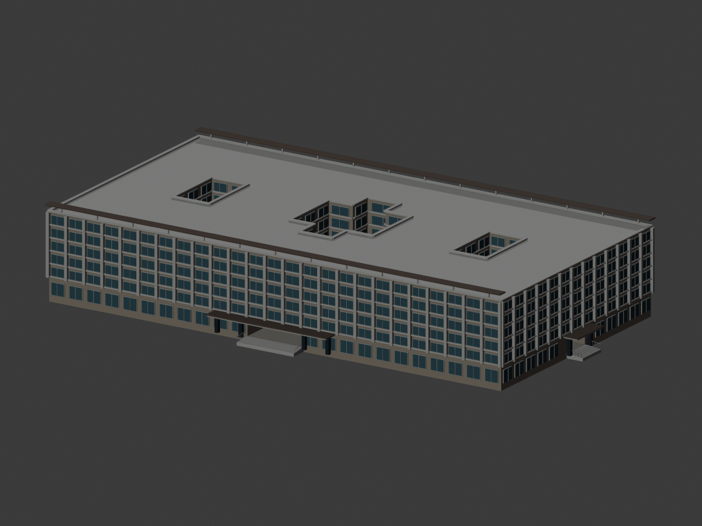
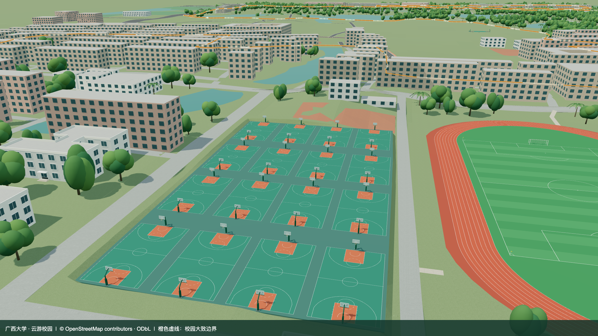
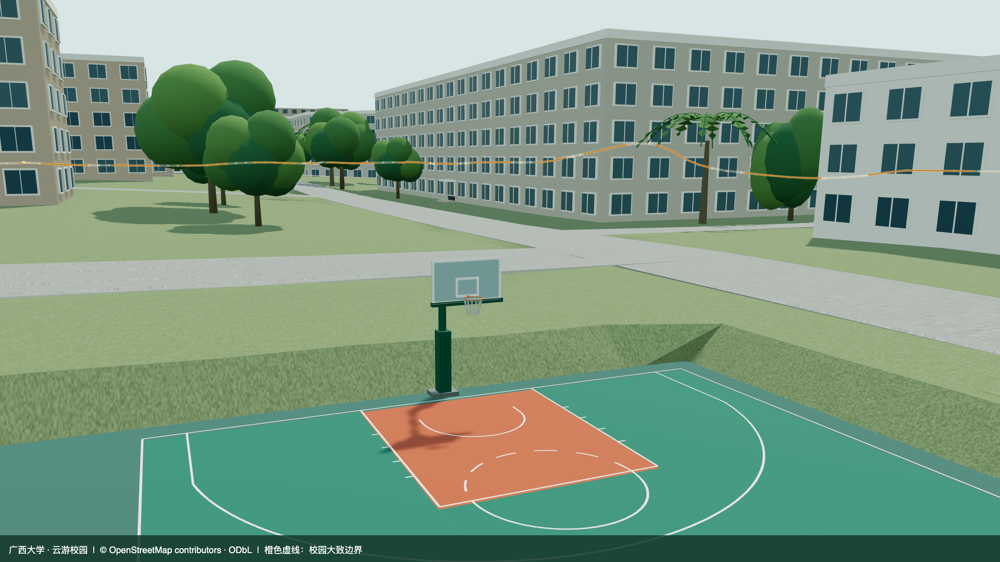

# Blender 模型与重建

源文件 `blender/gxu-campus.blend` 由 Blender 5.2.1 LTS 构建，使用米制坐标；建筑、树木与道路水体为具名对象，建筑带 `featureId` / `landmark` / `sourceUrl` 属性。材质与自制 JPEG 纹理均打包在 .blend 内，不需要额外下载摄影贴图。

树木朝向由树位稳定计算，网页与 Blender 共用同一角度约定，局部删树不影响其余树的朝向。已有开放区域由 `data/vegetation-zones.json` 配置，完整与增量准备复用分区解析器。仅更新源文件朝向使用 `blender/update_tree_layout.py`；完整建模也采用同一公式，详见[植被分区与稳定朝向](VEGETATION_ZONES.md)。背景候选按世界网格独立种子生成；完整建模通过 `blender/tree_layout.py` 采样最终地形三角面，将高程写入树位第五列并应用到源实例。数据准备后须完成模型构建再发布树位；只校正既有源实例高程时，可对上述增量命令添加 `-- --ground`，再更新网页生产包。

行道树使用 `data/vegetation-avenues.json` → `scripts/vegetation_avenues.py`，在最终植被筛选前局部替换背景树。道路ID和线位哈希固定里程方向，候选按道路切线生成双侧偏移，再保留路口开口；重复准备保留已有树位的标高。首个[博萃路试点](AVENUE_PILOT.md)保留14株树，全部3,061株继续经过占地、树冠保留区、显式禁植区及模型检查。个别树位、间距和高度为估算，模板仍由既有GLB实例化，未增加新的树模型资源。

## 可重复构建

普通铺地样例使用 `data/paving-overrides.json` → `scripts/paving_data.py` → `public/data/pavings.json` → `blender/paving_geometry.py`。完整准备顺序为最终道路、入口场地、普通铺地、岸段、植被；完整几何构建先处理入口场地与铺地，再处理岸段，最后重算树根高程。修改道路或场地后，需同时刷新铺地和岸段上下文；构建会拒绝过期的派生结果。

铺地节点归入 `roads` 图层，源文件与基础 GLB 成套更新。`update_roads.py` 和 `update_basketball.py` 已接入 `sync_source_pavings()`；2026-09-13 已在隔离副本中把铺地过渡宽度改为 4 米，核对两条实际增量命令及源文件/GLB 的参数响应。局部压低穿出铺面的底面，不修改原始 DEM JSON；详见 [铺地校准与专项验证](PAVING_CALIBRATION.md)。

细分地形由 `blender/terrain_export.py` 以匹配的 18 位位置和 UV 精度导出，替换基础模型内地形节点的压缩数据；其他节点保持原精度。`compact_buffer_views()` 清除替换后不用的载荷，保留图片及全部有效引用。铺地地形的 UV 投影在局部范围内固定为 XY，避免极小三角面的不稳定法线改变投影；其他区域保持原投影。完整构建与两条增量模型路径共用该逻辑。专项命令为 `blender --background --python-exit-code 1 --python blender/validate_terrain_texture.py`。

网页运行只需要 npm；重新制作模型需要 Blender，建议使用与 CI 一致的 Python 3.12，并通过约束文件固定几何处理依赖。

```sh
python3 -m venv work/venv
work/venv/bin/pip install -r scripts/requirements.txt -c scripts/constraints-geodata.txt
npm run data:restore
work/venv/bin/python scripts/prepare_geodata.py
npm run models:build
```

`blender` 必须位于 PATH，也可改用本机 Blender 可执行文件绝对路径。工作文件位于 `work/`，不纳入 Git。固定随机种子使植物配置和纹理一致；不同 Blender/Draco 版本可能改变二进制压缩结果。

数据流程：OSM JSON → Shapely 合并关系和内环 → 校园外扩 300 米裁剪（建筑最终仅保留校内及距校界 20 米内的外部建筑） → Earcut 多边形三角化 → 米制地形、轮廓及 POI 目录 → Blender 几何 → 自包含 Draco GLB。`data:restore` 使用已发布快照；要更新数据，运行 `python3 scripts/fetch_geodata.py --refresh` 后重新准备和构建。

## 模型分级

### 两处田径场

`data/sports.json` 保存可编辑参数；`scripts/sports_data.py` 从 OSM 外轮廓推导米制中心和方向，`prepare_geodata.py` 生成完整运动场平整区和排树区。`blender/sports.py` 独立生成连续圆弧跑道、内场条纹、平面标线、球门网架和西场主席台。每个弯道使用 96 段；细白线位于面层之上，足球场与跑道不再随粗粒度 DEM 起伏。东场两侧原始直道铺地延伸保留。

源文件中“西校园田径场”“东校园田径场”是独立可编辑对象，各有 6 个具名顶点组（铺地、跑道、草坪、分道线、足球标线、球门）。西场主席台有 3 个建筑构件组，开放台面替代原来的通用带窗房屋，基础和近景模型均同步。网页在基础 GLB 内为两场保留独立节点，统一归入 sports 图层；不进入精选地标导航。

独立节点把 Draco 独立位置量化范围约束在单个场地，避免全校园范围量化将厘米级标线压入跑道表面。`validate_exported_sports.py` 解码实际发布 GLB，逐条检查分道线的高度间隔。仅调整基础导出布局时可用 `blender --background --python-exit-code 1 --python blender/build_campus.py -- --base-only`，保留既有源文件与近景资源；修改几何或数据后仍应运行完整构建。

```sh
blender --background --python-exit-code 1 --python blender/validate_sports.py
blender --background --python-exit-code 1 --python blender/validate_exported_sports.py
blender --background --python-exit-code 1 --python blender/validate_landmarks.py
```

[西场模型预览](screenshots/west-track.png) · [东场模型预览](screenshots/east-track.png) · [几何检查结果](model-checks/sports-geometry-check.json)。照片只作造型参考，未打包分发。完整精度边界见 [数据说明](DATA.md#东西田径场修订)。

### 加载资源

| 资源 | 用途 |
| --- | --- |
| base.glb | 地形、路面、水体、绿地、运动场、周边建筑、带窗格及入口/屋顶轮廓的全校基础建筑和地标体量 |
| chunk-*.glb | 普通建筑近景，增加窗框、窗梃及按形制推定的阳台等；加载后替换对应基础分区 |
| 20 个地标 GLB | 独立加载，可点选、巡游和单独修改；使用一致的米制位置 |
| trees.glb | 3 个多材质模板，网页合并为顶点色几何后分块实例化 |

模板材质包括石材、白色涂层、玻璃、深色金属、灰青屋瓦、铺装、草地、树皮和三种树冠色。10 张 128 × 128 自制 JPEG 纹理采用米制平面 UV；没有大尺寸摄影贴图。几何使用 Draco，解码器本地托管。东/西/北是场景加载分区，并不逐线等同于校方的行政分区。网页以视距触发普通分区近景，树木按空间块进行视锥剔除。首屏基础模型和树木模板约 5.68 MB。自动画质按运行表现调整阴影、植被密度与近景预算，手机默认采用保守配置，详见 [近期优化](FIXES.md)。

### 普通建筑共享形体（2026-09-12）

430 栋普通建筑采用 `scripts/building_overrides.py` 应用逐字段校准、`scripts/building_forms.py` 解析默认形体、`blender/generic_buildings.py` 生成网格。主体、屋顶和入口平台共用于基础与近景，近景只增加立面小构件；特殊地标、主席台和纪念柱保留专用模块。没有屋顶资料时使用推定平顶；两处 OSM 四坡顶按实际轮廓生成，尺寸估算边界见 DATA.md。

可编辑源文件将普通楼分为主体、屋顶、入口平台、立面窗格四组，并合并重复顶点；屋檐与墙体共用顶点同时保留两个编辑分组。只调整普通楼形体时，可运行下列增量数据入口以保留当前地形、场地和植被派生结果，然后完整重建模型：

```sh
work/venv/bin/python scripts/building_overrides.py
npm run models:build
blender --background --python-exit-code 1 --python blender/validate_generic.py -- --report-prefix=s2-pilot
```

完整 `prepare_geodata.py` 同样接入形体解析。S3 前置修复已让外围道路复用最终邻近建筑筛选，完整准备不再因已删除的楼栋留下缺口；来源目录可从人工输入独立重建。主路少量沥青/路缘分界仍有重算差异，合并铺地范围不变，详见[重建核验](model-checks/refinement/s3-preparation.json)。不能将依赖版本变动造成的轮廓差异混入楼栋校准。阶段基线、依赖约束、固定视角和待补资料见 [执行记录](CAMPUS_REFINEMENT_PROGRESS.md)。

S2 首批包含 8 条记录；动物学院使用完整覆盖原轮廓的高低分段，每段有自己的屋面和窗层，入口定位在原外边。分段内部交界不生成窗列，原内院边的窗朝向院内空地。默认入口和未校准立面仍为示意；原始 OSM 标签不被覆盖，数据契约、资料局限与记录见 [普通楼校准](BUILDING_CALIBRATIONS.md)。旧 `building_forms.py` 命令仍可用，会转调同一覆盖流程。

## 14 处地标检查

下面两个视角由实际 .blend 源文件渲染。用于检查几何、屋顶、入口和未见面的处理，不表示两张参考照片均覆盖每个面。全部模型为人工规则生成的外部建筑模型，没有室内重建。

| 地标 | 主要检查点及依据 | 视角 1 | 视角 2 |
| --- | --- | --- | --- |
| 南大门 | 2022 校方、2024 日期水印和 2026 活动照片：三跨石门、四门柱、弧形承托、叠檐、雕花嵌板、顶部小亭及红色立体校名；尺寸估算 | [查看](model-checks/south-gate-1.png) | [查看](model-checks/south-gate-2.png) |
| 图书馆 | 2026 图文正面及图库侧面：檐架、阶梯体量、入口柱廊；已补北侧门廊与感应门，未见细部估算 | [查看](model-checks/library-1.png) | [查看](model-checks/library-2.png) |
| 汇学堂 | 2026 图文正面：灰青坡顶、木门、竖向柱廊；入口按用户确认转向东，背面推定 | [查看](model-checks/huixue-1.png) | [查看](model-checks/huixue-2.png) |
| 大礼堂 | 官方图库现状斜视：三角山花、六柱门廊、侧面窗列、台阶 | [查看](model-checks/auditorium-1.png) | [查看](model-checks/auditorium-2.png) |
| 综合体育馆 | 2021 官方视频 7 秒/12 秒：浅坡大屋盖、采光构件、百叶、柱墩；辅以 2024 场馆用途 | [查看](model-checks/stadium-1.png) | [查看](model-checks/stadium-2.png) |
| 大学生活动中心 | 2026 图文：曲线轮廓、白色水平带、深色玻璃；保留 OSM 内院 | [查看](model-checks/student-center-1.png) | [查看](model-checks/student-center-2.png) |
| 第六教学楼 | 校方入口图：南北门、东西侧门及底层贯通；官方图库：窗框、挑檐、门厅、台阶，尺寸推定 | [查看](model-checks/teaching-six-1.png) | [查看](model-checks/teaching-six-2.png) |
| 第二教学楼 | OSM 轮廓、7 层标签及 2024 导览位置；立面主要按教学楼类型推定，未取得可确认的近期外观 | [查看](model-checks/teaching-two-1.png) | [查看](model-checks/teaching-two-2.png) |
| 综合实验大楼 | 校门与实验楼官方图库：双翼与中央上部桥体，底部通孔保持开放；后立面推定 | [查看](model-checks/laboratory-1.png) | [查看](model-checks/laboratory-2.png) |
| 计算机与电子信息学院 | 官方 PDF 第 1 页：竖向玻璃核心、粉色侧墙、窗列与悬挑平檐；背面及细节推定 | [查看](model-checks/computer-1.png) | [查看](model-checks/computer-2.png) |

重新生成视角：

```sh
blender --background --python-exit-code 1 --python blender/render_checks.py
```

维护时先修改 `data/landmarks.json` 的位置及来源，再修改 `blender/landmarks.py` 中对应造型。普通楼宇规则位于 `blender/build_campus.py`，几何组装器位于 `blender/geometry.py`。不要修改稳定 ID 来解决显示名称变化；模型、目录和拾取应保持一致。

## 南大门现状重建与汇学堂朝向修正（2026-09-09）

旧版误用了官方无日期图库中的旧南门柱列照片，现已完全替换为近期照片一致可见的三跨石门。现模型保留三处真实贯通门洞、四个分块石柱、弧形承托、叠层檐口、石雕嵌板、双排顶部小亭和横向红色校名。近景含门柱分缝、几何花纹、檐下纹饰、匾额嵌框及立体字；基础 LOD 保留相同现状轮廓与校名。门前花坛和矮栏按近期照片示意配置，不包含临时活动帐篷。

依据为 [2022 年校方毕业季第二张照片](https://news.gxu.edu.cn/info/1002/39575.htm)、[2024-10-10 日期水印现场照片](https://www.lun51.com/homepage/index.php?a=index&aid=1069&c=View&m=home)、[2026 年活动报道首图](https://www.5iidea.com/contents/47982)。2026 文章发布于 4 月 27 日、活动发生于 4 月 14 日，但单张门口照片的拍摄日未知。没有使用旧门照片恢复现门。

门的位置、宽度和进深绑定 OSM way/1492215424 门楼轮廓；门高及构件比例、未见背面为照片估算；雕花为几何近似，非扫描。校名使用 [Ma Shan Zheng](https://github.com/google/fonts/tree/main/ofl/mashanzheng) 开源书法字形替代原题字，不能称为原笔迹精确复刻。完整字体及 SIL OFL 许可位于 `blender/fonts/`；仅字形网格进入 GLB，网页不加载字体文件。

源模型南大门保留具名顶点组，方便分别编辑门柱、各门跨、匾额、校名和景观。规则位于 `blender/south_gate.py`。汇学堂先交换建模局部宽深再绕中心旋转 +90°，入口由南转东且主体仍适配原 OSM 边界框；导览镜头同步切换到东侧。朝向修正依据用户确认，不代表 OSM 数据在该日重新测量。

```sh
npm run models:build
blender --background --python-exit-code 1 --python blender/validate_landmarks.py
blender --background --python-exit-code 1 --python blender/render_checks.py -- south-gate huixue
```

几何检查直接读取保存后的 .blend：射线检查三门洞贯通、四门柱和三横梁存在，并检查汇学堂木门顶点位于东立面。结果见 [geometry-check.json](model-checks/geometry-check.json)。

现南门直接绑定 OSM `way/1492215424`（`building=gatehouse`、`man_made=ceremonial_gate`），替换原先在该轮廓生成的通用建筑。原版独立 POI 位于其北侧约 90 米，已经移除该误定位；稳定地标 ID 仍是 `south-gate`。

入口轴线上 OSM 标注 `memorial=column` 的四根历史门柱按纪念构筑物生成柱身、凹槽和柱帽，避免套用通用房屋的窗格、入口规则。南门模型基底对齐抬高 0.40 米的网页路面，保留可见柱脚。

模型清单保存各 GLB 的 SHA-256，网页把哈希附在资源 URL 上；更新模型后不会继续使用同名旧文件缓存。

## 图书馆与留学生公寓

图书馆规则位于 `blender/library.py`：OSM 轮廓经 `scripts/architecture_data.py` 划分为五个阶梯体量，内院保持贯通。近景包含蓝绿色幕墙与横竖分格、窗间墙、回纹腰线、镂空檐架、六柱门廊、立体馆名、台阶和扶手。馆名字体为随项目打包的 OFL 字体近似。源模型保留十二个具名顶点组（含北门门廊、门扇、台阶和北向馆名）；基础 LOD 保留体量、庭院、入口、檐架及大窗格，近景加载细回纹与密窗格。

2026-09-12 的 S3 方向校准将高体量放回南楼，北侧为较低的两翼与略高中央区，双回形幕墙朝向北侧时光之门。窗层数读取分区 `levels`，不再从高度除以 3.6 反推。南楼 11 层源于建设资料；北楼六层表达由照片与开放区域约束，36/27/23.5 米高度及连廊分区仍为估算。南侧旧入口保留并明确属于待进一步核对部分，北门六柱、采购门洞和八级台阶不因方向修正而移位。下方历史截图不作为本批结果，当前对照见[场地样板记录](LIBRARY_NORTH_SITE.md)。

留学生公寓规则位于 `blender/international_residence.py`：完整 OSM 底层轮廓作为国际学院裙楼，高层部分分为折角双翼。24 层住区带逐层阳台板、隔板、栏板和扶手，端面以大片实墙及窄窗带为主，转角连续玻璃窗带按层分隔；裙楼有独立遮阳竖板、门窗与入口雨棚，屋顶设置女儿墙、镂空框架和示意设备。源文件同样保留八个具名顶点组。高层退界、未见面与细部尺寸是照片估算，不宣称测绘级复原。

| 模型 | 南侧视角 | 背侧视角 |
|---|---|---|
| 图书馆 | [查看](model-checks/library-1.png) | [查看](model-checks/library-2.png) |
| 留学生公寓 | [查看](model-checks/international-residence-1.png) | [查看](model-checks/international-residence-2.png) |

```sh
blender --background --python-exit-code 1 --python blender/validate_architecture.py
blender --background --python-exit-code 1 --python blender/render_checks.py -- library international-residence
```

参考照片年份和精度限制见 [数据说明](DATA.md#图书馆与留学生公寓资料)。公开参考照片不嵌入模型，不随站点重新分发。

### 图书馆北入口补建（2026-09-09）

北门柱数于 2026-09-12 依据[校方读书月现场图](https://news.gxu.edu.cn/info/1002/43647.htm)由四根修正为六根，中央保留宽开间。北门设在 OSM 轮廓北侧中央内凹处，门面沿建筑局部 +Y 朝北（实际方位约 11.6°），与南门分别建模。补齐六柱门廊、内凹馆名牌、玻璃门、不锈钢门头、平台台阶及扶手；基础与精细 LOD 均保留北入口，仍归属图书馆地标。

[校方 2026-05-26 采购公告](http://www.lib.gxu.edu.cn/info/5662/12651.htm)明确北楼门洞为 6.60×2.55 米、六片门扇玻璃各 1.00×2.25 米；模型采用这些参数。该公告不证明安装验收已经完成。柱廊及牌匾参考[本馆介绍的北楼照片](http://www.lib.gxu.edu.cn/info/5692/8371.htm)与[官网页头近景](http://www.lib.gxu.edu.cn/__local/F/D1/F7/AD49D5886A41A265D4E96FE19B9_C206CD48_2A731.jpg)，照片拍摄日期未知；柱距、雨棚和台阶等尺寸按照片比例估算，不宣称实测。门扇为静态外观，不模拟开门。


## 新东门、东门、西门

重建入口模块为 `blender/campus_gates.py`，每座门均有基础 LOD 和独立 Draco GLB，具名顶点组保留在 Blender 源文件中。入口几何以局部南向创建，再按目录方位旋转；东门朝东、西门朝西、新东园门朝南。新增三门进入精选名单，原有 01—11 编号不变，新增 12 新东门、13 东门、14 西门。

东门以 OSM 门节点定位，结合相邻建筑净空将宽度约束为估算 22 米、高度估算 8 米。采用三处真正贯通的椭圆拱洞、四座凹槽石柱、叶片状柱头浮雕、连续平檐、檐下齿饰、菱花嵌板和红色立体校名。雕饰是照片启发的几何近似，文字使用项目 OFL 字体，并非原书法描摹。西门保留开放式校道，以门窗框、玻璃、薄檐、扶栏、道闸等细化小型入口设施。新东门暂为有明确位置依据的门卫设施推定模型，需近年实拍才能校准门体；没有复制东门石拱。

基础档保留拱洞、柱体、檐口和岗亭；细小雕饰、立体文字、栏杆竖杆、门把手与道闸色带仅在近景加载，控制首屏预算。模型资料及精度差异见 [DATA.md](DATA.md)。

| 地标 | 正面检查 | 背面检查 |
| --- | --- | --- |
| 新东门（外观推定） | [正面](model-checks/new-east-gate-1.png) | [背面](model-checks/new-east-gate-2.png) |
| 东门 | [正面](model-checks/east-gate-1.png) | [背面](model-checks/east-gate-2.png) |
| 西门 | [正面](model-checks/west-gate-1.png) | [背面](model-checks/west-gate-2.png) |

几何验证：`blender --background --python-exit-code 1 --python blender/validate_gates.py`，从各门真实朝向发射射线，检查三拱通道及另外两门中心通道贯通、东门四柱与横梁存在、对象唯一及可编辑分组保留。

三门检查图使用 Blender Workbench 材质色与空隙阴影展示源几何；实际光照、贴图和近景切换另在 Three.js 网页检查。

## 空间区块导出（2026-09-10）

普通校内建筑按中心所在的 360 米网格分为 30 个区块；每栋建筑完整归入一块，保留庭院与稳定 ID。基础 GLB 各区块节点与近景文件共用 `chunk-…` 键，实现逐块替换。地标仍独立加载。清单保留 `zones` 数组字段以兼容资产检查，但内容已改为空间区块，并记录边界。

基础 GLB 使用 15 位位置精度（2026-09-11 道路扩展后），法线使用 7 位量化以控制传输体积；运动场几何间距与单独量化范围保留。高精细区块保持 10 位法线。几何与源文件不因法线压缩而减面。`--base-only` 检查网格键与现有清单一致，网格发生变化时必须完整重建。

## 近景材质与植物 LOD（2026-09-10）

普通建筑按稳定 OSM ID 分配少量暖冷墙面色，局部窗格使用反射色差，细节层增加小型入口平台；保留原始轮廓、位置和高度。树冠提高分段并合并重合顶点形成平滑法线，棕榈采用连续弧形叶轴与成对叶片。以上为示意细化，未增加实测精度或新的树位。网页叠加轻微、可重复的植被色差，并按观看距离调整阴影偏移。

`vegetation.py` 是完整构建与植物单独重建共用的模板。完整构建保存精细树冠到 Blender 源文件，网页同时导出 `trees.glb` 远景和 `trees-near.glb` 近景。仅调整植物时可运行 `blender --background --python-exit-code 1 --python blender/build_vegetation.py` 重导两份 GLB 与清单；若修改模板几何，仍需完整构建来更新 `.blend` 源文件。当前 `.blend` 已包含这次的近景几何。

## 农院路及校园桥梁（2026-09-11）

道路预处理模块为 `scripts/infrastructure_data.py`，完整数据准备自动调用它；Blender 几何在 `blender/infrastructure.py`。原始补充快照与查询随仓库提供。桥下坡道、地形开口与挡墙常驻基础模型，9 段道路和 7 座湖上桥梁细部按需加载，3 座主要立交各有独立地标 GLB。源文件保留道路分段对象、桥梁对象及护栏、排水设施等顶点组。

仅更新道路推导参数时可运行：

```sh
work/venv/bin/python scripts/infrastructure_data.py
npm run models:build
blender --background --python-exit-code 1 --python blender/validate_infrastructure.py
```

道路或桥梁几何改变后使用完整构建，确保可编辑源文件、基础 LOD 和近景资产一致。基于实际源文件和导出 GLB 的检查与实拍对照记录见 [农院路与桥梁](INFRASTRUCTURE.md)。

### 体育馆临路体量修正（2026-09-11）

针对农院路穿模，体育馆按 `way/699156920` 的原凹形轮廓区分南侧主体与较窄北翼，取消在整个外接矩形东侧生成附楼的做法。既有照片用于屋顶和立面节奏，体量定位依据原 OSM 轮廓；没有新增照片或测绘证据。源文件、基础和精细 GLB 均同步，两个检查视角见 [正面](model-checks/stadium-1.png)与[北侧](model-checks/stadium-2.png)。

## 时光之门（2026-09-11）

图书馆北侧的时光之门是独立雕塑地标，归入文体。`data/sculptures.json` 定义参考参数，`scripts/sculpture_data.py` 读取 OSM 雕塑节点，`blender/time_gate.py` 构建三足相连的整体、顶部突起、褶皱金属表面、低矮铭牌与地面投光灯；使用体素融合消除脚柱和肩部接头。基础与近景模型采用不同几何密度，具名部件及金属材质保留于 Blender 源文件。

主要近景依据为 [2025-03-21 校方研学活动](https://cjxy.gxu.edu.cn/info/1041/1477.htm)中的脚柱照片，整体轮廓辅以 [2023-09-06 地标导览转载](https://www.sohu.com/a/718274615_121123989)。2026 校友记录只确认参观节点仍在使用。约 20.5 米高度、朝向、背面褶皱和草地岛范围均为参考估算；没有测绘或扫描数据。夜间淡蓝照明为展示设计，不宣称对应真实灯具参数。照片仅链接，不作为纹理打包。

| 正面检查 | 背面检查（未有完整照片覆盖，推定部分） |
| --- | --- |
|  |  |

网页提供全貌、正面、背面、俯视、雕塑近景和环绕，索引编号 18；搜索同时识别 OSM 原名“时空之门”和“图书馆北广场”。重建仍使用完整的数据处理及模型构建流程，无需独立下载照片。构建完成后可运行 `blender --background --python-exit-code 1 --python blender/validate_time_gate.py`，检查源文件及两档 GLB 的三足截面和拱下净空。

## 第十教学楼（2026-09-11）

第十教学楼作为第 19 处精选地标，原有 18 处编号不变。复用 `way/759170254` 的真实外轮廓；原普通建筑区块中的十教由独立模型替换，避免双重渲染。`blender/teaching_ten.py` 保留七个具名部分，基础与近景模型均采用南低北高的结构。

`architectural_envelope()` 以北侧长墙提取约 15.565° 轴线，在 OSM 轮廓内裁剪出南侧弧形区（9.9 米）、中央采光体量（13.2 米）、南北连接空间（6.6 米）及北翼（26.4 米）。四区面积之和与原轮廓一致，不填平两侧凹口。北翼依据 OSM 的八层标签按 3.3 米层高估算；其余高度与分界依据照片比例推定，不是测绘数据。

外观依据[校方校园风光中的多媒体教学楼照片](https://www.gxu.edu.cn/info/1021/18800.htm)：浅色墙面、弧形教学区、圆弧楼梯间、竖向白色框架及平屋顶。该照片没有明确拍摄或原始发表年份，不能称为近年实景。2024 调研和 2026 面试公告只用于核对用途及近期使用。模型补充窗框、楼梯间窄窗、采光窗、女儿墙、屋顶设备、估算入口雨棚、台阶与楼名；入口构件和未见背面明确列为推定。

| 南侧与东侧 | 北侧与西侧（未见面推定） |
| --- | --- |
|  |  |

完整数据准备会自动生成高度分区、避让入口树冠并保持索引顺序。模型构建后可运行：

```sh
blender --background --python-exit-code 1 --python blender/validate_teaching_ten.py
```

## 第六教学楼四向入口核对（2026-09-11）

旧模型为独立地标，但仅有南侧雨棚和台阶；首层整体挤出封住了实际入口，不足以视作完整精建。本次改为 `blender/teaching_six.py` 独立规则：保留 OSM `relation/11971046` 的三个内院，首层墙体按通道分割，二至六层保持原轮廓；补建南北门厅、东西侧门、台阶、雨棚、扶手、架空通道顶板和底面。基础和精细模型都保留通道，精细档增加窗框、线脚、竖向立柱与扶手。

[校方 2025-12-17 考前通知](https://yjsc.gxu.edu.cn/info/1021/4254.htm)的附件 3 明确标示南大门、北大门及两侧出入口；图中安检门是考试管理位置，不作为永久门编号。[华蓝项目资料](https://www.gxhl.com/work/jianzhugongcheng/337.html)说明三个中庭及中央首层架空连通南北，并列出 2013 年设计、2016 年竣工。校方图库与设计单位外观照片均未标注拍摄日期，不能称为近期实景照片。

入口位置关系有资料支持；约 14 米主入口、7 米侧入口、5.2 米顶板高度、台阶、背面和侧面立面细节为展示估算。通道宽高仅记录模型参数，未作现场测量。源模型按具名分组保留四个入口、楼层、通道和立面，网页新增六教“北门近景”。

| 南侧与东门 | 北侧与西门 |
| --- | --- |
|  |  |

```sh
blender --background --python-exit-code 1 --python blender/validate_teaching_six.py
```

北门及西侧门附近的 DEM 高于建筑锚点约 0.33 米，台阶基底抬高并收敛至同一门厅标高，避免地面穿出台阶；门前挡住近景的树木为示意配置，已作局部避让。

## 周边道路规整与边界显示

`scripts/surroundings_data.py` 在既有道路/桥梁与雕塑数据准备完成后运行。保留校内路面和详细农院路模型，仅替换校外同层地面道路：按道路等级或 OSM 宽度生成圆角路面，将交叉口合为一个面，浅色路缘与沥青、步道保持互不重叠，外围建筑留出估算间距。长条路缘先按 12 米网格切分再三角化，避免递归细分产生大量无用面。路面随 DEM 起伏，并按 Blender 与 GLB 实际使用的地形三角面采样高度，避免双线性插值与地形网格不一致造成遮挡。道路位置没有为了视觉整齐而拉直或迁移。

边界线由 Three.js 绘制，固定屏幕线宽 2 像素、95% 不透明度的白色实线，开启深度遮挡，取消黄色虚线和外描边；与物理建筑独立，不生成围墙。Blender 保留更新后的可编辑周边道路面，边界 JSON 为公开地理数据交付的一部分。

```sh
python3 scripts/surroundings_data.py
python3 scripts/test_surroundings.py
python3 scripts/campus_roads_data.py
blender --background --python-exit-code 1 --python blender/update_roads.py
blender --background --python-exit-code 1 --python blender/validate_surroundings.py
```

仅修改周边铺装时可运行上述更新脚本，重建基础 GLB 并替换源文件中的道路对象；完整 `build_campus.py` 同样读取派生数据。所有坐标以米为单位，原始 OSM GeoJSON 和道路中心线保留。


## 篮球场（2026-09-11）

保留已有 OSM 定位的 19 片室外单场，其中西校园集中区 16 片；工业职业技术学院的 12 片已移除。其余为零散球场，不应把渲染数量理解为全校总数。学校 [2024 年体育设施介绍](https://tyxy.gxu.edu.cn/info/1166/2372.htm)记载东区 15 片、西区 16 片；当前地图没有东校园田径场旁的独立篮球场轮廓；后续依据校方导览图补绘西侧 15 片估算场地，布局及坐标不宣称实测，详见 [东校园篮球场](EAST_BASKETBALL.md)。一块仅标注整体范围的活动区继续保留铺地（财经学院的另一块已删除），去掉误导性的超大单场外框和中线；室内篮球馆保持原建筑。

- 单场保留 OSM 中心、长轴与 ID，比赛区按 28×15 米统一归整；原地图宽度约 14.2—14.6 米，归整存在少量外扩，原轮廓保存在数据中。没有移动球场去迎合排布。
- [FIBA 2024 规则](https://assets.fiba.basketball/image/upload/documents-corporate-fiba-official-rules-2024-v10a.pdf)用于场线比例：5 厘米线宽、三分线直段与圆弧衔接、中圈、罚球半圆及禁区、合理冲撞区。面层采用互不重叠的色块；白线单独抬高约 4 厘米并采用既有深度偏移，确保压缩后仍可见，此抬高是显示处理。
- 篮架包含底座、防护立柱、悬臂、篮板及目标框、连续圆管篮圈和开放的锥形菱格篮网。篮圈上缘采用距比赛面 3.05 米的通用建模规格；不属于经实测的专业设备型号。
- [2026 年东校园现场照片](https://zyhjcl.gxu.edu.cn/info/1106/4503.htm)辅助绿色场面、橙色局部铺装与绿色设施的视觉风格。该照片不能核对每片球场或西校园的确切配色；对应颜色、架型和缓冲区均按视觉估算记录。活动日期 2026-01-20，页面发布 2026-01-21，照片元数据拍摄日期未知。
- 分成四组连续铺装，89 个局部地形单元重新分面，球场区域整平、边缘 1.5 米范围回接原地形。仅修改模型工程修正，原始 DEM 年代和高程数据不变。4 株侵入球场或缓冲区的示意树移除，树木总数为 3,120。

`public/data/basketball.json` 保存定位、原轮廓、估算轮廓、分组、地形补片及来源。基础 GLB 按四个场地组聚合，避免每个篮架成为单独绘制对象；源文件保留 34 个独立球场（19 个 OSM 定位、15 个资料约束估算）及具名的标线、篮架、篮网分组。球场由“运动场地”图层控制，不加入搜索或自动巡游。

```sh
python3 scripts/basketball_data.py
python3 scripts/test_basketball.py
blender --background --python-exit-code 1 --python blender/update_basketball.py
blender --background --python-exit-code 1 --python blender/validate_basketball.py
```

完整数据与模型构建也包含这些步骤。专项更新脚本重建基础 GLB、篮球场、地形与贴地道路，保留其他建筑、地标和近景资源。

| 西校园整体 | 篮架近景 |
| --- | --- |
|  |  |

## 荟萃楼（2026-09-11）

按新闻传播学院共用楼体北翼精建，保留原关系及内院；2024—2026 年资料确认在用情况，清晰外观照片主要来自 2020 年校方全景和更早入口近景，不能当作近期实测。[来源、复原范围与重建方式](HUICUI.md)。


## 紧邻校界建筑

校外建筑保留规则来自 `scripts/context_data.py`，完整数据处理后应用。`blender/update_context.py` 仅重建基础 GLB 的 context 节点及可编辑源文件的同层对象；所有校内建筑、篮球场、道路、植被和地标近景文件保持原样。页面“紧邻校界建筑”图层控制这 13 栋建筑，删除的远处建筑不会在后续完整重建时恢复。

### 校外零散色块与道路（2026-09-12）

按用户圈选移除北侧公园、西侧湖岸色块、零散球场，以及西、东、南侧的多余支路。周边主干道与校门连接保留，三处断头段在连接处收束。此调整限定网页展示范围，不表示原地图要素不存在。

`scripts/scene_cleanup.py` 按 OSM ID 记录范围，`external_surfaces_data.py` 在周边道路合并前执行清理，保留曲面索引和原始 OSM 快照。专项更新顺序：

```sh
python3 scripts/external_surfaces_data.py
python3 scripts/surroundings_data.py
python3 scripts/basketball_data.py
blender --background --python-exit-code 1 --python blender/update_scene_cleanup.py
```

更新脚本同步基础 GLB 和 Blender 中的道路、水面、绿地与地形，移除三片校外篮球场及底板；保留建筑、地标、两处田径场、31 片校内篮球场及近景模型。

## 校内主路与汇学堂草地（2026-09-11）

`campus_roads_data.py` 合并既有主路面，将沥青、路缘和中心虚线分割为互不重叠的面，沿用桥下材质。Blender 使用实际地形三角面采样高度，源文件焊接道路重合顶点以缩小体积。`update_roads.py` 同步更新道路与草地树木对象，保留所有建筑、地标及近景 GLB。参数与重建方法见 [CAMPUS_ROADS.md](CAMPUS_ROADS.md)；可运行 `blender --background --python-exit-code 1 --python blender/validate_surroundings.py -- --campus` 检查实际源文件和 GLB 路面高程。

## 图书馆中央前场建模（2026-09-12）

完整准备链在 `infrastructure_data.py` 完成周边道路和校内主路后调用 `site_data.prepare_sites()`。`build_campus.py` 验证场地的道路几何摘要、建筑轮廓和入口参数；输入失效时要求重新准备，避免接缝使用旧道路。场地覆盖优先读取全部既有覆盖，保留 `surfaces` 数组槽位，最后生成场地及排除树冠。

`blender/site_geometry.py` 使用原地形及道路实际三角面的 BVH，生成 1 米级铺面和局部地形。6 个原粗地形面局部替换，新增 3,066 面，最大削低 0.544 米，边缘 3 米过渡；原始 DEM 保留。原主路约 1 米深接触带被保形分割并移入小型场地对象，用埋入补口覆盖压缩接缝，原路宽与标高保留。

`site-library-north` 常驻基础模型、归道路图层，源文件分成铺地、侧面、埋入接缝、原主路接口四组。首版仅支持一个图书馆场地；其他区域推广需要扩展契约及验证。完整重建应使用已固定依赖的 Python 环境执行数据准备，然后运行 `npm run models:build`；旧的道路或篮球场局部更新脚本未验证新场地联动，不用于交付此场地变更。

```sh
work/refinement-venv/bin/python scripts/prepare_geodata.py
npm run models:build
work/refinement-venv/bin/python -m unittest discover -s scripts -p 'test_*.py'
blender --background --python-exit-code 1 --python blender/test_site_geometry.py
blender --background --python-exit-code 1 --python blender/validate_site.py
```

[场地记录及当前限制](LIBRARY_NORTH_SITE.md) · [几何检查](model-checks/refinement/site-geometry.json)。

## 普通建筑低门廊与内退入口（2026-09-12）

`scripts/building_overrides.py` 解析 `parts.openBelow` 和 `entrances.recess`，`blender/generic_buildings.py` 在两个细节级别共用门廊顶板、底面、显式方柱、平台、台阶与内退门面。第一处应用是农学院南侧原映射凸部；主楼五层高度及原外环保持。柱间不按普通外墙排窗，相邻主体墙在低屋面上方补回窗列。

门廊限定一层平屋面，柱位须在分段内且互不重叠；门面内退须经过唯一门廊并贴合主体墙，中央通路不得被柱子堵塞。底板、板底、顶面高度及柱距为照片约束估算，支持规则不是结构设计校核。字段和来源见[农学院记录](AGRICULTURE_BUILDING.md)与[楼栋契约](BUILDING_CALIBRATIONS.md)。

2026-09-13 后续扩展已支持平顶多层分段的底层开放空间，保留板底以上窗列，并排除等高分段共边的内部女儿墙；内退入口可独立配置台阶级数与落地基准，见[动物学院入口](ANIMAL_COLLEGE_ENTRY.md)。上述“一层”限制保留为初版规则背景。

有照片依据的外廊通过 `facadeRules.openCorridor` 锚定原外环边，由 `blender/facade_corridors.py` 在原分段内部生成后退墙、端墙、楼板及栏板，基础和近景共用。支持平顶和坡顶实体分段，禁止与 `openBelow` 混用或侵入内院；普通窗口移到外廊后墙。动物学院两段四层外廊的来源、估算尺寸、固定镜头和当前验收状态见[外廊校准](ANIMAL_COLLEGE_FACADES.md)。导出后使用 `blender --background --python-exit-code 1 --python blender/validate_facade_corridors.py` 检查实际源文件与两级 GLB，而非仅检查生成参数。

中央正面八列窗格采用 `facadeRules.windowGrid` 与 `blender/facade_windows.py`，基础/近景共用连续竖向分隔和窗位，近景再增加细边框与窗内分格。规则可用于多层门廊上方，窗和分隔不得侵入底层开口；单层开放门廊及被体量切开的原立面边会明确报错。实际源文件和导出模型由 `blender --background --python-exit-code 1 --python blender/validate_window_grid.py` 验证，资料边界与示意尺寸见[中央窗格校准](ANIMAL_COLLEGE_GLAZING.md)。

```sh
work/refinement-venv/bin/python scripts/building_overrides.py
npm run models:build
blender --background --python-exit-code 1 --python blender/validate_generic.py -- --report-prefix=s3-agriculture
blender --background --python-exit-code 1 --python blender/validate_agriculture.py
```

专项检查读取实际源文件、基础与近景 GLB，采样柱子、三个开放柱间、门面、门廊上方玻璃及三阶台阶。台阶还与实际地形和铺面比较；固定画面按普通场景、隐藏植被诊断视图分别记录。手机尺寸允许依照现有预算使用基础模型，需要单独调整角度避开前方邻楼遮挡。


## 镜湖代表性岸段（2026-09-12）

`data/shore-overrides.json` 保存水体 ID、岸线修订、边索引、来源和估算参数；`scripts/shore_data.py` 在最终道路和入口场地准备后生成 `public/data/shores.json`，随后执行植被分区。完整构建由 `blender/shore_geometry.py` 生成岸壁并局部抬高地形，之后统一重算树根高程。节点 `shore-jinghu-auditorium-bank` 属于 `water` 图层。

局部裁切必须给相邻地形面插入一致的边顶点，防止 Draco 量化使长边与分段边错开；非平面四边形先保留原三角划分，再细分对应三角面。参数与验证范围见[镜湖岸段校准](SHORE_CALIBRATION.md)。

道路或篮球场增量模型更新通过 `sync_source_shores()` 同步依赖的岸段和地形对象。但增量数据准备不会自动刷新全部岸段约束：修改道路、场地、水体或建筑轮廓后，应先运行 `scripts/shore_data.py`（或完整 `npm run data:prepare`），再构建模型。构建会拒绝不匹配的环境修订哈希。本批最终交付使用完整模型构建。2026-09-13 已在隔离副本中提高岸顶参数并执行两条实际增量命令，源文件、GLB、场地与树根验证通过，见[增量验收记录](model-checks/refinement/s4-incremental-summary.json)。

专项检查：`blender --background --python-exit-code 1 --python blender/validate_shore.py`。树木检查可追加 `-- --report-prefix=s4-shore`，为不同工作包保存独立报告，避免覆盖先前已验收的树木记录。


### 增量重建兼容性修复（2026-09-13）

道路增量加载源文件时，生成器中未被对象使用的材质可能没有随 `.blend` 保存。现按名称复用已有材质，对缺失的调色板项重建基础着色参数，保持材质索引有效。篮球场和道路的保留检查通过 `preserve_glb_geometry.mesh_nodes_by_name()` 对齐完整/基础导出的逻辑对象名：仅忽略 Blender 末尾数字后缀，重复逻辑名直接报错，不能以忽略缺失节点代替核对。

在两份独立的生产资产副本中，将 `data/shore-overrides.json` 的 `freeboard` 从 0.55 改为 0.65，重新运行 `scripts/shore_data.py`，随后分别执行 `blender/update_roads.py` 和 `blender/update_basketball.py`。两者均只改变岸段和地形的压缩几何，保留其他 79 个基础节点；所有节点的变换与图层属性保留，69 个资产清单有效，实际仅 `base.glb` 字节变化。全部树根和图书馆场地检查通过。此测试参数没有写回生产资产。

复核时分别执行 `validate_shore.py`、`validate_site.py` 和 `validate_vegetation.py -- --report-prefix=s4-incremental`；检查报告及输入/代码哈希见 [增量验收汇总](model-checks/refinement/s4-incremental-summary.json)。47 项 Python 测试包含跨数字后缀的几何保留与歧义节点拒绝回归。


## 建筑与树冠的最终三维净空

`build_campus.py` 在最终树根高程确定后调用 `tree_clearance.filter_building_collisions()`，用实际生成的基础/近景建筑（含非桥梁地标）和两级树模板判断表面穿插。三维包围盒只做初筛，最终使用三角面 BVH，相交余量为 0.03 m。规则不消耗随机序列，也不改变保留树的属性；数据准备后必须完成模型阶段才得到最终树数。

两条已有道路/篮球场增量命令执行同一构建规则，再按稳定树位同步源实例；已用原始 3,111 株在隔离副本验证两者均保留相同 3,050 株。`update_tree_layout.py` 仅适用于树位数量和位置未变化的朝向/贴地更新，不能用它代替本次删树的完整或配套增量流程。

```sh
blender --background --python-exit-code 1 --python blender/test_tree_clearance.py
blender --background --python-exit-code 1 --python blender/validate_tree_clearance.py
blender --background --python-exit-code 1 --python blender/validate_vegetation.py -- --report-prefix=s4-tree-clearance
```

独立验证读取实际保存源文件及全部建筑 GLB，对运行时两级树模板均检查，不能以生成器报告代替该验证。后续已加入可识别闭合组件的双向包含检查，以及最终占地和模型树冠保留区筛选；开放网格不自动封口。[场地独立检查](VEGETATION_SITE_CLEARANCE.md)另读取道路、桥梁、水面及运动场实际网格，覆盖源文件和运行资产。示意精度、未覆盖范围和源文件保留记录见[植被记录](VEGETATION_ZONES.md)。

新增树位后，可用下列只读检查复核；每批使用新的报告前缀，保留历史结果：

```sh
blender --background --python-exit-code 1 --python blender/validate_tree_clearance.py -- --report-prefix=avenue-check-buildings
blender --background --python-exit-code 1 --python blender/validate_site_tree_clearance.py -- --report-prefix=avenue-check-sites
blender --background --python-exit-code 1 --python blender/validate_vegetation.py -- --report-prefix=avenue-check
```

## 独立低矮景观层（2026-09-13）

`data/low-planting.json` 按稳定建筑 ID 和局部坐标定义绿篱，`scripts/low_planting_data.py` 在最终植被准备中检查整个占地并生成派生数据；轮廓或上下文过期会使构建报错。`blender/low_planting.py` 在最终地形上生成独立闭合叶团，使用单材质防止 Draco 跨材质量化破坏接缝，纳入基础模型的植被图层。

道路和球场增量命令同步低矮景观源对象；已在隔离副本中分别验证抬高 3 米的错误源对象被实际命令修复，随后源文件与 69 个导出资产检查通过。该实验验证同步路径，没有模拟道路改线或新的实景种植。参数范围、照片依据、估算边界及原图对照见[低矮绿化说明](LOW_PLANTING.md)。

### 普通建筑的外挑门廊

林学院采用 `entrances.attachedPortico`，由 `scripts/attached_portico_data.py` 解析、`blender/attached_portico.py` 生成两级共用的平台、四柱、顶板和两排镂空栏板。门廊附着原外边，保留 OSM 主体和内院；它与原轮廓内的 `parts.openBelow` 门廊分开表达。外挑门廊可跨越同栋实心体量分段，但所有接触分段都必须高于雨棚顶，且不能附着于开放底层。所有尺寸明确录入，台阶起算标高与楼栋基准分别说明。

外挑占地进入最终植被落点排除和低矮景观上下文。修改后运行楼栋与植被准备，再成套重建模型；通过 `blender/validate_forestry_entry.py` 检查实际源文件/GLB 门廊及台阶两侧地形，通过 `validate_generic.py` 检查共享形体。具体资料、参数与回退范围见[林学院入口记录](FORESTRY_COLLEGE_ENTRY.md)，不以示意尺寸代表测绘结果。

数学学院北门采用同一规则的实心平雨棚：`parapetHeight: 0` 明确关闭顶面栏板，`slabThickness` 表达板厚，保留四柱和独立录入的短台阶。非零栏板仍须高于 0.3 m，以容纳原有两排开口；原林学院配置和输出保持。分段、旋转、局部低屋顶及开放底层冲突由数据测试覆盖，数学学院实际几何由 `validate_mathematics.py` 检查。

### 实体外墙上的宽窄窗带

林学院南侧中段使用 `facadeRules.windowBands`：以原外边的 `from/to` 分数和 `firstLevel` 限定校准范围，再明确各窗组的局部起止点、近景分格及水平挑檐。范围外和底层沿用现有规则。`scripts/facade_bands_data.py` 检查窗框间隔、楼层和尺寸，`blender/facade_bands.py` 生成两级共同的挑檐及宽窄玻璃面；细窗框、窗梃仅在近景增加。

该配置保留背后实体墙，不等同于 `openCorridor`。不能同时使用开放走廊、阳台、另一种窗格布局，也不能跨越高度分段或占据开放门廊。使用 `blender/validate_forestry_facades.py` 核对实际源文件和导出 GLB 的窗宽、墙体、窗间留白与挑檐。[立面记录](FORESTRY_COLLEGE_FACADES.md)说明照片支持范围及估算参数。

### 分段立面与简化平台

数学学院使用可选的 `facadeRules.part`，将窗带或窗格规则限定到一个已存在的体量分段；归一化位置相对于该分段与原外边的唯一连续交段，楼层取分段值。未指定 `part` 的既有规则继续使用整条原边。未知分段、不相接或不连续的交段、同边混合整体和分段规则均报错。微斜边精确求交缺失时，只恢复 0.1 微米内的重合边界，不扩大体量范围。

普通简化入口可用 `landingHeight` 设置平台顶面并同步门面和雨棚标高；默认生成两级实心平台，不与内退或独立门廊配置混用。有明确台阶资料时使用 `stairFlight: {width, landingDepth, riserCount, tread, baseHeight}`。`riserCount` 表示踢面总数，平台以下生成 `riserCount - 1` 个踏面，各级高差由平台顶面与基底均分；宽度须支承完整门面，外挑占地纳入树木及低矮景观排除。参数尺寸仍可为明确标注的估算。修改后运行数据测试、`validate_generic.py` 及 `validate_mathematics.py`，同时检查实际台阶与地形，见[数学学院南门](MATHEMATICS_SOUTH_ENTRY.md)。

简化入口可在 `landingHeight` 基础上设置 `doorFrame: {bays, pierWidth, pierDepth}`，分别指定开间数、门柱宽和深。解析器要求 1–6 个整数开间、有限尺寸、每个净开口至少 0.9 m，且最外门柱完整落在入口所依附的外边范围内。基础和近景共同生成 `bays + 1` 根石材柱、连续门楣和分开的玻璃门洞；普通近景窗避开整个门框范围，不在柱后保留玻璃。该字段用于现有简化门面，不能替代带独立立柱、外挑平台与栏杆的 `attachedPortico`。数学学院主门采用三开间配置，门柱和门楣验证包含实际导出模型。

### 普通入口向侧面人行道连接

`data/site-overrides.json` 可包含 `side-connection`：使用稳定楼栋 ID、入口 ID、楼栋轮廓版本和目标人行道版本，明确宽度、转折前出、搜索区间及资料依据。`scripts/side_connection_data.py` 在入口局部坐标中逐断面寻找人行道边界，并检查楼体/门廊冲突；`scripts/site_data.py` 支持多个场地，要求整地范围互不相交。当前实现向局部负 X 一侧连接，其他方向应先建立相应资料与几何约定。

`blender/side_connection.py` 用实际道路平面和楼栋入口基底设置铺面标高；只在铺地下方裁切并降低地形，自由边补侧面。接触带保留原道路平面，裁切产生的长短边通过 `conform_edges` 共享分段，防止独立三角边在 Draco 量化后开裂。验证使用实际源文件与 GLB，不能以源几何通过代替导出检查。细节见[数学学院北门连接](MATHEMATICS_NORTH_CONNECTION.md)。

`front-connection` 通过 `scripts/front_connection_data.py` 从显式 `stairFlight` 最前缘沿局部正 Y 接至目标道路，保留台阶全宽；目标可为步道或平面服务道路，拒绝桥隧、非零层级、失效铺面版本和楼体/外挑入口冲突。与侧向连接共用实际道路采样、局部地形、收口和导出检查。运行 `validate_side_connection.py -- --site-id=mathematics-south-connection` 检查南门，默认仍检查北门。

道路接触带材质在组合场地网格的 `xy_uv_materials` 中登记，沿用原路面的世界 XY 纹理投影；埋入接口的三角面不因法线倾斜改换投影轴。未标记的竖直侧面保留通常投影。`blender/test_side_connection.py` 同时覆盖两种连接各两种倾斜地形，以及接触带纹理和竖直侧面回归。

### 基础模型未使用属性

基础导出通过 `export_attributes.py` 的临时 glTF 钩子省去纯色材质未使用的 UV，保留源文件 UV 和所有近景导出。核心贴图槽及未知/启用材质扩展保留坐标，已知空扩展占位可以跳过；规则按实际导出材质判断。恢复旧压缩节点时同步恢复其原属性 accessor 集合。`test_export_attributes.py` 检查真实 Draco 导出与作用域清理，`scripts/check-export-attributes.mjs` 对变化分组进行解码后的有向三角面/法线精确比较；不以文件更小代替形体和材质验证。该优化批次首屏模型为 4,833,592 bytes，成本和验证边界见[导出属性记录](EXPORT_ATTRIBUTE_BUDGET.md)；后续数学学院立面批次为 4,847,648 bytes。

### 上层玻璃与花格面板

`facadeRules.panels` 使用 `id/type/from/to/bottom/top/columns/rows/frameWidth/depth` 明确上层面板范围，支持 `glazing` 和 `lattice`。`scripts/facade_panels_data.py` 校验边界、孔隙、重叠及窗带/挑檐冲突，要求外环实心分段并显式关闭阳台。底部须不低于 +3.2 m；地面门厅继续使用入口规则。每个 ID 在所属立面内唯一。

`blender/facade_panels.py` 为基础和近景共同生成面板，并只替换与矩形范围相交的默认窗及外框。花格采用白色浅杆件和暗色背板，保留楼体实墙，不表示完整内部楼梯或穿墙开口。源对象保留 `05_立面专项` 顶点组。修改后运行 `blender/test_facade_panels.py` 的旋转/孔隙检查与 `blender/validate_mathematics.py` 的实际源文件及 GLB 检查；参数来源和未确认范围见[数学学院立面](MATHEMATICS_FACADE_PANELS.md)。

道路和篮球场增量更新均在导出后调用 `sync_source_sites`，替换可编辑源文件中的场地组件，保留 `siteId` 和道路图层属性。保留时光之门的既有压缩几何后调用 `compact_buffer_views` 清理未引用缓冲，随后计算清单字节数和哈希。增量检查应从缺少新场地的旧源文件启动，确认新组件能重建且基础/近景无关资产保持。

### 数学研究中心分部屋顶与局部铺地

分部可通过 `parts.roof` 显式设置 `type/rise`，与原轮廓分区一起核验。外廊支持 `piers` 和 `balusters`，底层开放必须给出柱列；坡顶增加外廊顶层板面。`entry-apron` 表达照片支持的短铺地，局部整地只降低旧三角面并渐变回原地面。参数、检查和局限见[数学研究中心校准](MATH_CENTER_CALIBRATION.md)。

`gallery-apron` 锚定带显式柱列的底层外廊立面，检查原轮廓和分段版本；整地范围向廊内延伸至廊深，清除楼板下的地形穿插，廊外用窄铺地和渐变带接回旧地面。构建时检查立面、原点与方向失效，并验证范围外地形。两类局部铺地均不自动代表已接至校园道路。完整数据准备后需完整构建，以同步楼栋高程；增量道路/篮球维护从成套已有资产启动。

东翼两处廊道使用 `attachedGallery`，在原内退墙线之外表达实体底层、上层楼板与斜檐。零端部退让只在两侧有原映射凸部墙时有效，沿侧墙方向求交收口；原地图轮廓保留，新增占地进入最终植被排除。楼板侧面与下层墙面不重叠；原后墙底层不再生成窗格，玻璃移至新增外墙。实现和限制见[东翼外廊](MATH_CENTER_EAST_GALLERIES.md)。
