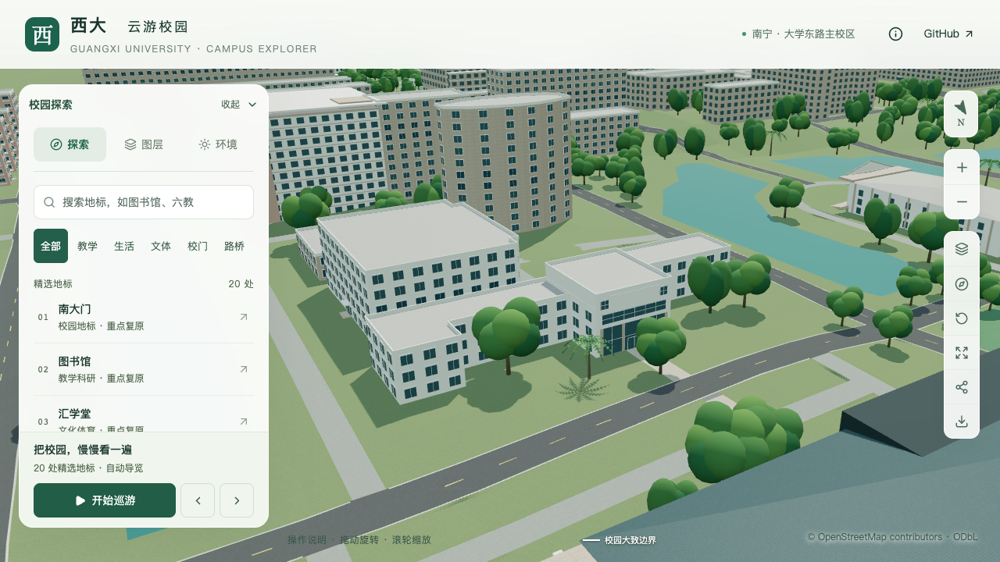

# 办公北楼北向门厅及前场连接

接续[中央高体量校准](OFFICE_NORTH_MASSING.md)，本批把办公北楼`way/671978896`的示意南侧入口迁移到北侧中央凸部，补充两层高玻璃界面、第三层横向窗带、顶层标识实墙及两端窄窗，并将门口接到映射道路。仍为第17条部分对象记录，不新增整栋验收数。

## 依据与采用参数

依据[广西大学基金会项目册](https://jjh.gxu.edu.cn/__local/A/1C/2D/C94DA67648AB9698A6BE04E1718_D3801DBD_2512297.pdf)PDF第35页、印刷第31页的具名照片。放大原页后可辨下部跨两层的玻璃界面、中央门、竖向实体分隔、上部横窗及顶层大面积标识墙；照片未显示独立外挑雨棚或成组台阶。定位沿用北侧第1边及后方网络大楼关系，照片拍摄时间未知，不主张为2026年测绘。

| 内容 | 本批采用 | 依据边界 |
| --- | --- | --- |
| 北向玻璃入口 | 第1边中点，总宽16.2米、三开间、四根分隔柱 | 位置和形制有照片支持，数量与尺寸作简化估算 |
| 玻璃高度 | 相对楼栋基准0.15至6.35米，横档3.3米 | 对应两层高界面，具体标高未测量 |
| 中央门 | 宽3.2米、高2.6米 | 固定共享玻璃与门框示意，不建门后内部 |
| 分隔柱 | 宽0.6米、深0.28米 | 全部限制在立面宽度内 |
| 第三层窗带 | 第1边比例0.07–0.93，高7.05–9.25米，六列两行 | 被树遮挡部分作连续简化，不声称精确窗数 |
| 顶层标识墙 | 中央0.18–0.82，高9.95–12.9米 | 表达实墙，金色文字与细檐口留待后续 |
| 顶层两端窄窗 | 各两列两行，高10.3–12.25米 | 可见窗组的估算简化 |
| 前场连接 | 宽4.4米，纵深约35米 | 宽度限制在中央柱间；纵深取现有地图道路，不以照片透视测距 |

原建筑轮廓和中央四层/侧翼三层保持。其他立面、整片停车前场、树木准确点位、材质色号及屋面设备仍未确认。当前窄连接只表达从门口到道路的连续通行部分，不代表完整实景广场边界。

## 数据与生成规则

新增`entrances.flushEntrance`，明确门槛、玻璃顶部、横档、奇数开间、柱与门框尺寸。入口必须落在一个实体分段内，尺寸受该分段高度约束；禁止叠加雨棚、台阶或内退门廊，也不能与同面外廊/窗格系统重叠。下部默认窗被替换，避免两层玻璃后再叠加普通窗。

既有`panels`补充`solid`类型，用共享浅色材质表达标识实墙，同时抑制对应默认窗；实墙不允许窗格行列。现有玻璃和花格规则保持。入口、柱、窗带和实墙在基础与近景中共用。

`front-connection`支持明确门槛的贴墙入口。4.4米连接面从门前起始，远端接`way/948683817`的实际道路三角面，沿程插值高度，面下局部削低粗地形并封闭自由侧边。6米宽方案会进入中央柱脚范围，故收紧到4.4米，并新增校验拒绝超过柱间净宽的配置。没有为适配旧接口而生成虚构台阶。

## 验证

139项数据测试通过；完整重建后完成道路接缝修复及增量更新，最终Pages构建通过。430栋普通建筑回归、门厅40处材质/深度采样及两个旧构件排除采样通过；四层中央与三层侧翼屋面保持。源文件、基础和近景使用同一门厅，旧模型在第一处玻璃采样仍命中实墙，反例有效。

前场在源模型及基础GLB各检查623处铺面和1,536处外围地形。压缩后铺面与地形最小净空约0.114米，外围地形误差小于0.007米，门槛连接偏差约3毫米。门扇/门框占据靠墙0.25米范围，检查通道遮挡从其外侧0.275米开始；闭合门扇与门框不是凭空挡路构件，本项不验证室内穿行或自动开门。初始检查把门框上沿及门梃误作前场障碍，已按这个明确边界分别检查门厅与接近通道。

另外发现真实导出问题：道路与小连接节点分别量化后，接触线偏移露出深覆盖片，源模型连续但基础GLB出现约0.113米高差。新贴墙入口改用0.012米浅覆盖，不再复用0.12米地形净空；原道路位置和上表面保持。实际复查最大相邻采样高差约0.027米，低于既定0.06米导出容差；边界少量材质缝的测得上限约1毫米。这是压缩精度范围内的通过，不宣称数学上无缝。

源对象对照仅办公北楼、局部地形与道路改变，新增一个前场对象；其他527个原有非树木对象及3,063株树属性保持。道路增量程序重生成的六个无关桥梁/引道源对象从基线保留，对应导出GLB本就逐字节一致。场地与树木实际网格检查通过。

69个GLB与静态包一致，仅基础和办公楼所在近景区块改变，其余67个文件、87个原基础节点保持；新增一个场地节点。首屏5,131,840 bytes，较上一批增加67,032 bytes；最大普通近景区块1,684,868 bytes。隔离副本再次增量重建保持91个基础节点和其他68个GLB，门厅及前场实际检查复查通过。

七张最终截图逐张核看。早期探索图标为被最终版本替代；手机尺寸下楼栋较小，不把截图完成等同于精细外观或手机真机性能验收。

| 调整前 | 北向门厅与前场连接 |
| --- | --- |
|  |  |

[门厅几何](model-checks/refinement/s2-office-entry-geometry.json) · [前场接口](model-checks/refinement/s2-office-entry-path-geometry.json) · [接缝修复前反例](model-checks/refinement/s2-office-entry-path-before-seam-fix.json) · [源对象保持](model-checks/refinement/s2-office-entry-source-preservation.json) · [资源预算](model-checks/refinement/s2-office-entry-assets.json) · [隔离增量](model-checks/refinement/s2-office-entry-incremental-assets.json) · [视觉核查](model-checks/refinement/s2-office-entry-visual-review.json)


## 性能对照

复用同日当前系统重放的S0，双方使用Apple M5、Darwin 27.0.0、Chromium 148.0.7778.96、1280×720、DPR 1，同一脚本每档三次至少30秒环绕。三次近景/全景往返完成，无浏览器错误。

| 三次结果或中位指标 | S0 | 本批 | 变化 |
| --- | ---: | ---: | ---: |
| 精细FPS | 60 / 60 / 60 | 60 / 60 / 60 | 0% |
| 流畅FPS | 30 / 30 / 30 | 29 / 29 / 29 | -3.33% |
| 精细三角形 | 4,019,920 | 4,158,694 | +3.45% |
| 流畅三角形 | 1,051,945 | 1,128,865 | +7.31% |
| 精细绘制调用 | 547 | 560 | +2.38% |
| 流畅绘制调用 | 263 | 288 | +9.51% |

符合帧率下降不超过10%、三角形及绘制调用增长不超过15%的门槛。24次CPU快照中，启动瞬间记录到累计CPU时间0.05秒的Python包装程序；六个计时窗口内未记录到超过2%阈值的Python或Blender计算。常规桌面活动保留，不推断独占设备、相同热状态或手机真机表现。

[性能数据](model-checks/refinement/s2-office-entry-performance-browser.json) · [负载快照](model-checks/refinement/s2-office-entry-performance-performance-context.json) · [汇总与文件指纹](model-checks/refinement/s2-office-entry-summary.json)

门厅几何专项默认读取仓库内保存的旧入口记录，可在没有本机临时基线目录时运行：

```sh
blender --background --python-exit-code 1 --python blender/validate_office_entry.py
```
