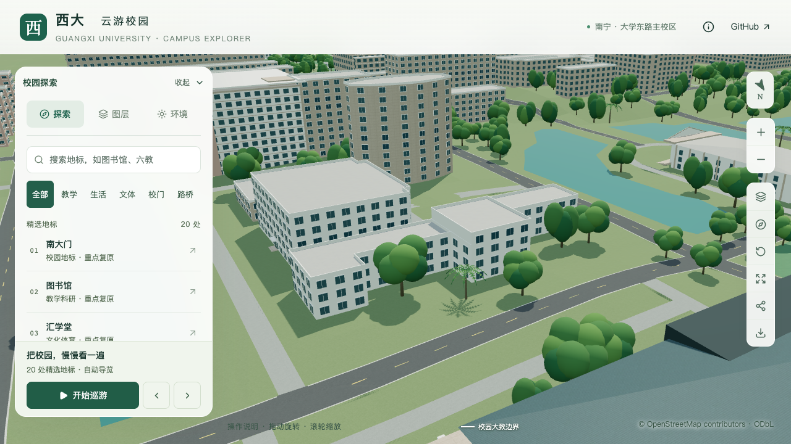

# 办公北楼中央高体量校准

本批对应 S2 扩展，目标为 `way/671978896` 办公北楼。原模型整栋按服务建筑默认三层、9.9米生成；现将北侧中央凸部改为四层、估算13.2米，两侧及其余部分保留三层、9.9米。新增一条部分校准记录，累计17条；入口、主要立面和完整屋面仍待核对，不计作整栋验收完成。

## 依据与边界

[广西大学基金会校园项目册](https://jjh.gxu.edu.cn/__local/A/1C/2D/C94DA67648AB9698A6BE04E1718_D3801DBD_2512297.pdf)PDF第35页、印刷第31页的办公北楼条目明确记载四层，对应照片可辨中央高块和两侧三层窗。文档元数据为2020-01-15，照片拍摄时间未知，不能据此认定2026年现状完全一致。

地图北侧第1边的约18米宽凸部，与照片的高门厅对应。地图西南侧网络大楼在照片后方偏右，支持北侧为所见正面的定位。中央两侧沿原第0、2边延伸到原第7边所在后墙，作为本次分界；这一后部深度尚无屋顶照片或测绘确认，因此仍属估算。

| 项目 | 采用值 | 依据状态 |
| --- | --- | --- |
| 最高层数 | 4层 | 校方具名文字记载 |
| 中央体量 | 约376.56平方米，13.2米 | 轮廓约束的分段、3.3米层高估算 |
| 两侧及其余体量 | 约901.48平方米，9.9米 | 可见侧翼三层，后部保留原三层示意 |
| 屋面 | 分段平屋面 | 可见轮廓支持，背部设备及檐口尺寸未确认 |

分段并集覆盖原轮廓，面积差小于`1e-9`平方米；没有扩展占地或重新绘制楼栋边界。基础和近景复用既有`parts`机制，分别采用各段高度及窗层数，无需修改通用生成器。

本批只处理高低体量。北侧门厅的门洞、平台及连接仍待专门校准，现有最长边示意入口不能当作真实入口。中央标识墙、窗列、墙面色彩以及侧翼和背立面仍未复原。办公南楼不随本批调整。

[资料索引](model-checks/refinement/s2-office-north-evidence.json)保存PDF哈希、核对页码及推断边界；原PDF和参考照片只保留本机，不随仓库分发。

## 验证

135项数据测试、完整模型重建和Pages构建通过。430栋普通建筑的共享形体与实际导出回归通过；本栋专项在中央和侧翼共16个位置向下采样，源文件、基础和近景均命中13.2米或9.9米的目标屋面，并检查屋面法线。容差分别为0.006、0.05、0.02米，以容纳源网格浮点误差和GLB量化误差。旧模型在中央第一处采样仍命中约9.902米，因此该反例被正确拒绝。

530个非树木对象仅办公北楼改变，其他529个对象的几何、UV、材质及变换保持，全部3,063株树实例属性保持。树木与建筑实际网格碰撞复查通过。69个GLB与生产静态包一致，只有基础GLB和`chunk-n1-n2`近景改变，其余67个文件、89个基础节点保持。首屏5,064,808 bytes，相对上一批增加504 bytes；最大普通近景区块1,684,868 bytes，均在预算内。

七张截图已逐张核看：全景、近景前后对照，以及关闭树木、夜景和手机尺寸。高低屋面可辨，树木遮住部分底层；手机尺寸下楼栋较小，不据此验收窗格或入口。本批未改变道路、场地或增量生成器，使用实际源对象和未受影响GLB逐项保持检查，未重复道路增量构建。

| 原整栋三层 | 中央四层、两侧三层 |
| --- | --- |
|  |  |

[实际屋面高度](model-checks/refinement/s2-office-north-geometry.json) · [旧模型反例](model-checks/refinement/s2-office-north-before-model-geometry.json) · [全校普通建筑](model-checks/refinement/s2-office-north-all-geometry.json) · [对象保持](model-checks/refinement/s2-office-north-source-preservation.json) · [资源核对](model-checks/refinement/s2-office-north-assets.json) · [树木碰撞](model-checks/refinement/s2-office-north-trees-geometry.json) · [视觉核查](model-checks/refinement/s2-office-north-visual-review.json)

实际模型专项可用以下命令重跑：

```sh
blender --background --python-exit-code 1 --python blender/validate_office_north.py
```


## 性能对照

复用同日当前系统重放的S0，双方使用Apple M5、Darwin 27.0.0、Chromium 148.0.7778.96、1280×720、DPR 1，同一脚本每档三次至少30秒环绕。三次近景/全景往返完成，无浏览器错误。

| 三次结果或中位指标 | S0 | 本批 | 变化 |
| --- | ---: | ---: | ---: |
| 精细FPS | 60 / 60 / 60 | 60 / 60 / 60 | 0% |
| 流畅FPS | 30 / 30 / 30 | 29 / 29 / 29 | -3.33% |
| 精细三角形 | 4,019,920 | 4,149,334 | +3.22% |
| 流畅三角形 | 1,051,945 | 1,126,303 | +7.07% |
| 精细绘制调用 | 547 | 556 | +1.65% |
| 流畅绘制调用 | 263 | 290 | +10.27% |

符合帧率下降不超过10%、三角形及绘制调用增长不超过15%的门槛。24次CPU快照未记录到超过2%阈值的Python或Blender工作；常规桌面活动保留，不推断独占设备或相同热状态。相对上一批的28 FPS变化不作为本次模型带来性能改善的证据。

[本批性能](model-checks/refinement/s2-office-north-performance-browser.json) · [负载快照](model-checks/refinement/s2-office-north-performance-performance-context.json) · [复用S0](model-checks/refinement/s2-arts-s0-current-os-browser.json) · [验收汇总和文件指纹](model-checks/refinement/s2-office-north-summary.json)
