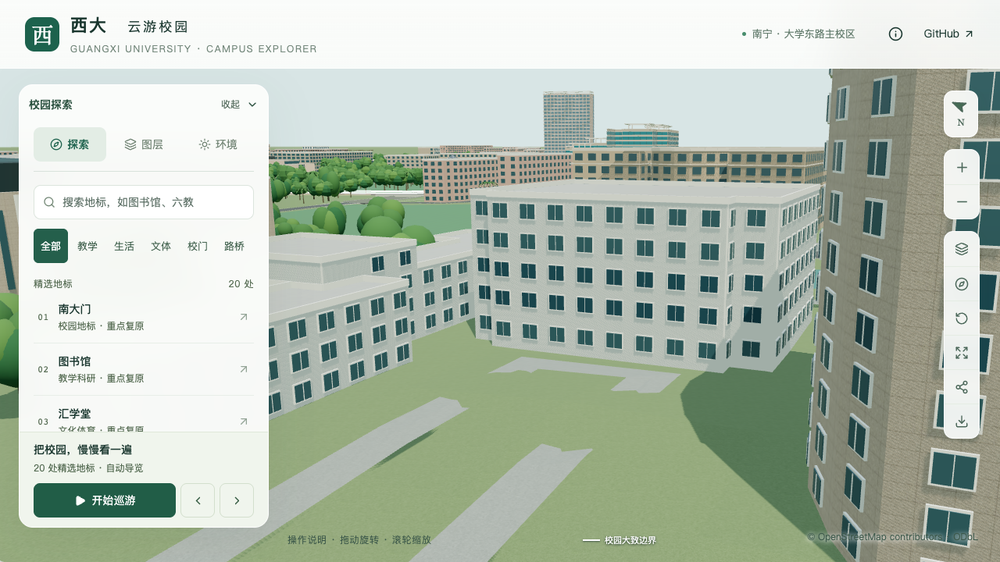

# 办公南楼西侧低门厅

> 本文保留低门厅批次的验收结果；后续柱后玻璃和门窗分隔见[玻璃界面校准](OFFICE_SOUTH_GLAZING.md)。

本批在既有五层主体和逐层文献高度上，细分西侧中央低门厅，增加四根圆柱、后退玻璃门与三级台阶，将主入口从原东侧最长边示意位置移到西侧中央。仍保留同一个 `way/759132930`、原始建筑轮廓及导航范围。

## 来源与采用边界

[2025 年校方寒假工作简报](https://ghjjc.gxu.edu.cn/info/1046/3490.htm)中的照片明确配文为分析测试中心门口，画面可见四根圆柱、内退中央玻璃门及上部实体招牌区。这与旧项目册的办公南楼照片对应，补足了此前缺少改造后外观的问题。网页发表于 2025-02-28，照片具体拍摄日期未知。

照片支持构件存在与柱子数量，不能直接提供精确尺寸或方位。西向入口是照片形制与原轮廓凸部的匹配推定；门厅取西侧凸条中央 76%，宽约 24.75 米、深 2.2 米，柱径 0.8 米。低体量按首两层文献高度合计为 8.7 米，主体仍为 20.4 米。门厅净高 4.2 米、门宽 6.8 米、平台高 0.6 米及三级台阶均标为估算。

门厅上部取消通用窗列，表达照片中的实体招牌区。后方侧玻璃、招牌颜色与文字、两端竖向玻璃及屋顶凸出仍待后续核对，本批不计作整栋校准完成。原照片只留在本机作为参考，不用作纹理或随仓库分发。

[取证及尺寸记录](model-checks/refinement/s2-office-south-entry-evidence.json)保存网页、图片指纹和字段依据。资料排查中另一张排水养护照片虽与西宿 3 栋出现在同一段文字中，画面建筑标识实际为工程训练中心，因此没有用于宿舍校准。

## 模型规则

`floorHeights` 现在支持从同一地面基准开始的高低分段。每段必须取前 N 层，分段高度与对应层高之和一致；高主体、低门厅及门厅上方露出的主体墙面分别使用对应层高表。外廊、专项窗格等尚按等层高生成的组合仍明确拒绝。

圆柱使用 16 边截面，基础和近景共用。门厅只占原映射边的一部分，台阶随门厅实际宽度截断，避免横跨两侧高体量。新增逐层分段路径使用重合边界恢复倾斜轮廓的有效区间；沿用等层高的既有导出路径保持。本楼主体与门厅直接共享分界顶点，避免布尔相减的浮点残片变成全高薄墙。

## 验证与效果

145 项 Python 测试、56 项 Node 测试、类型检查、lint、完整模型与 Pages 构建通过。430 栋普通建筑的源文件、基础和近景回归及实际树冠检查通过。只有办公南楼源对象改变，其他 530 个非树木对象及 3,063 株树保持。

专项射线在源文件及实际两级 GLB 中检查三处低屋面、平台和顶棚底面、三处柱间开口、四根圆柱的轴向与偏心截面、后退玻璃门、实体上部以及三级台阶。主体原有的三处屋面及四十处非等距窗带检查继续通过。旧实心模型在低屋面检查失败；台阶修复前副本在最低一级落地检查失败，避免仅用“踏面高于地面”掩盖底部悬空。

首屏模型为 5,134,224 bytes，比上一批增加 2,096 bytes；最大普通近景区块为 1,684,868 bytes。仅 `base.glb` 和 `chunk-n1-n2.glb` 改变，其他 90 个基础节点及 67 个 GLB 保持；69 个模型与生产包一致。

七张最终桌面远近、树开关、夜间及手机尺寸画面已逐张核看。手机使用较正的西侧视角，入口可见；这不是手机真机性能测试。前场仍沿用已有示意铺地，本批不宣称完成道路到入口的场地连接验收。

[几何检查](model-checks/refinement/s2-office-south-entry-portico.json) · [层高回归](model-checks/refinement/s2-office-south-entry-storeys-geometry.json) · [旧体量反例](model-checks/refinement/s2-office-south-entry-before-portico.json) · [台阶悬空反例](model-checks/refinement/s2-office-south-entry-step-gap-control-portico.json) · [资产与体积](model-checks/refinement/s2-office-south-entry-assets.json) · [画面核查](model-checks/refinement/s2-office-south-entry-visual-review.json)

使用同日同环境 S0、Apple M5、Darwin 27.0.0、Chromium 148.0.7778.96、1280×720、DPR 1 对照；每档三次至少 30 秒采样。

| 指标 | S0 | 本批 | 变化 |
| --- | ---: | ---: | ---: |
| 精细 FPS | 60 / 60 / 60 | 60 / 60 / 60 | 中位数 +0.00% |
| 精细三角形中位数 | 4,019,920 | 4,155,556 | +3.37% |
| 精细绘制调用中位数 | 547 | 560 | +2.38% |
| 流畅 FPS | 30 / 30 / 30 | 28 / 28 / 28 | 中位数 -6.67% |
| 流畅三角形中位数 | 1,051,945 | 1,131,907 | +7.60% |
| 流畅绘制调用中位数 | 263 | 293 | +11.41% |

帧率下降不超过 10%、三角形与绘制调用增长不超过 15% 的门槛通过。三次近景/全景往返完成，无浏览器错误。24 次进程快照中，六个计时窗口内未记录到超过 2% 阈值的 Python/Blender 计算；日常桌面活动仍保留，不声称设备独占。

[性能原始数据](model-checks/refinement/s2-office-south-entry-performance-browser.json) · [进程快照](model-checks/refinement/s2-office-south-entry-performance-performance-context.json) · [本批汇总](model-checks/refinement/s2-office-south-entry-summary.json)

| 原西侧示意体量 | 低门厅和四圆柱 |
| --- | --- |
|  |  |

复查命令：

```sh
python3 -m unittest discover -s scripts -p 'test_*.py'
blender --background --python-exit-code 1 --python blender/validate_office_south_entry.py
blender --background --python-exit-code 1 --python blender/validate_office_south.py
```

当前累计仍为 18 条部分对象记录，不新增整栋验收数。S2 的 20–30 栋、S3 六栋邻楼及后续 S4/S5 继续按原计划推进。
