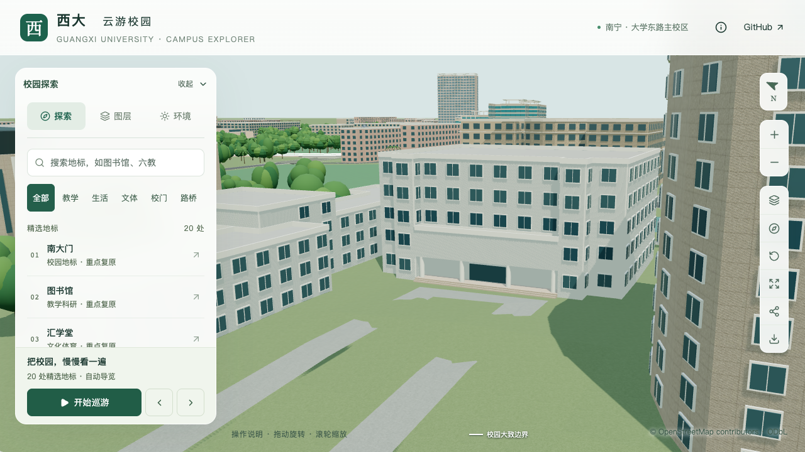
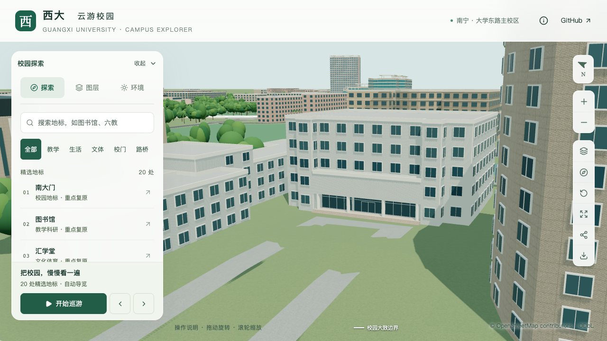

# 办公南楼柱后玻璃界面

在上一批低门厅和四圆柱的基础上，补上左右连续窗面、中央门区、双扇门分隔和上亮窗。此前两侧还是实墙，中央也只有一片未分格玻璃；本批让柱后界面更接近校方照片中的三段构成。

## 来源和尺寸边界

继续使用[2025 年校方寒假工作简报](https://ghjjc.gxu.edu.cn/info/1046/3490.htm)中明确标注的分析测试中心入口照片。照片支持左右玻璃和中央门区、横向上亮窗的存在；总宽、窗格数量与门扇尺寸并非实测。原图不随模型分发或作为纹理。

采用总宽 22.8 米、高 3.25 米的三段界面，中段宽 6.8 米，与原入口范围一致。左右各简化为四列玻璃，中央双扇门宽 3.2 米、高 2.35 米，横向上亮窗分隔位于平台上方 2.65 米。框架宽 0.075 米，颜色沿用共享材质，不能据此认定现场框色。所有尺寸及分格均在[取证记录](model-checks/refinement/s2-office-south-glazing-evidence.json)中标为估算。

主体、低门厅、四圆柱、台阶、原始建筑轮廓、入口方向及逐层高度沿用上一批。招牌、两侧竖向体量和完整前场仍待进一步校准。

## 数据和生成

新增 `entrances[].recessGlazing`，仅适用于已解析的内退柱廊入口。参数分别表达总玻璃宽度、中央门区、实际门扇及左右窗列，避免把整面玻璃误当成一扇大门。左右窗面根据总宽、中段宽和间隔生成；尺寸、计数和门上方空间均进行约束。

玻璃必须位于主体后墙上，并被柱廊后缘覆盖；仅检查前缘宽度不足以保证梯形柱廊后部容得下玻璃。玻璃总高也必须低于柱廊顶棚。此规则与原默认门、贴墙门厅、附加雨棚等入口系统互斥，避免重复几何。

基础和近景共享三段玻璃、主框、窗梃及门扇分隔，继续使用已有玻璃与白色材质。未启用该参数的楼栋沿用原生成路径。

## 验证与效果

149 项 Python 测试、56 项 Node 测试、类型检查、lint、模型与 Pages 构建通过。430 栋普通建筑回归和实际树冠检查通过。源文件只有办公南楼改变，其他 530 个非树木对象与 3,063 株树保持。

专项检查在源文件、基础及近景 GLB 中各核查 23 处玻璃、17 处框架和 3 处范围外点，检查首个可见交点的材质、深度及外侧法线，防止隐藏在实墙后的玻璃被误认为正确。旧模型在第一个侧窗检查点命中白墙，形成有效反例。既有逐层高度、低门厅、圆柱与台阶检查继续通过；柱间净空检查止于后墙前 0.25 米，闭合门框的 0.16 米突出量由独立首交点检查覆盖，不视为通道封堵。

首屏模型 5,135,432 bytes，比上一批增加 1,208 bytes；最大普通近景区块 1,684,868 bytes。仅 `base.glb` 与 `chunk-n1-n2.glb` 改变，其他 90 个基础节点、67 个 GLB 保持；69 个模型与生产包一致。

七张最终日夜、近远景、树开关及手机尺寸画面已逐张核看。玻璃保持在柱后，左右窗面及中央双扇门可辨。手机是桌面浏览器视口模拟；完整前场接路仍不在本批验收范围。

[专项玻璃检查](model-checks/refinement/s2-office-south-glazing-glazing.json) · [旧模型反例](model-checks/refinement/s2-office-south-glazing-before-glazing.json) · [柱廊回归](model-checks/refinement/s2-office-south-glazing-portico.json) · [层高回归](model-checks/refinement/s2-office-south-glazing-storeys-geometry.json) · [资产检查](model-checks/refinement/s2-office-south-glazing-assets.json) · [画面核查](model-checks/refinement/s2-office-south-glazing-visual-review.json)

同日同环境 S0 对照：Apple M5、Darwin 27.0.0、Chromium 148.0.7778.96、1280×720、DPR 1，每档三次至少 30 秒采样。

| 指标 | S0 | 本批 | 变化 |
| --- | ---: | ---: | ---: |
| 精细 FPS | 60 / 60 / 60 | 60 / 60 / 60 | 中位数 +0.00% |
| 精细三角形中位数 | 4,019,920 | 4,156,180 | +3.39% |
| 精细绘制调用中位数 | 547 | 555 | +1.46% |
| 流畅 FPS | 30 / 30 / 30 | 27 / 28 / 28 | 中位数 -6.67% |
| 流畅三角形中位数 | 1,051,945 | 1,132,219 | +7.63% |
| 流畅绘制调用中位数 | 263 | 293 | +11.41% |

帧率下降不超过 10%、三角形和绘制调用增长不超过 15% 的门槛通过；三次近景/全景往返无错误。24 次进程快照中，六个计时窗口未记录到超过 2% 阈值的 Python/Blender 计算。日常桌面活动保留，不声称设备独占。

[性能数据](model-checks/refinement/s2-office-south-glazing-performance-browser.json) · [进程快照](model-checks/refinement/s2-office-south-glazing-performance-performance-context.json) · [本批汇总](model-checks/refinement/s2-office-south-glazing-summary.json)

| 调整前 | 柱后玻璃和中央门区 |
| --- | --- |
|  |  |

```sh
python3 -m unittest discover -s scripts -p 'test_*.py'
blender --background --python-exit-code 1 --python blender/validate_office_south_glazing.py
blender --background --python-exit-code 1 --python blender/validate_office_south_entry.py
```

当前仍为 18 条部分对象校准记录，本批不增加整栋验收数。S2 的 20–30 栋、S3 六栋邻楼及后续 S4/S5 继续按原计划推进。
