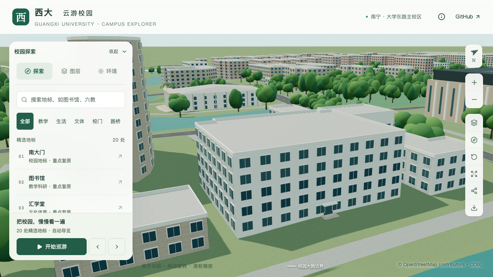
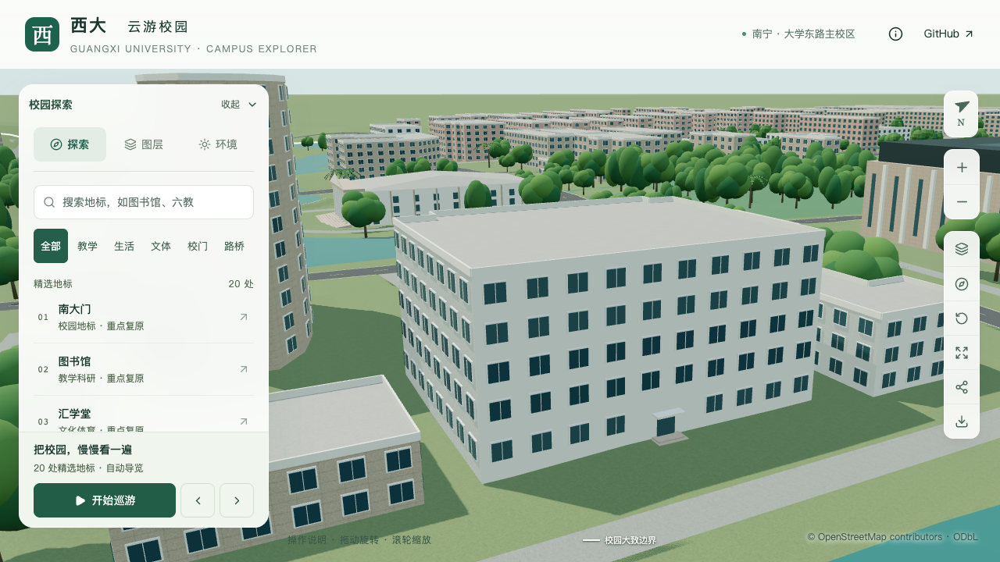

# 办公南楼逐层高度校准

> 本文保留层高批次的验收记录。后续低门厅分段、入口位置和分段层高支持已更新，当前状态见[办公南楼门厅](OFFICE_SOUTH_ENTRY.md)。

办公南楼 `way/759132930` 的主体由 16.5 米调整为 20.4 米，保留五层：底层 4.8 米，其余四层各 3.9 米。窗层随各层实际采用的高度排布，不再平均分配总高度。原轮廓、名称、稳定 ID 和导航范围保持。

## 依据与适用范围

[2021 年校方改造咨询公告](https://www.gxu.edu.cn/info/1006/27078.htm)给出分析测试中心项目面积 6418 平方米、五层及上述层高。[2022 年校方调研报道](https://news.gxu.edu.cn/info/1002/39995.htm)明确分析测试中心位于办公南楼，使用五个楼层约 6400 平方米，并已基本完成改造。项目册 PDF 第 35 页的办公南楼条目也记载五层、6418 平方米，三项资料共同完成楼栋对应。

这些是文献记载的层高。20.4 米是逐层相加得到的主体高度，不等于竣工测量的总建筑高度，也未计入屋顶突出物。2022 年生命科学分中心改造公告对应行健文理学院 5 号楼，不能用于此楼。

旧项目册照片可见中央较低的门厅、两侧竖向体量和平屋面。OSM 轮廓只提供西侧凸条，内部边界和改造后外观尚未确认。本批先落实层高；低门厅分段、屋顶突出物、主要立面和真实入口仍待核对。现有东向最长边示意入口没有作为实景入口验收。窗高、窗宽和窗列仍为通用估算。

[取证记录](model-checks/refinement/s2-office-south-evidence.json)保存来源、网页指纹、旧值和采用值；原网页与照片只作本机参考，不用作模型纹理。

## 数据与建模

人工覆盖表增加 `floorHeights`，按由下到上的顺序保存各层高度，必须与完整层数逐项对应。解析器校验有限正数、层数和总高度，拒绝与统一 `floorHeight` 或不一致的显式 `height` 并用。有人工逐层高度时优先于 OSM 总高度，冲突进入报告；移除覆盖后恢复 OSM/默认规则。

当前仅支持未分段主体及普通窗列。仍使用等层高假设的外廊、专项窗格、窗带和分段配置会被明确拒绝，避免只改数据而让生成器继续按平均层高建模。之后对本楼门厅分段时需相应扩展，不能绕过此检查。

派生 `form` 和每段立面携带同一层高表；基础与近景使用累计层高定位窗层。资料字段将“确认的文献层高”和“推导的主体高度”分开，也不再为此楼附加未使用的“默认 3.3 米层高”说明。

## 验证

142 项 Python 测试、56 项 Node 测试、类型检查、lint、完整模型构建及 Pages 构建通过。430 栋普通建筑回归、实际树冠检查通过。源文件只改变办公南楼，其他 530 个非树木对象和 3063 株树保持。

专项检查在源文件、实际基础 GLB 和近景 GLB 中分别采样四处屋面、四十处窗带内外点，并检查两处示意入口上方的排窗。旧 16.5 米模型在屋面检查失败；另一个总高正确但仍平均分层的反例用于识别错误窗层，而非只验证总高度。近景核查发现高底层窗与示意入口雨棚交叠后，补充入口占用范围的排窗，并以修复前模型验证反例。

69 个 GLB 与生产包一致，仅基础文件及 `chunk-n1-n2.glb` 改变；90 个其他基础节点、67 个其他 GLB 保持。首屏模型 5,132,128 bytes，增加 288 bytes；最大普通近景区块 1,684,868 bytes，符合原预算。

| 调整前 | 文献逐层高度 |
| --- | --- |
|  |  |

[专项几何](model-checks/refinement/s2-office-south-geometry.json) · [旧模型反例](model-checks/refinement/s2-office-south-before-geometry.json) · [平均分层反例](model-checks/refinement/s2-office-south-equal-storeys-control-geometry.json) · [入口排窗修复前](model-checks/refinement/s2-office-south-before-window-fix-geometry.json) · [源对象保持](model-checks/refinement/s2-office-south-source-preservation.json) · [资产检查](model-checks/refinement/s2-office-south-assets.json)

本楼新增为第 18 条部分对象校准记录，不计作整栋完成。下一步需获取改造后外观，并确认西侧门厅和竖向体量的映射边界。

```sh
blender --background --python-exit-code 1 --python blender/validate_office_south.py
```

## 性能与交付

复用同日重放的 S0，使用相同 Apple M5、Darwin 27.0.0、Chromium 148.0.7778.96、1280×720、DPR 1 和生产预览脚本。每档三次至少 30 秒活动，三次近景/全景往返完成，无浏览器错误。

| 指标 | S0 | 本批 | 变化 |
| --- | ---: | ---: | ---: |
| 精细 FPS | 60 / 60 / 60 | 60 / 60 / 60 | 0% |
| 流畅 FPS | 30 / 30 / 30 | 28 / 27 / 28 | 中位数 -6.67% |
| 精细三角形中位数 | 4,019,920 | 4,161,816 | +3.53% |
| 流畅三角形中位数 | 1,051,945 | 1,132,325 | +7.64% |
| 精细绘制调用中位数 | 547 | 560 | +2.38% |
| 流畅绘制调用中位数 | 263 | 292 | +11.03% |

符合帧率下降不超过 10%、三角形与绘制调用增长不超过 15% 的门槛。24 次进程快照中，六个计时窗口内没有记录到超过 2% 阈值的 Python/Blender 计算；日常桌面活动保留，不声称设备独占或手机真机性能。早期排窗修复前的性能采样已主动停止，仅保留于本机工作目录，不用于本次验收。

七张最终目标楼栋画面已逐张核看，手机画面中目标可见但部分底层被近处建筑遮挡；窗扇尺寸和真实门厅仍不在本次验收范围。性能脚本另保存图书馆手机尺寸回归图。

[画面核查](model-checks/refinement/s2-office-south-visual-review.json) · [性能数据](model-checks/refinement/s2-office-south-performance-browser.json) · [进程快照](model-checks/refinement/s2-office-south-performance-performance-context.json) · [本批汇总](model-checks/refinement/s2-office-south-summary.json)
