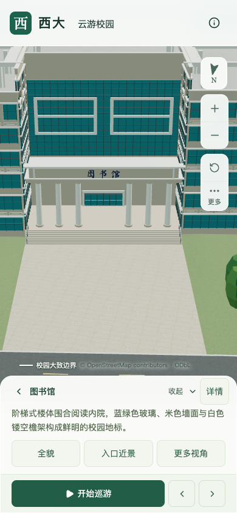

# 当前资产性能复核（2026-09-15）

当前版本通过常规桌面条件下的固定图书馆镜头性能回归门槛。此次将保存的 S0 生产包与当前生产包在同一台机器上依次重测，双方各完成精细/流畅三次30秒活动及三次近景加载往返，没有页面、控制台或资源加载错误。

本次不修改模型。先前的外部计算干扰记录保留，新增报告只适用于下列当前资产，不改写历史版本的验收结论。

## 结果

下表为各档三次活动结果的中位数。帧率门槛为下降不超过10%，三角形和绘制调用增幅分别不超过15%。

| 指标 | S0 重新测量 | 当前版本 | 变化 |
| --- | ---: | ---: | ---: |
| 精细档 FPS | 60 / 60 / 60 | 60 / 60 / 60 | 0% |
| 流畅档 FPS | 30 / 30 / 30 | 30 / 30 / 30 | 0% |
| 精细档渲染三角形 | 4,014,819 | 4,134,737 | +2.99% |
| 流畅档渲染三角形 | 1,053,826 | 1,121,897 | +6.46% |
| 精细档绘制调用 | 537 | 542 | +0.93% |
| 流畅档绘制调用 | 269 | 291 | +8.18% |
| 首屏模型与树模板 | 5,051,912 bytes | 5,012,720 bytes | −39,192 bytes |

当前最大普通近景区块为1,684,868 bytes；首屏低于6,000,000 bytes，普通区块低于2,000,000 bytes。历史基线、当前公开资源与当前生产包各69个模型均逐文件核验体积和SHA-256，当前公开资源与生产包一致。

## 条件与负载审阅

两版使用同一 Apple M5、macOS Darwin 25.5.0、Chromium 148.0.7778.96、1280×720视口及DPR 1。两版调用同一个浏览器检查脚本，通过相同按钮设定图书馆北侧、日间、画质和环绕；每档使用新浏览器上下文、加载后热身，每轮活动至少30秒。基础场景、加载预算和资产差异本身属于待比较的产品变化。

两版各记录24次、间隔约10秒的进程快照。正式活动期间有 WindowServer、Codex、索引、浏览器等桌面活动，也有短时 Git/Python 进程。当前版捕捉到的两个 Python 进程PID不同，进程年龄分别为0/1秒，采样时累计CPU用量为0.47/0.20秒；后续高于2% CPU的采样中未再出现，最终进程检查也已不存在。没有观察到前次持续约90秒的外部计算负载。

本次人工审阅按常规桌面回归条件接受这些短时波动；不能仅以启动瞬间的CPU百分比推定持续计算干扰。两档所有重复结果稳定、数值门槛通过，设备及运行配置一致，因此关闭当前版本的固定镜头性能待验收项。该结论**不证明独占CPU/GPU、完全相同的热状态或电源模式**；10秒采样可能遗漏短任务，帧率达到60/30上限也不等于已经测出性能余量。手机截图仅为桌面浏览器的390×844视口模拟，不作真机性能结论。

## 资产与验收范围

- 当前模型清单：`290489af154933bcb59e669c2d2b2b15a8051e601251d7cbb700968a0fae6360`。
- 当前可编辑源文件：`472acca20878dad3c675cafbb692f51dce75626cc4ac927fb423213e02c518b5`。
- S0重放清单：`1ab1452d99e47dbb47ab79d9bc967de3a509b7269a8b2073c922ef8ccca05b76`，内容与原 `baseline-fixed-browser.json` 所记录的清单一致。

已复核[东翼外廊原汇总](model-checks/refinement/s2-east-gallery-summary.json)的13项实现指纹及16项证据指纹仍与当前文件一致，其几何、画面和增量维护通过结论可以承接。本次补齐该**局部外廊批次**的性能依赖；没有重新运行或扩称其他版本、其他镜头的专项几何验收。

20–30栋整栋校准、图书馆六栋必需邻楼及完整场地、S4庭院/湖边组织与其余S5工作仍未完成。累计12条部分楼栋记录，本次新增整栋验收数为零。湖岸、铺地和低矮景观历史批次的完整验收仍需各自对应的当前几何与资料证据，不能只靠本次活动帧率一并关闭。

## 原始证据

[基线浏览器记录](model-checks/refinement/s5-perf-20260915-baseline-browser.json) · [基线负载](model-checks/refinement/s5-perf-20260915-baseline-performance-context.json) · [当前浏览器记录](model-checks/refinement/s5-perf-20260915-current-browser.json) · [当前负载](model-checks/refinement/s5-perf-20260915-current-performance-context.json) · [汇总与指纹](model-checks/refinement/s5-perf-20260915-summary.json)。

原始手机尺寸画面已逐张核看：S0是旧门廊及前场树位；当前画面可见六柱、双回形幕墙和连续铺地。这只补充所加载版本的画面证据，不代替完整场地或相邻楼栋的验收。

