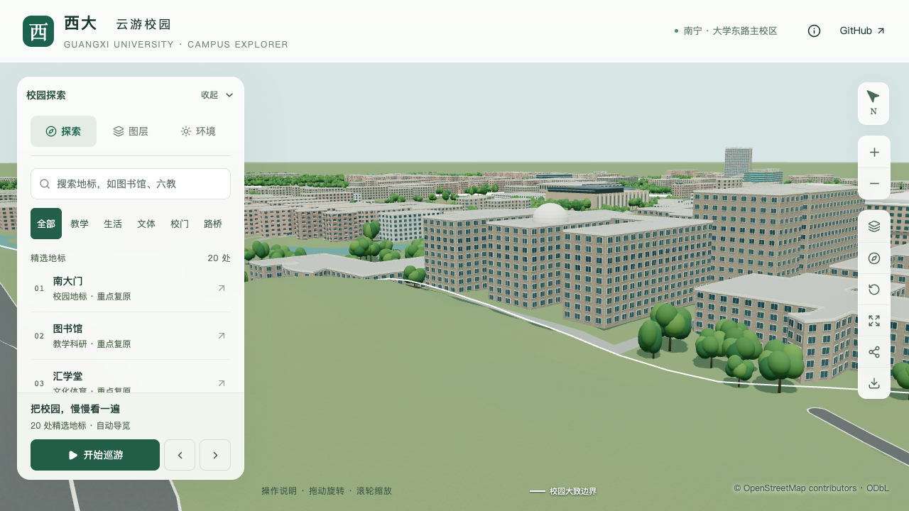
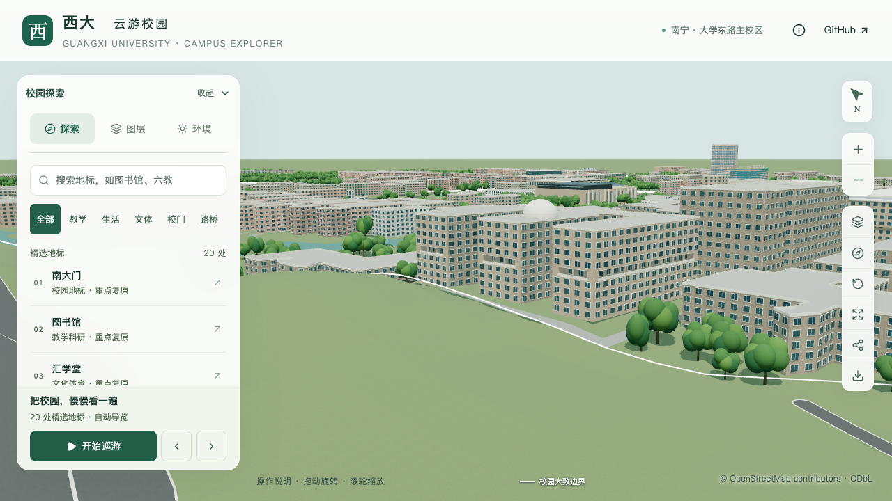

# 物理学院：第五层外廊与层数核对

> 2026-09-16，`dev`。接续[屋顶穹顶](PHYSICS_BUILDING_ROOF.md)，本批校准六个外侧立面的中部凹入带，整栋尚未完成。

## 资料如何约束本批

[华蓝设计团队2021年项目详解](https://m.thejie.com/writing/10723)中的分层示意图标注1–2F、3–5F、6–9F，为既有9层记录补充了设计方依据。本文从保留[华蓝原文链接](https://mp.weixin.qq.com/s/MRUSpW4nENHUQ0XUnb0Hhg)、项目团队署名的转载页读取；原微信页本轮未能读取。图示属于设计表达，并非竣工测绘。

详解中的正面、相对两侧和西侧三翼端面实景，与[设计方官网项目照片](https://www.gxhl.com/work/jianzhugongcheng/887.html)及学院具名横幅互相补充。上部四层窗、其下开放层与下部体量支持将中部凹入带对应到第五层。位置依据与模型尺寸分开记录：照片支持凹入形态，2米深度、0.9米栏板及柱距仍为估算。图文索引与本地文件指纹见[证据记录](model-checks/refinement/s2-physics-corridor-evidence.json)。

本批采用范围为 `way/957404989` 原外环第0、6、14、15、16、17边，即三个西端面和北、东、南外侧长立面。庭院内侧没有直接套用同一规则。只开放零基楼层索引4，不将整个第五层做成没有后墙的架空层。

| 项目 | 修改前 | 本批 |
| --- | --- | --- |
| 层数依据 | OSM 9层 | 保持9层，补充设计方分层图及实景核对 |
| 主体高度 | 29.7 m | 保持；仍按9×3.3 m估算，实际层高和总高未确认 |
| 第五层外侧立面 | 实墙及外贴窗 | 在原轮廓内凹入2 m，补充楼板、后墙、栏板和简化柱 |
| 其余楼层 | 原实墙及窗列 | 保持墙面位置，不随中层外廊整体向内移动 |
| 端部及构件 | 未作该项校准 | 两端各保留2.4 m，柱截面0.5×0.55 m，栏板高0.9 m；均为估算 |
| 屋顶及场地 | 平屋面、穹顶及原有场地 | 保留穹顶、原轮廓、两个庭院、道路和树位 |

中层楼面在模型基准以上13.2米，板底16.32米；这两个数来自当前估算层高及0.18米示意楼板，不是现场标高。当前后墙仍使用通用窗列。实际窗组、下部大开口、入口台阶与接路、上部局部外廊、屋顶附房和构架继续待核对。

## 共享规则与回归范围

`openCorridor.lastLevel` 是包含末层的零基索引，省略时延续原有“从首层至最高层”的行为。解析器拒绝倒序、非整数和超过主体层数的范围。模型只在所选楼层生成凹入后墙、楼板、柱与栏板，并恢复其上方实体墙；普通窗列及显式门窗使用相同楼层范围，避免上层窗户被留在实体墙后面。

165项数据测试、60组立面方向/旋转小样及普通、显式窗户的楼层位置小样通过。旋转小样最初在大校园坐标上产生约0.1毫米浮点误差，现改为绕立面局部中点旋转，保留原0.1毫米小样阈值；实际校园坐标和压缩误差另由源文件/GLB专项检查覆盖。

专项报告检查第五层实际凹入、栏板、支柱、楼板及板底，上下实体墙、窗户位置和原庭院。旧模型因第五层仍是外侧实墙而失败，见[旧模型反例](model-checks/refinement/s2-physics-corridor-before-geometry.json)。最终记录见[实际几何](model-checks/refinement/s2-physics-corridor-geometry.json)、[全部外廊方向回归](model-checks/refinement/s2-physics-corridor-normals-geometry.json)和[本批汇总](model-checks/refinement/s2-physics-corridor-summary.json)。

| 修改前 | 第五层凹入后 |
| --- | --- |
|  |  |

累计仍为20条部分对象记录，新增整栋验收数为零。本批不把九层图文核对当作精确高度确认，也不把中部外廊当作入口和整栋立面已经完成。

## 最终资源与性能

仅目标源对象改变，其余530个非树木对象和3,063株树保持；69个GLB中只有基础模型和对应近景区块改变，其他90个基础节点、67个GLB保持。首屏5,150,788 bytes，增加3,964 bytes；最大普通近景区块1,684,868 bytes。完整构建、Pages、165项Python和56项Node检查通过。

同机同浏览器的图书馆活动镜头中，精细三次60 FPS，流畅三次29 FPS；相对S0的帧率变化0%/−3.33%，三角形增加3.55%/7.92%，绘制调用增加2.38%/11.03%，均通过原预算。三次LOD往返无错误；24次进程快照中，计时窗口未记录到超过2%阈值的Python/Blender计算。这是既定全局回归镜头的结果，不是物理学院所有近景或手机真机性能保证。七张本楼画面及图书馆手机尺寸回归已核看。
