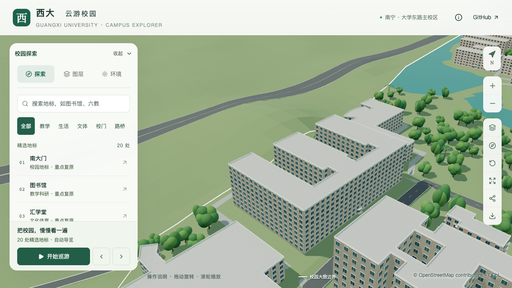
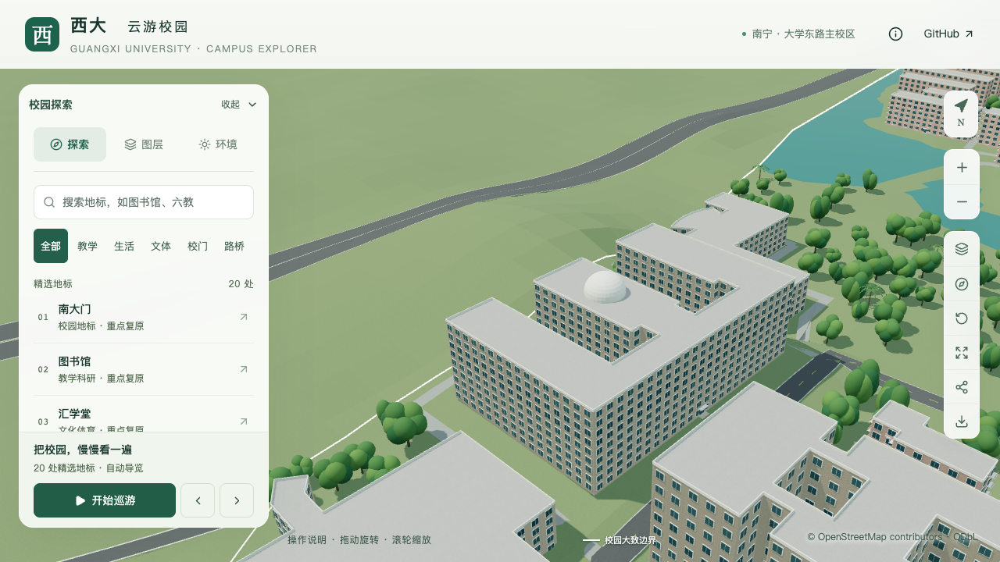

# 物理学院：中央屋顶穹顶

> 2026-09-16；开发分支 `dev`。目标 `way/957404989`，本批仅校准屋顶穹顶，整栋仍待核对。

## 资料与采用范围

[华蓝集团项目页](https://www.gxhl.com/work/jianzhugongcheng/887.html)提供大学生创新实验中心大楼的三张实景照片。其三条东西向主体、东侧连接及外观，与[物理学院首页具名横幅](https://physics.gxu.edu.cn/images/banner55555.jpg)和既有倒E形地图轮廓匹配。目标不与南侧的物理资治楼 `relation/11564998` 混用。

第三张鸟瞰照片明确显示中央翼段屋顶有白色穹顶。原模型只有统一平屋面，本批在原屋面上补充简化穹顶，使这一可识别轮廓在基础及近景中都存在。照片日期未知，项目页的2019年10月竣工日期不当作拍摄日期；来源和本地参考指纹见[证据索引](model-checks/refinement/s2-physics-evidence.json)。原照片不打包进公开资源，不用作模型纹理。

| 参数 | 本批取值 | 依据边界 |
| --- | --- | --- |
| 中心 | 本地 X/Y `[-678, -860.7]` | 照片相对位置与中央翼段轮廓约束估算 |
| 半径 | 7 m | 照片比例估算，非摄影测量 |
| 圆柱底座 | 0.8 m | 估算，从所支撑屋面起算 |
| 曲面增高 | 6.5 m | 上半椭球简化，不包含内部结构 |
| 当前顶点高度 | 楼栋基准以上37 m | 现有29.7 m主体加0.8 m底座和6.5 m曲面；不是建筑实测高度 |
| 主体 | 暂保留9层、29.7 m | OSM层数与3.3 m估算层高；尚未得到竣工尺寸确认 |

原倒E形轮廓、两个向西开放的庭院及示意入口保持。照片中的架空段和共享平台使数层口径需要进一步核对，不由窗排、电梯停层或2014年方案数据直接改写主体层数。屋顶附房、构架、东侧开放连廊、入口台阶、主要窗列和实际接路仍待完成。本批新增一条部分对象记录，累计20条，不等于完成20栋整楼验收。

## 实现约束

`roofDome` 只接受 `center`、`radius`、`drumHeight`、`rise`，需要逐字段来源记录。准备流程要求其圆形占地完整落在一个实体平屋面分段内，距外边界及内院至少0.5 m；拒绝跨段、坡顶和开放框架。底座高度从所支撑分段派生，后续修改主体高度时不会留下悬空穹顶。

32个周向分段与8个曲面分带由基础/近景共享，使用已有白色材质。顶部采用三角扇，避免极点退化四边形；构件落在同一普通建筑节点和区块中，继续使用现有拾取、图层和卸载机制。

## 验证记录

数据与实际模型检查见[数据报告](model-checks/refinement/s2-physics-data.json)、[穹顶专项](model-checks/refinement/s2-physics-geometry.json)和[本批汇总](model-checks/refinement/s2-physics-summary.json)。专项以独立固定参数检查顶部、三圈曲面、底座侧面、周围平屋面和原庭院，包含实际源文件、基础及近景GLB。旧模型缺少穹顶，在顶点检查中按预期失败，见[反例报告](model-checks/refinement/s2-physics-before-geometry.json)。

| 修改前 | 补充穹顶后 |
| --- | --- |
|  |  |

最终163项Python测试、56项Node测试通过。430栋普通建筑与3,063株树实际模型回归通过；源文件只有物理学院改变，其他530个非树木对象、90个基础节点和67个GLB保持。首屏5,146,824 bytes，增加4,112 bytes，最大普通近景1,684,868 bytes。

七张固定镜头画面和图书馆手机尺寸回归已核看。精细三轮60 FPS、流畅三轮29 FPS；相对同系统S0，三角形增幅3.45%/7.92%，绘制调用增幅2.38%/6.46%，符合原预算。三次LOD往返无错误，24次CPU快照在六个计时窗口内未记录到超过2%阈值的Python/Blender计算。手机仅为桌面浏览器尺寸模拟。[视觉检查](model-checks/refinement/s2-physics-visual-review.json)、[资产核对](model-checks/refinement/s2-physics-assets.json)及[验收汇总](model-checks/refinement/s2-physics-summary.json)保留完整范围与指纹。
