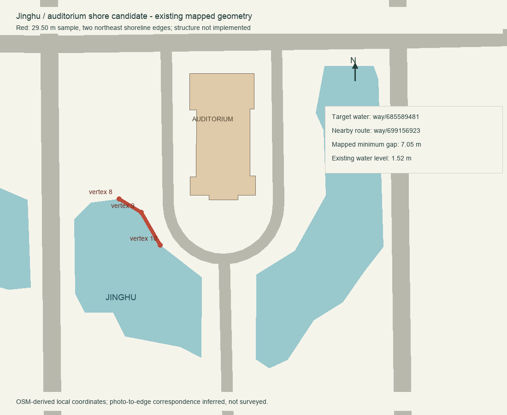
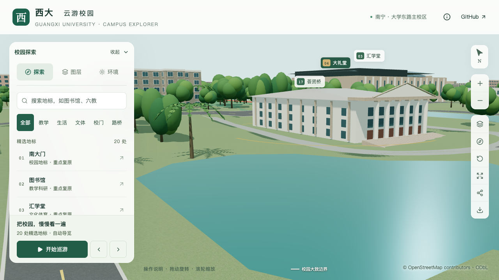
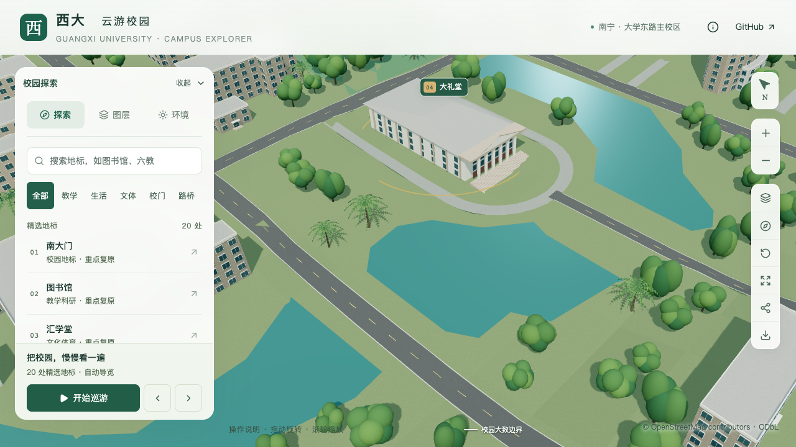
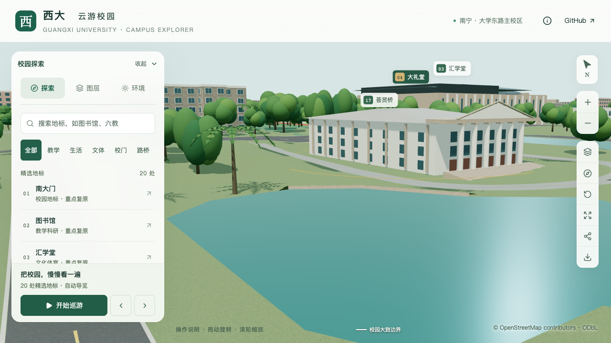

# 镜湖岸段校准

本页接续 S4 代表性湖岸任务。29.50 米砌石岸壁、岸顶压石和局部陆侧地形已实现，源文件、实际 GLB、原道路及全部树根检查通过。三轮活动测试的数值均达到门槛，但进程记录仍显示其他 Python/Blender CPU 活动，同条件性能验收仍待完成；下文保留修改前证据与估算界限。

## 样板范围及依据

选定镜湖 `way/685589481` 靠大礼堂一侧的两条东北岸边作为首个样本。使用现有水体顶点 8→9→10（从 0 编号），长度约 29.50 米；大礼堂为 `way/671978892`。坐标为项目米制坐标，X 向东、Y 向北、Z 向上。

| 锚点 | X / m | Y / m |
| --- | ---: | ---: |
| 顶点 8 | −428.738806 | −666.751140 |
| 顶点 9 | −418.551989 | −673.074116 |
| 顶点 10 | −409.750087 | −688.213636 |

图中红线是模型样本范围。灰色通道来自现有映射铺面，尚未叠加各准备模块的最终修正；实际施工连接必须采样最终铺面，不能把示意图作为高程依据。

[校方校园风光图库](https://www.gxu.edu.cn/info/1021/18800.htm)的“大礼堂前”“西校园镜湖”“西校园镜湖一角”可见砌石岸壁、岸顶步行空间及短柱。“大礼堂西侧”则可见草坪和低矮景观。这组资料支持按具体岸段区分硬岸与草地，未支持全湖统一铺装。图库未注明拍摄日期，不能表述为 2026 年测绘或实景记录。

[2024 年秋季第十周后勤简报](https://ghjjc.gxu.edu.cn/info/1046/3406.htm)中“大礼堂西南面镜湖岸边路灯修复”照片补充了该区域的草坡和置石信息，不能把近处草地推定成整圈硬岸。其他具名翠湖、鉴湖照片仍未定位到具体岸段，不采用其石柱铁链或植物配置作为本样板的直接依据。

**证据界限：**水体轮廓及建筑位置来自现有 OSM 数据；照片与所选东北岸的对应关系依据“大礼堂前”的具名说明和相对位置推断，没有精确摄影坐标。样板两端是本轮的工作边界。墙高和岸顶宽度采用下文明确标注的模型估算；短柱间距、排水口位置和植物种类没有可靠定位，未加入模型。原照片仅缓存于本地 `work/` 供核对，未加入网页贴图或文档图片分发。

[来源、图像哈希与范围记录](model-checks/refinement/s4-shore-evidence.json)保存逐张观察和未确认项；[候选参数](../work/refinement-s4-shore/proposed-bank.json)保存岸线修订哈希，供后续校验轮廓变化。

## 已复现的模型问题

从实际 `base.glb` 解码地形与水面，在两条样板岸边采样 12 个位置。岸线地形与向湖内偏移约 0.17 米的实际水面比较，水面高出约 **0.835–1.230 米**。现有模型缺少将这处水面边缘连接到岸上地面的实体岸壁。这是模型连接问题，不是现场高差测量。

[实际几何基线](model-checks/refinement/s4-shore-before-ground.json)保存全部采样。首次检查因导入对象带 `.001` 后缀未匹配而退出，修正对象选择后成功读取；原失败日志保留于 `work/refinement-s4-shore/ground-before.log`，有效日志为 `ground-before-checked.log`。

[修改前浏览器基线](model-checks/refinement/s4-shore-before-browser.json)记录两处镜湖固定镜头及沿用脚本的图书馆手机尺寸回归，无页面、控制台或资源错误。此处的“通过”仅指基线采集成功，不代表湖岸几何已合格。

| 修改前岸边近景 | 修改前周边俯视 |
| --- | --- |
|  |  |

## 原定建模约束

邻近通道 `way/699156923` 的原映射铺面距样板岸线最近约 7.05 米，环绕大礼堂并在东南接出。建立岸顶过渡前应核对其最终模型高程及可用宽度。不能把整个湖周地形统一抬高，也不能用水面以下的原地形加显示偏移充当岸顶。

1. 在单独岸段数据中保存稳定水体 ID、岸线修订、所选边、资料和估算参数。保留原水体轮廓、水位与表面数组索引。
2. 按实际地形和通道铺面建立“水面—岸壁—岸顶—外侧地面/通道”的局部连接。墙脚伸入水下，岸顶、外侧和两端有明确收口；只在照片支持的样本内采用硬岸。
3. 确认新硬质范围后执行树冠排除，受地形改变影响的保留树重新计算最终高程。不要在新增岸顶下面保留未更新的树根。
4. 让基础表示与可编辑源文件包含相同主轮廓，明确岸壁与铺地的图层归属。近景加载及水体/道路图层切换不能使连接构件重复或遗失。
5. 用本页 12 个失效采样和新增岸顶/外侧采样验证修复，检查实际源文件和解码 GLB 的接触误差；回归范围外地形、原道路、水位及岸线。
6. 重拍同组镜头，检查两端和外侧过渡，并完成原定资源和活动性能验收。完成后再更新本页实施状态。

以下为本批实施与验证；完整 S4、S2/S3 剩余楼栋校准和 S5 仍未完成。

## 已实现的局部岸段

人工输入为 [shore-overrides.json](../data/shore-overrides.json)，派生数据为 [shores.json](../public/data/shores.json)。岸段绑定水体 ID、轮廓修订哈希和两条原始边；最终道路、建筑、水体及场地组成环境修订哈希，防止使用过期的避让范围。

| 参数 | 本批采用值 | 依据性质 |
| --- | ---: | --- |
| 核心岸线长度 | 29.5019 m | 现有映射轮廓计算 |
| 水位 | 1.52 m | 保留原模型水位 |
| 岸顶高出水面 | 0.55 m | 模型估算，非测绘 |
| 压石宽度 | 0.40 m | 模型估算，非步道宽度 |
| 陆侧整形最大宽度 | 6 m | 局部模型连接参数 |
| 两端过渡长度 | 各 5 m | 沿相邻原岸线衰减 |
| 道路、建筑等安全退让 | 0.60 m | 模型保护范围 |
| 陆侧处理面积 | 250.764 m² | 裁去保护范围后的计算面积 |

岸壁由临水面、背面、压顶、底面和两端封口组成，墙脚同时低于原地面和水面。陆侧抬高逐渐回到原地形，保留大礼堂外侧既有环路；没有增建整圈硬质步道，也没有加入未定位的柱链、排水口或花坛。新硬质范围经过树冠排除，本批无需删树；3,111 株树的位置、树高和类型保留，2 条高程记录随最终网格重新计算。

完整准备顺序为最终道路 → 图书馆场地 → 岸段 → 植被分区。`shore_geometry.py` 在普通建筑及树木贴地前生成岸段，源文件与基础 GLB 常驻节点同属水体图层。岸顶为石材，不采用水面透明材质。

## 几何和画面验证

[实际源文件与 GLB 检查](model-checks/refinement/shore-geometry.json)重新检查原有 12 个失效岸站，并各执行 26 条岸壁水位射线。压石内部采样避开量化边界，原两端沿岸内移 5 cm；具体采样坐标已记录。模型陆侧 0.8 m 处高于水面至少 0.427 m（源文件）/0.435 m（GLB），原水面与道路采样高程不变。

源文件范围外 1,306 点最大高程变化约 0.000046 m；GLB 范围外 1,295 点最大变化约 0.0593 m，属于全校地形 15 位量化后的重采样误差。压石与陆侧地形接触差为源文件约 4.3–5.0 cm、GLB 约 −0.5–4.3 cm。这里的误差用于检查模型连接，不表示实景测量精度。

首次导出的局部地形存在 T 形接点：细分边与相邻长边独立量化后出现裂缝。修复统一了相邻面的边分段，并保留非平面四边形原来的三角划分。[投影覆盖检查](model-checks/refinement/s4-shore-projected-coverage.json)显示，40 × 49 m 检查矩形内，相对旧模型的缺失面积从 5.184 m² 降至浮点残差 2.32×10⁻¹³ m²。失败日志保留在本地，新增的两个回归用例分别验证压缩舍入接缝和非平面邻面保形。

[图书馆与全局地形回归](model-checks/refinement/s4-shore-site-geometry.json)检查 20,195 个范围外地形点和 310 个前场点，原有中央连接保持有效；该全局粗网格本次没有命中岸段排除区，岸段本身由上述局部密集检查覆盖。[全部树根检查](model-checks/refinement/s4-shore-tree-source.json)确认 3,111 株源实例与第五列高程一致，压缩地形接触误差小于 0.05 m。

[五组最终固定镜头](model-checks/refinement/s4-shore-final-browser.json)含岸段近景、周边俯视、两端近景和图书馆手机尺寸回归；[九种图层/夜景状态](model-checks/refinement/s4-shore-layers-interaction.json)验证水体、道路、建筑和植被开关及恢复，无浏览器错误。人工查看两端、日夜及各图层画面：岸壁连续，原环路与草地留白保留；水体关闭时岸壁同步隐藏，道路关闭时岸壁保留。两端草坡仍是估算过渡，其他未处理岸线仍维持原有示意地形。

| 修改后近景 | 修改后周边俯视 |
| --- | --- |
|  |  |

[资产核对](model-checks/refinement/s4-shore-assets.json)：69 个模型与生产包一致，首屏模型 5,684,344 bytes，最大普通近景区块 1,684,868 bytes。普通楼和图书馆近景文件全部保留；基础文件新增岸段并修改地形，时光之门因完整重建产生二进制差异，已另做[实际几何检查](model-checks/refinement/s4-shore-time-gate-geometry.json)。45 项 Python、54 项 Node、6 项岸段几何测试、类型检查、lint 和 Pages 构建通过。

## 前两轮活动性能记录

两轮均完成精细/流畅各三次 30 秒活动、七组固定镜头及三次 LOD 往返，无浏览器错误。按三轮结果的中位数与 S0 比较，FPS、三角形和 Draw Calls 均达到计划数值门槛；因出现其他高负载进程，两轮均未作为同条件通过依据。

| 第二轮配置 | 三轮 FPS | FPS 中位数变化 | 三角形中位数及变化 | Draw Calls 中位数及变化 |
| --- | --- | --- | --- | --- |
| 精细 | 60 / 60 / 53 | 0% | 4,114,089（+2.40%） | 531（−1.12%） |
| 流畅 | 30 / 30 / 30 | 0% | 1,088,845（+3.45%） | 258（−3.73%） |

首轮活动期出现 Python 142.3%、Blender 120.8% 采样；确认对应进程结束后复测，第二轮又出现 Python 99.1%、Blender 78.6% 及其他桌面负载。没有停止其他任务。第二轮共记录 27 次进程采样，18 次在活动时段；这是桌面浏览器测量，不是隔离基准或手机真机结果。

[首轮浏览器](model-checks/refinement/s4-shore-validated-browser.json) · [首轮并发条件](model-checks/refinement/s4-shore-validated-performance-context.json) · [第二轮浏览器](model-checks/refinement/s4-shore-timed-browser.json) · [第二轮并发条件](model-checks/refinement/s4-shore-timed-performance-context.json) · [汇总与哈希](model-checks/refinement/s4-shore-summary.json) · [人工画面复核](model-checks/refinement/s4-shore-visual-review.json)。

当前状态为“几何、画面、资源已通过，同条件性能验收待完成”。道路/篮球场增量流程已于 2026-09-13 通过[隔离端到端验证](model-checks/refinement/s4-incremental-summary.json)；普通铺地示例、行道树/庭院/低矮景观、S2/S3 整批楼栋及 S5 仍未完成。

## 增量维护验收（2026-09-13）

修复道路增量的未保存材质查找错误，以及篮球场增量对 Blender `.001` 名称后缀的误判。两份隔离副本分别把岸顶高出水面参数从 0.55 改为 0.65 m 后重新准备数据，运行实际增量脚本，再对源文件、解码 GLB、图书馆场地及 3,111 株树根验证。12 个岸站的源文件/GLB 压石高度均约为水上 0.65 m，证明更新实际生效。

两条流程保留其余 79 个基础节点、全部节点变换和图层属性；69 个资产均与清单匹配，实际仅基础 GLB 变化。生产 `.blend`、基础模型、模型清单和树位的哈希保持不变，生产岸顶参数仍为 0.55 m。该项已通过；岸段同条件性能验收仍待完成。[报告与哈希](model-checks/refinement/s4-incremental-summary.json)。

## 第三轮活动记录（2026-09-13）

完成增量维护检查后，对未改变的生产资产再测一次：精细 60/60/60 FPS，流畅 30/30/28 FPS；三轮中位数分别为 60/30。相对 S0，三角形中位数 +2.23%/+3.65%，Draw Calls +0.19%/−3.73%，全部数值达标。27 次进程采样中 18 次位于活动期，其中捕捉到 Python 100% CPU 活动；原采样缺少该进程的持续时间，无法排除对照条件受干扰，故仍未标记为同条件通过。

[第三轮浏览器](model-checks/refinement/s4-shore-final-timed-browser.json) · [第三轮并发条件](model-checks/refinement/s4-shore-final-timed-performance-context.json)。后续采样脚本增加父进程、运行时长及累计 CPU 时间，不采集命令参数；用于区分短暂命令与持续负载，不回写或改判已有测量。先继续其他场地与楼栋工作，保留这一验收项。
