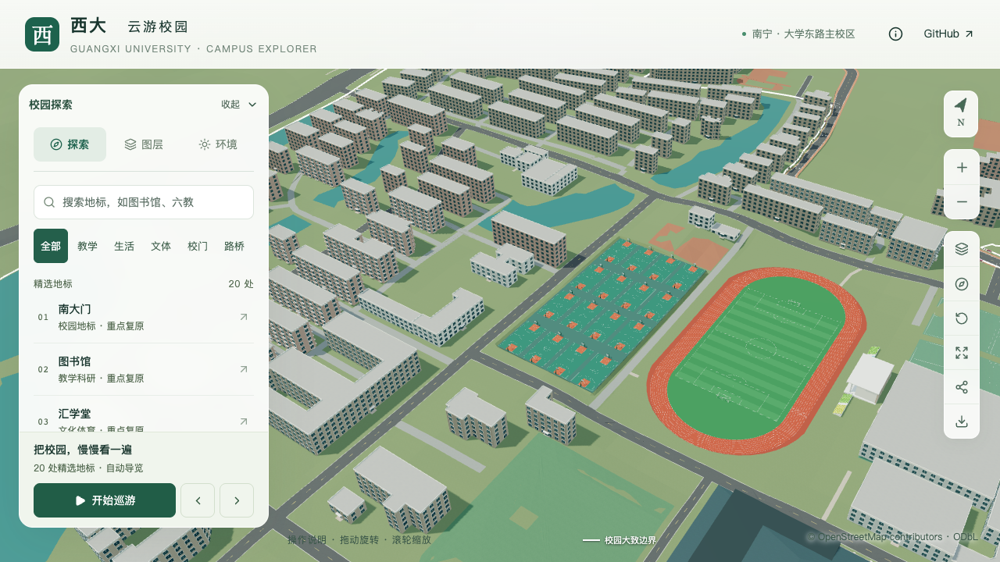

# 运动场同材质颜色合批扩展

2026-09-30。结构平台整栋复核后，流畅档绘制调用较S0增加14.83%，接近15%上限。本批扩展既有合批，为继续邻楼校准留出开销余量。农学院低翼、退台边界仍缺少可定位图纸或清晰侧后影像，不能用新增细节掩盖体量依据不足。

## 改动

沿用[sports-batching.ts](../lib/campus/sports-batching.ts)的严格材质、变换、阴影、图层和绘制范围检查，只扩展四个明确节点内的允许材质：

- 东、西田径场：原五种场面颜色加入球网和黄色座椅，每处由当前4组降至2组。
- 东、西两组篮球场：场面绿、限制区色和篮网色合成一组，每组由9组降至7组。

总计比修改前少8个绘制分组。篮球场外围铺装、球架金属、篮板玻璃以及运动场标线分别保留；标线仍采用原深度偏移与不投影设置。各节点的父级、图层与加载规则保持，不能跨场地或把粗糙度不同的颜色强行合并。

合并将线性RGB写入顶点属性，额外增加478,512字节（约467.3 KiB）颜色缓冲；这是属性数组容量，不是总显存测量。原网格按已有共享资源释放逻辑清理。合并后包围体扩大可能改变裁剪成本，因此需要活动性能实测；静态网格一致不能替代这项验证。

源Blender文件、69份GLB和公共地理数据保持不变；本轮仅重新构建Pages前端，没有重建模型或重新运行无关的Python建模测试。

## 验证

[实际Draco解码检查](model-checks/refinement/s5-sports-extended-decoded.json)覆盖四组共116,934个有向三角形，逐个比较位置、法线、线性颜色、UV和其他材质参数，按Float32一致。66项Node测试、类型检查、lint及Pages构建通过；新增测试覆盖篮球分组的白名单、标线/玻璃/外沿保留和重复调用。

[浏览器前后对照](model-checks/refinement/s5-sports-extended-visual.json)使用冻结的修改前生产包与修改后的当前包、同一资源及镜头。16张截图已直接核看，包含两处田径场、两组篮球场、夜景和390×844手机尺寸模拟；浏览器无错误。运动场地图层关闭后面数下降，恢复后回到原值。

八组前后对照的场景像素一致。四组整图相同；另外四组仅在侧栏“环境”太阳图标的坐标(262,189)有一个像素差异，RGB由(221,227,222)变为(222,227,223)。没有将这四组写作整图逐像素相同。[像素检查](model-checks/refinement/s5-sports-extended-pixel-review.json)保留差异范围。

| 固定视角 | 原绘制调用 | 当前绘制调用 |
| --- | ---: | ---: |
| 西田径场白天 | 374 | 366 |
| 东田径场白天 | 234 | 226 |
| 西田径场夜间 | 409 | 401 |
| 西田径场手机尺寸 | 138 | 134 |
| 西篮球场白天 | 332 | 324 |
| 东篮球场白天 | 264 | 256 |
| 东篮球场夜间 | 242 | 234 |
| 东篮球场手机尺寸 | 73 | 69 |



活动性能及最终结论见[联合汇总](model-checks/refinement/s5-sports-extended-summary.json)，继续使用同系统S0、每档三次30秒环绕、FPS下降不超过10%及三角形/绘制调用增幅不超过15%的原门槛。首屏模型仍为5,830,400字节，最大普通近景1,684,868字节。

最终测量：精细档60/60/60 FPS、绘制调用中位数559（较S0 +2.19%）、三角形4,268,643（+6.19%）；流畅档30/30/30 FPS、绘制调用299（+13.69%）、三角形1,205,631（+14.61%）。原预算通过。三次LOD往返、六张图书馆/普通楼回归画面通过；26次CPU快照在计时窗口未记录达到2%阈值的Python/Blender活动，十秒采样不证明完全隔离。流畅档三角形仍接近上限，不能把绘制调用余量当作可无限增加几何的余量。

本批不增加建筑验收数：22个校准对象中2栋首轮通过、20个部分校准；S3六栋邻楼与整体S0–S5仍未完成。后续继续农学院屋面分区和动物学院剩余体量/前庭核对。

## 复现

```sh
node --experimental-strip-types scripts/check-sports-batching.mjs <new-report-path>
npm test
npm run typecheck
npm run lint
npm run build:pages
```

固定画面对照使用 `scripts/check-sports-batching-browser.mjs <new-phase> --courts`，指定 `BEFORE_FRONTEND_ROOT` 为修改前静态包目录；也可沿用 `BEFORE_URL`。提供本机Playwright和Chromium路径，已有报告不覆盖。活动性能使用 `scripts/check-refinement-browser.mjs <new-phase>`。
