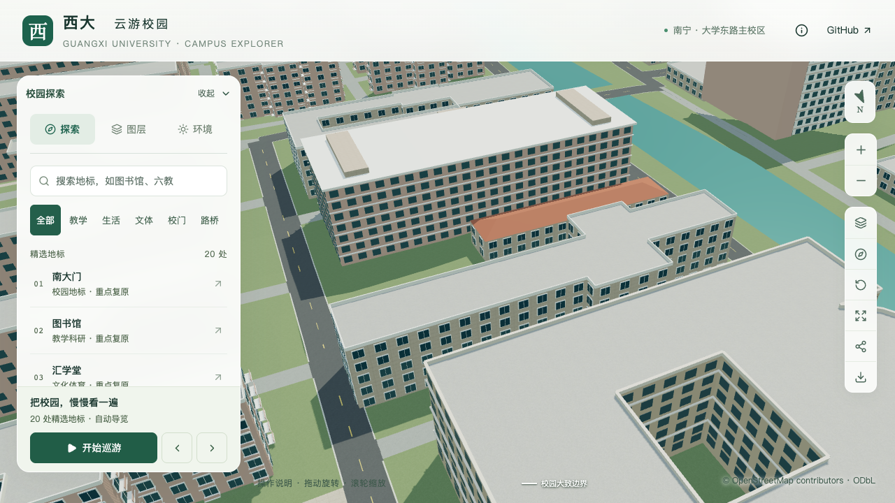
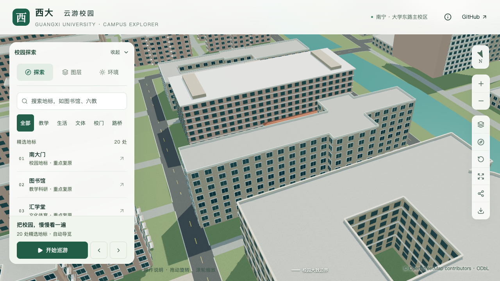

# 第三教学楼层数校准

楼栋：`way/759132933`。本批将类型默认五层调整为校方历史条目记载的八层，主体高度由 16.5 m 调整为 26.4 m。3.3 m 层高仍是估算，完整屋顶、各段高度、入口与立面尚未完成核对，不计为整栋实测或完整校准。

## 依据与限制

[校方基金会项目册](https://jjh.gxu.edu.cn/__local/A/1C/2D/C94DA67648AB9698A6BE04E1718_D3801DBD_2512297.pdf)的 PDF 第34页、印刷第30页，第2项明确命名西校园第三教学楼，并记载1985年建成、八层、面积4,696平方米。已逐页查看原排版，层数文字位于三教标题下方。具名配图可见开放外廊，但上部裁切，不能独立数全楼层，也不能确认所有立面的朝向。

[2022年12月23日考场安排](https://yjsc.gxu.edu.cn/info/1021/1534.htm)列出三教第一至第六层教室，支持存在六楼；它没有说明总层数，因此与八层记载不构成直接冲突。

[2026年公共楼宇管理询价公告](https://www.gxu.edu.cn/info/1364/40125.htm)附件1的服务清单列出同名三教及4,696平方米。该表未提供层数，不能独立确认八层；也不将服务面积除以地图占地面积来推算楼高。

项目册文件创建于2020年1月15日，公开发布日期及照片拍摄日期未知。资料支持历史记载，不能证明2026年的全部现状。OSM原标签没有层数，本批保留原标签、稳定ID、轮廓及版本，以人工覆盖记录采用理由。

## 当前表达与待核对项

- 层数采用八层，窗口沿用生成器的相同层数；基础和近景共享主体高度。
- 轮廓不变，未新增附楼、重画院落或改动导航分类。
- 未确认各段高度，整栋统一高度仍是简化表达；须继续核对各翼及楼梯间，不能称为逐段测绘。
- 完整屋顶未入镜，保留带估算标记的默认平顶。
- 主入口、外廊方位与范围尚未对应到具体地图边，保留原示意入口和立面规则。

历史配图与维修近照仅保存在本地取证目录，不作为贴图分发。来源登记沿用 `gxuDonationProjects`，本批未增加公共来源条目。

## 验证记录

构建前检查用新高度核对旧源模型，在三教主体轮廓处明确报出不一致，失败日志保存在本地本批工作目录。重建后的几何、资产、画面与性能结果由本批汇总记录统一说明。

两组固定相机分别检查三教立面与周边楼群，另有植被开启、夜景及手机尺寸画面。近景图关闭植被仅用于观察几何，不能作为实际景观复原的证据。手机视口可能依照现有预算使用基础模型，仍需保持同样的八层主体。

| 修改前：默认五层 | 修改后：资料八层 |
| --- | --- |
|  |  |

[来源与判断](model-checks/refinement/s2-teaching3-evidence.json) · [实际模型几何](model-checks/refinement/s2-teaching3-generic-geometry.json) · [资产不变项](model-checks/refinement/s2-teaching3-assets.json) · [近景浏览器记录](model-checks/refinement/s2-teaching3-close-context-browser.json)。

2026-09-13，本次层数修订验收通过。24项建筑形制及覆盖数据测试通过；430栋普通建筑的源文件和实际基础/近景几何检查通过，3,050株树的建筑表面碰撞检查通过。三教以外522个源对象、82个基础节点和67个GLB文件保持；69个模型及派生数据与生产预览包一致。完整构建仍成套保留时光之门旧源对象与压缩几何，未解决其生成过程的全局字节确定性。

17张画面逐张核对，包含近景、楼群、植被开关、夜景及手机尺寸；浏览器三次LOD往返通过，无页面或资源错误。性能在与S0相同的图书馆活动镜头下测量：精细三轮60/60/60 FPS，流畅28/28/28 FPS；25次进程采样未捕捉到高负载Python或Blender。三角形和Draw Calls增长均在15%门槛内。这不是三教近景或手机真机的独立性能测量。

首屏模型5,897,824 bytes，增加1,384 bytes；最大普通近景区块1,684,868 bytes，均在预算内。[本批汇总](model-checks/refinement/s2-teaching3-summary.json)保存版本哈希和检查范围。源和导出几何一致、画面通过，并不确认示意入口、平顶与各段等高符合实景；这些待核对项仍保留。
