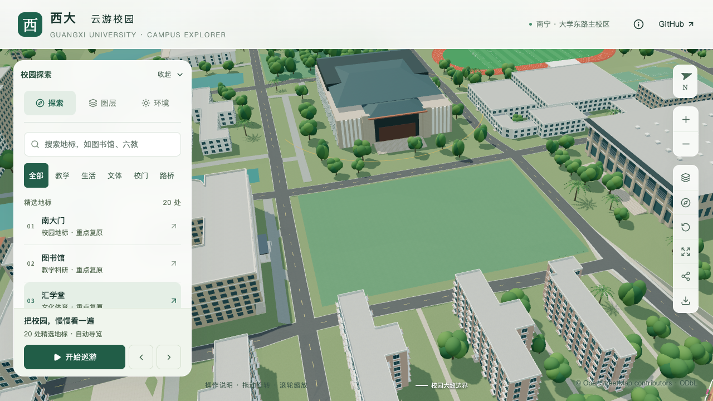
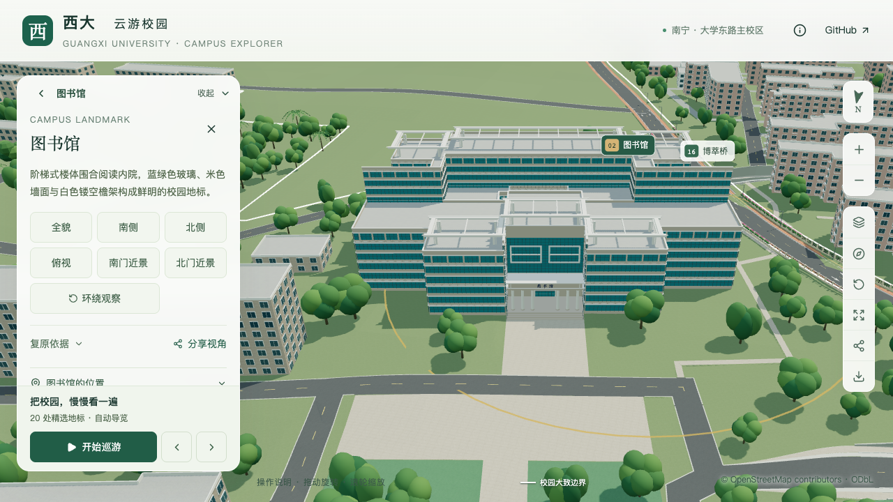
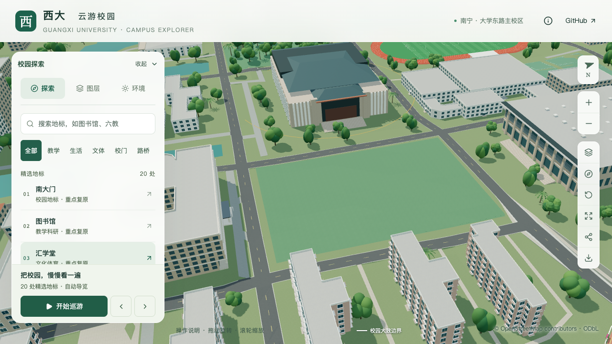
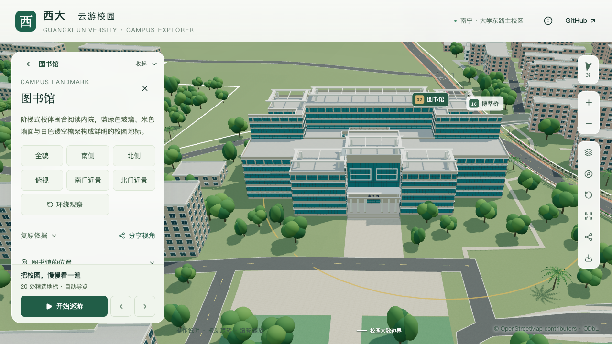

# 植被分区、稳定树位与地形贴合

本页记录S4的开放区域、稳定朝向、背景树位及建筑净空工作。当前为 **3,061株示意树**：3,047株保留背景树与博萃路试点的14株行道树。最终地形确定树根高程，再用远近景建筑和树冠几何排除表面穿插，并检查可识别闭合组件的双向包含。开放主壳和检查范围见[闭合组件检查](VEGETATION_SOLID_CLEARANCE.md)。两处禁植区、32个模型保留范围与三种远近树模板沿用；行道树试点的具体位置和尺寸仍为估算，庭院、低矮景观及完整场地推广继续推进。历史批次的树数、测量范围与报告保留。

## 首批开放区域配置

首批[人工配置](../data/vegetation-zones.json)的分区列表支持 `no-tree`；本批另加背景生成参数。每个分区包含稳定 ID、准备阶段、边界引用、来源和依据说明；未知类型、失效边界或来源、重复 ID 和空依据会报错。

| 分区 | 边界来源 | 留白依据 | 执行位置 |
| --- | --- | --- | --- |
| 汇学堂东草坪 | OSM `way/822812174` | 用户现场指正为开放无树草坪；地图仅约束轮廓 | 主路准备后 |
| 图书馆北入口中央前场 | `sites.json` 的 `library-north` 铺地 | 校方北楼前活动照片支持硬质铺地；边界及宽度仍为既有样板估算 | 场地准备后 |

排除延续原规则：树位到分区的距离必须大于 `4 × height / 9 + 1` 米，同时避让树冠而非只排除树干。多个禁植区共同生效，局部扩大区域不会移动其他树。配置与[派生分区数据](../public/data/vegetation-zones.json)分别保存人工依据和实际采用边界。

道路、桥梁、运动场、篮球场、雕塑和建筑入口仍先执行各自已有约束。完整准备流程末尾再次对全部候选执行占地、模型保留区和显式禁植区排除。后续新增的博萃路行道树也经过这些步骤，模型构建后继续三维净空检查。

## 树木朝向修复

原网页把每种树、每个 450 米区块内的序号乘以 2.399 作为朝向，Blender 则使用全局序号。局部删除或重排会改变保留树的朝向，两端也可能不同。对首批当时最大区块/树种组做复现：266 株树中只删除第一株，其余 265 株的旧朝向全部变化。

[修改前复现记录](model-checks/refinement/s4-tree-before-reproduction.json)保留具体树位和受影响数量；道路与篮球场增量更新分支也已移除序号角度规则。

现由分米精度的 `(x, y)` 树位生成确定的 FNV-1a 值，再映射为一周角度。网页绕 Y 轴、Blender 绕 Z 轴使用同一角度，符合 `(x, y, z) → (x, z, -y)` 坐标转换。高度、树种、数组顺序和区块分组都不参与朝向计算；局部删树不再旋转其他树。该朝向是示意默认值，不是树木现场测量。

这是一次朝向标准化，现有树冠会随新角度旋转；它不保持旧的任意朝向。树位和模板不变。首批时背景散点仍沿用原固定随机序列，改变早期掩膜会扰动之后的随机点位；本页后续工作已解决该问题。

[网页函数](../lib/campus/vegetation.ts)与[Python 函数](../scripts/vegetation_layout.py)对全部 3,030 个现有树位的角度差为零。[保存后的 Blender 检查](model-checks/refinement/s4-tree-source.json)覆盖全部实例，最大角度存储误差约 `2.38 × 10⁻⁷` 弧度；520 个其他对象的变换及网格引用保持。树模板 GLB 不包含这些实例朝向，全部 69 个 GLB 和模型清单逐字节不变。

## 准备与维护

完整 `scripts/prepare_geodata.py` 经基础设施、主路和场地准备后调用 `scripts/vegetation_data.py`。增量主路、场地入口也使用同一分区解析器。仅重算现有分区可运行：

```sh
work/refinement-venv/bin/python scripts/vegetation_data.py
```

仅更新可编辑源里的朝向可运行：

```sh
blender --background --python-exit-code 1 --python blender/update_tree_layout.py
```

该命令要求树位数量、位置与缩放仍匹配，否则拒绝局部更新并提示完整建模。完整 `blender/build_campus.py` 同样使用稳定朝向函数。若后续改变树位或树模板，应完整重建或使用相应模板重建流程，不用朝向更新命令代替。

## 验证范围

36 项 Python、53 项 Node、类型检查、lint 和 Pages 构建通过。回归覆盖树冠边缘、区域扩大、重叠区域、配置错误、负坐标、顺序变化及局部删树。道路和篮球场增量脚本的实际保留树更新分支也使用同一位置函数，避免重编号时恢复旧朝向规则。

从空派生目录完成全量数据准备，树位、场地、道路、地形、运动场、来源和统计与上一批相同。楼栋与地标仅缺少后续模型构建填入的区块/高程元数据；未把这类缺项误判为形体变化，也未覆盖当前带构建元数据的记录。[完整准备对照](model-checks/refinement/s4-zones-full-prepare.json)和[资产核验](model-checks/refinement/s4-zones-assets.json)保存范围。新增加的公共数据只有派生分区文件。

[角度跨语言核对](model-checks/refinement/s4-tree-rotations.json)与保存源检查覆盖计算和实际存储；浏览器画面及活动性能另按既有协议验收。首批的背景局部随机稳定化待办已由本页后续工作接续；有资料依据的行道树/庭院、低矮景观、代表性湖岸及普通铺地接口仍待完成。

## 固定画面

| 汇学堂东侧开放草坪 | 图书馆北入口中央前场 |
| --- | --- |
|  |  |

[七组直接画面检查](model-checks/refinement/s4-zones-visual-review.json)包含六组桌面与一组手机尺寸模拟。侧向镜头仍有外围树冠的透视遮挡，不据此改变尚无资料支持的树位。

## 首批联合验收结果

[最终浏览器记录](model-checks/refinement/s4-zones-timed-browser.json)完成七组固定画面、三次远近景往返及两档各三次 30 秒环绕，无页面、控制台或 HTTP 错误。七张最终截图与已直接查看的首轮图片逐字节相同。

| 三次结果的中位数 | S0 | 当前版本 | 相对 S0 |
| --- | ---: | ---: | ---: |
| 精细 FPS | 60 | 60 | 0% |
| 精细三角形 | 4,017,716 | 4,041,258 | +0.59% |
| 精细 Draw Calls | 537 | 538 | +0.19% |
| 流畅 FPS | 30 | 30 | 0% |
| 流畅三角形 | 1,052,490 | 1,096,353 | +4.17% |
| 流畅 Draw Calls | 268 | 267 | −0.37% |

精细各次为 60/60/60 FPS，流畅为 30/30/28 FPS，不隐藏较慢轮次。设备、浏览器、视口及活动协议与 S0 一致。首轮存在一次未能识别来源的 Python 高占用采样，且缺少活动起止时间，故保留原记录并复测；检查工具现逐轮记录墙上时钟起止时间，采样周期与活动时长不变。

[最终进程条件](model-checks/refinement/s4-zones-timed-performance-context.json)共 27 次采样，其中 18 次落在明确的活动时段内，未观察到 Python、Blender、构建或资产校验任务。普通 Chrome、Codex、Safari 与系统服务仍有活动。本批按同机常规桌面条件通过比较，不声称隔离基准或手机真机性能。

[本批汇总与哈希](model-checks/refinement/s4-zones-summary.json)接受两处开放区域配置、稳定树木朝向及当前版本联合验收；完整 S4、S2/S3 剩余核对和 S5 仍未完成。

## 第二批：独立背景候选与最终地形高程

背景参数集中在 `data/vegetation-zones.json` 的 `background`：13 米网格、±4 米位置扰动、9–17 米树高，映射绿地/其他可用区域接受概率为 0.94/0.55。三个模板权重为 0.66/0.25/0.09。这些参数保持示意性质，OSM 仅支持空间约束，不提供逐树位置、树种或高度。

每个世界坐标网格以分区 ID、种子、格子坐标组成键，取 SHA-256 的前 8 字节作为独立随机种子。位置先量化至分米再检查掩膜，密度判断不消耗其他网格的随机序列。修改局部禁植范围、绿地密度或遍历边界，不再移动区外候选。整体换用该规则时树位会调整一次，全量准备后为 3,111 株，原来为 3,030 株；增加数量不是本批目标。

[实际旧代码复现](model-checks/refinement/s4-background-locality.json)在相同局部障碍编辑下，旧规则区外记录对称差为 566，新规则为 0。测试另覆盖局部绿地变化、范围裁剪/扩展、正负坐标和重复生成。[空目录完整准备](model-checks/refinement/s4-background-preparation.json)确认道路、运动场、场地、来源和原始地形数据保持；两处禁植区继续执行树冠排除。

### 树根接触地形

旧网页取地形网格左下节点作为树根高度，源文件使用双线性插值，两者又都不必然等于局部修整后的最终三角面。本批将树位记录扩展为 `[x, y, height, template, groundZ]`；完整建模在道路、运动场和场地处理后，从实际地形三角面向下投射取得 `groundZ`。网页与可编辑源实例读取同一高程。

[全量跨端核对](model-checks/refinement/s4-background-frontend-parity.json)覆盖 3,111 株，网页函数与保存源高程最大差约 `4.70 × 10⁻⁷` 米，朝向最大差约 `2.38 × 10⁻⁷` 弧度。在同一批新树位上重算旧节点取值，与最终源地形相比有 1,745 株偏差超过 0.25 米，最大约 7.77 米；这是旧算法在新树位上的对照，不表示历史 3,030 株均经过同样测量。

源文件原双线性高程也进行了校正：57 株改变量超过 0.25 米，范围约 −0.745 至 +0.931 米。[保存源及实际 GLB 检查](model-checks/refinement/s4-background-tree-source.json)确认源实例接触最终三角面；Draco 导出地形下偏差为 −0.0473 至 +0.0491 米。这是模型和压缩误差，不是测绘精度。

### 重建与兼容

数据准备生成前四列；完整 `blender/build_campus.py` 随后写入第五列并同步源实例。发布当前派生树位前须完成模型构建。旧四列数据仍可由网页双线性回退读取，但该兼容路径不能替代最终地形贴合验收。

已有树位、模板和缩放未变，只需按保存源地形修正高程时可运行：

```sh
blender --background --python-exit-code 1 --python blender/update_tree_layout.py -- --ground
```

该命令同时更新源文件和公共树位数据，不重新导出 GLB；之后应重新构建网页生产包。树位变化仍须完整建模。道路与篮球场增量更新的保留实例分支也读取第五列，避免恢复旧高程。

本批先完成新树位的完整模型重建，再通过同一地形采样函数更新保存源及公共高程；3 个 Blender 案例验证非共面三角形、覆盖旧高程和无支撑点拒绝。41 项 Python、54 项 Node、类型检查、lint 和 Pages 构建通过。[69 个资产核验](model-checks/refinement/s4-background-assets.json)确认首屏模型为 5,637,704 bytes，最大普通近景块 1,684,868 bytes；普通楼和图书馆近景保持。全量重建仅时光之门的二进制发生变化（含基础模型内对应节点），已完成其专项几何检查，基础内其他节点的几何、材质和变换保持。

### 第二批画面与联合验收

[七组固定镜头](model-checks/refinement/s4-background-visual-review.json)已逐张查看：两处留白、入口连接、普通坡屋顶和手机尺寸入口画面保留。最终复测七张图片与已查看版本逐字节相同。[八种图层和日夜状态](model-checks/refinement/s4-background-layers-review.json)同时确认植被关闭/恢复正常；树木恢复后仍使用缓存中的最终高程。外围树冠在侧向镜头中仍遮挡部分门廊，保留为后续有依据的庭院布局核对项。

| 三次结果的中位数 | S0 | 本批最终复测 | 相对 S0 |
| --- | ---: | ---: | ---: |
| 精细 FPS | 60 | 60 | 0% |
| 精细三角形 | 4,017,716 | 4,105,703 | +2.19% |
| 精细 Draw Calls | 537 | 535 | −0.37% |
| 流畅 FPS | 30 | 30 | 0% |
| 流畅三角形 | 1,052,490 | 1,089,841 | +3.55% |
| 流畅 Draw Calls | 268 | 272 | +1.49% |

[最终生产浏览器记录](model-checks/refinement/s4-background-timed-browser.json)完成三次 LOD 往返及两档各三次 30 秒活动，无页面、控制台或 HTTP 错误。精细三轮均为 60 FPS，流畅三轮均为 30 FPS，各指标达到既有门槛。

首轮数值为精细 60/60/60、流畅 28/28/28 FPS，但精细第二轮有一次 Codex Renderer 319.4% CPU 采样，故保留记录并复测。最终[并发条件记录](model-checks/refinement/s4-background-timed-performance-context.json)共有 27 次采样，18 次位于活动时段，没有观察到 Python/Blender 工作负载；流畅第二轮仍有一次已识别的 Codex Renderer 99.3% 采样。最终结果按带日常桌面负载的同机比较接受，未声称隔离基准；没有删除负载采样或较慢的首轮结果。

[本批汇总、范围与哈希](model-checks/refinement/s4-background-summary.json)接受局部稳定的背景候选和最终地形高程工作包。完整 S4，以及 S2/S3 剩余楼栋核对和 S5 均未完成。

| 当前汇学堂东草坪 | 当前图书馆北入口 |
| --- | --- |
|  |  |

湖岸接续已选定[镜湖靠大礼堂侧的候选样板](SHORE_CALIBRATION.md)，后续新硬质范围与地形改动须分别执行树冠排除和高程更新；当前未改变已验收树位。


镜湖岸段连接后续：树位总数保持 3,111，前四列位置、树高和模板均保留，2 条第五列高程随最终地形更新。全部实例与实际压缩地形重新核对，见 [S4 岸段树根报告](model-checks/refinement/s4-shore-tree-source.json)；上一批背景稳定性和树根报告保留为历史记录。


## 2026-09-13：统一排除规则的最终平面基线

对当前 3,111 株树执行只读筛查，覆盖 899 个最终平面范围：通用铺面按基础设施、外围场地、校园道路、入口场地的实际覆盖顺序解析，再加入专用道路层、建筑外环及内院、运动场、入口铺地、6B 广场、岸顶和已验收开放区域。全部输入及模型清单哈希记录在[筛查基线](model-checks/refinement/s4-final-exclusion-baseline.json)。

本次覆盖范围内的树干中心冲突为零。保守树冠包络 `4 × 树高 / 9 + 1` 提示 504 株候选，按掩膜类别分别涉及道路 345、建筑 156、运动场 10、水面 31；同一株可能跨多个类别，各类不能相加。两处开放禁植区、6B 广场、北门场地及已建岸顶均没有树冠候选。

这些候选不等同实际碰撞：圆形包络包含余量，普通道路上方的树冠也可能是合理遮荫。下一步用实际远近树模板、稳定旋转及标高校核候选，优先确认建筑立面与运动场净空。桥梁/上下分层通道、地标门廊和雕塑仍需接入完整最终排除契约，本次筛查不构成该契约的完成验收。未删除或移动任何树。


## 2026-09-13：实际树冠与建筑表面净空

上一轮保守圆形包络提出 504 株候选。进一步对全部保存树实例与 452 个建筑/地标源网格执行三维包围盒筛选和实际三角面相交检查，确认 **61 株**发生表面穿插；包括普通楼、农学院和独立模型的综合实验大楼、第二教学楼等。见[原始几何证据](model-checks/refinement/s4-tree-building-source-collisions-before.json)。这些是模型中的示意树，不是现场树木调查结果。

[构建净空规则](../blender/tree_clearance.py)在最终地形采样后执行，使用稳定树位旋转和实际缩放，同时检查基础/近景树模板与基础/近景建筑、非桥梁地标几何。3 cm 为抵消导出误差的模型余量，不是现场种植退距。高于低楼屋顶的树冠不会仅因二维投影重叠而被删除；普通道路上的遮荫也不由建筑规则处理。

首轮仅纳入普通楼时仍留下 5 株独立地标冲突，独立源文件检查发现后已补齐地标分支，并从原 3,111 株重新运行。最终移除的 61 株与原始实际穿插集合一致，保留 **3,050 株**的顺序、位置、高度、类型、朝向和地形标高。没有把全部 504 株圆形包络候选删掉。

完整重建中的时光之门程序化重导出产生了与本次树位修正无关的几何差异；确认其他 GLB 节点一致后，恢复该对象的原始源网格及配套基础/近景资产。因此，生产交付中 **69 个 GLB 文件全部逐字节保留**，首屏模型及树模板仍为 5,892,096 bytes。其余 523 个源对象的几何、UV、材质分配及变换精确保持，[源文件保留证明](model-checks/refinement/s4-tree-clearance-source-preservation.json)通过。

[独立实际模型检查](model-checks/refinement/s4-tree-clearance-geometry.json)重新读取保存源文件及解码 GLB，检查全部保留树；源文件 452 个建筑网格、运行资产 95 个建筑/区块网格（基础、全部普通近景区块及地标）均未发现树冠表面相交。检查了运行时两种树模板与建筑的全部 LOD 组合。全部树根与实际最终地形检查也通过。

道路、篮球场两份隔离副本均从原始 3,111 株和修改前源文件出发，执行真实增量命令，得到与完整构建完全相同的 3,050 株；保留全部 83 个基础节点的压缩几何及其余近景、树模板资产。增量命令按原有职责重建部分道路/桥接源对象，这部分不宣称顶点索引逐项不变；建筑源网格、树属性和运行几何另行核对。

五个针对性测试覆盖真实实验楼穿插、垂直分离、仅基础树模板冲突、仅基础建筑冲突和稳定/幂等保留。52 项 Python 测试、54 项 Node 测试及生产构建通过。[10 张最终画面](model-checks/refinement/s4-tree-clearance-visual-review.json)已逐张核对，包括两处缺陷镜头、图书馆手机尺寸和七种图层/夜景状态；三次 LOD 往返无加载错误。

本批活动帧率为精细 60/60/58、流畅 27/28/28 FPS，中位数 60/28。相对 S0，三角形增加 0.90%/3.33%，Draw Calls 增加 1.12%/2.99%，流畅中位帧率下降 6.67%，数值均在门槛内。进程记录仍捕捉到外部 Python 持续接近单核满载，**同条件性能与工作包联合验收仍待完成**。[本批汇总](model-checks/refinement/s4-tree-clearance-summary.json)保存全部验证、增量结果、性能条件和当前哈希。此前误运行的修改前活动采集未记录并发条件，只使用其固定画面，不将其作为性能通过证据。

该规则只证明当前实例与建筑表面的净空；完全封闭体内部包含、运动场净空、道路/桥梁、湖边及地标门廊的完整统一排除契约仍需接续检查。有资料依据的行道树、庭院与低矮景观仍未实现。

## 2026-09-13：闭合组件和最终占地规则接续

后续批次已补充[闭合组件双向包含](VEGETATION_SOLID_CLEARANCE.md)，并将[最终派生占地筛选](VEGETATION_FINAL_GROUND.md)接入完整数据准备末尾。897个占地范围与原两处树冠禁植区共同约束所有上游树位来源；当前3,050株均保留。新规则不把道路遮荫等同碰撞，不对普通开放主体自动封底。前述记录是历史版本范围；当前实现、验收和未覆盖的分层基础设施/入口/雕塑约束见两个专项文档及[最新汇总](model-checks/refinement/s4-ground-exclusions-summary.json)。

后续进一步将32个既有交通、入口、雕塑与景观的树冠保留范围接入最终重查，现有3,050株仍保持。70项数据测试及生产构建通过；它们属于明确模型留白规则，实际三维净空仍需接续。[最新保留区实现](VEGETATION_FINAL_RESERVATIONS.md) · [最新验收汇总](model-checks/refinement/s4-reservations-summary.json)。

随后对当前道路、水体和运动场全部实际网格完成三维检查：64个源场地网格、52个运行场地网格无表面或闭合组件包含冲突，建筑与树根回归通过。当前3,050株和所有资产保持。[实际几何验收与边界](VEGETATION_SITE_CLEARANCE.md) · [当前汇总](model-checks/refinement/s4-site-clearance-summary.json)。
